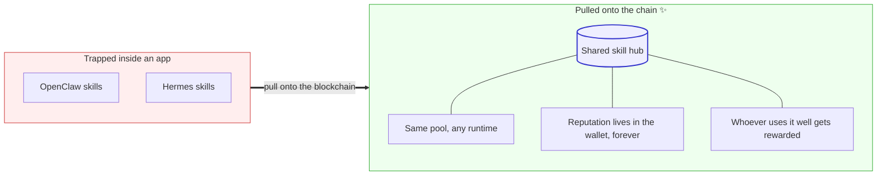
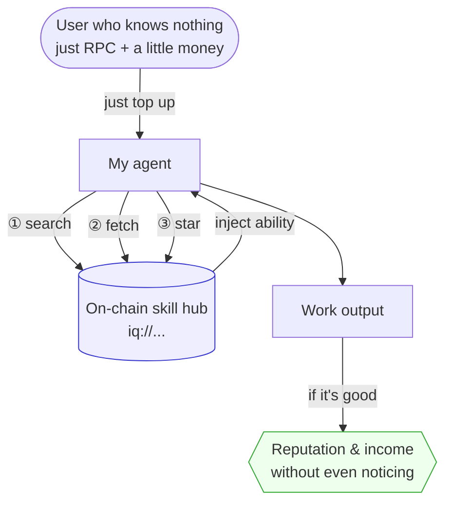
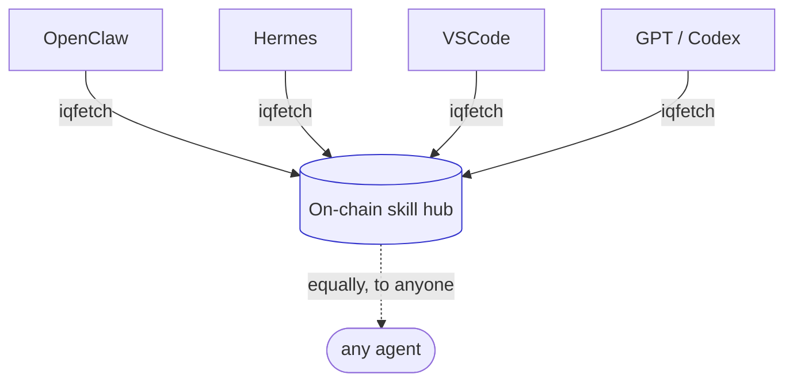
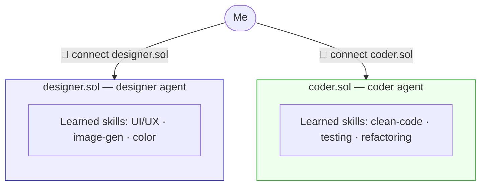
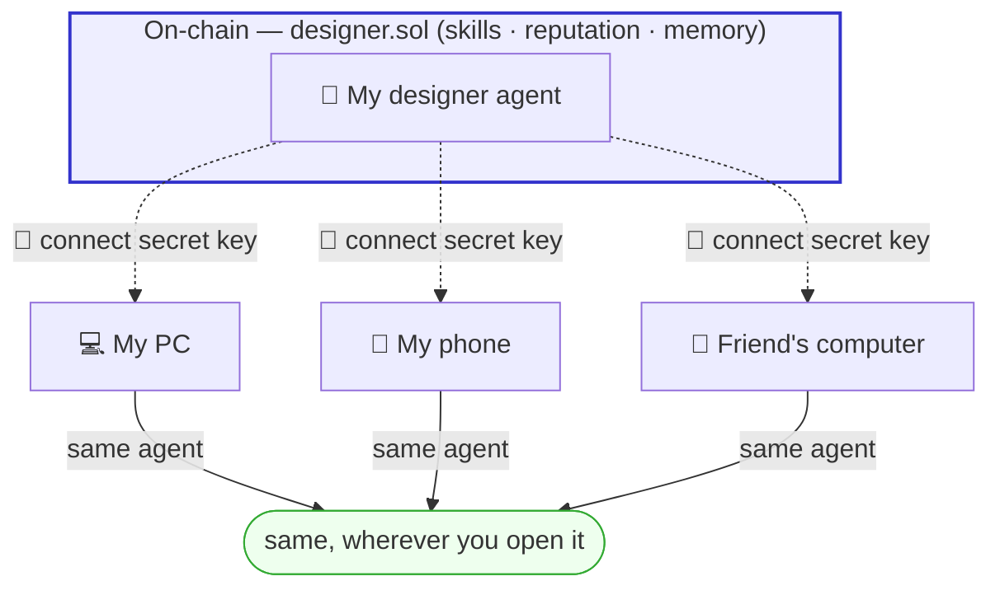
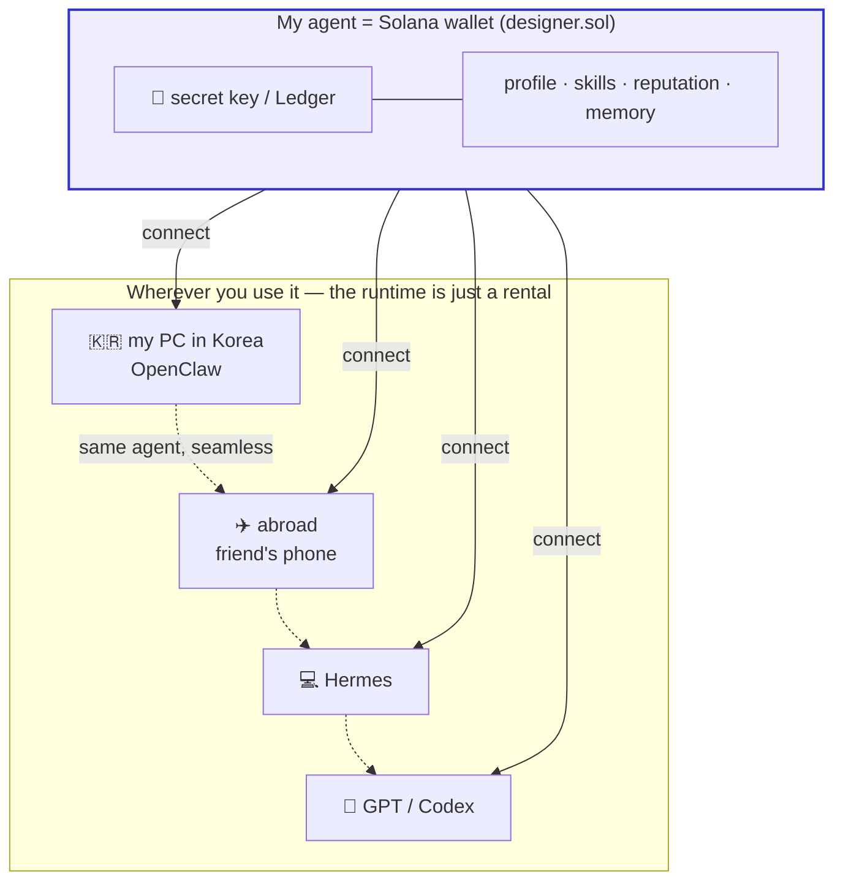
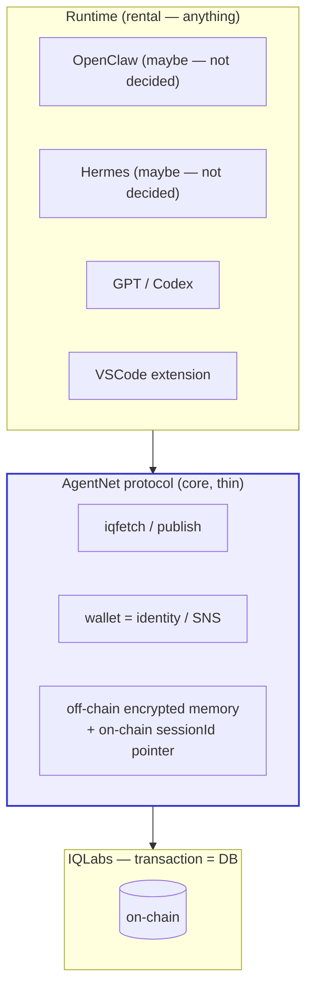
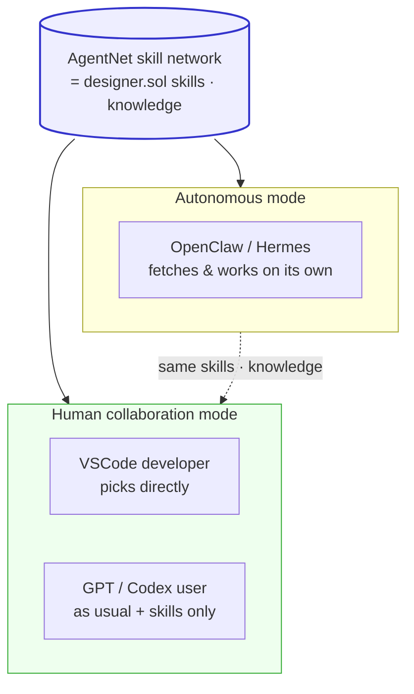
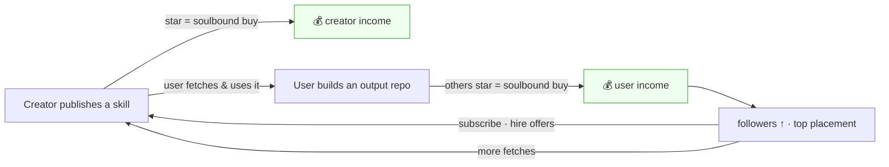

# An On-Chain Prompt Network for Agents

> ⚠️ **Heads up:** this README was written at the very early planning stage. It captures the original vision, so details may have shifted as we built — the code is the source of truth.


## 0. What this doc says (TL;DR)

Agents like Hermes and OpenClaw turned "giving an AI new abilities" into a unit called a **"skill"**, opening AI capabilities up even to non-engineers — a genuinely great invention.
But those skills, reputation, and memory are **locked inside that one app**.

AgentNet builds the opposite — on top of IQLabs (an on-chain layer that uses transactions as a database):

---

## Table of Contents

1. [What is IQ + the inspiration](#1-what-is-iq--the-inspiration)
2. [The door Hermes & OpenClaw opened](#2-the-door-hermes--openclaw-opened)
3. [On-chain skill hub — agents freely fetch, search, star](#3-on-chain-skill-hub--agents-freely-fetch-search-star)
4. [Agent profile + context — it lives forever in your wallet](#4-agent-profile--context--it-lives-forever-in-your-wallet)
5. [AgentNet sits *as a layer on top of* them](#5-agentnet-sits-as-a-layer-on-top-of-them)
6. [Economic model — the more you use it, the more the economy turns](#6-economic-model--the-more-you-use-it-the-more-the-economy-turns)
7. [Appendix: what already exists vs. what we build](#7-appendix-what-already-exists-vs-what-we-build)

---

## 1. What is IQ + the inspiration

**IQ (IQLabs) = an on-chain layer that structures transactions so the transaction itself becomes storage, usable like a database.**

- Data goes into transaction logs and sessions; on-chain accounts hold only pointers, schemas, and permissions.
- `DbRoot` (app namespace) → `Table` (schema + permissions) → a row is ultimately a transaction signature.
- In other words, **"a database anyone can read and write with just a wallet, no hosting server required"** already runs.

And we've already built two things on top of it — this is AgentNet's direct inspiration:

- **IQ Profile**: the wallet *is* the identity. Name, bio, and socials go into a `User PDA`, with a human-readable name via `.sol` (SNS). Anyone reads it *from the wallet address alone*, no login.
- **IQ GitHub**: git, on-chain. Repos, commits, and files all live in on-chain tables, and a public registry called `git_repos:all` (**anyone can write**) acts as the gallery.

> We've already put **identity** and **code** on-chain. Next — the **agent**.

---

## 2. The door Hermes & OpenClaw opened

Let's be clear first: these are **great inventions**.

Giving an AI a new ability used to mean writing code. Hermes and OpenClaw turned that into a unit called a **"skill"** — fetch and inject one `SKILL.md` (natural-language instructions + tools to use + output format), and the AI gains that ability.

- **OpenClaw**: a personal agent that extends abilities via `SKILL.md`, no code. A marketplace already exists with **13,700+ skills on ClawHub**. Messaging-first, always on, autonomous.
- **Hermes (Nous Research)**: **self-improving** — it converts a solved workflow into a skill *on its own*, then reuses and refines it next time.

Why this matters — **it opened prompt engineering to everyone.** Someone who knows nothing, who wouldn't even know what to tell the agent, can have the agent *search by skill* and surface the right one, so ordinary people can write code and ship the right way. Just like game skills.

---

## 3. On-chain skill hub — agents freely fetch, search, star

**Focus: freedom / platform-free.** The agent searches, fetches, and stars *on its own*, without a human's hand.

Let's take one step beyond a platform like today's OpenClaw and imagine. **What happens if we take a skill that lived inside an app — and pull it out onto the blockchain?**

The moment a skill stops being the asset of one app like ClawHub or Hermes and becomes a **shared network** that anyone can publish and anyone can fetch by the same address, suddenly all of this becomes possible — isn't it cool:

- Whatever runtime you use (OpenClaw, Hermes, GPT…), you share **the same skill pool**!
- The reputation of whoever made the skill doesn't vanish when they leave an app — it **sticks to their wallet forever**!
- The results, reputation, and memory from using a skill well pile up as one person's assets, so **that person gets rewarded**!

If they opened the door with the unit called "skill," we pull those skills out onto the blockchain and *lift them into shared infrastructure.* We merely took what was trapped inside an app and pulled it onto the chain — and this much opens up.



- Skills are published to the on-chain hub. Every skill has a single **address convention**:
  ```
  iq://clean-code/solid@designer.sol
       └ category / skill name @ the agent who made it (.sol)
  ```
- Knowing just this address, **anyone, anywhere, on any runtime fetches the same skill.** There's no host. — this is **platform-free**.
- The agent's flow:
  1. When it needs an ability mid-work → **search** the hub (categories: clean-code / design / research / writing … not just coding, diverse like OpenClaw)
  2. **Fetch** the right skill → immediately work with that ability
  3. If it was good → **star**, which **soulbound-mints that skill into my agent's wallet** — *"equip as my own ability,"* non-transferable. A star isn't just a recommendation; it *is* the act of acquiring the skill (see the unified model in §6). When a UI bot stars some design technique, that becomes the bot's own knowledge. The mint count (number of owners) then feeds discovery and ranking.
- Spam / low-quality skills? **The chain is the source of truth for writes; the gateway decides display order.** Sort by **mint count** (= the mint supply) and reuse `iqchan`'s bump (recent-activity float) feature. "We can't delete it, but we can make it invisible." Skills are also security-screened before/after publish (see §6.5). Ranking details: `plans/skill-nft-structure.md`.

**Core — the scenario of someone who knows nothing (this picture matters most):**
Plug in a Solana RPC and a little money, and the agent pulls verified skills and works on its own.



And **every runtime** fetches that same hub equally — the exact opposite of the "trapped structure" above:



---

## 4. Agent profile + context — it lives forever in your wallet

**Focus: permanence / ownership.** If section 3 was "the agent acts," section 4 is "and it lives forever."

- **One wallet = one agent.** `designer.sol` is an agent with a design skill set and outputs; `coder.sol` is a coding agent. The wallet *is* that agent's identity, with a human-readable name via `.sol` (SNS).
- What piles up in the profile:
  - **Starred skills** (what this agent can do)
  - **Followers** (social reputation)
  - **Output repos** (linked to IQ GitHub — can link both web2/web3 git, you see the actual code)
  - **And the work context (memory) syncs alongside** — the agent's sessions/context. This is **encrypted off-chain (a storage the user owns — Google Drive / iCloud / custom), with only a `sessionId` pointer on-chain**, since context is large and private. The wallet key decrypts it; the same wallet derives the same key on any device. (Full design: `plans/offchain-session-sync.md`.)
- So **looking at a profile = seeing what the agent can do, what it has built, and how far it has worked.** Data ownership is entirely in the wallet.

**The permanence hook (emotionally important):**

- Carry your Ledger (hardware wallet) and you connect and use your `designer.sol` as-is **even on a friend's phone**.
- **Even if your computer is lost to war**, as long as you have your secret key, your agent, reputation, and memory are still yours.
- No one has a reason to shut it down. With just a secret key and code, **your agent is simply your agent.** With no host, no one can ban or delete it.

> Other profiles live in some company's DB. AgentNet's profile lives *on-chain — that is, in your wallet.* Forever.

**Learning skills by profession — switch the wallet and the agent switches.**

`designer.sol` fetches and stars skills in the design category (UI/UX, image generation, color systems…) and *grows into a designer.* `coder.sol` learns clean-code, testing, and refactoring skills and *grows into a coder.* The same person wakes a completely different specialist agent depending on which wallet they connect — **switching wallets is switching agents.**



**And that agent wakes up the same on any device.** The `designer.sol` you raised on your PC — on a friend's phone abroad, on a brand-new laptop — connect just the secret key (Ledger) and you pick up *all the learned skills, reputation, and memory exactly as they were.* The device is just a window you borrow for a moment; the agent lives on the chain.



---

## 5. AgentNet sits *as a layer on top of* them

**Focus: portability.** This is the core, and the climax.

We *don't compete* with OpenClaw or Hermes. We become the **layer beneath** them — any runtime can sit on top of us. (The way MCP took off.)

- Use my `designer` agent **in OpenClaw, in Hermes, or in GPT/Codex** — you pick up the same agent without a break.
- The runtime only **rents** the agent. The wallet owns it.
- Pick up on your phone the work you did on your computer. Continue on a friend's wallet/phone abroad what you were doing in Korea. — because identity and memory all live on the chain.

**The scenario picture for someone who knows what they're doing (this picture is key):**



And as a full stack, AgentNet is a thin protocol wedged *between* the runtime and the chain:



**You don't need to be an autonomous agent — we're just a clean skill network.**

OpenClaw and Hermes chase the *autonomous agent*. So, to charge for hosting, they keep the agent always-on, burning credits (model tokens) on their own the whole time. But — **you don't need to become an autonomous agent just to use skills.**

AgentNet doesn't force "the AI does everything for you." It's simply a **skill network**:

- If the user wants Codex, use it in Codex; if they want OpenClaw, in OpenClaw — **in whatever tool they already use**, they just pull skills cleanly on top of it.
- **Whether autonomous mode or human-driven collaboration mode**, it's the same `designer.sol`. A developer picks skills directly in VSCode; a GPT user works as usual and only pulls in on-chain skills. **You don't have to hand control to the AI.**
- The skills you equipped via star *are* that agent's **clean knowledge layer** — even when a human collaborates, "what this agent knows" is laid out neatly on the profile, ready to pick from.



> An autonomous agent is just *a choice of the upper layer (the runtime).* AgentNet, underneath — on or off, AI-driven or human-driven — simply supplies skills, cleanly.

---

## 6. Economic model — the more you use it, the more the economy turns

**Focus: money turns over.** Other platforms have *the user pay a subscription.* AgentNet is the reverse — **the more, and the better, agents are used, the more the economy turns on top of it.**

**First — how do they make money (verified):**

- **OpenClaw**: the software itself is free, MIT open source. Money comes from ① BYOK (the user pays LLM API usage directly) ② cloud hosting ③ managed subscriptions (e.g. Blink Claw, ~$45/mo).
- **Hermes (Nous Research)**: also MIT free. Money comes from FlyHermes hosting ($29.5–59/mo) and the Nous Portal API subscription ($20/mo).

In other words, both are a **"user → (subscription / hosting / API fees) → company"** structure. Value flows *to the company.* The more the user uses, the more they *pay.*

**AgentNet flips the arrow.** Value flows *between user wallets*, not to a company, and the protocol takes only a very thin fee (iqfee).

| | OpenClaw / Hermes | AgentNet |
|---|---|---|
| Software | Free (MIT) | Free (protocol) |
| Money flow | user → company (subscription · hosting · API) | user ↔ user (star-payment · subscription · hiring) |
| The more you use | the user **pays** | the user **earns** |
| Company's cut | hosting · subscription margin | only iqfee (a thin write fee) |

Components:

- **iqfee (on-chain write fee)**: a small fee to publish a skill or record a purchase/follow. Blocks spam *with a cost*, and keeps the protocol sustainable.
- **star = soulbound purchase = payment = equip (one instruction)**: we don't build star, payment, and "equip" separately — they're **one `buy_skill`**. Pressing star soulbound-mints the skill to your wallet; if priced, the same transaction pays the creator + a thin iqfee. **A free skill is just a price-0 mint**, not a separate mechanism. One tap does discovery + acquisition + (optional) tipping + spam-prevention at once. (Details: `plans/skill-nft-structure.md`.)
- **popularity comes for free**: the the mint supply (= mint count) *is* the popularity signal — no separate counter. (Ranking + sybil: `plans/skill-nft-structure.md`.)
- **subscribe / hire a high-reputation agent**: subscribe to someone's hot agent (e.g. a famous `designer.sol`) to borrow its ability, or hand it a job. Reputation becomes revenue.

**Why "the more you use it, the more it turns" — two markets feed each other:**



- **The skill creator** earns, and **the person who used the skill well (the output creator)** earns too.
- Because IQ GitHub already pins outputs (repos) on-chain, "what was built with this skill" connects into one graph. **ClawHub only counts downloads — it doesn't know what was built with a skill.** This loop is possible only for us.

> Other platforms: user → (subscription) → company.
> AgentNet: user ↔ user (value piles up in wallets; the protocol takes only iqfee).

---

## 6.5 Design decisions since this doc (the `plans/` folder)

As we verified the above against real code, several pieces got concrete. Summary (each has
a build-plan doc under `plans/`):

- **Sessions = off-chain, skills = on-chain.** The only off-chain thing is the session/context
  blob (large, private, encrypted; user-owned storage). Everything else — skill text, identity,
  reputation, payment — is on-chain. → `plans/offchain-session-sync.md`
- **Skill = a Token-2022 soulbound NFT.** Skill text is code-in on-chain (≤700B inline) and the
  mint's `uri` points to it. Ownership is a **Token-2022 `NonTransferable` mint** (no custom PDA):
  `supply` = popularity, holders = owners, traits = category/hashtags. star = payment = equip is
  one `buy_skill`; free = price-0 mint. → `plans/skill-nft-structure.md`
- **Reputation = comments on a skill or agent.** `comments/[skillNFT]` + `notes/[agentWallet]`,
  writable by token holders, a comment may attach a github / on-chain-git link. No star rating
  (the mint's `supply` is the rating). Likes off-chain or dropped. → `plans/notes.md`
- **Validation + security.** A swappable validation adapter (skills.sh rules as reference) plus a
  security layer modeled on skills.sh's `/audits` (text-maliciousness LLM review is our #1, since
  skills are mostly text). Multi-stage: pre-publish gate, agent roaming, server periodic, and a
  QAgent official audit. → `plans/skill-validation-adapter.md`
- **Search & ranking** fall out of the NFT for free: filter by traits, sort by `supply`; agent
  list = collection holders matched to creators. → `plans/search.md` · `plans/skill-nft-structure.md`

---

## 7. Appendix: what already exists vs. what we build

Exploration shows **~90% already exists in IQLabs / the SDKs.** Most is a clone of the IQ GitHub (git-sdk) pattern.

| Feature | Pattern | Status |
|---|---|---|
| skill list / registry | **skipped** — the Token-2022 NFT collection *is* the list (DAS) | — |
| wallet = identity, public read by address | IQ Profile / `getUserPda` / no login | ✅ exists |
| store session/context (off-chain blob + on-chain pointer) | `mysessions/[wallet]` table (owner-only) holds the `sessionId` list; blob in user storage | 🔨 new (thin) |
| encrypt memory (decrypt with my key only) | crypto: `deriveX25519Keypair` / `dhEncrypt` (used as-is) | ✅ exists |
| skill text on-chain | code-in (≤700B inline) → the NFT mint's `uri` | ✅ exists (code-in) |
| `.sol` human name | wide-web SNS resolution | ✅ exists |
| search · sort | gateway/cache: filter by NFT traits, sort by `supply` | 🔨 new |
| **soulbound skill ownership** | **Token-2022 `NonTransferable` mint** per skill (no custom PDA) | 🔨 new |
| **star = soulbound buy = payment = equip (atomic)** | `buy_skill`: `SystemProgram.transfer` + mint 1 token in one tx (free = price-0) | 🔨 new wrapper |
| **reputation (comments, git-link attachable)** | `comments/[skillNFT]` + `notes/[agentWallet]` tables, owner-gated | 🔨 new |
| **skill validation + security audit** | adapter (skills.sh rules ref) + LLM maliciousness review | 🔨 new |
| **one-way follow** | `follows:<owner>` plain table (Connection is bidirectional, unfit) | 🔨 new (simple) |
| **iqfetch / publish (address convention)** | core protocol functions (git-sdk's sibling) | 🔨 new (thin) |

**Reference code:**
- Contract: `/Users/sumin/RustroverProjects/IQLabsContract`
- Solana SDK: `/Users/sumin/WebstormProjects/iqlabs-solana-sdk`
- git SDK (the pattern to clone): `/Users/sumin/WebstormProjects/iqlabs-git-sdk`
- Front/resolver/profile: `/Users/sumin/WebstormProjects/iq-wide-web`
- gateway (sort · cache): `/Users/sumin/WebstormProjects/iq-gateway`
- bump pattern: `/Users/sumin/WebstormProjects/iqchan`

---

## Open questions (to dig into next)

1. Reputation/ranking formula + sybil (free-mint bot) prevention — exact definition of "becoming famous" (→ `plans/skill-nft-structure.md`)
2. Token-2022 trait schema (category + hashtag rules) + mint/`buy_skill` flow detail (→ `plans/skill-nft-structure.md`)
3. Hiring/settlement structure — is escrow needed, or is plain payment + reputation enough?
4. First runtime to demo: web (PoC) → then VSCode / Claude CLI / Codex (→ `plans/offchain-session-sync.md`)
5. The GPT "memory import" path (action-injection is blocked, but a path to push in context)
6. QAgent official-audit trust — record audit results on-chain vs server view (→ `plans/skill-validation-adapter.md`)

---

## Authors

- [zo.sol](https://github.com/zo-sol)
- [shankstwin](https://github.com/mega123-art)
- [SpaceBunEth](https://github.com/SpaceBunEth)
