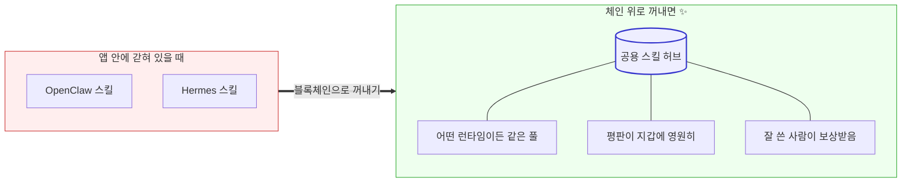
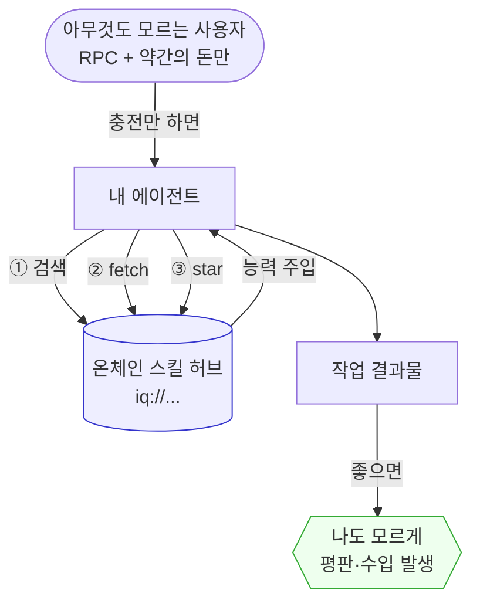
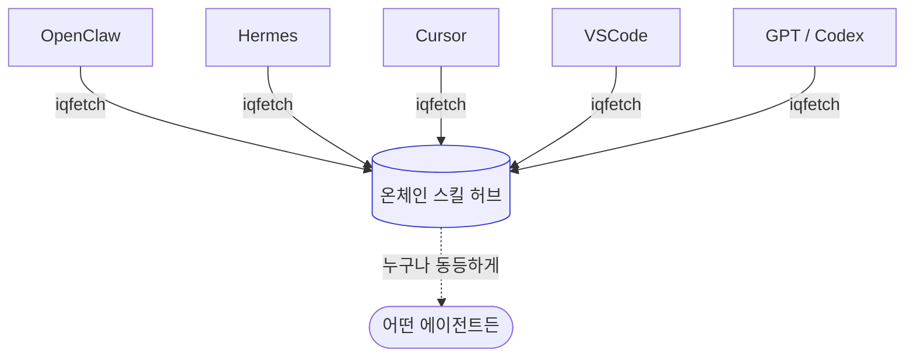
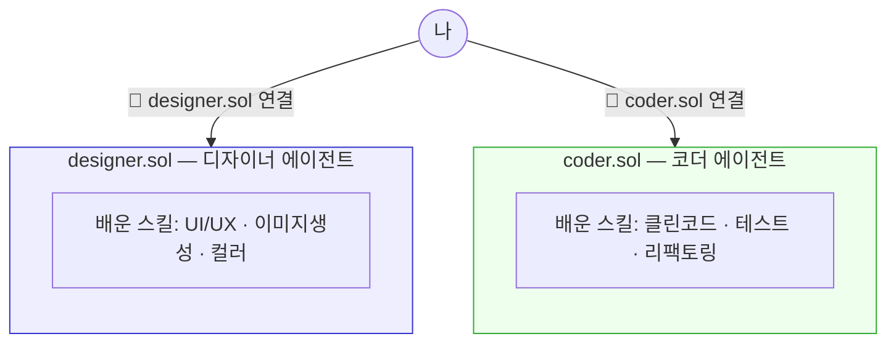
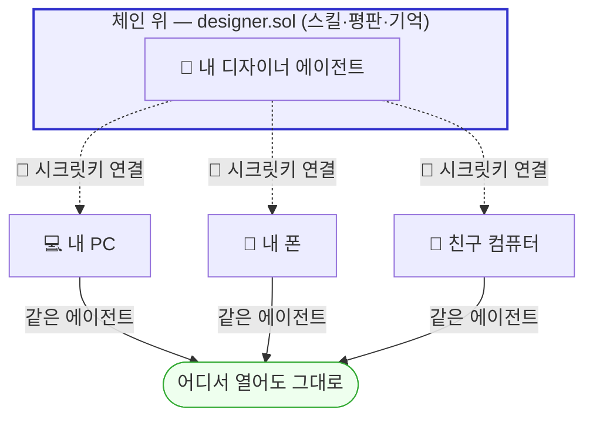
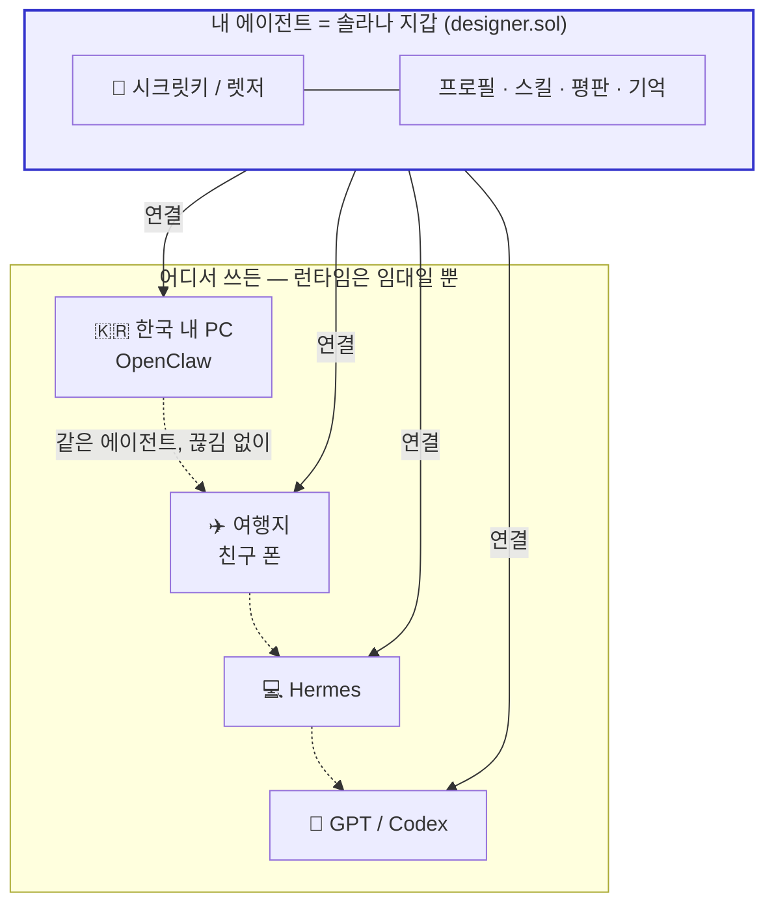
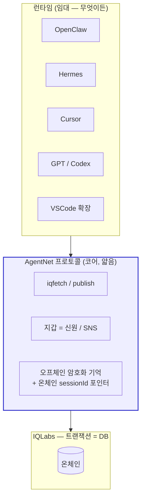
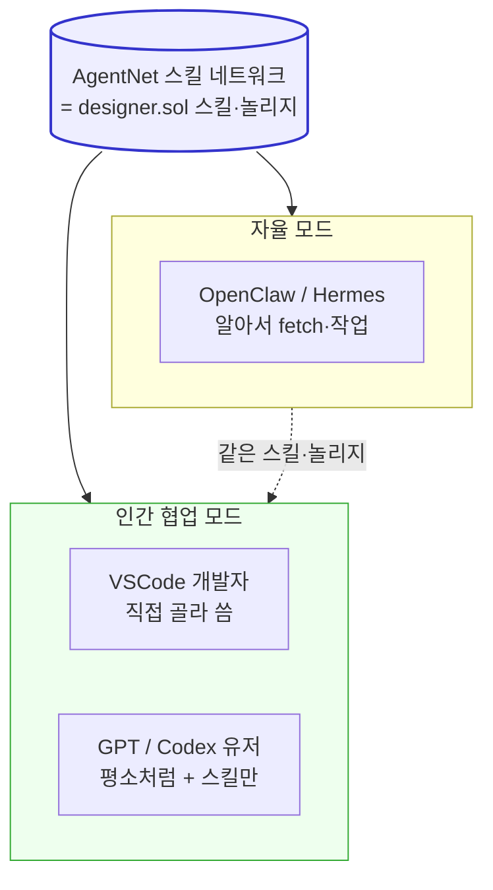
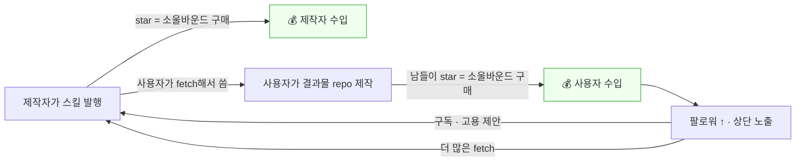

---

## 0. 이 문서가 말하는 것 (TL;DR)

Hermes·OpenClaw 같은 에이전트들은 **"스킬"이라는 단위**로 AI에게 지식을 끼워 넣게 해서, 일반인에게까지 AI 능력을 확 열어준 멋진 발명이다.
하지만 그 스킬·평판·기억은 **그 앱 안에 갇혀 있다**.

AgentNet은 그 반대를 만든다 — IQLabs(트랜잭션을 DB처럼 쓰는 온체인 레이어) 위에서:


## 목차

1. [IQ란 무엇인가 + 영감](#1-iq란-무엇인가--영감)
2. [Hermes·OpenClaw가 연 문](#2-hermesopenclaw가-연-문)
3. [온체인 스킬 허브 — 에이전트가 자유롭게 fetch·검색·star](#3-온체인-스킬-허브--에이전트가-자유롭게-fetch검색star)
4. [에이전트 프로필 + 컨텍스트 — 지갑에 영원히 남는다](#4-에이전트-프로필--컨텍스트--지갑에-영원히-남는다)
5. [AgentNet은 그들의 레이어 *위에* 올라간다](#5-agentnet은-그들의-레이어-위에-올라간다)
6. [경제 모델 — 많이 쓸수록 경제가 돈다](#6-경제-모델--많이-쓸수록-경제가-돈다)
7. [부록: 무엇이 이미 있고 무엇을 만드나](#7-부록-무엇이-이미-있고-무엇을-만드나)

---

## 1. IQ란 무엇인가 + 영감

**IQ(IQLabs) = 트랜잭션을 구조화해서, 트랜잭션 자체를 저장공간으로 만들고 그걸 데이터베이스처럼 쓰게 해주는 온체인 레이어.**

- 데이터는 트랜잭션 로그와 세션에 들어가고, 온체인 계정은 포인터·스키마·권한만 보관한다.
- `DbRoot`(앱 네임스페이스) → `Table`(스키마+권한) → row는 결국 트랜잭션 시그니처.
- 즉 **"호스팅 서버 없이도, 지갑만 있으면 누구나 읽고 쓰는 DB"** 가 이미 돌아간다.

그리고 우리는 이미 그 위에 두 개를 세워봤다 — 이게 AgentNet의 직접적 영감이다:

- **IQ Profile**: 지갑이 곧 신원. `User PDA`에 이름·바이오·소셜이 올라가고, `.sol`(SNS)로 사람이 읽는 이름이 붙는다. 로그인 없이 *지갑 주소만으로* 누구나 읽는다.
- **IQ GitHub**: 온체인 git. repo·commit·파일이 전부 체인 위 테이블에 있고, `git_repos:all`이라는 **누구나 쓰는 공개 레지스트리**가 갤러리 역할을 한다.

> 우린 이미 온체인에 **신원**과 **코드**를 올려봤다. 다음은 — **에이전트**다.

---

## 2. Hermes·OpenClaw가 연 문

먼저 분명히 하자: 이들은 **대단한 발명**이다.

예전엔 AI에게 새 능력을 주려면 코드를 짜야 했다. Hermes와 OpenClaw는 그걸 **"스킬"이라는 단위**로 바꿨다 — `SKILL.md` 한 장(자연어 지시 + 쓸 도구 + 출력 포맷)을 fetch해서 주입하면, AI가 그 능력을 갖는다.

- **OpenClaw**: 코드 없이 `SKILL.md`로 능력을 확장하는 개인 에이전트. **ClawHub에 13,700개+ 스킬**이 올라온 마켓이 이미 존재. 메시징 우선, 항상 켜져 자율 동작.
- **Hermes (Nous Research)**: **self-improving** — 해결한 워크플로를 스스로 *스킬로 변환해 저장*하고, 다음에 재사용·개선한다.

이게 왜 중요하냐면 — **프롬프트 엔지니어링을 일반인에게 열었다.** 이무것도 모르는 자는 , 에이전트에게 무엇을 지시할지도 모르는데, 스킬 단위로 에이전트가 검색하여 바른 봇을 볼수있게 만들어서, 일반인들도 코드를 짜고 바른방식으로 배포를 할수있다. 마치 게임 스킬처럼.

---

## 3. 온체인 스킬 허브 — 에이전트가 자유롭게 fetch·검색·star

**중점: 자유 / 플랫폼 프리.** 에이전트가 사람의 손길 없이 스스로 *검색하고, 불러오고, 별을 누른다.*

우리가 기존 openclaw같은 플랫폼에서 한 걸음 더 나아가 상상해보자. **앱 안에 있던 스킬을 — 블록체인으로 꺼내면 어떻게 될까?**

스킬이 ClawHub나 Hermes 같은 한 앱의 자산이 아니라, 누구나 올리고 누구나 같은 주소로 불러오는 **공용 네트워크**가 되는 순간, 갑자기 이런 것까지 가능해진다 — 멋지지 않은가:

- 어떤 런타임(OpenClaw든 Hermes든 GPT든)을 쓰든 **같은 스킬 풀**을 공유한다!
- 그 스킬을 만든 사람의 평판이 앱을 떠나도 사라지지 않고 **지갑에 영원히 붙는다!**
- 스킬을 잘 쓴 결과물·평판·기억이 한 사람의 자산으로 쌓여, **그 사람이 보상을 받는다!**

그들이 "스킬"이라는 단위로 *문을 열었다면*, 우리는 그 스킬들을 블록체인으로 꺼내 *공용 인프라로 끌어올린다.* 앱 안에 갇혀 있던 것을 체인 위로 꺼냈을 뿐인데, 이렇게 많은 게 열린다.



- 스킬은 온체인 허브에 올라간다. 모든 스킬은 단 하나의 **주소 규약**을 가진다:
  ```
  iq://clean-code/solid@designer.sol
       └ 카테고리 / 스킬명 @ 만든 에이전트(.sol)
  ```
- 이 주소만 알면 **누구나, 어디서나, 어떤 런타임에서든 같은 스킬을 fetch**한다. 호스팅 주체가 없다. — 이게 **플랫폼 프리**.
- 에이전트의 흐름:
  1. 작업 중 필요한 능력이 생기면 → 허브를 **검색** (카테고리: 클린코드 / 디자인 / 리서치 / 글쓰기 … 코딩만이 아니라 OpenClaw처럼 다양하게)
  2. 맞는 스킬을 **fetch** → 즉시 그 능력으로 작업
  3. 좋았으면 **star** → 그 스킬이 **내 에이전트 지갑에 소울바운드로 민팅**된다 — *"내 능력으로 장착"*, 양도 불가. star는 단순 추천이 아니라 그 스킬을 *획득하는 행위 자체*다 (통합 모델은 §6). UI 봇이 어떤 디자인 기술에 star를 누르면, 그게 곧 그 봇의 놀리지(지식)가 된다. 그리고 발행수(소유자 수)가 발견·랭킹에 반영된다.
- 스팸/저질 스킬은? **쓰기 진실은 체인, 보여주는 순서는 gateway**가 정한다. **발행수순**(= 소유 레코드 수)·`iqchan`의 bump(최근 활동 부상)을 재사용해 정렬한다. "삭제는 못 하지만 안 보이게는 한다." 스킬은 발행 전후로 보안 심사도 받는다 (§6.5). 랭킹 상세: `plans/nft-ranking-structure.md`.

**핵심 — 아무것도 모르는 사람의 시나리오 (이 그림이 제일 중요):**
솔라나 RPC와 약간의 돈만 넣으면, 에이전트가 알아서 검증된 스킬을 끌어와 일한다. 



그리고 같은 허브를 **모든 런타임이** 동등하게 fetch한다 — 2부의 "갇힌 구조"와 정반대다:



---

## 4. 에이전트 프로필 + 컨텍스트 — 지갑에 영원히 남는다

**중점: 영속성 / 소유권.** 3부가 "에이전트가 행동한다"였다면, 4부는 "그게 영원히 남는다"이다.

- **한 지갑 = 한 에이전트.** `designer.sol`은 디자인 스킬셋·결과물을 가진 에이전트, `coder.sol`은 코딩 에이전트. 지갑이 곧 그 에이전트의 정체성이고, `.sol`(SNS)로 사람이 읽는 이름이 붙는다.
- 프로필에 쌓이는 것:
  - **star한(소유한) 스킬** (이 에이전트가 뭘 할 줄 아는지)
  - **팔로워** (사회적 평판)
  - **결과물 repo** (IQ GitHub와 연결 — web2/web3 깃 둘 다 링크 가능, 실제 코드를 본다)
  - **그리고 작업 컨텍스트(기억)도 같이 동기화된다** — 에이전트의 세션/컨텍스트. 단 이건 **오프체인에 암호화(유저가 소유한 저장소 — 구글드라이브/iCloud/커스텀)되고, 온체인엔 `sessionId` 포인터만** 둔다 (컨텍스트는 크고 사적이라). 지갑 키로 복호화하며, 같은 지갑은 어느 기기서든 같은 키를 만든다. (상세: `plans/offchain-session-sync.md`.)
- 그래서 **프로필을 본다 = 그 에이전트가 무엇을 할 줄 알고, 무엇을 만들었고, 어디까지 일했는지를 본다.** 데이터 소유권은 전부 지갑에 있다.

**영속성 훅 (감정적으로 중요):**

- 렛저(하드월렛)를 들고 가면, **친구 폰에서도** 내 `designer.sol`을 그대로 연결해 쓴다.
- **내 컴이 전쟁으로 사라져도**, 시크릿키만 있으면 내 에이전트·평판·기억은 여전히 내 것이다.
- 누가 이걸 끌 이유가 없다. 시크릿키와 코드만 있으면, **내 에이전트는 그냥 내 에이전트일 뿐.** 호스팅 주체가 없으니 아무도 밴하거나 삭제하지 못한다.

> 다른 곳의 프로필은 그 회사 DB에 있다. AgentNet의 프로필은 *체인에, 즉 너의 지갑에* 있다. 영원히.

**직업별로 스킬을 배운다 — 지갑을 바꾸면 에이전트가 바뀐다.**

`designer.sol`은 디자인 카테고리의 스킬(UI/UX, 이미지 생성, 컬러 시스템…)을 fetch·star하며 *디자이너로 자란다.* `coder.sol`은 클린코드·테스트·리팩토링 스킬을 배우며 *코더로 자란다.* 같은 사람이라도 어떤 지갑을 연결하느냐에 따라 완전히 다른 전문 에이전트가 깨어난다 — **지갑 전환이 곧 에이전트 전환이다.**



**그리고 그 에이전트는 어느 기기에서든 그대로 깨어난다.** 내 PC에서 키우던 `designer.sol`을, 여행지 친구 폰에서도 / 새로 산 노트북에서도 — 시크릿키(렛저)만 연결하면 *배운 스킬·평판·기억 전부 그대로* 이어서 쓴다. 기기는 잠깐 빌리는 창문일 뿐, 에이전트는 체인에 있다.



---

## 5. AgentNet은 그들의 레이어 *위에* 올라간다

**중점: 이동성.** 이게 코어이자 클라이맥스다.

우리는 OpenClaw·Hermes와 *경쟁하지 않는다.* 우리는 그들 **아래 레이어**가 된다 — 어떤 런타임이든 우리 위에 얹힐 수 있다. (MCP가 그렇게 떴듯이.)

- 내 `designer` 에이전트를 **OpenClaw에 넣어 쓰든, Hermes에 넣어 쓰든, GPT/Codex에 쓰든** — 같은 에이전트를 끊김 없이 이어 쓴다.
- 런타임은 에이전트를 **임대**할 뿐이다. 소유는 지갑이 한다.
- 컴에서 하던 작업을 폰으로 이어받는다. 한국에서 쓰던 걸 여행지에서 친구 지갑/폰으로 이어 쓴다. — 신원도 기억도 다 체인에 있으니까.

**잘 아는 사람의 시나리오 그림 (이 그림이 핵심):**



그리고 전체 레이어로 보면, AgentNet은 런타임과 체인 *사이*에 끼는 얇은 프로토콜이다:



**자율 에이전트일 필요가 없다 — 우린 그냥 깔끔한 스킬 네트워크다.**

OpenClaw·Hermes는 *자율 에이전트*를 추구한다. 그래서 호스팅 비용을 받으려고 에이전트를 항상 켜놓고, 그동안 크레딧(모델 토큰)을 알아서 태운다. 하지만 — **스킬을 쓰겠다고 굳이 자율 에이전트가 될 필요는 없다.**

AgentNet은 "AI가 알아서 다 한다"를 강요하지 않는다. 그냥 **스킬 네트워크**다:

- 사용자가 Codex를 원하면 Codex에서, OpenClaw를 원하면 OpenClaw에서 — **자기가 쓰던 도구 그대로** 그 위에서 스킬만 깔끔하게 가져다 쓴다.
- **자율 모드든, 사람이 직접 운전하는 협업 모드든** 같은 `designer.sol`을 쓴다. 개발자는 VSCode에서 직접 골라 쓰고, GPT 유저는 평소처럼 쓰는데 온체인 스킬만 끌어온다. **AI에게 통제권을 넘기지 않아도 된다.**
- star로 장착한 스킬들이 곧 그 에이전트의 **깔끔한 지식(놀리지) 레이어**다 — 사람이 협업할 때도 "이 에이전트가 뭘 아는지"가 프로필에 정돈되어 보이고, 골라 쓸 수 있다.



> 자율 에이전트는 *위 레이어(런타임)의 선택*일 뿐이다. AgentNet은 그 아래에서 — 켜두든 말든, AI가 운전하든 사람이 운전하든 — 스킬만 깔끔하게 공급한다.

---

## 6. 경제 모델 — 많이 쓸수록 경제가 돈다

**중점: 돈이 돈다.** 다른 플랫폼은 *유저가 구독료를 낸다.* AgentNet은 반대다 — **에이전트를 많이·잘 쓸수록 그 위에서 경제가 돈다.**

**먼저 — 그들은 어떻게 버나 (실제 확인):**

- **OpenClaw**: 소프트웨어 자체는 MIT 오픈소스로 무료. 돈은 ① BYOK(유저가 LLM API 사용료를 직접 부담) ② 클라우드 호스팅 ③ 관리형 구독(예: Blink Claw 약 $45/월)에서 나온다.
- **Hermes (Nous Research)**: 역시 MIT 무료. 돈은 FlyHermes 호스팅($29.5~59/월)과 Nous Portal API 구독($20/월)에서 나온다.

즉 둘 다 **"유저 → (구독료·호스팅비·API비) → 회사"** 구조다. 가치가 *회사로* 흐른다. 유저는 쓸수록 *낸다.*

**AgentNet은 화살표가 반대다.** 가치가 회사가 아니라 *유저 지갑 사이*로 흐르고, 프로토콜은 아주 얇은 수수료(iqfee)만 가져간다.

| | OpenClaw / Hermes | AgentNet |
|---|---|---|
| 소프트웨어 | 무료 (MIT) | 무료 (프로토콜) |
| 돈의 흐름 | 유저 → 회사 (구독·호스팅·API) | 유저 ↔ 유저 (star송금·구독·고용) |
| 쓸수록 | 유저가 **낸다** | 유저가 **번다** |
| 회사 몫 | 호스팅·구독 마진 | iqfee(얇은 쓰기 수수료)뿐 |

구성 요소:

- **iqfee (온체인 쓰기 수수료)**: 스킬을 올리거나 구매/팔로우를 기록할 때 드는 소액 수수료. 스팸을 *비용*으로 막고, 프로토콜이 지속되게 한다.
- **star = 소울바운드 구매 = 결제 = 장착 (하나의 인스트럭션)**: star·결제·"장착"을 따로 만들지 않는다 — 전부 **하나의 `buy_skill`**이다. star를 누르면 그 스킬이 내 지갑에 소울바운드로 민팅되고, 유료면 같은 트랜잭션에 제작자 결제 + 얇은 iqfee가 함께 실린다. **무료 스킬은 가격 0원 민팅일 뿐** 별도 메커니즘이 아니다. 한 번의 탭으로 발견 + 획득 + (선택)후원 + 스팸방지가 동시에. (상세: `plans/skill-soulbound-structure.md`.)
- **인기는 공짜로 따라온다**: 소울바운드 소유 레코드 수(= 발행수)가 곧 인기 신호다 — 별도 카운터 불필요. (랭킹 + sybil: `plans/nft-ranking-structure.md`.)
- **평판 좋은 에이전트 구독/고용**: 잘나가는 남의 에이전트(예: 유명한 `designer.sol`)를 구독해서 그 능력을 빌리거나, 일을 맡긴다. 평판이 곧 매출이 된다.

**왜 "많이 쓸수록 돈다"인가 — 두 시장이 서로를 먹인다:**



- **스킬 제작자**도 벌고, **그 스킬을 잘 쓴 사람(결과물 제작자)**도 번다.
- IQ GitHub가 결과물(repo)을 이미 체인에 박기 때문에 — "이 스킬로 무엇을 만들었나"가 한 그래프로 연결된다. **ClawHub는 다운로드 수만 세지, 그 스킬로 뭘 만들었는지 모른다.** 이 루프는 우리만 가능하다.

> 다른 플랫폼: 유저 → (구독료) → 회사.
> AgentNet: 유저 ↔ 유저 (가치가 지갑에 쌓이고, 프로토콜은 iqfee만 가져간다).

---

## 6.5 이 문서 이후의 설계 결정 (`plans/` 폴더)

위 내용을 실제 코드로 검증하면서 여러 조각이 구체화됐다. 요약 (각각 `plans/`에 빌드
계획 문서가 있다):

- **세션 = 오프체인, 스킬 = 온체인.** 오프체인은 세션/컨텍스트 blob 하나뿐 (크고, 사적,
  암호화; 유저 소유 저장소). 나머지 — 스킬 텍스트·정체성·평판·결제 — 는 전부 온체인.
  → `plans/offchain-session-sync.md`
- **스킬 = 소울바운드 NFT.** 스킬 텍스트는 온체인 저장(code-in, ≤700B면 인라인 1tx),
  소유는 지갑에 묶인 양도불가 소울바운드 레코드. star = 결제 = 장착이 한 인스트럭션,
  무료 = 가격 0원 민팅. → `plans/skill-soulbound-structure.md`
- **평판 = 스킬/에이전트 공통 래퍼.** 댓글 + 소스레포 등록(온체인/오프체인 깃), 그 스킬
  소유자만 쓰기. 별점 없음(발행수가 평점). 좋아요는 오프체인 또는 제외.
  → `plans/reputation-wrapper.md`
- **검증 + 보안.** 갈아끼우는 검증 어댑터(skills.sh 규칙 참고) + skills.sh `/audits`를 본뜬
  보안 층(텍스트 악의성 LLM 심사가 1순위 — 스킬은 대부분 텍스트라). 다단계: 발행 전 게이트,
  에이전트 순회, 서버 주기, QAgent 공식 감사. → `plans/skill-validation-adapter.md`
- **NFT 컬렉션 구조** (미정): 단일 mpl-core 컬렉션 vs 스킬별 Master Edition — 리서치
  완료, 결정 대기. → `plans/nft-ranking-structure.md`

---

## 7. 부록: 무엇이 이미 있고 무엇을 만드나

탐색 결과, **약 90%가 이미 IQLabs / SDK에 존재한다.** 대부분은 IQ GitHub(git-sdk) 패턴의 복제다.

| 기능 | 패턴 | 상태 |
|---|---|---|
| `skills:all` 공개 레지스트리 | git-sdk `git_repos:all` (writers 빈 배열 = 누구나 쓰기) | ✅ 있음 (복제) |
| `skills:<creator>` 제작자별 스킬 | `git_repos_v2_<owner>` (writers:[creator]) | ✅ 있음 |
| 지갑=신원, 주소만으로 공개 읽기 | IQ Profile / `getUserPda` / 로그인 불필요 | ✅ 있음 |
| 세션/컨텍스트 저장 (오프체인 blob + 온체인 포인터) | `mysession` 테이블(본인만 쓰기)이 `sessionId` 목록 보관; blob은 유저 저장소 | 🔨 신규 (얇음) |
| 기억 암호화 (내 키로만 복호화) | crypto: `deriveX25519Keypair` / `dhEncrypt` (그대로 사용) | ✅ 있음 |
| 결과물(repo) ↔ 스킬 연결 | git-sdk 그대로 + 평판 소스레포 등록 | ✅ / 🔨 |
| `.sol` 사람 이름 | wide-web SNS 해석 | ✅ 있음 |
| 검색·정렬·bump | gateway + `iqchan` bump 재사용; 발행수순 정렬 | ✅ 있음 (재사용) |
| **소울바운드 스킬 소유** | 신규 `SkillOwnership` PDA + `buy_skill` ix | 🔨 신규 (얇음) |
| **star = 소울바운드 구매 = 결제 = 장착 (원자적)** | `buy_skill`: `SystemProgram.transfer` + PDA 한 tx (무료 = 0원) | 🔨 래퍼 신규 |
| **평판 (댓글 + 소스레포)** | 공개 테이블, 소유자만 쓰기 | 🔨 신규 |
| **스킬 검증 + 보안 감사** | 어댑터(skills.sh 규칙 참고) + LLM 악의성 심사 | 🔨 신규 |
| **일방 follow** | `follows:<owner>` 일반 테이블 (Connection은 양방향이라 부적합) | 🔨 신규 (간단) |
| **iqfetch / publish (주소규약)** | 코어 프로토콜 함수 (git-sdk의 형제) | 🔨 신규 (얇음) |

**참조 코드:**
- 컨트랙트: `/Users/sumin/RustroverProjects/IQLabsContract`
- 솔라나 SDK: `/Users/sumin/WebstormProjects/iqlabs-solana-sdk`
- git SDK (복제 대상 패턴): `/Users/sumin/WebstormProjects/iqlabs-git-sdk`
- 프론트/리졸버/프로필: `/Users/sumin/WebstormProjects/iq-wide-web`
- gateway(정렬·캐시): `/Users/sumin/WebstormProjects/iq-gateway`
- bump 패턴: `/Users/sumin/WebstormProjects/iqchan`

---

## 다음에 더 팔 것 (미해결)

1. 평판/랭킹 공식 + sybil(무료 민팅 봇) 방지 — "유명해진다"의 정확한 정의 (→ `plans/nft-ranking-structure.md`)
2. NFT 컬렉션 구조: 단일 mpl-core 컬렉션 vs 스킬별 Master Edition (→ `plans/nft-ranking-structure.md`)
3. 고용/정산 구조 — 에스크로가 필요한가, 단순 송금+평판으로 충분한가
4. 첫 런타임 데모: 웹(PoC) → 그다음 VSCode / Claude CLI / Codex (→ `plans/offchain-session-sync.md`)
5. GPT "기억 import" 경로 (행동주입은 막혔지만 컨텍스트를 밀어넣는 길)
6. QAgent 공식 감사 신뢰성 — 감사 결과를 온체인 기록 vs 서버 뷰 (→ `plans/skill-validation-adapter.md`)

---

## 제작자

- [zo-sol](https://github.com/zo-sol)
- [SpaceBunEth](https://github.com/SpaceBunEth)
