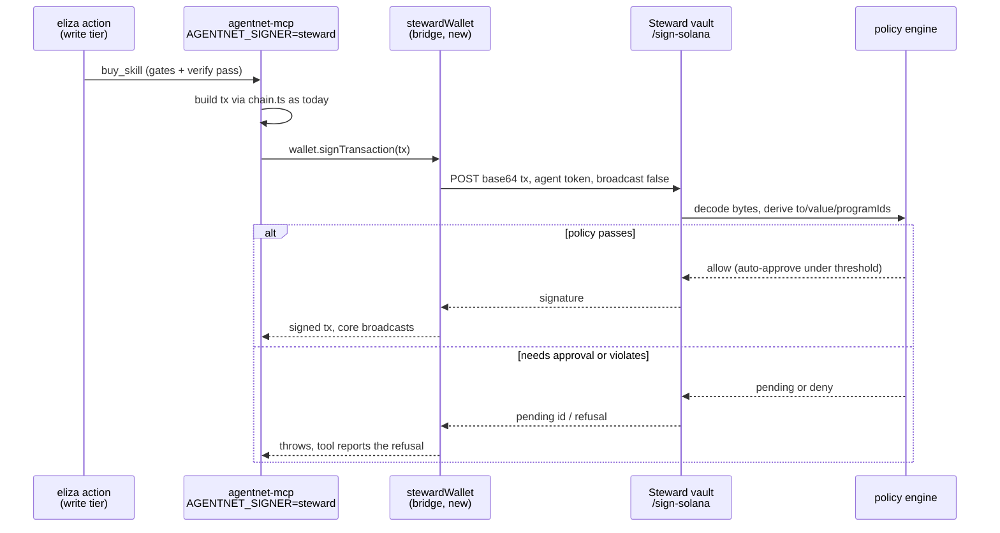

# Steward-governed wallets: the spend key out of the agent process

> **Status: partly built.** The signer seam upstream ships today, and Steward's
> Solana policy rail ships today; the bridge between them does not exist yet.
> Every mechanism claim below was verified by reading the cited files in this
> repo, the Steward repo, and the plugin. Nothing here changes who the agent IS
> (the wallet address stays the identity); it changes where the key LIVES.

## 0. The problem

Today the write tier holds a raw keypair inside the same process the LLM drives.
The stdio MCP server bootstraps its own wallet from `AGENTNET_WALLET_KEYFILE`
(`packages/core/src/mcp-stdio.ts`, header env contract), and `keypairWallet`
signs whatever it is handed, silently, with no gate of its own
(`packages/core/src/account/keypairWallet.ts:12`). The gates that do exist are
process-local and partial: `PROMPT_BEFORE_USE` covers only `publish_skill` and
`buy_skill` (`packages/core/src/skill-market/index.ts:120`), so blog and comment
tools auto-sign their network-fee transactions in every mode. The plugin's
whole spend-safety story is two settings plus advice: gate flags off by default
and "fund the keyfile with only what it may spend" (plugin-agentnet README,
Safety section). The keyfile balance as ceiling is honest but crude: one prompt
injection on a funded key signs until the balance is gone, with no per-tx cap,
no allowlist, no audit trail.

Steward is exactly the missing half: a signing service where the key never
enters the agent process, every signature passes a policy engine, and every
decision is audited. This doc is the bridge.

## 1. The seam upstream (exists, this repo)

Core never assumed a local keypair:

- `Wallet` is a four-member interface: `address`, `publicKey`, `signMessage`,
  `signTransaction`/`signAllTransactions`
  (`packages/core/src/runtime/contract.ts:19`, extending iqlabs-sdk's
  `WalletSigner`). Everything on-chain routes through the injected `Wallet`.
- Core deliberately re-exports `SignerInput` instead of declaring its own
  signer type (`packages/core/src/core/types.ts:7`).
- The `keypairWallet.ts` header states the design intent: interactive
  front-ends (Phantom, mobile) implement `Wallet` directly instead of via a
  Keypair. A remote policy signer is the same move, one more implementation.

So a `stewardWallet` is a drop-in: no core surgery, just a different object
handed to `connect()` / the stdio bootstrap.

## 2. What Steward ships (exists, steward repo, read at HEAD)

- **Solana signing route**: `POST /vault/:agentId/sign-solana`
  (`packages/api/src/routes/vault.ts:7622`), reachable through the SDK as
  `StewardClient.signSolanaTransaction` (`packages/sdk/src/client.ts:2538`,
  base64 serialized tx in, signature out, optional broadcast). Auth is the
  agent-scoped token (`requireAgentAccess`); token model is 15m access / 30d
  agent / 30d refresh, tenant-scoped (`packages/auth/src/jwt.ts`).
- **Spoof resistance**: caller-supplied `to`/`value` are advisory only. The
  authoritative policy fields are decoded from the transaction bytes
  (`parseSolanaTransaction`, `deriveSolanaPolicyFields` in
  `packages/vault/src/solana-instructions.ts:903`), including `programIds`
  collected explicitly "for allowed-program style policy" (line 888), plus a
  priority-fee cap assertion. SPL and Token-2022 transfers are decoded
  natively (`packages/vault/src/solana.ts:594`).
- **Fail-closed default**: a transaction whose instructions cannot all be
  decoded sets `fullyParsed: false` and is refused (`vault.ts:7751`) unless
  the tenant opts into audited blind signing
  (`STEWARD_ALLOW_UNSAFE_SOLANA_BLIND_SIGNING`, `vault.ts:194`), which then
  requires a caller-supplied envelope.
- **Policy engine**: core rule types include `spending-limit`,
  `approved-addresses`, `auto-approve-threshold`, `time-window`, `rate-limit`,
  `contract-allowlist` (`packages/policy-engine/src/policy-rule-registry.ts:50`),
  with manual-approval flow, spend recording, and audit events on the signing
  paths (`writeAuditEvent` throughout `vault.ts`).
- **Eliza precedent**: Steward already ships `@stwd/eliza-plugin` with
  `sign-transaction`, `transfer`, `check-spend`, `request-approval`,
  `list-approvals` actions (`packages/eliza-plugin/src/actions/`). Governed
  signing inside eliza is their own product direction; this idea plugs
  AgentNet into it rather than inventing a parallel rail.

## 3. Mechanism

`AGENTNET_SIGNER` selects the wallet implementation at the stdio server's
bootstrap. Default `keyfile` is exactly today's behavior; `steward` swaps in
the bridge. The plugin already has the forwarding seam: its transport spawns
the server with `{ ...process.env, ...this.env }` and an overridable command
(`plugin-agentnet/src/lib/mcp-client.js:23`), and all settings resolve through
`runtime.getSetting` (README, Config table), so three new pass-through settings
(`STEWARD_API_URL`, `STEWARD_AGENT_ID`, `STEWARD_AGENT_TOKEN`) ride the
existing pattern.

The bridge sets `broadcast: false` so core keeps its own send-and-confirm path
(`chain.ts` singleton via `initChain`) and nothing downstream of signing
changes. `signAllTransactions` loops `signTransaction`; multi-sig-per-tx flows
(publish) just make N policy-checked calls.

## 4. Two honest frictions

**Encryption key vs spend key.** Core derives the vault/session encryption key
from a deterministic ed25519 signature over fixed bytes
(`wallet.signMessage` into `deriveX25519Keypair`,
`packages/core/src/core/crypto.ts:22`; the fixed `SESSION_KEY_MESSAGE` is
visible in `chat/ui/onboarding.ts:234`). Steward is deliberately hostile to
headless arbitrary-message signing: `sign-message` is disabled by default and
demands an owner/admin session with recent MFA (`vault.ts:5064`), and
`sign-raw-digest` needs two unsafe env opt-ins plus MFA plus a
`raw-signing-chain` policy, and signs a 32-byte digest, not a message
(`vault.ts:5257`). So the bridge cannot mint the storage key per boot, and
should not try. The honest v1: a one-time attended ENROLLMENT step per device
performs the single `signMessage`, derives the x25519 seed, and caches it
locally (mode 600, same treatment as `tokens/` files in `core/paths.ts`).
Transaction signing stays per-call and headless. This split is actually the
right trust shape: Steward governs the capability that moves money; the cached
seed only decrypts the operator's own session data. A domain-bound
deterministic sign endpoint under policy would remove the enrollment step, but
that is a Steward-side feature request, not something to fake around.

**Program decode.** AgentNet's economic transactions are IQ program
instructions (code-in chunks, inventory writes) plus Token-2022 mints. Steward
decodes the token layer but not the IQ program, so these transactions land
`fullyParsed: false` and are refused by default (`vault.ts:7751`). Two exits:
a Steward-side decoder entry for the IQ program family, which makes
`programIds` allowlisting plus lamport caps fully honest; or the audited
blind-signing opt-in with a caller-supplied envelope, acceptable for devnet
bring-up only, because it reduces Steward to a spend meter on the advisory
envelope. Say which one a deployment is running. Never present blind-sign
bring-up as the shipped story.

## 5. Exists today / needs building / needs zo

**Exists today** (verified in source):

- the `Wallet` seam and its explicit foreign-signer intent
  (`runtime/contract.ts:19`, `keypairWallet.ts` header, `core/types.ts:7`)
- the stdio server's env-driven bootstrap and the plugin's env forwarding +
  command override (`mcp-stdio.ts`, `mcp-client.js:23`, README Config)
- Steward end to end: sign-solana route with byte-derived policy fields and
  fail-closed parse gate, policy rule set, approvals, audit, SDK method,
  agent-scoped tokens, and their own eliza plugin precedent (paths in section 2)

**Needs building** (ours, bridge-sized):

- `stewardWallet`: implements `Wallet` over `StewardClient`; address and
  publicKey from the agent's Solana wallet address, `signTransaction` via
  sign-solana with `broadcast: false`, `signMessage` served from the
  enrollment cache, clear errors for pending-approval and policy-refusal
- the enrollment command (attended, once per device) that mints and caches the
  encryption seed
- plugin config rows for the three Steward settings, forwarded to the spawned
  server like the existing `AGENTNET_*` rows

**Needs zo:**

- `AGENTNET_SIGNER` accepted into the published `@iqlabs-official/agentnet-mcp`
  bootstrap (keyfile default, steward opt-in), and whether the bridge lives in
  core as `account/stewardWallet.ts` or stays an external package
- the double-approval UX call: when Steward policy says manual-approve and the
  local `PROMPT_BEFORE_USE` card also fires, who is the source of truth
- whether the CLI/webview surfaces should show "governed wallet" state

**Needs Steward lane** (their repo, their review):

- IQ program decoder entry so AgentNet transactions evaluate as fully parsed
- optionally, a policy-scoped domain-bound message-sign to retire enrollment

## Shortest path

The bridge package plus a devnet demo, zero upstream changes. The plugin's
`AGENTNET_MCP_COMMAND` already points at any local build (README, Config), so:
fork the stdio server's bootstrap locally, swap `localWallet` for
`stewardWallet` behind `AGENTNET_SIGNER` (the `Wallet` type makes this a
ten-line change), enroll once, set a Steward `spending-limit` policy of a few
hundred thousand lamports with blind-signing opt-in ON and labeled as
bring-up, then run one gated write (a comment post) and one refused overspend.
The demo proves the three claims that matter: the key never entered the agent
process, the cap was enforced by the signer not the prompt, and every
signature left an audit row. That evidence is the argument for both upstream
asks at once: zo's `AGENTNET_SIGNER` switch and Steward's IQ decoder entry.
