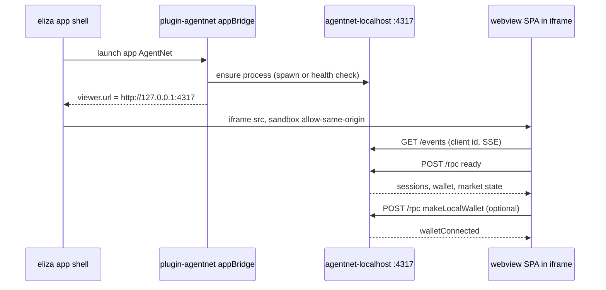
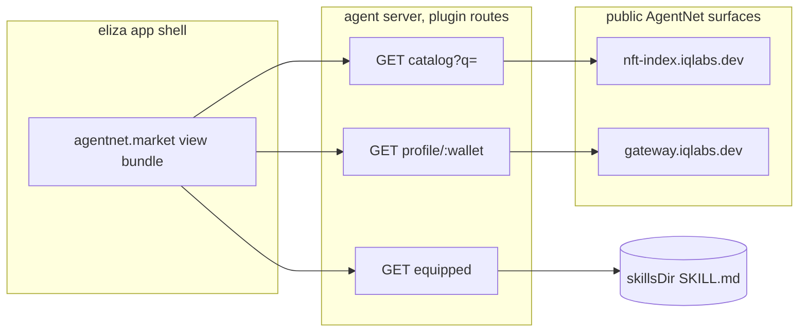

# AgentNet view inside the eliza app

Goal: an AgentNet surface inside the eliza app so an eliza agent's owner can
see the market, their equipped skills, and their profile without leaving the
app. Two shapes are possible; both are sketched below with what each really
needs. plugin-agentnet (the finished read/write plugin) is the carrier for
either shape.

Status: idea doc. Nothing here is built. Every claim below is grounded in
code that was actually read; paths cite the elizaOS `develop` worktree
(`/Users/nubs/Git/eliza-oidc-work`) and the AgentNet worktree (`wt-183`).

## The key fact: eliza plugins ship UI first-class

The plugin contract already carries views, apps, nav tabs, and widgets. No
shell changes are needed to put a new surface in the app.

- `Plugin.views?: ViewDeclaration[]`
  (`packages/core/src/types/plugin.ts:1512`). A view is a compiled JS bundle
  at `bundlePath` (convention `dist/views/bundle.js`), served by the agent at
  `/api/views/<id>/bundle.js`, dynamically `import()`ed by the shell and
  mounted via `componentExport` (`packages/ui/src/components/views/DynamicViewLoader.tsx`).
  Registry: `packages/agent/src/api/views-registry.ts`.
- Maturity is a declared field: `viewKind: "system" | "release" | "developer"
  | "preview"` (`packages/core/src/types/view-kind.ts`). `preview` is hidden
  until the user flips the Settings toggle. A new AgentNet panel ships as
  `preview`, honestly.
- `Plugin.app?: PluginApp` + `appBridge?: PluginAppBridge`
  (`plugin.ts:1063,445`): an "app" with a `viewer: { url, sandbox,
  postMessageAuth }` iframe embed. `appBridge.prepareLaunch` runs before
  launch (spawn a process, return the launch URL), `stopRun` tears it down.
  The shell embeds `viewer.url` through `EmbeddedAppViewer`
  (`packages/ui/src/components/apps/EmbeddedAppViewer.tsx`, default sandbox
  `allow-scripts allow-same-origin allow-popups`) with an origin-pinned
  postMessage auth handshake (`packages/ui/src/components/apps/viewer-auth.ts`).
- Working reference: plugin-todos declares one view
  (`plugins/plugin-todos/src/index.ts:23`), builds it with the shared vite
  config (`packages/scripts/view-bundle-vite.config.ts`; react, `@elizaos/ui`,
  `lucide-react` stay external, the shell provides them), and the view
  component fetches its data from a plain agent HTTP route
  (`TodosView.tsx` reads `GET {base}/api/lifeops/todos`). Plugin `routes`
  (`Plugin.routes?: Route[]`) are served under the plugin-name prefix.

One restriction to carry honestly: dynamic bundle and frame URLs are filtered
out on store builds (iOS App Store, Google Play) per the `ViewDeclaration`
contract comment (`plugin.ts:875`). Both shapes below are web/desktop first.

## Shape A: embed the real AgentNet webview

The webview (`wt-183/surfaces/webview`) is a Vite React SPA served by
`surfaces/localhost` (`src/index.ts`): a local node process on port 4317
(`AGENTNET_PORT`) that serves `webview/dist` static and speaks SSE
`GET /events` + `POST /rpc` with cursor replay
(`webview/src/transport/client.ts`, all paths origin-relative). The SPA is
the full product: chat, market, agent directory, profile
(`webview/src/market/MarketScreen.tsx`, `AgentDirectory.tsx`,
`SkillDetailView.tsx`).

What it needs at runtime, verified in `surfaces/localhost/src/index.ts`:

- The localhost server process. It boots with NO wallet: a guest device key
  whose transaction signing fails closed (`deviceGuestWallet`, line 179), so
  market reads work immediately.
- A real wallet only for on-chain actions. Two paths exist: browser-extension
  `connectWallet {address, signature}` (Phantom/Solflare, needs a real
  browser), or `makeLocalWallet` (line 1114): adopt a device keypair at
  `~/.config/solana/id.json`, generated if missing, persisted as wallet mode
  and auto-reconnected on restart (line 1291).
- Claude/Codex CLIs only for chat. Market browse does not need them.

### How the embed works

The honest first version is the app viewer iframe, not the view registry:
view-registry `sandboxed-iframe` isolation grants `allow-scripts` but never
`allow-same-origin` (`packages/ui/src/components/views/SandboxedViewFrame.tsx`,
`surface-manifest.ts`), which gives the SPA an opaque origin; its relative
`/events` and `/rpc` calls become cross-origin and `surfaces/localhost` sets
no CORS headers, so the SPA breaks. The `PluginApp` viewer path keeps the
SPA on its true `127.0.0.1:4317` origin and everything works as-is.



### Wallet handoff

No protocol needed for v1, the handoff is the filesystem: plugin-agentnet's
write tier signs with `AGENTNET_WALLET_KEYFILE`, default
`~/.config/solana/id.json` (plugin README, `src/lib/mcp-client.js` spawn
env), and the webview's `makeLocalWallet` adopts the same default path. One
keypair, one AgentNet identity, shared by the agent's actions and the
embedded UI. A real postMessage handoff (eliza injecting an identity into
the SPA) has shell support (`PluginAppViewer.postMessageAuth`,
`resolveViewerAuthMessage`) but no listener in the SPA. That is hers to add.

### What blocks Shape A

`surfaces/localhost` is a private workspace package
(`surfaces/localhost/package.json`: `"private": true`, depends on
`@iqlabs-official/agent-sdk` as `workspace:*`). The plugin cannot spawn what
users cannot install. Until she publishes the sdk plus a runnable
`agentnet-localhost` bin (or a bundled dist), Shape A only works on machines
with an AgentNet checkout. Label: blocked on publish.

## Shape B: native read-tier panel

If the full embed is too heavy, a small native panel ships today from
plugin-agentnet alone, using the read tier that already exists and is
tested (`src/lib/indexer.js`: `fetchCatalog`, `searchCatalog`,
`fetchInscription`, `fetchUserProfile`, `fetchUserPosts`;
`src/lib/chain.js`: `fetchMintMetadata`; `src/lib/skillfile.js`: equipped
skill listing). No wallet, no localhost server, no AgentNet checkout.

Panel contents, mirroring the webview's market screens at reduced depth:

- Market search: query box over the catalog, tile list (name, supply, price,
  free/priced badge). Data: indexer.
- Owned / equipped: the locally equipped AgentNet skills from `skillsDir`,
  with unequip hint routed to chat (actions stay the agent's job).
- Profile card: gateway profile + created items for the configured wallet
  (the write-tier keyfile address when set, else lookup by pasted address).



Mechanism: three GET routes in `Plugin.routes` fronting the existing lib
functions (the view never talks to the public internet directly, same
pattern as todos), one React panel component, one vite view-bundle config
copied from plugin-todos, and a `views` entry:

```
views: [{
  id: "agentnet.market",
  label: "AgentNet",
  path: "/agentnet",
  viewKind: "preview",
  bundlePath: "dist/views/bundle.js",
  componentExport: "AgentNetPanel",
  tags: ["market", "skills", "solana"],
}]
```

Note: the plugin is currently a local scaffold, so bundle-path resolution
uses the directory-loaded binding (`bindPluginPackageDirectory`,
`views-registry.ts`); once it has an npm name, set `Plugin.packageName`.

## Exists today

- eliza: full plugin view system (declaration, registry, serving, dynamic
  mount, view manager), `viewKind` maturity gating, plugin routes, app
  viewer iframe with sandbox + postMessage auth, shared view-bundle build.
- AgentNet: the webview SPA with market/profile/directory screens, the
  localhost server with guest-mode reads, `makeLocalWallet`, SSE replay.
- plugin-agentnet: read-tier libs with offline + live tests, config
  resolution through `runtime.getSetting`, write tier behind gates.

## Needs building (ours)

- Shape B: three read routes + `AgentNetPanel` component + vite view config
  + `views` declaration in plugin-agentnet. All additive.
- Shape A: `app` + `appBridge` block in plugin-agentnet (ensure process,
  health check `GET /`, `stopRun` kill), config for an existing checkout
  path until publish.

## Needs zo

- npm publish of `@iqlabs-official/agent-sdk` and a runnable
  `agentnet-localhost` package (hard blocker for Shape A off-machine).
- CORS headers on `/events` + `/rpc` if she ever wants the sandboxed
  view-registry embed instead of the app viewer.
- A postMessage auth/wallet listener in the SPA if identity injection
  should replace the shared-keyfile handoff.
- Optional: an `?embed=1` chrome-light mode of the SPA (market only, no
  chat) for a tighter in-app fit.

## Shortest path

Shape B, market search only: one GET route (`catalog?q=` fronting
`fetchCatalog` + `searchCatalog`), one panel component with a search box and
tile list, `viewKind: "preview"`, shipped inside plugin-agentnet. No wallet,
no new processes, no zo dependency, and the view/route/bundle plumbing it
proves out is exactly what the owned-skills list, the profile card, and
later the Shape A launcher build on.
