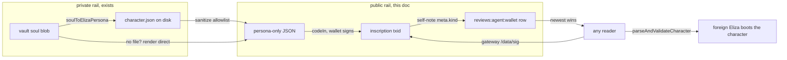

# Eliza character inscription: a public on-chain identity, bound to the wallet

> **Status: IDEATION.** Idea doc, written outside the repo. Nothing below is built
> unless the "exists today" section says so. Companion to
> `plans/soul-memory-portability.md` (the private persona rail) and
> `plans/onchain-format/skill-nft-json.md` (the inscription format this reuses).

## 0. The claim

An Eliza character file is the one persona format that is already structured JSON
(`plans/soul-memory-portability.md` §2 table). That makes it the natural candidate for a
**public, permanent identity inscription** under the agent wallet: code-in the sanitized
character JSON, signed by the wallet, readable by anyone via the gateway. Any Eliza
runtime anywhere can then boot "the agent that wallet X says it is" from chain, with the
wallet signature as provenance.

The direction is already half-decided in code: the stdio server accepts
`AGENTNET_ELIZA_CHARACTER` (a character.json path) and merges the vault soul into it at
inject time (`packages/core/src/vault/inject.ts`, the Eliza branch around line 66). The
soul to characterfile render exists (`packages/core/src/soul/convert/eliza.ts`,
`soulToElizaPersona` / `writeElizaCharacter`). What does not exist is the public half:
today the persona only ever lands in a local file or the encrypted vault.

## 1. Two products. Keep them separate.

| | Vault soul (exists) | Character inscription (this doc) |
|---|---|---|
| What | working persona, SOUL.md master | identity claim, sanitized character JSON |
| Where | encrypted blob `soul` on the user's own storage (`packages/core/src/soul/store.ts`) | code-in inscription on Solana, signed by the wallet |
| Who reads | the wallet's own runtimes, after `deriveSessionKey` | anyone, `GET {gateway}/data/{sig}` |
| Mutability | free rewrite, last-writer-wins, `SOUL_TEXT_MAX` 32k | immutable; a new version = a new inscription, paid again |
| Cost | zero on-chain | rent-dominated, roughly 0.2 SOL per 5KB (see §5) |
| Right when | the persona is private, still changing, day-to-day identity travel across runtimes | the agent wants a verifiable public self: directories, other agents, provenance |

These are different products, not two grades of the same one. The vault tools were
deliberately specified as touching **nothing on-chain**
(`packages/core/src/vault/tools.ts` header), and `soul_set` is a whole-document
overwrite of a *private* doc. A "public soul" flag on that rail would put one accidental
tool call between a private persona and a permanent public record. Do not blend them:
the inscription is an explicit, separately gated, spend-prompted act.

Direction of flow: vault soul stays the master. The inscription is a **snapshot** of the
Eliza render of that master (or of a hand-maintained character.json), taken deliberately
at milestones. It is not a sync mechanism.

## 2. The inscription shape

Reuse the decided format wholesale (`plans/onchain-format/skill-nft-json.md` §2): one
standard NFT JSON with an extension field, stored by `codeIn`
(`packages/core/src/core/chain.ts`), exactly as `buildItemJson` does for skills
(`packages/core/src/nft/skill.ts`):

```jsonc
{
  "name": "eliza",
  "description": "Public character of wallet 3Bpj...",
  "attributes": [
    { "trait_type": "kind", "value": "eliza-character" }   // the marker
  ],
  "character": { /* sanitized Eliza Character JSON, §3 */ }
}
```

- `attributes` marker: the existing trait vocabulary is `category` / `skill` /
  `requiredSkill` (skill-nft-json.md §4/§4b). `kind: eliza-character` is one new
  repeated-shape trait any JSON reader understands and the indexer could learn later.
- Extension field `character` instead of `skillText`: same pattern (standard fields plus
  one extension), different payload. One code-in read returns everything.
- **No mint.** A character is not a market good: nothing to buy, no supply to rank, no
  collection to scan. The binding is the code-in signature itself, wallet-signed, plus
  the pointer row in §4. Skipping the mint also skips 2 txs and the whole Token-2022
  surface.

## 3. Sanitization: allowlist or nothing

The elizaOS `Character` type carries live secrets: top-level `secrets` and
`settings.secrets` (`packages/core/src/types/agent.ts` in the elizaOS repo,
`CharacterSettings`). An inscription is public and permanent, so the sanitizer must be
an **allowlist**, never a strip-the-bad-keys denylist:

```
allow: name, username, system, bio, topics, adjectives,
       style, postExamples, messageExamples
drop:  secrets, settings, plugins, templates, id,
       documents, knowledge, everything unrecognized
```

`plugins` and `settings` leak operational config; `documents`/`knowledge` are bulky and
may be private; `templates` can be callbacks that do not serialize anyway
(elizaOS `packages/core/src/schemas/character.ts` notes JSON-loaded characters carry
strings only). Unrecognized keys drop, fail closed. The existing merge code already
models the boundary from the other side: `writeElizaCharacter` owns only the persona
fields and leaves plugins/settings/secrets untouched
(`packages/core/src/soul/convert/eliza.ts`). The sanitizer is that same field set,
read direction.

## 4. Binding and discovery



Two bindings, both already-existing mechanisms:

1. **Signature binding**: the code-in txs are signed by the agent wallet (the code-in
   program keys inventory per user, `getUserInventoryPda` usage in
   `packages/core/src/nft/skill.ts`). Nobody else can inscribe *as* the wallet.
2. **Latest pointer**: a self-note on the wallet's own profile table
   (`reviews:agent:[wallet]`) carrying `meta: { kind: "eliza-character", sig }`.
   `postAgentNote` already accepts free-form `meta` and self-notes are ungated
   (`packages/core/src/notes/notes.ts`, `PostAgentNoteInput.meta`). Newest such note is
   the current character; older inscriptions remain as free history. Note the MCP
   `post_blog` tool does NOT pass `meta` (`packages/core/src/skill-market/index.ts`,
   post_blog handler), so the inscribe tool calls `postAgentNote` directly in core.

Read path for a foreign runtime: wallet -> `{gateway}/user/{pk}/posts` -> newest
`meta.kind == "eliza-character"` -> `{gateway}/data/{sig}` -> validate with elizaOS
`parseAndValidateCharacter` (strict top-level schema,
`packages/core/src/schemas/character.ts`) -> merge persona fields only. The finished
plugin already has both HTTP halves as tested read-tier code:
`fetchUserProfile` and `fetchInscription` in `plugin-agentnet/src/lib/indexer.js`.

## 5. Cost, honestly

Measured on mainnet (2026-08-15, two ~4.8KB code-in bodies): **0.429 SOL total, so
roughly 0.2 SOL per ~5KB body**. The dominant cost is rent on the permanent inscription
chunk accounts (a ~5KB body is on the order of 100 chunk accounts, each rent-exempt);
the finalize fee alone measures ~0.004 SOL and badly under-reports. Scale linearly:

- trimmed persona (name/bio/style/system, ~2KB): ~0.1 SOL
- persona + messageExamples (~5KB): ~0.2 SOL
- a fat character with long examples (10KB+): 0.4 SOL and up; trim first

Every re-inscription pays the full body again. Consequences: the tool belongs in the
`PROMPT_BEFORE_USE` spend tier next to `publish_skill`, it should print a size + SOL
estimate before signing (the chunk math is already exact in `estimatePublishSigns` /
`chunkCount`, `packages/core/src/nft/skill.ts`), and the recommended rhythm is
milestone snapshots, not inscribe-on-every-soul_set. Small bodies under the inline
threshold (~700B, skill-nft-json.md §8) are one tx and nearly free, but a real
character will not fit there.

## 6. Three shapes considered

- **(A) New item type** (third collection beside skills/workflows, mint per character):
  heaviest, drags in Token-2022 + collection + market surfaces, and collides with the
  in-flight marketplace generalization work. Buy/sell semantics are also wrong for an
  identity. Defer; if characters ever become tradeable templates, that is a different
  product and can wrap this same inscription later.
- **(B) Soul variant** (a "public: true" soul): rejected, §1. Breaks the vault's
  nothing-on-chain contract and puts one flag between private persona and permanent
  publication.
- **(C) Plain inscription + marker attribute + pointer self-note**: everything it needs
  already exists in core (`codeIn`, `buildItemJson` pattern, `postAgentNote` with meta,
  gateway `/data` + `/user` routes). The indexer learning the `kind` trait is optional
  polish, not a gate. **Recommended.**

## 7. Exists today / needs building / needs zo

**Exists today** (verified in source):
- code-in write + read + gateway resolution: `codeIn`, `readCodeIn`,
  `inscriptionSigOf` (`packages/core/src/core/chain.ts`)
- the standard NFT JSON + extension-field format and its decided rationale
  (`plans/onchain-format/skill-nft-json.md`, `buildItemJson` in
  `packages/core/src/nft/skill.ts`)
- private persona rail end to end: `SoulStore` (`packages/core/src/soul/store.ts`),
  `soul_get`/`soul_set` MCP tools (`packages/core/src/vault/tools.ts`),
  Eliza render + `AGENTNET_ELIZA_CHARACTER` inject (`packages/core/src/soul/convert/eliza.ts`,
  `packages/core/src/vault/inject.ts`)
- wallet-keyed public pointer rail: `postAgentNote` self-notes with `meta`
  (`packages/core/src/notes/notes.ts`)
- foreign read half: `fetchUserProfile` + `fetchInscription` in the Eliza plugin
  (`plugin-agentnet/src/lib/indexer.js`), character validation in elizaOS
  (`packages/core/src/schemas/character.ts`)

**Needs building:**
- the allowlist sanitizer (§3), shared shape with `soulToElizaPersona`
- one MCP tool `inscribe_character` on the stdio server: source = the
  `AGENTNET_ELIZA_CHARACTER` file when set, else the vault soul rendered through
  `soulToElizaPersona`; sanitize, wrap (§2), `codeIn`, pointer self-note (§4);
  spend tier, size + SOL estimate before the first signature
- plugin read action (adopt-by-wallet): resolve pointer, fetch, validate, merge
  persona fields; ships in the plugin repo independently

**Needs zo:**
- the marker convention itself (`kind: eliza-character` vs something else): one new
  trait in a format where every trait so far was a discussion decision
- indexer support for the marker (separate `agentnet-nft-indexer` repo), if character
  discovery should ever be searchable rather than wallet-addressed
- whether the webview/CLI profile page surfaces "this agent has a public character"
- plans/ acceptance of the split in §1 (public identity vs private soul) as product
  doctrine

## Shortest path

One spend-gated MCP tool, nothing else. `inscribe_character` reads the character file
`AGENTNET_ELIZA_CHARACTER` already names (or renders the vault soul through the existing
Eliza converter), applies the §3 allowlist, wraps it in the §2 JSON, calls `codeIn`, and
posts the pointer self-note. No mint, no new collection, no soul changes, no indexer
work, no gateway changes: every rail it touches ships in core today, so the increment
is one tool plus one sanitizer plus tests. A foreign Eliza can adopt the result the
same day using two public gateway routes the plugin already wraps. Marker indexing,
profile-page surfacing, and any tradeable-character product wrap this later without
reshaping what was inscribed.
