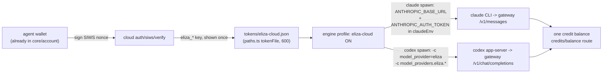

# Eliza Cloud sign-in + model suite (a metered gateway for the engines)

> **Status: research/idea - no source-code changes here.** Every mechanism claim below was
> verified by reading the cited files in this repo, the elizaOS repo, and the Steward repo.
> The two live-probe items in "Shortest path" are the only unverified assumptions, and they
> are gated first on purpose.

## 0. Thesis

Today both engines run on the USER's own vendor login: claude on their subscription OAuth
(`packages/core/src/account/claudeAuth.ts`), codex on device auth in `~/.codex`
(`packages/core/src/account/codexAuth.ts`). A user with neither subscription has a wallet,
skills, and no brain to run them.

Eliza Cloud (api.elizacloud.ai, source `packages/cloud` in the elizaOS repo) is a billed
inference gateway with accounts, API keys, and a credit balance - and it already speaks
BOTH of our engines' wire protocols. Its Solana sign-in issues an API key from a wallet
signature, and the agent already IS a wallet. So the whole feature collapses to:

> Sign one nonce with the wallet -> hold one `eliza_*` key -> point the EXISTING engines'
> token traffic at the gateway. One balance, a suite of models, no new engine.

## 1. Where auth enters the engine layer today (this repo, read)

- `packages/core/src/runtime/spawn.ts:167` - the whole engine switch:
  `opts.cli === "claude" ? claudeEngine(opts) : codexEngine(opts)`. One `Engine`
  interface, surfaces never import SDK types.
- claude path: agent SDK `query()` with `pathToClaudeCodeExecutable: resolveExecutable("claude")`;
  `claudeEnv` is built by spreading `process.env` (spawn.ts:399) explicitly to keep
  "PATH / ANTHROPIC creds". Env injection is already the designed seam.
- codex path: spawns `codex app-server --stdio`; `opts.apiKey` becomes
  `childEnv.OPENAI_API_KEY` (spawn.ts:553). So a key-fed engine ALREADY exists
  (the "Stage 1 Codex API Key" in `runtime/contract.ts:170`).
- Process-scoped config overrides on the codex spawn are also proven:
  `codexMcpFlags()` (spawn.ts:520) injects `-c mcp_servers.<name>...` without touching
  `~/.codex/config.toml`. The same `-c` mechanism carries `model_providers.*` overrides.
- Model catalogs are live probes per engine: `runtime/claudeModels.ts`
  (`supportedModels()` over the SDK control channel) and `runtime/codexModels.ts`
  (`model/list` JSON-RPC). Both fall back to a static baseline on failure.
- Key storage precedent: `account/codexAuth.ts` persists an API key at
  `tokenFile("codex-key")` (`core/paths.ts:29`, mode 600). An eliza key gets the same
  treatment, `tokens/eliza-cloud.json`.
- The engine id union `"claude" | "codex"` is baked through
  `runtime/contract.ts` (startSession, SessionHandle, ChatMessage.cli, SessionMeta,
  CanonicalSession), `runtime/detect.ts`, prefs, and the CLI `/engine` command
  (`surfaces/cli/src/commands.ts:22`). Anything that adds a THIRD engine touches all of
  it - that is why stage 1 below deliberately does not.

## 2. What the gateway offers (elizaOS repo, read at HEAD)

- **Anthropic wire**: `packages/cloud/api/v1/messages/route.ts`. Its header states it is
  an Anthropic Messages API compatible endpoint, built precisely so Claude Code and
  Anthropic SDK clients can spend elizaOS Cloud credits without a custom proxy.
- **OpenAI wire**: `packages/cloud/api/v1/chat/completions/route.ts`. Full agentic
  shape: `tools`, `tool_choice`, `tool_calls`, streaming, usage-based billing with a
  20 percent platform markup (stated in the route header).
- **Responses shim**: `packages/cloud/api/v1/responses/route.ts` exists but its typed
  request is text-only (no tool passthrough) and it adapts onto the completions handler.
  Codex must therefore ride the chat wire, not the responses wire. Honest gap, see 5.
- **Catalog**: `packages/cloud/api/v1/models/route.ts`, OpenAI-format model list, public.
- **Account + balance**: `packages/cloud/api/v1/api-keys/route.ts` (create returns
  `plainKey` once), `packages/cloud/api/credits/balance/route.ts` (works with API-key
  auth), credit reserve + off-path billing per `packages/cloud/api/docs/inference-hot-path.md`.
- **Sign-in, three doors**:
  - `api/auth/siws/verify/route.ts`: validates a Sign-In-With-Solana message + ed25519
    signature, finds-or-creates the user BY WALLET ADDRESS, and issues an API key.
    This is the door made for us: the agent wallet signs, no browser, no email.
  - `api/auth/cli-session/*`: a device-style CLI login flow (create, complete in
    browser, poll), for users who want their existing cloud account instead.
  - `api/auth/steward-session/route.ts` + `steward-nonce-exchange` + `steward-refresh`:
    Eliza Cloud already accepts Steward JWTs and syncs the user in.

## 3. Steward's role (steward repo, read)

`packages/auth/src` is a wide identity surface (SIWE guard, passkey, Apple/OAuth/OIDC/SAML,
email, phone, TOTP; `jwt.ts` defines 15m access / 30d agent / 30d refresh tokens with tenant
and agent scopes). But Steward has NO inference credit ledger: its balance objects are
wallet groupings (`packages/db/src/schema.ts`, `digitalAssetAccounts`). And Eliza Cloud
already consumes Steward JWTs (2 above). Conclusion: Steward is a sign-in provider IN FRONT
of the same cloud balance, not a second balance layer. We integrate the balance once
(Eliza Cloud) and get Steward sign-in transitively, for free. Its credential-injecting
proxy (`packages/proxy/src/index.ts`) is a later option for org-held keys, not stage 1.

## 4. Mechanism: a gateway profile, not a new engine

Both vendor CLIs support pointing their token traffic at a compatible base URL. Claude Code
via `ANTHROPIC_BASE_URL` + `ANTHROPIC_AUTH_TOKEN` (its documented LLM-gateway mode); codex
via a `model_providers` entry with `base_url`, `env_key`, `wire_api = "chat"` selected by
`model_provider` (its documented custom-provider mode, same `-c` override channel we
already use for MCP). The engines keep doing everything else exactly as now: same
approval gates, same sandbox, same session jsonl, same inject/resume. Only the HTTPS
destination of the model calls changes.

Surface work rides existing patterns: merge the gateway `/v1/models` catalog into the
per-engine pickers with a CLOUD tag (same fallback contract as `claudeModels.ts`), one
`//ELIZA_` status band on boot (tab 01 already stacks `//WALLET_ //CLAUDE_ //CODEX_
//STORAGE_` bands, see plans/cli-design-parity.md), a balance line in `/account`.
`detect.ts` learns that engine + eliza key counts as "ok" even with `no-login`, which is
the actual user-facing win: onboarding without a vendor subscription.

## 5. Honest risks, checked before code

- **Path mapping is unverified.** The cloud routes mount under `/api/v1/*` in source;
  what the deployed host exposes at `api.elizacloud.ai` must be probed live before
  writing a line (Claude Code appends `/v1/messages` to its base URL). Probe-first,
  per house empiricism.
- **Claude CLI with key auth.** Claude Code accepts token env auth without subscription
  OAuth, but the exact behavior of a logged-out CLI + `ANTHROPIC_AUTH_TOKEN` needs one
  clean-machine test. `claudeModels.ts` supportedModels() should still answer (it is the
  CLI's own catalog), but verify.
- **Codex on the chat wire.** `wire_api = "chat"` is codex's supported path for
  third-party providers, and the gateway's completions route carries tools. Responses-only
  niceties (native reasoning summaries) may degrade; label the profile beta until a full
  agentic session is exercised.
- **Meter accuracy.** `defaultWindow()` (spawn.ts:224) hardcodes per-engine windows when
  the engine does not report one; gateway model ids may need entries or the context meter
  lies.
- **Cost honesty.** Credit reserve per call + 20 percent markup, and an agentic session is
  MANY calls. Show the balance, never hide the burn.
- **Positioning.** `claudeAuth.ts` states the product point: your OWN subscription, tokens
  never proxied off-device. The eliza profile must stay opt-in and additive - a second way
  to run, never a silent reroute. Reselling vendor models is the gateway's compliance
  surface, not ours; ours is not lying about where tokens go.

## Exists today

- Engine env/flag seams: `claudeEnv` spread (spawn.ts:399), `opts.apiKey` ->
  `OPENAI_API_KEY` (spawn.ts:553), `-c` overrides (spawn.ts:520).
- Key persistence pattern: `account/codexAuth.ts` + `core/paths.ts` tokens dir.
- Wallet signing in core (the agent identity itself), so SIWS costs no new dependency.
- Gateway side, all shipped in elizaOS `packages/cloud`: Anthropic wire, OpenAI wire with
  tools, models catalog, SIWS key issuance, CLI device login, Steward JWT bridge, API-key
  management, credit balance + billing pipeline.
- Eliza-side reach into AgentNet already exists as `plugin-agentnet` (read tier live);
  this idea is the reverse direction: AgentNet consuming eliza inference.

## Needs building (PR-sized, this repo)

- `account/elizaCloudAuth.ts`: SIWS nonce fetch + wallet sign + key store, mirroring
  `codexAuth.ts` shape (connect, isConnected, key getter, disconnect).
- A provider profile on `SpawnOpts` (or an env toggle first): inject the two claude env
  vars and the codex `-c model_providers` flags at the two spawn points.
- Catalog merge: gateway `/v1/models` -> `ChatModelOption[]` with a CLOUD tag, only when
  the profile is on.
- Surfaces: `//ELIZA_` boot band, `/account` balance line, onboarding rung for
  "no subscription? sign in with your wallet".
- `detect.ts`: treat engine + eliza key as runnable.

## Needs zo

- Whether the profile is per-session, per-engine, or per-wallet state (session-settings
  is her active surface).
- A third FIRST-CLASS engine (a real `"eliza"` in the cli union) is her runtime rework to
  accept; her claudex branch already reshapes spawn/contract for engine number three, so
  the union change should ride HER shape, not precede it.
- Any commercial arrangement with Eliza Cloud (markup share, promoted default, none).
- Whether marketplace-side LLM calls (validation gate, verify) should meter through the
  same account.

## Shortest path

Probe, then a two-seam patch. No union changes, no new engine, sessions and approvals
untouched.

1. Zero-code probe with a personal key: run the stock claude CLI with
   `ANTHROPIC_BASE_URL` + `ANTHROPIC_AUTH_TOKEN` at the gateway, then codex with the
   `-c model_providers` override, one real tool-using turn each; confirm output AND a
   `credits/balance` delta. This settles risks 1-3 with evidence before any PR exists.
2. If both pass: one small opt-in PR - key file + env/flag injection at the two spawn
   points behind `AGENTNET_MODEL_GATEWAY=eliza`, README note, `/account` balance line.
3. Follow-ups in her order: SIWS onboarding rung, catalog merge, boot band, then the
   first-class engine conversation on top of the claudex shape.
