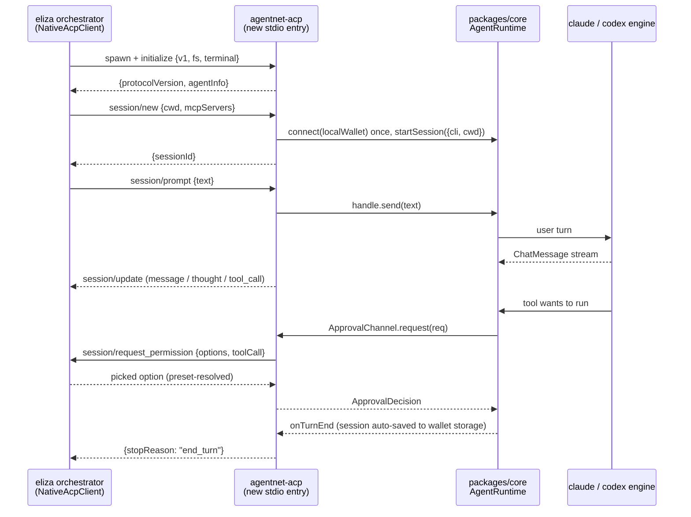

# Eliza coding sub-agent: AgentNet over ACP

> Idea doc, not a commitment. Make AgentNet a selectable coding backend inside
> elizaOS's agent orchestrator, next to Claude Code / Codex / opencode / eliza-code.
> Every path below was read on 2026-08-17 (eliza `develop`, AgentNet working tree),
> not guessed. Sibling lane: the marketplace plugin (`eliza-lane/plugin-agentnet`)
> puts our TOOLS into eliza chats; this one puts our RUNTIME under eliza's coding
> tasks.

## The pitch

Eliza's orchestrator farms coding work out to sub-agent CLIs. The contract is ACP
(Agent Client Protocol): newline JSON-RPC over a spawned subprocess's stdio. Any
binary that speaks it becomes a backend an eliza agent can select, drive, approve,
and verify. We already have the entire runtime such a binary needs: headless wallet,
engine passthrough (claude/codex on the user's own subscription), encrypted session
capture to the wallet, NFT skills equipped into the run, skill-shopping MCP. The
missing piece is ONE thin stdio entry that speaks ACP.

Ship it and every eliza deployment is a potential AgentNet session: their coding
runs land in a wallet and sync across devices, our skills equip into real work, and
verified-work gets real material.

## How eliza drives coding sub-agents today

Read from `elizaOS/eliza` develop, `plugins/plugin-agent-orchestrator`.

| Piece | File (under `plugins/plugin-agent-orchestrator/src`) | Mechanism |
|---|---|---|
| backend set | `services/task-agent-frameworks.ts` | closed union `SupportedTaskAgentAdapter`: `elizaos / pi-agent / claude / codex / opencode`. Per-backend capability profiles (implementation, research, verification, ... scored 0..1) matched against task signals to auto-pick |
| selection | `services/coding-backend-routing.ts` | precedence: explicit `framework:` prefix → character routing → operator pin `ELIZA_ACP_DEFAULT_AGENT` → planner guess |
| gate | `services/task-agent-routing.ts` | `KNOWN_ADAPTER_TYPES` = the same 5. `actions/tasks.ts parseAgentPrefix` drops unknown prefixes as plain text, so a new first-class backend needs a set entry there |
| spawn | `services/acp-native-transport.ts` | `NativeAcpClient` spawns the backend command with `stdio:["pipe","pipe","pipe"]`, sends `initialize {protocolVersion:1, clientCapabilities:{fs, terminal}}`, then `session/new {cwd, mcpServers}` → `{sessionId}`, then `session/prompt {sessionId, prompt:[{type:"text",text}]}` → `{stopReason}`. Default prompt timeout 300 s |
| transcript | `services/acp-service.ts` (~3613) | consumes `session/update` notifications, payload under `params.update.sessionUpdate`: `agent_message_chunk`, `agent_thought_chunk`, `plan`, `tool_call` / `tool_call_update` |
| approvals | `acp-native-transport.ts resolvePermission` | the AGENT asks `session/request_permission {options, toolCall}`; eliza picks an option from its `ApprovalPreset` (`readonly / standard / permissive / autonomous / verifier`, `services/types.ts`). `fs/read_text_file`, `fs/write_text_file`, `terminal/*` are client-side methods gated by the same preset |
| command | `services/acp-service.ts nativeAgentCommand` | per-type override `ELIZA_<TYPE>_ACP_COMMAND`; defaults: claude → `npx @agentclientprotocol/claude-agent-acp`, codex → `npx @agentclientprotocol/codex-acp`, opencode → `opencode acp`, elizaos → `eliza-code-acp` on PATH |
| detection | `task-agent-frameworks.ts hasFrameworkBinary` | a backend is "installed" when its binary is on PATH or its `*_ACP_COMMAND` resolves to an executable |
| conformance | `__tests__/fixtures/fake-acp-agent.mjs` | eliza's own fake agent: the minimal shape a backend must speak (initialize → `{protocolVersion, agentCapabilities, agentInfo}`, session/new → `{sessionId}`, session/prompt → updates then `{stopReason:"end_turn"}`), no LLM |

Two facts worth keeping:

- eliza vendors an opencode FORK as a git submodule
  (`plugins/plugin-agent-orchestrator/vendor/opencode`, `.gitmodules`) just to have
  a coding backend it controls. External backends are a first-class concept there,
  and ACP is the only door.
- their own comment in `acp-service.ts`: "The elizaOS CLI has no ACP mode; the
  separately installed eliza-code ACP server is the native adapter." Backends are
  separate small binaries by design. Ours would be the same shape.

## What we already expose headlessly

| Piece | File (AgentNet) | State |
|---|---|---|
| runtime factory | `packages/core/src/index.ts` `connect(wallet) → AgentRuntime` | exists |
| headless wallet | `packages/core/src/account/localWallet.ts`; bootstrapped with zero UI by `packages/core/src/mcp-stdio.ts` (keyfile env, generate-if-missing) | exists |
| session drive | `packages/core/src/runtime/contract.ts` `AgentRuntime.startSession → SessionHandle` (`send / onMessage / onTurnEnd / onUsage / interrupt / stop`) | exists |
| engine passthrough | `packages/core/src/runtime/spawn.ts`: claude via agent-sdk `query()`, codex via `codex app-server --stdio` JSON-RPC; runs on the user's subscription, no API key | exists |
| approvals seam | `packages/core/src/runtime/approval/channel.ts` `ApprovalChannel`: swappable decision source, the header itself lists "an auto-policy in CI" as an intended channel | exists |
| skills into runs | `spawn.ts SpawnOpts` `mcpServers / allowedTools / enabledSkills`; the runtime equips owned NFT skills and the skill-shopping MCP per spawn | exists |
| session capture | runtime auto-saves encrypted pages to wallet storage on every turn end (`contract.ts startSession` contract) | exists |
| headless stdio precedent | `packages/core/src/mcp-stdio.ts`: an entry an EXTERNAL host spawns; its header already names Eliza as such a host | exists |
| ACP speaker | nothing in the repo speaks ACP | missing |

## Transport: what is honest, what is not

Three candidate integrations. One survives.

1. **Pty-drive our Ink TUI** (`surfaces/cli`). No. The CLI is a fixed-height
   repainting frame (`plans/cli-design-parity.md` house rule 2); scraping it is
   screen-scraping our own product with no protocol, and it breaks on every reskin.
2. **Bridge eliza to `surfaces/localhost`** (HTTP-RPC + SSE,
   `surfaces/localhost/src/index.ts`). Real protocol, wrong shape twice over:
   eliza's `NativeAcpClient` only spawns stdio subprocesses (there is no HTTP
   client mode in `acp-native-transport.ts`), and the localhost host deliberately
   boots with NO wallet until a browser POSTs `connectWallet` (index.ts header).
   Bridging means adding a port, a lifecycle, and an auth story eliza never asked
   for. localhost stays what it is: the webview / Android host.
3. **New headless ACP entry over `packages/core`.** Matches eliza's spawn contract
   exactly and mirrors `mcp-stdio.ts` in shape: stdio JSON-RPC, `localWallet`
   bootstrap, stdout reserved for the protocol. This is the pick.

## The mapping (every seam already exists)

| ACP, eliza side | AgentNet core |
|---|---|
| `initialize` | reply `{protocolVersion:1, agentCapabilities, agentInfo}`; engine presence via `runtime/detect.ts detectCli` |
| `session/new {cwd, mcpServers}` | first call: `connect(localWallet())`; then `runtime.startSession({cli, cwd, ...})`. Forward eliza's `mcpServers` into `SpawnOpts.mcpServers` so the sub-agent inherits the parent's tools (the exact parity eliza built the field for) |
| `session/prompt {text}` | `handle.send(text)`; resolve `{stopReason:"end_turn"}` on `onTurnEnd` |
| `session/update` ← | `ChatMessage.role` map: `assistant` → `agent_message_chunk`, `thinking` → `agent_thought_chunk`, `tool` → `tool_call` / `tool_call_update` |
| `session/request_permission` ← | `AcpApprovalChannel implements ApprovalChannel`: `request()` sends the ask with allow-once / allow-always / deny options; the picked option maps onto `ApprovalDecision.outcome` (`once / always / deny`), `kind:"plan"` requests ride as `plan` updates |
| `session/cancel` | `handle.interrupt()` (turn stops, session lives) |
| process close / `session/close` | `handle.stop()`; the log is already in wallet storage |

Because everything routes through `AgentRuntime.startSession`, these ride along with
zero extra code: encrypted session capture to the operator's wallet + drive
(resumable later from our CLI / vscode / webview), owned NFT skills equipped into
the run, skill-shopping MCP when the toggle is on, raw material for verified-work.

## Exists today / needs building / needs zo

**Exists today** (verified above): eliza's whole selection + spawn + transcript +
approval machinery, including their conformance fixture. Our runtime, engines,
approval seam, headless wallet, stdio-entry precedent, skills-into-runs.

**Needs building** (ours, small):

1. `packages/core/src/acp-stdio.ts` (bin `agentnet-acp`): the JSON-RPC loop, four
   request methods (`initialize`, `session/new`, `session/prompt`,
   `session/cancel`), three update kinds, and `AcpApprovalChannel`. Bootstrap
   copied from `mcp-stdio.ts` (localWallet → rpc → connect). stdout is protocol,
   diagnostics to stderr, same rule as the MCP entry.
2. Engine pick for headless: claude when `detectCli` finds it, else codex; honor a
   `AGENTNET_ACP_ENGINE` env override.
3. Approval default: the spawned entry always ASKS (eliza answers from its preset);
   `autoApprove` only as the documented fallback when the host never responds.

**Needs zo**:

- The positioning call: does AgentNet present itself as a coding backend inside
  other orchestrators at all? Nothing changes about whose subscription runs the
  model; what changes is WHO spawns us.
- Bin naming + npm publish, same lane as `@iqlabs-official/agentnet-mcp`.
- The eliza-side PR for a first-class `agentnet` entry: one set member in
  `KNOWN_ADAPTER_TYPES` (`task-agent-routing.ts`), plus adapter union + label +
  capability profile + `hasFrameworkBinary` + `normalizePreflightAdapterId`
  (`task-agent-frameworks.ts`) and `DEFAULT_AGENTS` (`acp-service.ts`). Mechanical,
  but their repo and their review. Not needed for a demo:
  `ELIZA_ELIZAOS_ACP_COMMAND=agentnet-acp` routes the elizaos slot to us today with
  zero upstream changes. Honest label: it works but shows as eliza-code in their
  UI, so it is demo-only, never the shipped story.

## Shortest path

The minimal correct increment is `acp-stdio.ts` speaking exactly what eliza's own
`fake-acp-agent.mjs` speaks: `initialize`, `session/new`, `session/prompt` with
`agent_message_chunk` updates and an `end_turn` stop, permissions asked and mapped.
No plan updates, no `terminal/*`, no resume, one engine, localWallet only. Prove it
twice: (1) a pipe test driving the binary with the same newline JSON-RPC
`NativeAcpClient` sends; (2) a local eliza with `ELIZA_ELIZAOS_ACP_COMMAND` pointed
at it completes one real coding task, and that session then appears in our CLI's
session list straight from wallet storage. That round trip is the demo AND the
argument for the upstream adapter PR: registration lands after, with the working
binary in hand.
