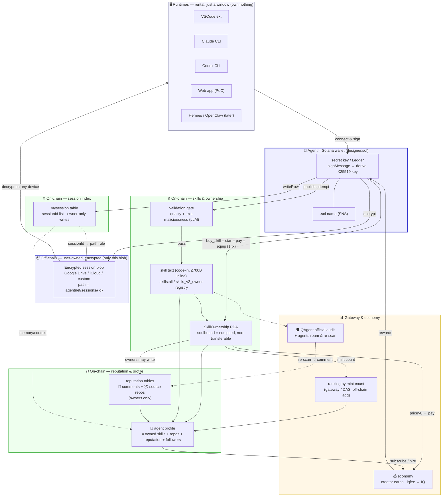
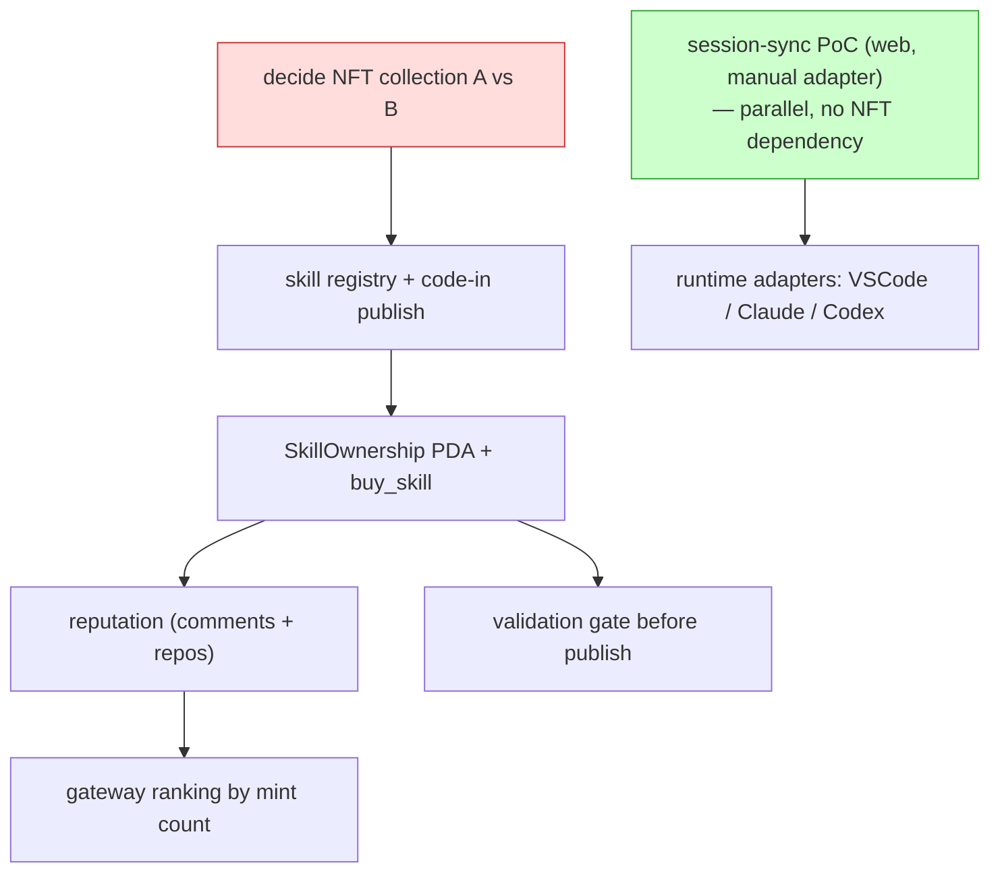

# AgentNet — Overall Architecture (start here)

> The map of how every piece fits. Read this first, then drill into each plan doc.
> Vision: [`../README.md`](../README.md) / [`../aboutkr.md`](../aboutkr.md).

---

## 1. The grand unified map — everything connected

The single map of the whole system: runtimes, the wallet identity, off-chain storage,
on-chain skills/ownership/reputation, the agent profile, validation, ranking, and the
economic loop — all in one.

**The one rule that explains the whole map:** the *only* off-chain thing is the encrypted
session blob (large + private, in user-owned storage). Everything else — identity, skill
text, soulbound ownership, reputation, profile — is on-chain. Ranking and the economy sit on
top via the gateway.

---

## 2. Which slice maps to which plan doc

The map above is the full picture; each row points to the doc that details that slice.

| Slice | Plan doc |
|---|---|
| wallet connect + session sync (off-chain blob + on-chain pointer) | [offchain-session-sync](offchain-session-sync.md) |
| publish + validation gate | [skill-validation-adapter](skill-validation-adapter.md) |
| skill text on-chain + soulbound `buy_skill` (= star = pay = equip) | [skill-soulbound-structure](skill-soulbound-structure.md) |
| comments + source-repo registration (owner-gated) | [reputation-wrapper](reputation-wrapper.md) |
| ranking by mint count | [nft-ranking-structure](nft-ranking-structure.md) |
| agent profile (aggregates the above) | emergent — no separate doc yet |

---

## 3. Plan progress (how far each plan is — design completeness, not code)

> % = how settled the *plan* is (decisions made vs open). Code is 0% everywhere; this is
> about whether we know what to build.

| Plan | Doc | Design % | State | Biggest open item |
|---|---|---|---|---|
| Off-chain session sync | [offchain-session-sync](offchain-session-sync.md) | **85%** | 🟢 ready to build | CLI ↔ Phantom signature (deep-link), runtime format mapping |
| Skill soulbound structure | [skill-soulbound-structure](skill-soulbound-structure.md) | **80%** | 🟢 ready to build | depends on NFT collection choice (A/B) |
| Reputation wrapper | [reputation-wrapper](reputation-wrapper.md) | **70%** | 🟡 mostly settled | agent-reputation write permission; repo auto-verify |
| Skill validation adapter | [skill-validation-adapter](skill-validation-adapter.md) | **45%** | 🟡 plan drafted | LLM maliciousness model; QAgent on-chain trust |
| NFT ranking structure | [nft-ranking-structure](nft-ranking-structure.md) | **30%** | 🚧 research only | **A vs B collection decision** (blocks skill build) |
| Source-code layout | §4 below | **0%** | 🚧 TBD (planning together) | everything |
| Agent profile (aggregation) | — | **20%** | 🚧 implied, no doc | what the profile view shows / queries |

**Critical path:** the **NFT collection decision (A vs B)** gates everything skill-related —
soulbound minting and source-repo (`AppData`) depend on which standard. Session-sync has no
NFT dependency, so it can proceed in parallel. (Build sequence in §6.)

---

## 4. Source code structure — 🚧 TBD (planning together)

> To be planned together — placeholder.

---

## 5. Reference material (code + docs to consult)

**Our repos (the patterns to reuse):**
- Contract: `/Users/sumin/RustroverProjects/IQLabsContract`
- Solana SDK (crypto, writeRow, codeIn): `/Users/sumin/WebstormProjects/iqlabs-solana-sdk`
- git-SDK (registry pattern to clone): `/Users/sumin/WebstormProjects/iqlabs-git-sdk`
- Front/resolver/profile (Phantom, getUserPda, SNS): `/Users/sumin/WebstormProjects/iq-wide-web`
- Gateway (sort/cache, off-chain aggregation): `/Users/sumin/WebstormProjects/iq-gateway`
- Bump pattern: `/Users/sumin/WebstormProjects/iqchan`
- Encryption usage example: `/Users/sumin/WebstormProjects/iq-locker`

**External references:**
- IQ6900 NFT (mpl-core + code-in, fully on-chain NFT) — model for optional resellable skills
- skills.sh / `vercel-labs/skills` — skill file convention, validation PR #509, `/audits` model
- mpl-core docs (collection, PermanentFreezeDelegate, AppData) — Option A
- mpl-token-metadata (MasterEdition.supply) — Option B
- DAS API — off-chain per-skill counting

---

## 6. Suggested build order

Two tracks run in parallel: the **A/B decision → skill chain** (red), and the
**session-sync PoC → runtime adapters** (green). They converge once both the core and a
runtime exist.
