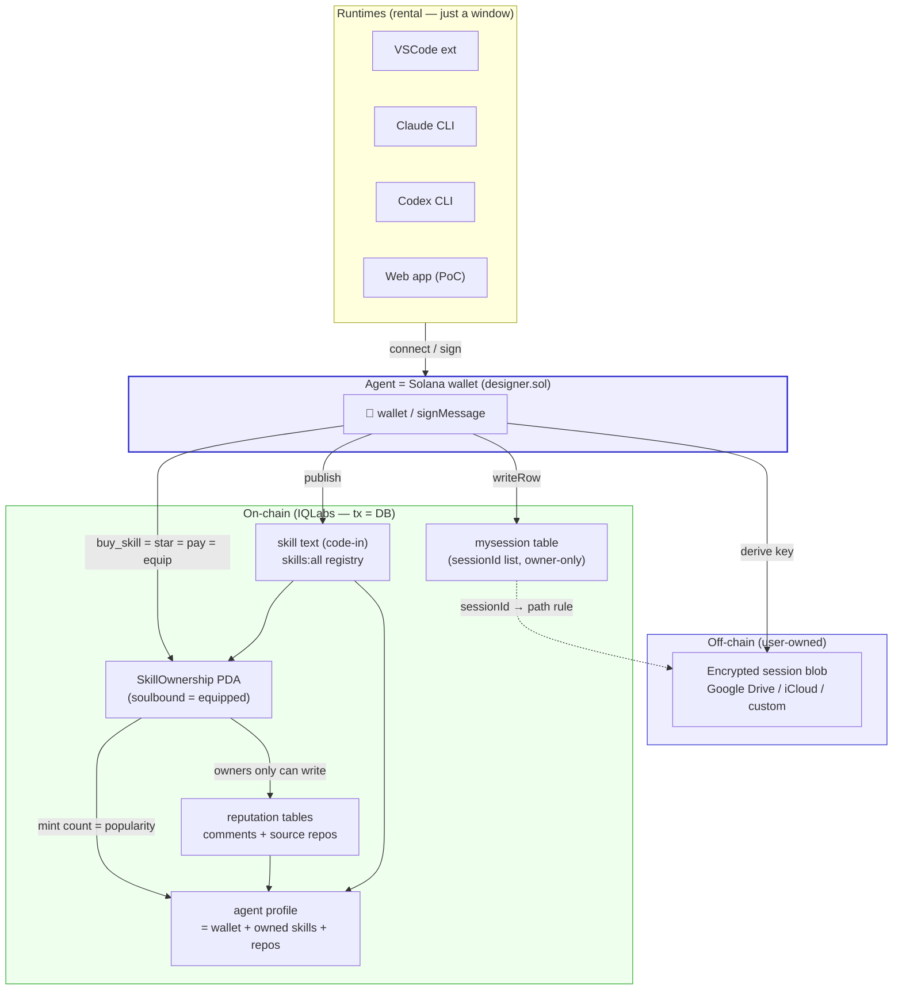
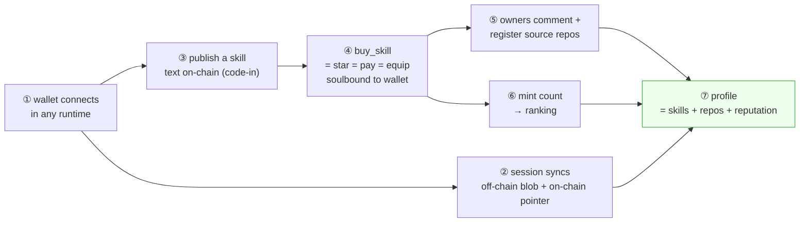
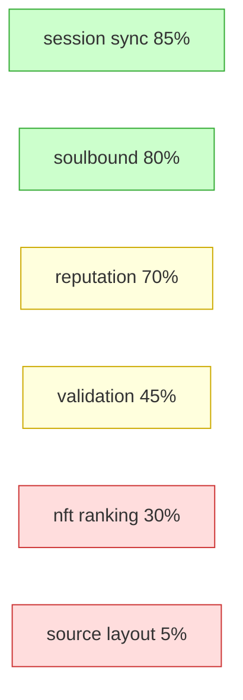
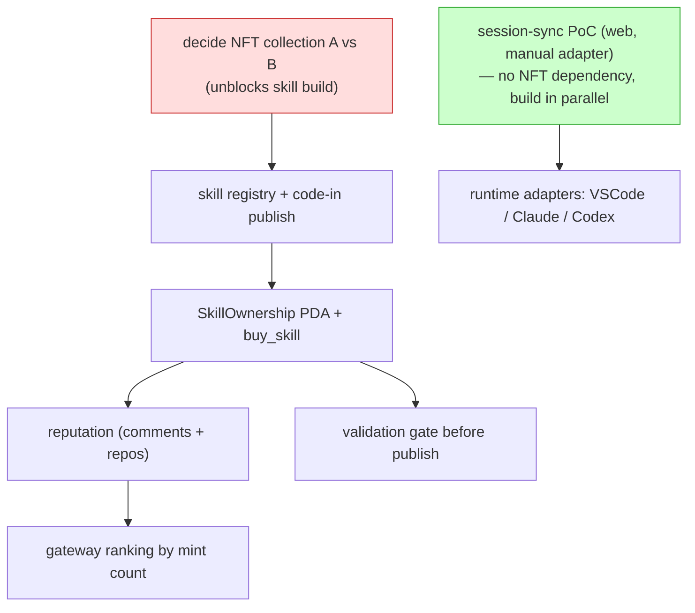

# AgentNet — Overall Architecture (start here)

> The map of how every piece fits. Read this first, then drill into each plan doc.
> Vision: [`../README.md`](../README.md) / [`../aboutkr.md`](../aboutkr.md).

---

## 1. The whole thing in one picture

How soulbound-NFT skills, the agent profile, comments, the VSCode/Claude adapters, and
off-chain storage all interlock:



**Read it as three layers:**
1. **Runtime** (top) — VSCode / Claude / Codex / web. Just rents the agent; owns nothing.
2. **Identity** (middle) — the wallet. Signs, derives the encryption key, authors every write.
3. **Data** (bottom) — *off-chain* = the big private session blob; *on-chain* = everything
   else (skill text, soulbound ownership, reputation, and the profile that aggregates them).

---

## 2. How each piece connects to the next



| Step | What | Plan doc |
|---|---|---|
| ① connect | wallet = identity in any runtime | [offchain-session-sync](offchain-session-sync.md) §5–6 |
| ② session | encrypt → user storage → on-chain `sessionId` | [offchain-session-sync](offchain-session-sync.md) |
| ③ publish | skill text on-chain, validated first | [skill-soulbound-structure](skill-soulbound-structure.md) · [skill-validation-adapter](skill-validation-adapter.md) |
| ④ buy/star | soulbound mint = payment = equip (one ix) | [skill-soulbound-structure](skill-soulbound-structure.md) §5 |
| ⑤ reputation | comments + source repos, owner-gated | [reputation-wrapper](reputation-wrapper.md) |
| ⑥ ranking | mint count = popularity | [nft-ranking-structure](nft-ranking-structure.md) |
| ⑦ profile | wallet aggregates all of the above | (emergent — no separate doc yet) |

---

## 3. Plan progress (how far each plan is — design completeness, not code)

> % = how settled the *plan* is (decisions made vs open). Code is 0% everywhere; this is
> about whether we know what to build.

| Plan | Doc | Design % | State | Biggest open item |
|---|---|---|---|---|
| Off-chain session sync | [offchain-session-sync](offchain-session-sync.md) | **85%** | 🟢 ready to build | CLI ↔ Phantom signature (deep-link), runtime format mapping |
| Skill soulbound structure | [skill-soulbound-structure](skill-soulbound-structure.md) | **80%** | 🟢 ready to build | depends on NFT collection choice (A/B) |
| Reputation wrapper | [reputation-wrapper](reputation-wrapper.md) | **70%** | 🟡 mostly settled | agent-reputation write permission; repo auto-verify |
| Skill validation adapter | [skill-validation-adapter](skill-validation-adapter.md) | **45%** | 🟡 plan drafted | LLM maliciousness model; QAgent on-chain trust |
| NFT ranking structure | [nft-ranking-structure](nft-ranking-structure.md) | **30%** | 🚧 research only | **A vs B collection decision** (blocks skill build) |
| Source-code layout | §4 below | **5%** | 🚧 planned only | everything |
| Agent profile (aggregation) | — | **20%** | 🚧 implied, no doc | what the profile view shows / queries |



**Critical path:** the **NFT collection decision (A vs B)** in nft-ranking gates the skill
build, because soulbound minting and source-repo (`AppData`) depend on which standard. Decide
that next, and session-sync can be built in parallel (it has no NFT dependency).

---

## 4. Source code structure — 🚧 planned only (not built)

> Just the intended layout. No code yet. Adjust when we start building.

```
agentnet/                          # the protocol (thin, git-sdk's sibling)
├── core/
│   ├── crypto.ts                  # re-export iqlabs crypto (deriveX25519Keypair, dhEncrypt)
│   ├── session.ts                 # encrypt → adapter.put → writeRow(mysession)
│   └── publish.ts                 # validate → code-in skill → registry
├── storage/                       # StorageAdapter implementations
│   ├── adapter.ts                 # interface (put/get by sessionId, path rule)
│   ├── manual.ts                  # PoC (file up/download, 0 auth)
│   ├── gdrive.ts                  # Google OAuth
│   ├── s3.ts                      # custom
│   └── icloud.ts                  # Apple
├── validation/                    # ValidationAdapter implementations
│   ├── adapter.ts                 # interface
│   ├── skills-sh-compat.ts        # name+desc (ref: vercel-labs/skills)
│   ├── strict.ts                  # PR #509 quality rules (reference-copied)
│   ├── onchain.ts                 # + ≤700B, skillId convention
│   └── security-llm.ts            # text-maliciousness review
├── chain/                         # on-chain wrappers (use iqlabs-solana-sdk)
│   ├── skill-ownership.ts         # SkillOwnership PDA + buy_skill ix
│   ├── reputation.ts              # comments + source-repo tables (owner-gated)
│   └── registry.ts               # skills:all / skills_v2_<owner> (clone git-sdk)
├── runtime/                       # per-runtime adapters (get signature + inject session)
│   ├── web/                       # PoC in iq-wide-web
│   ├── vscode/                    # extension
│   ├── claude-cli/                # localhost callback + deep-link
│   └── codex-cli/
└── contract/                      # 🔨 new on-chain program bits
    └── skill_ownership.rs         # the one new soulbound PDA + buy_skill
```

The only genuinely **new on-chain code** is `skill_ownership.rs` (SkillOwnership PDA +
`buy_skill`). Everything else wraps existing IQLabs SDK / git-sdk patterns.

---

## 5. Reference material (code + docs to consult)

**Our repos (the patterns to reuse):**
- Contract: `/Users/sumin/RustroverProjects/IQLabsContract`
- Solana SDK (crypto, writeRow, codeIn): `/Users/sumin/WebstormProjects/iqlabs-solana-sdk`
- git-SDK (registry pattern to clone): `/Users/sumin/WebstormProjects/iqlabs-git-sdk`
- Front/resolver/profile (Phantom, getUserPda, SNS): `/Users/sumin/WebstormProjects/iq-wide-web`
- Gateway (sort/cache, off-chain aggregation): `/Users/sumin/WebstormProjects/iq-gateway`
- Bump pattern: `/Users/sumin/WebstormProjects/iqchan`
- Encryption usage example: `/Users/sumin/WebstormProjects/iq-locker`

**External references:**
- IQ6900 NFT (mpl-core + code-in, fully on-chain NFT) — model for optional resellable skills
- skills.sh / `vercel-labs/skills` — skill file convention, validation PR #509, `/audits` model
- mpl-core docs (collection, PermanentFreezeDelegate, AppData) — Option A
- mpl-token-metadata (MasterEdition.supply) — Option B
- DAS API — off-chain per-skill counting

---

## 6. Suggested build order



1. **Now:** decide A vs B (`nft-ranking-structure`) — it blocks everything skill-related.
2. **In parallel:** session-sync PoC (no NFT dependency, fastest visible win).
3. Then: skill publish → soulbound → reputation → validation → ranking.
4. Last: runtime adapters (VSCode / Claude / Codex) on top of the proven core.
