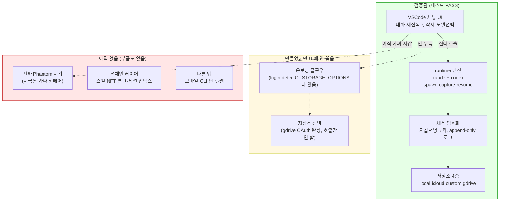
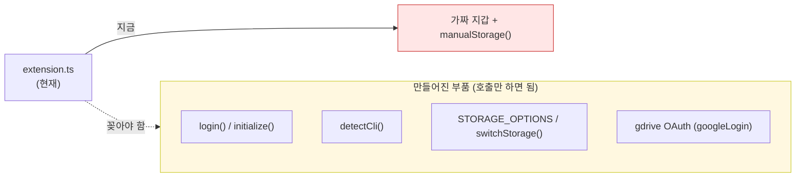

# AgentNet — 진행 상황 (Status Map)

> 다음 개발자를 위한 정직한 현황. **검증된 것 / 만들었지만 안 꽂은 것 / 아직 없는 것**을
> 구분해서 적는다. 과장 없음. 코드가 실제로 무엇을 하는지 파일 단위로 설명한다.

마지막 갱신: 첫 코드 PR 시점. 모든 `src/` 코드는 이 PR이 첫 커밋(이전엔 plans만 있었음).

---

## 1. 한눈에 — 무엇이 진짜 되나



**한 줄 요약:** 엔진·암호화·저장소·채팅 UI는 **진짜로 작동**한다. 빠진 건 "**진짜 신원(Phantom) + 온보딩 연결**" 한 덩어리, 그리고 그 다음의 **온체인 레이어**.

---

## 2. 무엇이 무엇을 하나 — 파일별 정직한 설명

### 2.1 엔진 (`src/runtime/`) — 전부 작동, 스텁 없음

| 파일 | 하는 일 | 상태 |
|---|---|---|
| `contract.ts` | 계약(인터페이스). 엔진과 모든 UI가 이것만 import. AgentRuntime, Wallet, StorageAdapter, ChatMessage 등 정의. 여기 안 바뀌면 UI/엔진 따로 작업 가능. | OK |
| `index.ts` | createRuntime(wallet, storage) — 엔진 본체. spawn→파싱→메시지 emit→턴끝에 자동 암호화 저장. sessionId 도착 전 메시지는 큐에 쌓았다 flush. | OK |
| `spawn.ts` | claude/codex를 각각 다른 방식으로 띄움. claude=긴 1프로세스(stdin stream-json), codex=턴마다 exec, 재개는 exec resume threadId. | OK 둘 다 |
| `convert/claude.ts` | claude stream-json 줄 → ChatMessage. system/init=sessionId, assistant=텍스트, result=턴끝. | OK |
| `convert/codex.ts` | codex exec --json 줄 → ChatMessage. thread.started=sessionId, item.completed=메시지, turn.completed=턴끝. | OK |
| `convert/types.ts` | 두 파서 공통 출력형 ParseResult. | OK |
| `detect.ts` | detectCli() — codex/claude 설치+로그인 상태 체크. 온보딩용인데 아직 UI가 안 부름. | OK(미사용) |

### 2.2 신원·암호화 (`src/core/`) — 작동

| 파일 | 하는 일 | 상태 |
|---|---|---|
| `crypto.ts` | 지갑 signMessage로 X25519 키 파생(결정적 — 같은 지갑=같은 키=어느 기기서나 복호화) → 세션 blob 암복호화. iqlabs-sdk 사용. | OK |
| `paths.ts` | ~/.agentnet/ 로컬 경로 단일 출처. AGENTNET_HOME으로 override(테스트 격리). | OK |

### 2.3 저장·세션 (`src/account/`) — 작동 (gdrive만 설정 필요)

| 파일 | 하는 일 | 상태 |
|---|---|---|
| `sessionLog.ts` | 저장 포맷의 단일 출처. 메시지 한 개 = 암호화된 한 줄(JSONL). append-only. | OK |
| `store.ts` | SessionStore — appendMessage(한 줄 추가)/load(복호화 재조립)/listMine/remove. | OK |
| `login.ts` | initialize(첫 설정), login(config 읽어 storage 복원), switchStorage, logout, getStorageInfo. | OK |
| `storage/adapter.ts` | 저장소 레지스트리. kind(local/gdrive/icloud/custom)→빌더. STORAGE_OPTIONS. | OK |
| `storage/manual.ts` | 로컬 파일. 진짜 append. | OK |
| `storage/icloud.ts` | iCloud Drive 폴더. 진짜 append. macOS 전용. | OK |
| `storage/custom.ts` | 유저 HTTP 엔드포인트(S3/WebDAV). PUT/GET/DELETE. | OK |
| `storage/gdrive.ts` | Google Drive appDataFolder. | OK 단 GOOGLE_CLIENT_ID 필요 |
| `storage/oauth.ts` | 구글 OAuth(PKCE+자동 refresh). 토큰은 로컬만(~/.agentnet/tokens/). | OK 완성 |

### 2.4 UI (`surfaces/vscode/`) — 채팅 완성, 온보딩 없음

| 파일 | 하는 일 | 상태 |
|---|---|---|
| `extension.ts` | webview↔runtime 브릿지. 진짜 createRuntime 호출(mock 아님). 단 지갑=가짜 키페어, 저장소=로컬 고정. | 부분 |
| `webview.ts` | 채팅 HTML/JS. 대화·세션목록·삭제·모델드롭다운·claude/codex 탭·IME·시간표시. | OK |

---

## 3. "UI는 됐지만 안 꽂은" 것 — 정확히 무엇

부품은 다 만들어졌는데 extension.ts가 아직 안 부르는 것들:



즉 **"구현이 없다"가 아니라 "만든 걸 화면에 연결만 안 했다".** 온보딩 화면(지갑→CLI체크→저장소선택)을 짜서 위 부품을 부르면 된다.

---

## 4. 아직 진짜로 없는 것

1. **진짜 Phantom 지갑** — 유일하게 부품조차 없음. 지금은 nacl 가짜 키페어(seed=7).
   - 주의: 지금 저장된 세션은 가짜 키로 암호화됨. 진짜 지갑 붙이면 복호화 안 됨(키가 다름). 전환 시 테스트 세션은 버려야 함.
2. **온체인 레이어** — 스킬 NFT, 평판(notes), mysessions 온체인 인덱스. 설계 문서(plans/)만 있고 코드 0.
3. **다른 앱** — 모바일/CLI 단독/웹. VSCode 하나만 있음.
4. **로컬↔클라우드 세션 중복 관리** — 지금은 한 저장소만. 병렬 사용 시 충돌 정책 미정.

---

## 5. 검증 방법 (직접 확인용)

```bash
pnpm install
pnpm test:run          # 엔진: claude+codex 캡처→암호화→append→복구. PASS 떠야 정상.
# VSCode: surfaces/vscode 열고 F5 → 채팅·세션목록·삭제 동작 확인
```

- 테스트는 임시 AGENTNET_HOME을 써서 실제 ~/.agentnet을 오염시키지 않는다.
- gdrive 실연결만 GOOGLE_CLIENT_ID(Desktop-app) 필요. local/icloud/custom은 설정 없이 동작.

다음 할 일은 [`roadmap-2tracks.md`](roadmap-2tracks.md) 참고.
