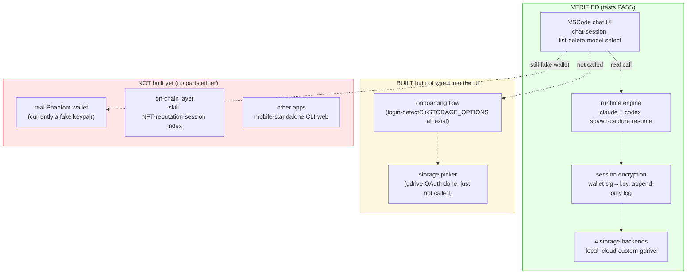
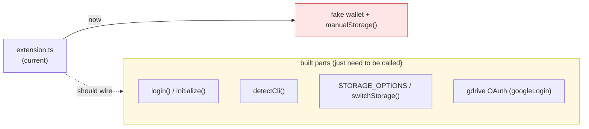
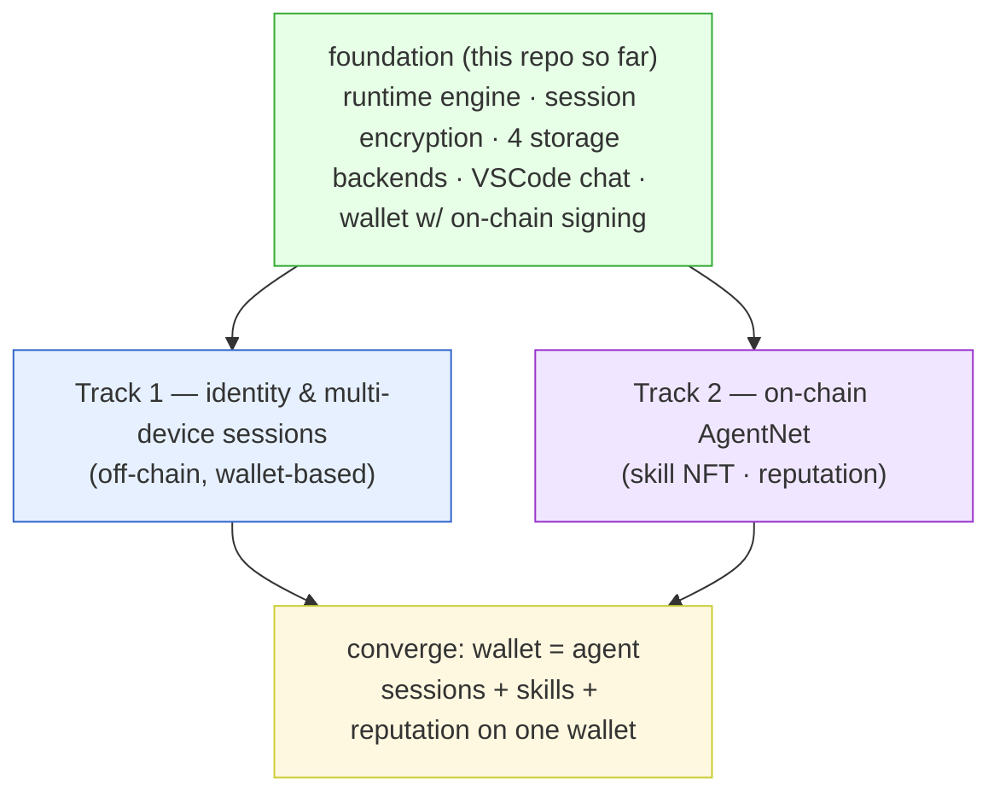
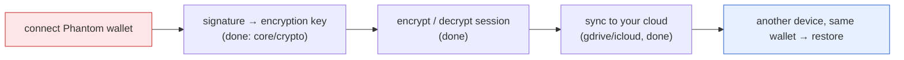
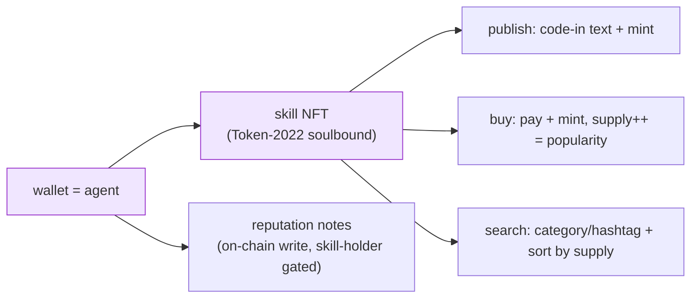
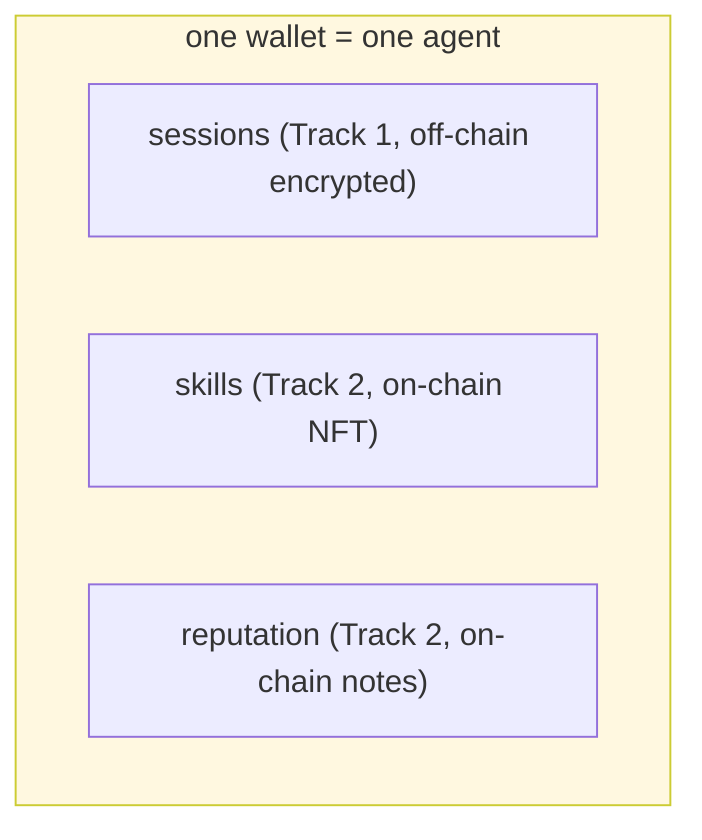

# AgentNet — Status Map

> An honest status for the next developer. Clearly separates **what's verified /
> what's built but not wired / what doesn't exist yet**. No overclaiming.
> Explains what the code actually does, file by file.

Last updated: at the first code PR. All `src/` code lands in that PR (before it, the repo had only plans).

---

## 1. At a glance — what actually works



**One-line summary:** the engine, encryption, storage, and chat UI **actually work**.
What's missing is one chunk — "**a real identity (Phantom) + wiring the onboarding**" —
and after that, the **on-chain layer**.

---

## 2. What does what — honest, file by file

### 2.1 Engine (`src/runtime/`) — all working, no stubs

| File | What it does | Status |
|---|---|---|
| `contract.ts` | The contract (interfaces). Engine and every UI import only this. Defines AgentRuntime, Wallet, StorageAdapter, ChatMessage, etc. As long as this doesn't change, UI/engine can be built independently. | OK |
| `index.ts` | createRuntime(wallet, storage) — the engine itself. spawn→parse→emit message→auto-encrypt & save on turn end. Messages seen before the sessionId arrives are queued, then flushed. | OK |
| `spawn.ts` | Spawns claude/codex in two different ways. claude = one long-lived process (stdin stream-json); codex = `exec` per turn, resumed via `exec resume <threadId>`. | OK both |
| `convert/claude.ts` | claude stream-json line → ChatMessage. system/init=sessionId, assistant=text, result=turn end. | OK |
| `convert/codex.ts` | codex `exec --json` line → ChatMessage. thread.started=sessionId, item.completed=message, turn.completed=turn end. | OK |
| `convert/types.ts` | Shared output shape `ParseResult` for both parsers. | OK |
| `detect.ts` | detectCli() — checks codex/claude install + login status. Meant for onboarding, but the UI doesn't call it yet. | OK (unused) |

### 2.2 Identity & encryption (`src/core/`) — working

| File | What it does | Status |
|---|---|---|
| `crypto.ts` | Derives an X25519 key from the wallet's signMessage (deterministic — same wallet = same key = decrypts on any device) → encrypts/decrypts session blobs. Uses iqlabs-sdk. | OK |
| `paths.ts` | Single source of truth for `~/.agentnet/` local paths. Override via AGENTNET_HOME (test isolation). | OK |

### 2.3 Storage & sessions (`src/account/`) — working (only gdrive needs config)

| File | What it does | Status |
|---|---|---|
| `sessionLog.ts` | Single source of the storage format. One message = one encrypted line (JSONL). Append-only. | OK |
| `store.ts` | SessionStore — appendMessage (add one line) / load (decrypt + reassemble) / listMine / remove. | OK |
| `login.ts` | initialize (first setup), login (read config, restore storage), switchStorage, logout, getStorageInfo. | OK |
| `storage/adapter.ts` | Storage registry. kind (local/gdrive/icloud/custom)→builder. STORAGE_OPTIONS. | OK |
| `storage/manual.ts` | Local files. Real append. | OK |
| `storage/icloud.ts` | iCloud Drive folder. Real append. macOS only. | OK |
| `storage/custom.ts` | User's own HTTP endpoint (S3/WebDAV). PUT/GET/DELETE. | OK |
| `storage/gdrive.ts` | Google Drive appDataFolder. | OK — needs GOOGLE_CLIENT_ID |
| `storage/oauth.ts` | Google OAuth (PKCE + auto refresh). Tokens stored locally only (~/.agentnet/tokens/). | OK, complete |

### 2.4 UI (`surfaces/vscode/`) — chat done, no onboarding

| File | What it does | Status |
|---|---|---|
| `extension.ts` | webview↔runtime bridge. Calls the real createRuntime (not a mock). But wallet = fake keypair, storage = pinned to local. | partial |
| `webview.ts` | Chat HTML/JS. Chat, session list, delete, model dropdown, claude/codex tabs, IME, relative time. | OK |

---

## 3. "Built but not wired" — exactly what

The parts are all built; `extension.ts` just doesn't call them yet:



So it's **not "there's no implementation" — it's "what's built isn't connected to the
screen yet".** Build the onboarding screen (wallet → CLI check → storage pick) and call
the parts above.

---

## 4. What genuinely doesn't exist yet

1. **Real Phantom wallet (UI)** — currently a local keypair (`testWallet()` in
   `src/account/keypairWallet.ts`). The `Wallet` interface now includes on-chain
   signing (publicKey + signTransaction + signAllTransactions, via iqlabs
   `WalletSigner`), so on-chain code can already run against `testWallet`. What's
   missing is only the *interactive* front-end (Phantom deep-link / mobile wallet).
   - Note: sessions saved now are encrypted with the test key. Once a real wallet is attached they won't decrypt (different key). Discard test sessions at that switch.
2. **On-chain layer** — skill NFT, reputation (notes), mysessions on-chain index. Only design docs (plans/), zero code.
3. **Other apps** — mobile / standalone CLI / web. Only VSCode exists.
4. **Local↔cloud session dedup** — only one storage at a time today. No conflict policy for parallel use yet.

---

## 5. How to verify (try it yourself)

```bash
pnpm install
pnpm test:run          # engine: claude+codex capture→encrypt→append→reload. Should print PASS.
# VSCode: open surfaces/vscode and hit F5 → check chat, session list, delete
```

- Tests use a temp AGENTNET_HOME, so they never pollute the real ~/.agentnet.
- Only real gdrive needs Google OAuth creds (Desktop-app). local/icloud/custom work with no config.

> ⚠️ **gdrive needs zo's Google OAuth client creds — ASK ZO.** Drive sync/sign-in
> silently fails without them (cloud writes are best-effort and swallow errors, so a
> missing client_id looks like "nothing uploaded"). The creds come from a Google Cloud
> **Desktop-app** OAuth client (not secret for installed apps). Provide them via EITHER:
> - env: `GOOGLE_CLIENT_ID` / `GOOGLE_CLIENT_SECRET`, OR
> - `~/.agentnet/config.json`: add `"google_client_id"` / `"google_client_secret"` keys
>   (preferred — a VSCode-launched extension gets no shell env). See `oauth.ts` `configCreds()`.
>
> Sessions on Drive are PRIVATE (owner-only, we set no public/anyone permission) AND
> AES-GCM encrypted with the wallet key — not public, unreadable even if seen.

---

## 6. What's next — Two Tracks

Everything above is the **shared foundation** both tracks stand on (engine +
encryption + storage). From here the work forks into two independent tracks that
**converge on one wallet**.



### Track 1 — Wallet identity & multi-device session sync (off-chain)

Connect a wallet, and the **same session syncs (encrypted) from your cloud** on any
device or app. "Wallet = identity; sessions follow the wallet."



| # | Task | Why / What | Depends on |
|---|---|---|---|
| **T1-1** | **Real Phantom wallet UI** | Replace `testWallet()` with interactive wallet signing. VSCode via deep-link / external-browser callback; mobile via wallet-app. Only needs to satisfy the `Wallet` interface — engine doesn't change. *(On-chain signing is already in the interface; this is just the interactive front-end.)* | parts: interface ready |
| **T1-2** | **Wire the onboarding screen** | Plug already-built `login()` / `detectCli()` / `STORAGE_OPTIONS` into the UI: connect wallet → CLI check → storage picker (Apple/Google/local/custom) → save config. | parts exist |
| **T1-3** | **Make storage selection real** | Currently pinned to `manualStorage` → switch to the storage the user picked. gdrive needs `GOOGLE_CLIENT_ID`. | parts exist |
| **T1-4** | **Multi-device verification** | Save on device A → `login` with same wallet on device B → confirm restore. (Same wallet = same key = decrypts; works by design, needs a real test.) | T1-1,2,3 |
| **T1-5** | **Build other apps** | VSCode-like app for mobile / standalone CLI. All reuse the same `src/`; only the surface is new. | T1-1 |
| **T1-6** | **Local↔cloud dedup + cloud flush** | (a) Overlapping local + cloud records: last-write-wins by file ts (v1) → smarter merge later. (b) **Perf:** `mirror.ts` re-uploads the full session to append-less clouds (gdrive/custom) every turn → O(N²) for long sessions. Fix by batching cloud writes (flush every N turns/T sec; local stays per-turn). Low priority — correct today, only matters for long sessions. | T1-4 |

**End state:** connect a wallet on your phone → yesterday's VSCode conversation is
there, and the storage holds the encrypted session, neatly synced.

### Track 2 — On-chain AgentNet (skill NFT · reputation)

The wallet (= an agent) **publishes / searches / buys skill NFTs** and leaves
**reputation notes** on-chain. **Unblocked now:** the `Wallet` interface has
on-chain signing, and `testWallet()` signs real Solana txs — so Track 2 can start
on devnet without waiting for the real Phantom UI (Track 1).



| # | Task | Reference doc | Status |
|---|---|---|---|
| **T2-1** | core/ on-chain part — table seeds (mysessions, etc.) + IQLabs chain wrapper | [`coding-info.md`](coding-info.md) | ✅ `src/core/` (types, seed, chain) |
| **T2-2** | **Publish skill NFT** — code-in text + Token-2022 mint (soulbound) | [`skill-nft-structure.md`](skill-nft-structure.md) | ✅ `nft/skill.publishSkill` + indexes to AUDIT |
| **T2-3** | **Buy skill** — pay + mint + supply++ (popularity) | 〃 | ⚠️ partial — payment + ATA built; **mint step blocked** (see limitation) |
| **T2-4** | **Search** — category/hashtag (trait) filter + sort by supply | [`search.md`](search.md) | ✅ `search/search` (supply hydrated live from mint) |
| **T2-5** | **Reputation notes** — on-chain write, skill-holder gate | [`notes.md`](notes.md) | ✅ `notes/` + `reputation/` (gated by token balance) |
| **T2-6** | **Validation gate** — quality / maliciousness check before publish | [`skill-validation-adapter.md`](skill-validation-adapter.md) | ✅ `nft/validation/` (compat/strict/onchain/security) |
| **T2-7** | **Workflow NFT** — skill-bundle recipe, requiredSkills gate | [`workflow-nft.md`](workflow-nft.md) | ✅ `nft/workflow` (prereq gate; same mint limitation) |
| **T2-8** | Expose as MCP tools — agent autonomous buy | coding-info Step 7 | ✅ `mcp/server` (search_skills, buy_skill) |

> ⚠️ **Known limitation — buy mint step (T2-3 / T2-7).** Each skill mint is created
> with the **creator** as mint authority, but `buySkill`/`unlockWorkflow` have the
> **buyer** sign the `mintTo`. On-chain, `mintTo` requires the mint authority's
> signature → a buyer cannot self-mint a creator-authored mint, so the mint step of
> buy fails on devnet. Everything *around* it works: payment routing, ATA creation,
> prerequisite gate, publish, indexing, search, reputation, validation, MCP.
> **Canonical fix** (plan [`skill-nft-structure.md`](skill-nft-structure.md) §4,
> "P = Program"): an on-chain program whose **PDA is the mint authority** mints via
> CPI atomically with payment. That program is **not built yet** — tracked as the
> next T2 task. A protocol-minter keypair is a faster interim alternative.
>
> Other guards added: `getAccountInfo === null` for ATA existence (not try/catch);
> IQ fee skipped when treasury is the System-Program sentinel (else funds burn);
> `supply` hydrated live from the mint (indexed copy is always 0).

**End state:** the designer agent (wallet) buys and equips skills, leaves reputation
on the good ones, popular skills sort by supply — all on the same wallet as sessions.

### Why two tracks



- **Track 1** (sessions) is **off-chain** — conversations encrypted, only the wallet reads them.
- **Track 2** (skills · reputation) is **on-chain** — public, buy/sell/sort.
- Both hang off the **same wallet**: connect your wallet → your whole agent (sessions + skills + reputation) comes with it.
- The tracks are **independent** (on-chain code never touches the session pipeline), so they run in parallel.

**Immediate next moves:**
- **Track 2** is unblocked — start on-chain (T2-1/T2-2) against `testWallet` on devnet now.
- **Track 1** — wire the onboarding/storage picker (T1-2/T1-3, parts exist); real Phantom UI (T1-1) when ready.
