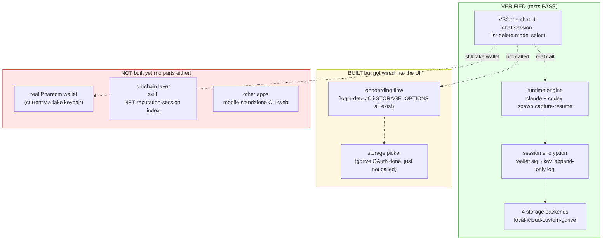
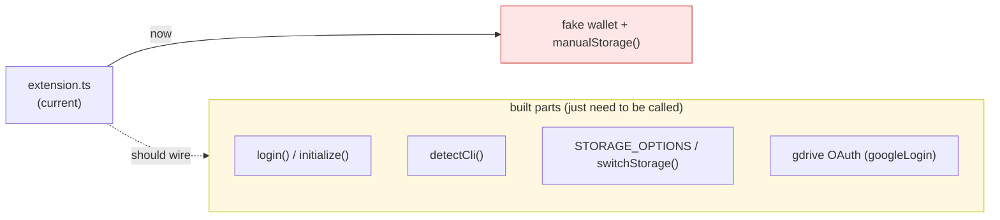

# AgentNet — Status Map

> An honest status for the next developer. Clearly separates **what's verified /
> what's built but not wired / what doesn't exist yet**. No overclaiming.
> Explains what the code actually does, file by file.

Last updated: at the first code PR. All `src/` code lands in that PR (before it, the repo had only plans).

---

## 1. At a glance — what actually works



**One-line summary:** the engine, encryption, storage, and chat UI **actually work**.
What's missing is one chunk — "**a real identity (Phantom) + wiring the onboarding**" —
and after that, the **on-chain layer**.

---

## 2. What does what — honest, file by file

### 2.1 Engine (`src/runtime/`) — all working, no stubs

| File | What it does | Status |
|---|---|---|
| `contract.ts` | The contract (interfaces). Engine and every UI import only this. Defines AgentRuntime, Wallet, StorageAdapter, ChatMessage, etc. As long as this doesn't change, UI/engine can be built independently. | OK |
| `index.ts` | createRuntime(wallet, storage) — the engine itself. spawn→parse→emit message→auto-encrypt & save on turn end. Messages seen before the sessionId arrives are queued, then flushed. | OK |
| `spawn.ts` | Spawns claude/codex in two different ways. claude = one long-lived process (stdin stream-json); codex = `exec` per turn, resumed via `exec resume <threadId>`. | OK both |
| `convert/claude.ts` | claude stream-json line → ChatMessage. system/init=sessionId, assistant=text, result=turn end. | OK |
| `convert/codex.ts` | codex `exec --json` line → ChatMessage. thread.started=sessionId, item.completed=message, turn.completed=turn end. | OK |
| `convert/types.ts` | Shared output shape `ParseResult` for both parsers. | OK |
| `detect.ts` | detectCli() — checks codex/claude install + login status. Meant for onboarding, but the UI doesn't call it yet. | OK (unused) |

### 2.2 Identity & encryption (`src/core/`) — working

| File | What it does | Status |
|---|---|---|
| `crypto.ts` | Derives an X25519 key from the wallet's signMessage (deterministic — same wallet = same key = decrypts on any device) → encrypts/decrypts session blobs. Uses iqlabs-sdk. | OK |
| `paths.ts` | Single source of truth for `~/.agentnet/` local paths. Override via AGENTNET_HOME (test isolation). | OK |

### 2.3 Storage & sessions (`src/account/`) — working (only gdrive needs config)

| File | What it does | Status |
|---|---|---|
| `sessionLog.ts` | Single source of the storage format. One message = one encrypted line (JSONL). Append-only. | OK |
| `store.ts` | SessionStore — appendMessage (add one line) / load (decrypt + reassemble) / listMine / remove. | OK |
| `login.ts` | initialize (first setup), login (read config, restore storage), switchStorage, logout, getStorageInfo. | OK |
| `storage/adapter.ts` | Storage registry. kind (local/gdrive/icloud/custom)→builder. STORAGE_OPTIONS. | OK |
| `storage/manual.ts` | Local files. Real append. | OK |
| `storage/icloud.ts` | iCloud Drive folder. Real append. macOS only. | OK |
| `storage/custom.ts` | User's own HTTP endpoint (S3/WebDAV). PUT/GET/DELETE. | OK |
| `storage/gdrive.ts` | Google Drive appDataFolder. | OK — needs GOOGLE_CLIENT_ID |
| `storage/oauth.ts` | Google OAuth (PKCE + auto refresh). Tokens stored locally only (~/.agentnet/tokens/). | OK, complete |

### 2.4 UI (`surfaces/vscode/`) — chat done, no onboarding

| File | What it does | Status |
|---|---|---|
| `extension.ts` | webview↔runtime bridge. Calls the real createRuntime (not a mock). But wallet = fake keypair, storage = pinned to local. | partial |
| `webview.ts` | Chat HTML/JS. Chat, session list, delete, model dropdown, claude/codex tabs, IME, relative time. | OK |

---

## 3. "Built but not wired" — exactly what

The parts are all built; `extension.ts` just doesn't call them yet:



So it's **not "there's no implementation" — it's "what's built isn't connected to the
screen yet".** Build the onboarding screen (wallet → CLI check → storage pick) and call
the parts above.

---

## 4. What genuinely doesn't exist yet

1. **Real Phantom wallet** — the only thing without even a part. Currently a fake nacl keypair (seed=7).
   - Note: sessions saved now are encrypted with the fake key. Once a real wallet is attached they won't decrypt (different key). Discard test sessions at that switch.
2. **On-chain layer** — skill NFT, reputation (notes), mysessions on-chain index. Only design docs (plans/), zero code.
3. **Other apps** — mobile / standalone CLI / web. Only VSCode exists.
4. **Local↔cloud session dedup** — only one storage at a time today. No conflict policy for parallel use yet.

---

## 5. How to verify (try it yourself)

```bash
pnpm install
pnpm test:run          # engine: claude+codex capture→encrypt→append→reload. Should print PASS.
# VSCode: open surfaces/vscode and hit F5 → check chat, session list, delete
```

- Tests use a temp AGENTNET_HOME, so they never pollute the real ~/.agentnet.
- Only real gdrive needs GOOGLE_CLIENT_ID (Desktop-app). local/icloud/custom work with no config.

For what's next, see [`roadmap-2tracks.md`](roadmap-2tracks.md).
