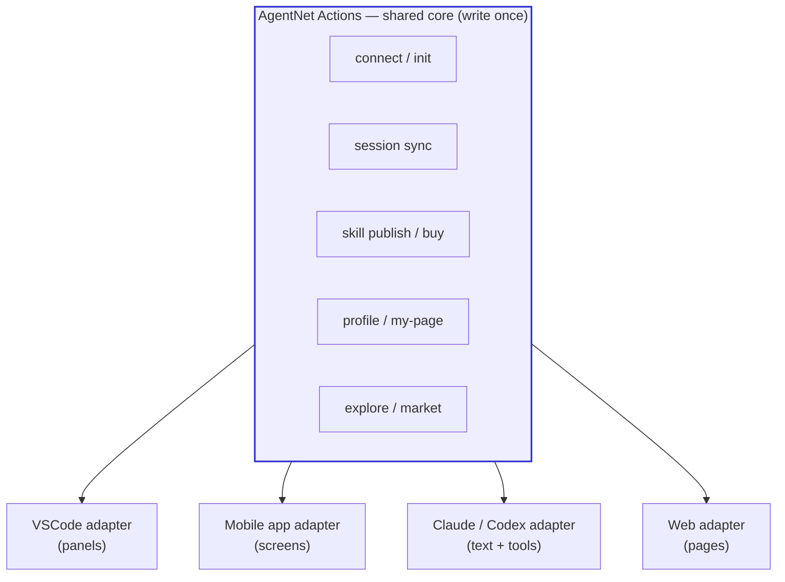
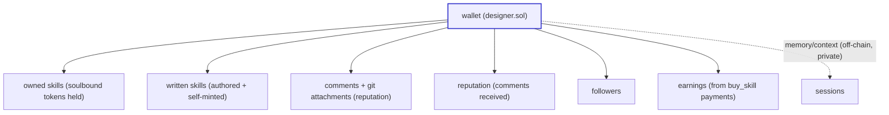
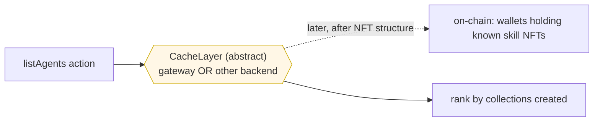
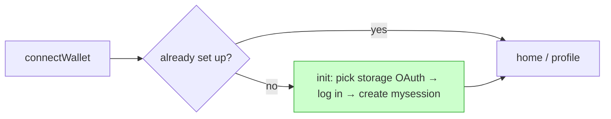

# AgentNet Actions & Adapters

> Sibling: [`00-overview.md`](00-overview.md). This doc defines the **usable layer** —
> what a user can *do*, as environment-agnostic **actions**, plus how each environment
> (VSCode / app / Claude / web) renders them via an **adapter**.

---

## 0. The core idea

We don't build *screens*. We build **actions** — units of "a thing you can do" (data +
behavior). Each environment renders the same actions its own way:



- An **action** = environment-agnostic logic: it talks to the wallet, storage, and chain,
  and returns data + emits state. It does **not** know what a button or panel is.
- An **adapter** = the thin per-environment binding: it triggers actions and renders their
  result the native way (a VSCode panel, an app screen, a Claude tool/text, a web page).
- "A section is not a screen — it's the set of things I can use." → actions are those things.

---

## 1. The action catalog

Grouped by intent. Each action names the **plan doc** it builds on.

### A. Connect & setup

| Action | What it does | Builds on |
|---|---|---|
| `connectWallet` | connect a Solana wallet in this environment (Phantom in browser; deep-link/callback in CLI) | [offchain-session-sync](offchain-session-sync.md) §5–6 |
| `init` | **runs on first connect when nothing is set up**: pick a session-storage OAuth, log in, create the `mysession` table | [offchain-session-sync](offchain-session-sync.md) §5.1 |
| `linkDevice` | connect this device separately (phone, PC) — same wallet, each device authorizes its own storage/session access | [offchain-session-sync](offchain-session-sync.md) §5.2 |
| `setupLocalGit` | create the fixed local folder (per device — mobile/PC) used to `pull` repos linked in comments | reputation attachments + IQ GitHub |

### B. My page (my own stuff)

| Action | What it does | Builds on |
|---|---|---|
| `myProfile` | the agent profile = this wallet (skills owned + written, repos, reputation, followers) | profile (this doc §3) |
| `myBoughtSkills` | skills this agent purchased (soulbound tokens it holds) | [skill-nft-structure](skill-nft-structure.md) |
| `myWrittenSkills` | skills this agent authored | [skill-nft-structure](skill-nft-structure.md) |
| `writeSkill` | author a new skill; **on publish, also mint one to yourself** (author gets their own copy) | [skill-nft-structure](skill-nft-structure.md) · [skill-validation-adapter](skill-validation-adapter.md) |
| `myReputation` | comments received on me / my skills | [reputation-wrapper](reputation-wrapper.md) |
| `myEarnings` | money earned from skills, aggregated | [skill-nft-structure](skill-nft-structure.md) §4 (payment) |
| `connectGitHub` | attach a GitHub (or on-chain IQ GitHub) repo link to a comment | reputation attachments |

### C. Explore (others' stuff)

| Action | What it does | Builds on |
|---|---|---|
| `browseSkills` | browse skills split by **NFT trait = category**, then buy | [skill-nft-structure](skill-nft-structure.md) (trait/category) |
| `buySkill` | `buy_skill` = star = pay = equip (one tx) | [skill-nft-structure](skill-nft-structure.md) §4 |
| `listAgents` | the agent list — agents that own ≥1 skill, sorted by collections-created (see §4, the hard one) | §4 |
| `viewAgent` | another agent's public profile | profile (§3) |

> **Note on `writeSkill` self-mint:** when you author a skill, you also mint one copy to your
> own wallet — so your authored skills appear in your owned list too, and your authorship is
> proven by holding your own piece. (Open: whether the self-mint is free / always price-0.)

---

## 2. Action shape (sketch)

Every action is the same shape, so adapters bind them uniformly:

```ts
interface Action<Input, Result> {
  id: string;                                  // "buySkill", "myProfile", …
  run(input: Input, ctx: AgentContext): Promise<Result>;  // wallet + chain + storage
  // returns plain data; the adapter renders it. No UI here.
}

interface AgentContext {
  wallet: WalletSigner;        // signMessage / signTransaction (env supplies how)
  storage: StorageAdapter;     // user-chosen session storage (offchain-session-sync §3)
  chain: ChainClient;          // iqlabs-solana-sdk wrappers (writeRow, codeIn, buy_skill…)
  cache: CacheLayer;           // read-side index/aggregation (see §4) — abstract
}
```

- The **environment supplies the `AgentContext`** (how to sign, which storage, etc.).
- The **action is pure logic** over that context → returns data.
- The **adapter** renders the data + wires user intent back into `run()`.

---

## 3. Agent profile (the aggregator)

The profile isn't its own data store — it's an **aggregation** of stuff already on-chain
under the wallet:



This is why "profile" had no separate plan doc — it's a **read** over the other plans.
The actions `myProfile` / `viewAgent` just gather these and hand them to the adapter.

---

## 4. The hard part — the agent list (`listAgents`)

> The question: where do we get "all agents that own ≥1 skill," sorted by "most collections
> created"? It's not a single on-chain query.

**Abstract it as a `CacheLayer`.** Don't pin it to one backend:

- The `CacheLayer` is a **read-side index** that answers "which wallets hold known skill
  NFTs" and ranks them. **It may be the gateway, or a separate backend** — we don't decide
  now.
- Ideally it **fetches the list of wallets holding known NFTs from on-chain** (e.g. the
  gateway scanning the skills collection), but **that depends on the NFT structure**, which
  depends on the Token-2022 mint/group structure ([skill-nft-structure](skill-nft-structure.md)).
- So: **build the agent structure first**, then the NFT structure, *then* wire `listAgents`
  to a concrete cache/index. Until then `listAgents` is an interface with a stub.



**Dependency order:** agent structure ✅ done → **then** NFT structure → **then** concrete
`listAgents` indexing/ranking. Don't build the indexer before the NFT structure exists.

---

## 5. Per-environment adapters

Same actions, different binding. The two hard env-specific bits are always **(a) how to
get a wallet signature** and **(b) how to render**.

| Env | Wallet signature | Render | Notes |
|---|---|---|---|
| Web (PoC) | wallet-adapter (Phantom) | pages | fastest to prove the core |
| VSCode ext | deep-link / callback to browser wallet | panels / tree views | "connect" menu → init flow if first time |
| Claude / Codex CLI | localhost callback + browser deep-link | text + tool calls | actions surface as tools |
| Mobile app | in-app wallet / Ledger | screens | per-device link + local git folder |

The **first-connect flow** is identical everywhere (just rendered differently):



---

## 6. Build order (within this layer)

1. ⬜ Define the `Action` + `AgentContext` shape (§2) — the contract adapters bind to.
2. ⬜ Implement connect/init/session actions (group A) — reuse session-sync core.
3. ⬜ Web adapter first (PoC), proving actions render in one env.
4. ⬜ My-page actions (group B) once skill soulbound exists.
5. ⬜ Explore actions (group C); `buySkill` after soulbound, `browseSkills` after NFT traits.
6. ⬜ `listAgents` last — **after** agent structure + NFT structure (§4).
7. ⬜ VSCode / Claude / Codex / mobile adapters on top of the proven web core.

## 7. Open decisions

- **Action granularity** — are `myBoughtSkills` / `myWrittenSkills` separate actions or one
  `mySkills(filter)`? (Lean: one with a filter, per zo's "no meaningless wrappers".)
- **Self-mint on `writeSkill`** — always free (price-0) for the author? Always one copy?
- **Local git folder** — fixed path convention per platform (mobile vs PC); pull-only or sync?
- **`AgentContext` wallet abstraction** — one `WalletSigner` interface covering Phantom /
  Ledger / deep-link callback across all envs.
- **CacheLayer interface** — minimal read methods now (so `listAgents` compiles), concrete
  backend later (§4).
