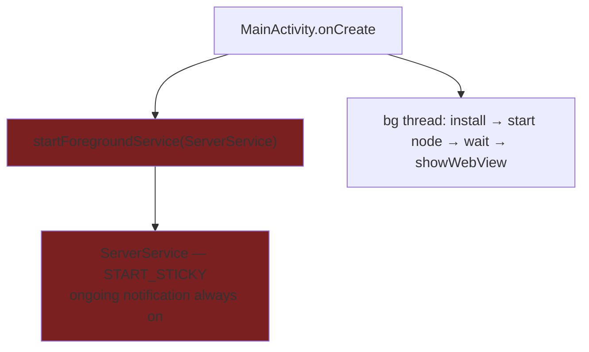
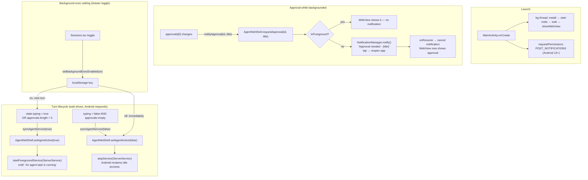

# Android background server — gated lifecycle (issue #53)

## Before (broken)

Problem: foreground service (and its persistent notification) starts on every app launch,
regardless of whether any agent work is happening. `START_STICKY` resurrects it even after
Android kills it. Node/proot runtime stays alive in background permanently.

## After (fix)

## Key invariants

| Condition | Service state |
|---|---|
| App foreground, no turn | No service (idle process, normal reclaim) |
| App foreground, turn active | No service needed (Activity keeps process alive) |
| App backgrounded, bg exec OFF | No service (process dies, turn dies) |
| App backgrounded, bg exec ON, turn active | Foreground service running |
| App backgrounded, turn ends | `stopService` — service torn down |

## Files changed

| File | Change |
|---|---|
| `surfaces/android/.../MainActivity.kt` | Remove launch-time service start; add `onResume`/`onPause` foreground tracking; add `setAgentActive()` + `requestApproval()`; request POST_NOTIFICATIONS |
| `surfaces/android/.../ServerService.kt` | `START_NOT_STICKY`; updated notification text |
| `surfaces/android/.../ShellBridge.kt` | Expose `setAgentActive` + `requestApproval` to web |
| `surfaces/android/.../AndroidManifest.xml` | Add `POST_NOTIFICATIONS` permission |
| `surfaces/webview/src/platform/agentService.ts` | New: bridge helper + `backgroundExec` localStorage setting |
| `surfaces/webview/src/App.tsx` | `useEffect` drives `syncAgentService` from `typing\|\|approvals`; fires `notifyApproval` on top approval |
| `surfaces/webview/src/chat/Sessions.tsx` | Android-only toggle row in Configure section |

## Deferred (not in this change)

- **Native approve/deny buttons in the notification** — needs a native→`/rpc` callback round-trip. Add when tap-to-open proves insufficient.
- **Approval timeout** — unblocking the runtime after deny/timeout lives in `ApprovalChannel` (core), not Android shell.
