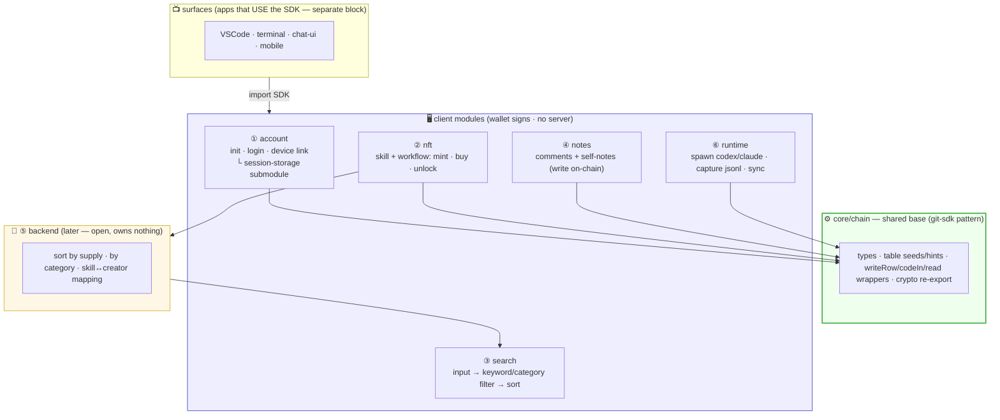
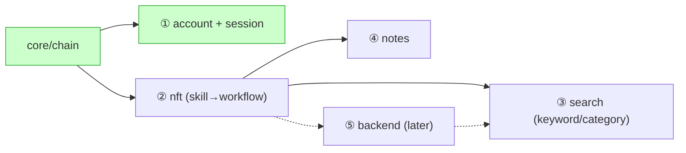
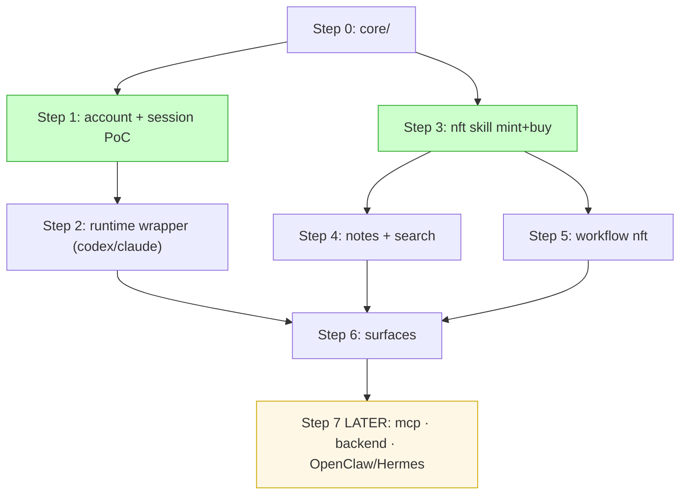

# Coding Info — modules, structure, what to build

> The concrete coding plan: what modules exist, what each owns/reuses, and (later) the
> source-file layout. Mirrors git-sdk's pattern: a thin SDK on top of
> `@iqlabs-official/solana-sdk`, split by responsibility. Sibling: [`00-overview.md`](00-overview.md).
>
> Contents: **§A modules** (below) · **§B source-file layout** · **§C conventions & libraries** · **§D steps (read→build)**.

---

# §A — Module breakdown

## A0. The map



Everything in **client** is wallet-signed (our server = 0). **backend** is later, owns no
data — just sorts/maps on-chain reads so search can use it.

---

## ⚙️ core / chain — shared base

The foundation every client module reuses (so table access isn't duplicated).
**git-sdk pattern:** a `core` (types + seeds) + `chain` (wraps solana-sdk).

| Owns | Detail |
|---|---|
| **table seeds/hints** | one place for `agentnet-root`, `mysessions/[wallet]`, `notes/[skillNFT]`, etc. (like git-sdk `core/seed.ts`) |
| **chain wrappers** | thin wrappers over solana-sdk `writeRow` / `codeIn` / `readTableRows` / PDA helpers |
| **crypto** | re-export iqlabs-sdk crypto (`deriveX25519Keypair`, `dhEncrypt`, `dhDecrypt`) as-is |
| **types** | shared domain types (Session, Skill, Workflow, Comment) |

**Reuses:** `@iqlabs-official/solana-sdk` (writer, reader, contract, crypto, utils).
**Nothing NFT here** — Token-2022 is its own module (②), since it's not an IQLabs table.

---

## ① account (login / identity / session storage)

The entry module — wallet = identity, first connect = init, plus session sync.

| Submodule | Owns |
|---|---|
| **identity** | connect wallet, `init` (first-time setup), device link (per-device), `signMessage` → derive key |
| **session-storage** | encrypt session → user's chosen drive → write `mysessions/[wallet]` pointer; reverse to restore |
| **storage adapters** | `StorageAdapter` interface + impls: `manual` (PoC) → `gdrive` → `icloud` → `custom`. **Not local git — cloud drives.** |

- Path rule: `agentnet/sessions/[sessionId]` (no on-chain pointer needed beyond sessionId list).
- Encryption via core's crypto (iqlabs-sdk); only the wallet decrypts; same wallet = same key on any device.
- **Reuses:** core/chain (mysessions table), core crypto.
- Plan doc: [`offchain-session-sync.md`](offchain-session-sync.md).

---

## ② nft (skill + workflow — same module)

One module for **both** skill and workflow NFTs (same Token-2022 pattern, separate collections).
This is the **only module that touches Token-2022** (separate from IQLabs — see [`skill-nft-structure.md`](skill-nft-structure.md) §2).

| Function | What |
|---|---|
| `publishSkill(text, traits, price)` | code-in text → mint Token-2022 skill (NonTransferable, traits, uri=txid) into skill collection |
| `buySkill(skillId)` | star = pay = equip: transfer + mint 1 token (supply++), one atomic tx |
| `publishWorkflow(recipe, requiredSkills, …)` | mint into workflow collection, `requiredSkills` trait |
| `unlockWorkflow(workflowId)` | check wallet holds all requiredSkills → mint workflow token |

- **Simple functions** (zo: "agents mint NFTs easily via a simple function").
- "Buy" lives here too — the buy/unlock flow is part of the nft module, not separate.
- **Reuses:** core crypto/codeIn for the text; Token-2022 itself is external (we mint it).
- Plan docs: [`skill-nft-structure.md`](skill-nft-structure.md) · [`workflow-nft.md`](workflow-nft.md).

---

## ③ search (input → find NFTs → sort)

Takes a query, finds matching NFTs, sorts. **MVP = keyword + category/hashtag only**
(semantic mapping comes later — no model calls yet).

| Step | What |
|---|---|
| input → filter | keyword on name + category/hashtag trait filter (skill **and** workflow collections) |
| sort | by `supply` (popularity) — **on the front-end** over data pulled via RPC/gateway |
| "what can I unlock" | given my held skills, surface workflows I can unlock now / am 1 skill away from |
| (later) semantic | embed a small category set, map vocabulary-mismatch query → category |

- **Front-end sorting** (zo): gateway/RPC returns raw data; sort/filter happens client-side.
- Result view shows the Q-table (audit) alongside + a ⚠️ "verify the source" note.
- **Reuses:** backend's sorted/mapped output (when available) + core read wrappers.
- Plan doc: [`search.md`](search.md).

---

## ④ notes (write on-chain — comments + self-notes)

A **note** = text written on-chain (not a star/score). Two flavors, same table shape:

| Note | Table | Writer |
|---|---|---|
| comment on a skill | `notes/[skillNFT]` | holders of that skill |
| comment on an agent | `notes/[agentWallet]` | (open: holders of that agent's skills) |
| **self-note ("I built this", blog)** | `notes/[agentWallet]` | **the wallet owner only** |

- A note may attach a github / on-chain-git link (rendered by the front-end).
- **Self-note** is *my* posts on *my* profile (owner-write), told apart from others'
  comments by `author == owner`. Same table, different write gate.
- **Reuses:** core/chain (tables), nft module (token-holding check for the gate).
- Plan doc: [`notes.md`](notes.md).

---

## ⑥ runtime (CLI wrapper — run the agent on codex/claude)

Wraps the user's codex/claude CLI so the agent runs on **their subscription** (no API key),
and the session is captured/injected for cross-CLI + cross-device continuity.

| File | Owns |
|---|---|
| `spawn.ts` | spawn codex/claude subprocess + `stream-json` I/O |
| `capture.ts` | watch the CLI's jsonl for appends → read new lines → trigger sync |
| `inject.ts` | canonical session → write the CLI's jsonl → `resume` |
| `convert/{claude,codex}.ts` | canonical ⇄ that CLI's jsonl (the only per-CLI code) |

- **Reuses:** account/session (encrypt + drive sync), core/chain.
- Full design (two paths, stream-json, canonical format) **+ reference repos to study**
  (opencode-claude-code-plugin, claude-code-plus, Clauditor…) in
  [`actions-and-adapters.md`](actions-and-adapters.md) §5b / §5b.1.

---

## ⑤ backend (later — open, owns nothing)

Not built now. When we add it, it only **sorts and maps on-chain reads** so search can use
them. Data stays on-chain; backend is a cache/index that can be rebuilt anytime.

| Job | Why backend |
|---|---|
| sort by `supply` (NFT type + sales count) | on-chain can't rank globally; someone reads all + sorts |
| sort by category | aggregate across the collection |
| **skill ↔ agent (creator) mapping** | for "popular agents" + "popular in which field" later |
| (later) Q audit | needs authority + LLM (separate concern, runs on our Q) |

> Once the backend just **sorts and maps**, the search module connects to it (and later via
> semantic) easily. Keep it open — it serves data, doesn't own it.

---

## Dependency order (what to build first)



1. **core/chain** — the shared base everything needs.
2. **① account + session** — independent (no NFT dep) — can proceed right after core.
3. **② nft** — skills first, then workflow (same module); gates ③④.
4. **④ notes** + **③ search** — on top of nft.
5. **⑥ runtime** — CLI wrapper (codex/claude) on top of account/session; surfaces bind to it.
6. **⑤ backend** — later, open; search upgrades to use it.

## Open decisions

- **Package split** — one SDK with these as folders, or separate packages (nft vs core)? TBD;
  start as folders in one package, split later if needed.
- **Self-blog table** — its own table vs a `kind` flag on the notes table.
- **requiredSkills granularity** (workflow) — exact mints vs category-level (from workflow-nft §6).
- **When to add semantic** to search (model call) — after keyword/category MVP proves out.

---

# §B — Source-file layout

Mirrors git-sdk exactly: **flat async functions** (no classes), files **60–220 lines**,
`core/` (types + seeds) + per-module folders, one barrel `index.ts`. Each file is a clear
pipeline — read top-to-bottom, one concern.

```
agentnet-sdk/                       package: @iqlabs-official/agent-sdk
└── src/
    ├── index.ts                    barrel — re-export public functions (flat, named)
    │
    ├── core/                       shared base (no module-specific logic)
    │   ├── types.ts                Session · Skill · Workflow · Note (domain types)
    │   ├── seed.ts                 ALL table hints in one place (agentnet-root, mysessions,
    │   │                           notes/[…], audit) + helpers like noteTableHint(addr)
    │   ├── chain.ts                thin wrappers on solana-sdk: writeRow/codeIn/readRows/PDA
    │   └── crypto.ts               re-export iqlabs crypto (deriveX25519Keypair, dh*)
    │
    ├── account/                    ① identity + session
    │   ├── identity.ts             connect · init · linkDevice · deriveKey(signMessage)
    │   ├── session.ts              encryptSession → put → writeRow ; query → get → decrypt
    │   └── storage/                StorageAdapter interface + impls (one file each)
    │       ├── adapter.ts          interface { put(sessionId,blob); get(sessionId) }
    │       ├── oauth.ts            OAuth flow + token stored LOCAL only (gdrive/icloud login)
    │       ├── manual.ts           PoC (file up/download, no auth)
    │       └── gdrive.ts           (icloud.ts / custom.ts later)
    │
    ├── nft/                        ② skill + workflow (the only Token-2022 module)
    │   ├── skill.ts                publishSkill · buySkill (mint = star = pay = equip)
    │   ├── workflow.ts             publishWorkflow · unlockWorkflow (requiredSkills gate)
    │   └── token2022.ts            low-level mint helpers (NonTransferable, traits, group)
    │
    ├── search/                     ③ find + sort (client-side)
    │   └── search.ts               filter by keyword/trait → sort by supply (one file; semantic later)
    │
    ├── notes/                      ④ write on-chain
    │   └── notes.ts                listNotes · writeNote (skill/agent subject, git attach, gate)
    │
    ├── runtime/                    ⑥ CLI wrapper — run the agent via codex/claude
    │   ├── spawn.ts                spawn codex/claude subprocess + stream-json
    │   ├── capture.ts              watch jsonl → read new lines → trigger sync
    │   ├── inject.ts               canonical → CLI jsonl + resume
    │   └── convert/                canonical ⇄ each CLI's jsonl
    │       ├── claude.ts
    │       └── codex.ts
    │
    └── mcp/                        ⑦ expose our functions as MCP tools (LATER)
        └── server.ts               searchSkill · buySkill · listMySkills as MCP tools
                                     → so codex/claude can CALL them mid-task (autonomous buy)
```

**Surfaces (separate block — the apps that USE the SDK):**

```
surfaces/                           ⑦ I/O surfaces — thin bindings over the SDK
├── vscode/                         extension
├── terminal/                      CLI
├── chat-ui/                       our chat program
└── mobile/                        app
```

Each surface just imports the SDK and renders/binds (wallet signature + UI). The wrapper
core (runtime/) is shared; surfaces only differ in "how to sign" + "how to render".

**Autonomous buy is not a new engine — it's two small things (LATER):**
1. `mcp/` exposes `searchSkill` / `buySkill` as **MCP tools**, so codex/claude can call them
   mid-task (they both support MCP).
2. A **"skill-shopping" SKILL.md** we publish to the market — natural-language: "when you
   need an ability, search the market and buy the matching skill." The agent fetches *that*
   skill while browsing, and follows it → calls our MCP tools. So "buying skills" is itself
   just a skill + a tool surface, not a separate autonomous-purchase system.

> **Mono-repo vs multi-repo = decide later.** The blocks above are drawn so they're
> independent — each module (core/account/nft/search/notes/runtime) and each surface is a
> clean boundary. So we can start as one repo (folders) and split any block into its own
> package/repo later without rework. Don't decide the repo layout now; keep the boundaries.

- **No over-splitting:** search and notes are **one file each** until they outgrow ~200
  lines (git-sdk's ceiling). storage / runtime-convert split per-adapter only because each is
  a distinct integration (gdrive vs icloud; claude vs codex). Don't make a folder for one function.
- **Backend (⑤) is a separate repo/service**, not in this SDK — it only reads on-chain.
- **Consumer import** (web/CLI), git-sdk style:
  ```ts
  import { publishSkill, buySkill } from "@iqlabs-official/agent-sdk";
  import iqlabs from "iqlabs-sdk";  // base SDK for setRpcUrl, low-level reads
  ```

## B2. Exact solana-sdk functions we wrap (verified)

`core/chain.ts` wraps these and nothing else — each module calls chain, not solana-sdk directly:

| Our use | solana-sdk function | note |
|---|---|---|
| create a table | `writer.createTable(conn, signer, dbRoot, seed, name, cols, idCol, extKeys, gate?, writers?, hint?)` | **gate + writers are built-in params** (see B3) |
| write a row | `writer.writeRow(conn, signer, dbRoot, seed, rowJson)` | sessions, notes |
| store text on-chain | `writer.codeIn({conn,signer}, data, filename) → txid` | skill/workflow text; txid → NFT uri |
| read rows | `reader.readTableRows(pda, {before,limit}) → rows[]` | notes, session list |
| read text | `reader.readCodeIn(txid) → {metadata, data}` | resolve a skill's uri |
| my sessions | `reader.getSessionPdaList(wallet) → [{pda,seq}]` | session restore |
| keys | `crypto.deriveX25519Keypair(signMessage)` / `dhEncrypt` / `dhDecrypt` | session encryption |
| PDAs | `contract.getDbRootPda` / `getTablePda` / `getUserPda` | chain.ts helpers |
| seeds / rpc | `utils.toSeedBytes` · `utils.setRpcUrl` · `wallet.SignerInput` | |

## B3. Key finding — gate/writers are already in `createTable`

We do **not** build custom write-gates. `createTable` already takes:
- **`writers: PublicKey[]`** → owner-only tables. `mysessions` = `writers:[wallet]`.
- **`gate: { mint, amount, gateType }`** (`gateType` 0=Token, 1=Collection) → token-holding gates.
  `notes/[skillNFT]` = gate on that skill's mint (only holders write). The contract checks the
  ATA / Metaplex metadata on-chain. **This is exactly our notes/session write rules — free.**

So `notes` and `mysessions` are mostly *table definitions* (seed + columns + gate/writers in
`core/seed.ts`), not new gate code. Net-new code is only the **nft module** (Token-2022 mint
— solana-sdk has zero mint code, confirmed).

---

# §C — Conventions & libraries

**Libraries** (copy git-sdk's choices):
- **peer:** `@solana/web3.js ^1.98`, `@iqlabs-official/solana-sdk ^0.1.27`, `buffer ^6`
- **Token-2022:** `@solana/spl-token` (the only addition git-sdk doesn't have — for the NFT module)
- **dev/build:** `tsup` (bundler), `typescript ^5.6`, `vitest`, `eslint`
- Crypto/hashes come *through* solana-sdk (`@noble/curves`, `@noble/hashes`) — don't re-add.

**Conventions** (from git-sdk):
- **Flat functions, not classes.** `export async function buySkill(conn, signer, …): Promise<string>` returning a tx sig / data. No facade class unless orchestration needs it.
- **All table hints in `core/seed.ts`** — single source of truth (like git-sdk's `seed.ts`):
  `AGENTNET_ROOT = "agentnet-root"`, `noteTableHint(addr) = "notes:" + addr`, etc.
- **kebab/colon hints** like git-sdk (`git_repos:all` → ours `notes:[addr]`, `mysessions:[wallet]`).
- **One barrel `index.ts`**, flat named exports (git-sdk style). Optionally add subpath
  exports later (`./nft`, `./account`) like solana-sdk's `package.json` "exports", once modules are stable.
- **Each module reuses `core/chain` + `core/crypto`** — never call solana-sdk's writeRow
  from two places with different defaults; wrap once in `chain.ts`.

### Coding rules (apply to every file — zo's 5 + OSS-first)

1. **No meaningless wrappers** with identical input and output.
2. **Reuse before adding:** if a feature is needed, scan all existing functions first and
   reuse as much as possible. Across the entire codebase there should never be more than one
   function with the same purpose.
3. **No throwaway type variables** — inline a type whenever it won't be reused.
4. **No non-essential parameters** — only define params that are truly required.
5. **Keep responsibilities clearly separated**, and if the design/approach feels wrong, say so.

**+ OSS-first (every section):** before writing a module, **search GitHub** with that
section's search terms, pick a repo to follow, and **copy/paste what fits** — then adapt to
rules 1–5. Don't reinvent what a proven repo already solves.

---

# §D — Steps (read this → build that)

> **▶ Where we start now (decided):** the **session-preservation track (T1)** — keep an
> agent's session in the wallet, shared across CLIs/devices. Order: **Step 0 `core/` →
> Step 1 session save → Step 2 CLI wrapper (vscode/codex/claude)**. NFT track (T2, Step 3+)
> is deferred. Code goes in **`AgentNet/src/`** (next to `plans/`); start as one repo.
> First env target: **`core/` proven via a test script with a local keypair** (web/CLI come
> after the core round-trips).

**Philosophy: build bottom-up, not demo-first.** This isn't for a pitch — we stack from the
most-shared base upward, so each layer is solid before the next sits on it. Order = **by how
many things depend on it**, not by what looks impressive. `core/` first (everything uses it),
then the shared table/crypto patterns, then modules that just *assemble* those.

Each step: **read** (plan doc) → **build** (files) → **search/copy** (what to look up) →
**done when**. After `core/`, two tracks proceed in parallel (T1 session, T2 skills); both
just compose `core/`, so neither is "the demo" — whichever, the base holds.

> ⚠️ **Before writing any module: search GitHub for open-source repos first.** Don't code
> from a blank file. Take the module's search terms (below), **search them on GitHub**
> (`github.com/search?q=...&type=repositories`), pick 1–2 repos that solve it, read their
> code, and **copy/paste what fits** (then adapt) rather than reinventing. These patterns are
> common — scrape proven logic. Each step's **search/copy** line gives the exact terms; do
> the GitHub search *before* building.

### Search terms per module (run these first, then code)

| Module | Search before building | Look for |
|---|---|---|
| core/chain | (read our git-sdk `layers/chain.ts` — already the template) | wrapper pattern over solana-sdk |
| account/session | `solana wallet signMessage derive encryption key`, `web wallet adapter phantom connect react` | sign→key derivation, connect UX |
| storage/oauth | `google drive oauth token store local desktop app`, `icloud cloudkit js web`, `s3 presigned upload browser` | OAuth flow + local token store per drive |
| runtime (wrapper) | `claude code CLI subprocess stream-json wrapper github`, `codex CLI session jsonl resume`, `spawn cli pipe stdin stdout node` | spawn + jsonl capture (repos in §5b.1) |
| nft (Token-2022) | `solana token-2022 NonTransferable mint example`, `token metadata extension additional_metadata`, `token group extension spl`, `IQ6900 code-in nft` | semi-fungible soulbound mint + traits |
| search | `client side fuzzy search filter sort javascript`, `solana DAS getTokenAccounts holders`, (later) `sentence-transformers category classification` | trait filter + holder enumeration |
| notes | (reuses createTable gate — see §B3; no external search needed) | token-gated table write |
| mcp (later) | `MCP server typescript expose tools`, `claude code MCP tool registration`, `codex MCP config` | tool surface for autonomous buy |

Always prefer: **(1)** our own repos (iqlabs-*, iq-wide-web) → **(2)** a close OSS repo to copy
→ **(3)** only then write fresh.

> **Reference repos go in `AgentNet/examples/` (git-ignored).** Shallow-clone the repos a
> module needs (e.g. `opencode-claude-code-plugin`, `claude-code-webstorm` for runtime),
> keep them open while coding to copy proven logic, and **delete them once that module is
> done**. They're scratch references, never committed.

## Step 0 — `core/` (do this slowly + right; everything stands on it)

The whole point of bottom-up. **Copy git-sdk's `layers/chain.ts` almost verbatim** — it's the
proven template. Get the table/crypto/codeIn patterns *clean here* and every module above is
just assembly.

- **Read:** §B / §B2 / §B3 (this doc) + **read git-sdk `layers/chain.ts` end to end** (our template).
- **Build (in order):**
  1. repo + `tsup`, peer-dep `@iqlabs-official/solana-sdk`.
  2. `core/seed.ts` — `AGENTNET_ROOT_ID = "agentnet-root"`; `DB_ROOT_SEED = toSeedBytes(...)`;
     `DB_ROOT = getDbRootPda(DB_ROOT_SEED)`; hint helpers (`mysessionsHint(wallet)`,
     `notesHint(addr)`, …). (seeds are keccak256'd by `toSeedBytes`, confirmed.)
  3. `core/chain.ts` — mirror git-sdk: `ensureDbRoot`, `tablePda(hint)=getTablePda(DB_ROOT,toSeedBytes(hint))`,
     `readRows(hint)`/`readRowsByPda(pda)` (wrap `readTableRows`), `codeIn(...)→txid` /
     `readCodeIn(txid)`, `accountExists`. Sync reader RPC to writer in the client ctor via `setRpcUrl`.
  4. `core/crypto.ts` — re-export `deriveX25519Keypair` / `dhEncrypt` / `dhDecrypt` as-is.
  5. `core/types.ts` — Session · Skill · Workflow · Note.
- **Confirmed arg shapes (from SDK read — no guessing):**
  - `createTable(conn, signer, dbRootId, tableSeed, tableName, cols, idCol, extKeys, gate?, writers?, hint?)`
    — **`writers:[owner]` = owner-only**, **`writers:undefined` = open**, **`gate:{mint,amount,gateType}` = token-gated**.
  - `writeRow(conn, signer, dbRootId, tableSeed, JSON.stringify(row)) → sig`.
  - `readTableRows(pda, {limit,before}) → rows[]`.
  - `codeIn({conn,signer}, data, filename, 0, filetype) → txid`; `readCodeIn(txid) → {metadata,data}`.
- **Bootstrap once:** a script calls `ensureDbRoot(conn, admin)` to init `agentnet-root`
  (git-sdk `bootstrap-registry.ts` pattern).
- **Done when:** a test script does `ensureDbRoot` → `createTable` (owner-only) → `writeRow` →
  `readRowsByPda` round-trips, and `codeIn`→`readCodeIn` returns the same text.

## Step 1 (Track T1) — account + session sync
- **Read:** [`offchain-session-sync.md`](offchain-session-sync.md) (whole) + §5 (init/login/device flow).
- **Build:** `account/identity.ts` (connect/init/deriveKey), `account/session.ts`
  (encrypt→put→writeRow `mysessions`; query→get→decrypt), `account/storage/adapter.ts` +
  `manual.ts` (file up/download, no auth).
- **Search:** `iq-wide-web` for the Phantom `signMessage` + `getUserPda` usage; `iq-locker` for a
  live `deriveX25519Keypair` example.
- **Done when:** web page → connect Phantom → save an encrypted dummy session → reopen in
  another browser → restore it (session-sync §7 PoC).
- **Then:** add `storage/oauth.ts` + `gdrive.ts` (token LOCAL only) once manual works.

## Step 2 (Track T1) — runtime wrapper (codex/claude)  ⟵ the "shared session" magic
- **Read:** [`actions-and-adapters.md`](actions-and-adapters.md) §5b + **§5b.1 reference repos**.
- **Build:** `runtime/spawn.ts` (subprocess + stream-json), `runtime/capture.ts` (watch jsonl →
  new lines → sync), `runtime/inject.ts`, `runtime/convert/claude.ts` + `codex.ts` (jsonl ⇄ canonical).
- **Search:** **clone & read** [opencode-claude-code-plugin](https://github.com/unixfox/opencode-claude-code-plugin)
  (stream-json spawn) and [Clauditor](https://plugins.jetbrains.com/plugin/30981-clauditor)
  (jsonl session mgmt); confirm `~/.claude/projects/*.jsonl` and `~/.codex/sessions/.../rollout-*.jsonl`
  shapes on a real machine.
- **Done when:** start a session in Claude CLI, see it sync to drive, **resume the same session
  in Codex** (and on another device).

## Step 3 (Track T2) — nft: skill mint + buy  ⟵ unblocks notes/search/workflow
- **Read:** [`skill-nft-structure.md`](skill-nft-structure.md) (model §1, NFT⟂IQLabs §2, buy §4).
- **Build:** `nft/token2022.ts` (mint helpers: NonTransferable + TokenMetadata + group),
  `nft/skill.ts` (`publishSkill` = code-in text → mint, `uri`=txid; `buySkill` = transfer + mint 1, supply++).
- **Search:** **read IQ6900 NFT** (mpl-core + code-in uri pattern — our model, swap shell for
  Token-2022); `@solana/spl-token` Token-2022 docs for `NonTransferable`/`TokenMetadata`/`TokenGroup`.
- **Done when:** `publishSkill` mints a soulbound skill whose `uri` resolves to the code-in text;
  `buySkill` mints a copy to a second wallet and `supply` reads 2.

## Step 4 (Track T2) — notes + search (need skill mints to exist)
- **Read:** [`notes.md`](notes.md) + [`search.md`](search.md).
- **Build:** `notes/notes.ts` (`writeNote`/`listNotes` on `notes/[skillNFT]` + `notes/[agentWallet]`;
  gate = token-holding via `createTable` `gate` param — §B3); `search/search.ts` (keyword + trait
  filter → sort by `supply`, **front-end**).
- **Search:** confirm DAS `getTokenAccounts` for holder lists; the `createTable` gate/writers
  signature (§B2/B3) — no new gate code needed.
- **Done when:** a holder can comment on a skill; search lists skills filtered by category, sorted
  by supply; "agent search" ranks creators by their skills' supply (search §2b).

## Step 5 — workflow nft (skills must exist)
- **Read:** [`workflow-nft.md`](workflow-nft.md).
- **Build:** in `nft/workflow.ts` — `publishWorkflow` (own collection, `requiredSkills` trait),
  `unlockWorkflow` (verify wallet holds all requiredSkills → mint).
- **Done when:** unlock is rejected if a required skill is missing, succeeds + mints when all held;
  "unlockable / almost-there" filter works in search.

## Step 6 — surfaces (bind the SDK to real UIs)
- **Read:** [`actions-and-adapters.md`](actions-and-adapters.md) §1 (action catalog) + §5 (per-env).
- **Build:** `surfaces/` apps — web first (PoC already from Step 1), then VSCode / terminal /
  chat-ui / mobile. Each = wallet-sign + render over the SDK; reuse `runtime/` for CLI surfaces.
- **Done when:** the full loop (connect → pick agent → session syncs → buy skill → it shows in
  the runtime) works in at least the web surface.

## Step 7 — LATER (after the loop works)
- **mcp/** — expose `searchSkill`/`buySkill` as MCP tools + publish a "skill-shopping" SKILL.md →
  autonomous buy (this doc §B autonomous-buy note).
- **backend (⑤)** — off-chain sort/aggregate + skill↔creator map; Q audit
  ([`skill-validation-adapter.md`](skill-validation-adapter.md)). Search upgrades to use it; add
  semantic query→category mapping.
- **Path 2 runtimes** — OpenClaw/Hermes fetch our skills + call our log-save function
  ([`actions-and-adapters.md`](actions-and-adapters.md) §5b "two paths").



**Critical path:** `core/` → (parallel: session PoC | skill mint) → they converge at runtime +
surfaces. T1 (session) and T2 (skills) are independent — either order or parallel
market-related. Don't start surfaces or workflow before their deps above are green.
