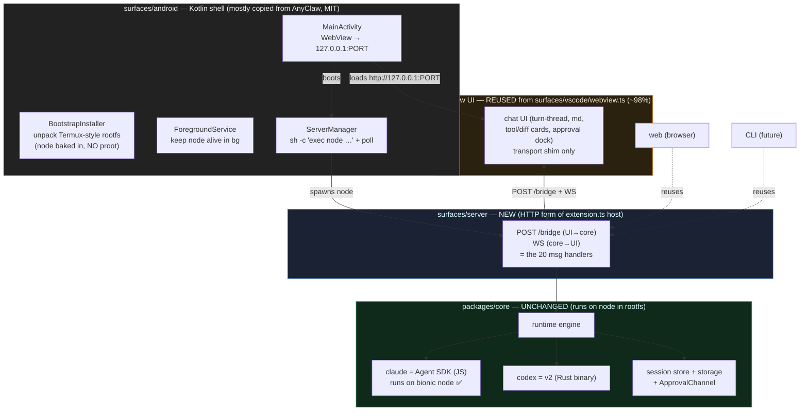

# AgentNet Mobile Strategy — Research Notes

Findings from researching how to run a claude/codex agent on a phone WITHOUT a server.
Facts gathered before any coding. (As of 2026-06. Anthropic policy is in flux, so dates
are stamped.)

> ⚠️ This doc was written as research notes, THEN re-decided after analyzing reference apps
> (AnyClaw, codex-mobile) and verifying claude's Android story. The **current decisions** are
> in "## ARCHITECTURE (DECIDED 2026-06)" right below. The older research sections after it are
> kept as the reasoning trail — where they conflict, the DECIDED section wins. All reference
> source links are collected in "## Reference sources (with links)" at the very bottom.

## TL;DR

- **Android only.** iOS shelved (Apple blocks fork/exec at the kernel — not a perf issue).
- **UI = reuse our existing webview UI inside an Android WebView** (NOT a Compose rewrite).
  ~1430 of webview.ts's 1457 lines stay byte-identical; only the transport shim + theme vars
  change. One UI shared across vscode / android / web.
- **Engine = our `packages/core` running on plain Node inside a Termux-style rootfs.** No proot
  needed, BECAUSE we use the **claude Agent SDK (pure JS)**, not the official claude-code binary
  (which went glibc-native in v2.1.113 and would force proot). claude runs on bionic node.
- **Architecture = local Node server + WebView**, same shape AnyClaw/codex-mobile proved:
  Kotlin shell boots node → node serves our core over `127.0.0.1:PORT` → WebView shows it.
- **A new `surfaces/server` layer** (the HTTP form of vscode's extension.ts host) is shared by
  android + web + CLI — solves "mobile + CLI + web" with one host.
- **codex = deferred to v2** (its SDK spawns a Rust/musl binary needing a special Android build
  + DNS proxy; claude-via-SDK is clean JS, so v1 = claude only).
- **Cost:** running on the user's subscription (Agent SDK credit) = cheap vs direct API
  (15–30×). Hinges on the 2026-06-15 subscription-credit terms (still to confirm).

(historical framing, superseded by the DECIDED section:)
- ~~Node.js runs at native ARM speed on a phone~~ — still true.
- ~~The one wall: child_process.spawn the claude binary~~ — reframed: we don't spawn the binary,
  we run the Agent SDK (JS) in-node.
- **Decision: mobile = Android only, iOS unsupported (for now).**
  - **Android** = our core on node in a Termux-style rootfs, subscription, self-contained.
  - **iOS** = shelved because Apple blocks fork/process-creation at the kernel level. Not a
    phone-performance issue (reasons below).

## ARCHITECTURE (DECIDED 2026-06)

This is the current plan. It was reached by analyzing two MIT reference apps (AnyClaw /
openclaw-android, codex-mobile/"codexapp"), reading our own webview + core, and verifying
claude's Android distribution story. Source links → "Reference sources" at the bottom.

### The one fact that unlocks everything: claude Agent SDK is JS, the official CLI is not
- The **official `@anthropic-ai/claude-code` CLI went native (glibc ELF) in v2.1.113
  (2026-04-17)** — `bin` flipped from `cli.js` to `bin/claude.exe`, no JS fallback, no
  android-arm64 build → it needs glibc → would FORCE proot on Android. [refs #1, #2, #3]
- BUT we already use **`@anthropic-ai/claude-agent-sdk` (pure JS)**, not that binary
  (see [[project_agentnet_claude_sdk]]). Pure JS runs on **bionic node** with **no proot**.
- → AnyClaw hit this same wall and dodged it with the *leaked* Claw Code/OpenClaude JS rewrite
  [ref #4]. We dodge it the legit way: the official Agent SDK. Same escape, clean source.
- ⚠️ **codex is still a native Rust/musl binary** (no JS path) → needs a special Android build
  + a DNS/TLS CONNECT proxy, exactly what AnyClaw does for codex [ref #4]. So **v1 = claude
  only (Agent SDK, clean); codex = v2**.

### Layer diagram
```
┌ surfaces/android/  — Kotlin shell (most copied from AnyClaw, MIT, attribute P. Voronin)
│   MainActivity        → WebView pointed at http://127.0.0.1:PORT   (no JS bridge; pure HTTP)
│   BootstrapInstaller  → unpack a Termux-style rootfs with node baked in (NO proot)
│   ForegroundService   → keep the node process alive in background
│   ServerManager       → ProcessBuilder `sh -c "exec node <our server>"` + readiness poll
│
├ surfaces/server/  — NEW thin layer = the HTTP form of vscode's extension.ts host
│   exposes packages/core over  POST /bridge (UI→core) + WS (core→UI)
│   = the 20 message handlers extension.ts had, as an HTTP/WS server
│   → REUSED by android (WebView), web (browser), and a future CLI
│
├ webview UI  — REUSED from surfaces/vscode/src/webview.ts (~98% unchanged)
│   only change: transport shim (acquireVsCodeApi → window.AgentBridge / fetch('/bridge'))
│   + redefine 13 --vscode-* CSS vars + pre-render chatHtml() to a static asset at build
│
└ packages/core  — UNCHANGED. Runs on the node inside the rootfs.
    claude = Agent SDK (JS) → runs on bionic node ✅   |   codex = v2
```



### Why each call (with the evidence)
- **UI = WebView reuse, NOT Compose.** webview.ts is self-contained (marked/dompurify inlined),
  its VSCode coupling is 3 spots only: `acquireVsCodeApi()` (1 line), 13 `--vscode-*` vars,
  3 watermark lines. The msg protocol (14 down / 20 up) is pure JSON. ~1430/1457 lines stay
  identical. A Compose rewrite would redo all of it AND fork the UI from vscode. (This REVERSES
  the earlier "rebuild in Compose" decision.)
- **No native JS bridge needed.** AnyClaw has zero `addJavascriptInterface` — the WebView just
  loads the local node server over HTTP. We do the same; our transport shim talks to a
  localhost server, not a Kotlin bridge. [ref #4]
- **No proot.** Because claude = Agent SDK (JS), a node-only rootfs suffices. Ship a trimmed
  Termux rootfs with node pre-baked → delete AnyClaw's apt/dpkg/proot/path-patching (~80% of
  its CodexServerManager). [refs #4, #5]
- **W^X bypass = `targetSdk=28`** (Termux's method) — apps targeting API ≤28 may execve from
  app home dir; API 29+ can't. minSdk 24 / compileSdk 35 / **targetSdk 28**. Trade-off: no
  Play Store (sideload/F-Droid), same as Termux. [ref #4]
- **Background = Kotlin Foreground Service** (`START_STICKY`, persistent notification). The node
  process is a separate OS process kept alive by app priority, not by any JS runtime. Approvals
  while backgrounded → push notifications (this is what `ApprovalChannel` was abstracted for).
- **The `surfaces/server` host is the multiplier.** vscode's extension.ts = a host wiring the
  UI's 20 messages to core. Rewrite it ONCE as an HTTP/WS server and android + web + CLI all
  reuse it — this is how "mobile + CLI + web" collapses into one host. codex-mobile proves the
  shape (POST /rpc + WS/SSE + static SPA, origin-relative, WebView-portable). [ref #6]

### What we reuse vs build (the boundary, confirmed against packages/core)
- **Reuse from core (verbatim, runs on node in rootfs):** the whole `runtime` engine, cross-CLI
  resume, AES-GCM session encryption keyed by wallet signature, the paginated page-log
  `SessionStore`, all 4 storage adapters + local-first cloud mirror, `connect()`/`login()`,
  the `ChatMessage`/`CanonicalSession` schema, and the `ApprovalChannel` seam.
- **Reuse from vscode surface:** the webview UI (~98%) + the 14/20 message protocol.
- **Build new (android-specific):** the Kotlin shell (mostly copied from AnyClaw), the trimmed
  node rootfs (the one real new artifact), `surfaces/server` (the HTTP host), a mobile `Wallet`
  impl, and a `PushApprovalChannel` (push-notification approvals).

### Open / still to confirm before/while building
- **The trimmed node rootfs** is the one genuinely new artifact — produce it once on a build
  machine (Termux bootstrap + node + libs), re-zip as our asset. Biggest unknown.
- **Mobile auth ↔ wallet:** `claude setup-token` gives a 1-yr subscription OAuth token
  (see oauth-on-mobile.md), but how it coexists with AgentNet's crypto-wallet identity is
  unspecified. Plus secure token storage (Android Keystore).
- **Subscription-credit ToS** (2026-06-15) — storing the user's OAuth token + running claude on
  their behalf: a terms question, resolve before shipping.

## What works / doesn't on a phone (verified facts)

| Layer | On a phone? | Basis |
|---|---|---|
| Node.js JS execution | ✅ **native ARM** | nodejs-mobile (JaneaSystems) — iOS/Android arm64, not emulation |
| Our runtime JS logic (canonical/encryption/inject) | ✅ | runs as-is on the Node above |
| LLM API direct calls (HTTPS) | ✅ | just networking |
| Native modules (C/C++/Rust, cross-compiled) | ✅ | nodejs-mobile supports native modules |
| **`child_process.spawn` (running a binary)** | ❌ | unsupported by nodejs-mobile [issue #25] + **iOS sandbox forbids fork** ("Operation not permitted") |

Key: what the claude binary does = `[LLM API call] + [tool execution] + [agent loop]`.
Everything inside it needs no spawn (pure Node API), so it works on a phone. spawn is only
needed to "run the claude binary whole."

## The decisive platform difference

### Android — can run claude whole (native ARM)
- **proot-distro** (termux): runs full Ubuntu/Debian Linux at **native ARM speed**. No
  QEMU/hypervisor (not emulation). No root required.
- node + claude code actually run inside it (proven by claude-code-termux et al.).
- If we bundle proot-distro into our app, it's automatic — the user doesn't hand-set up Termux.

### iOS — subprocesses forbidden at the OS level
- iOS apps **cannot** use `fork()`/`popen()`/child_process (Apple sandbox, no workaround
  short of jailbreak).
- iSH (x86 emulation) = slow + modern node crashes. a-Shell = only partly ARM. → local full
  execution is impractical.
- nodejs-mobile runs **JS natively but spawn doesn't work.**
- New hope: ios-linuxkit / iSH-arm64 ("Asbestos") = ARM translation + can pass App Store
  review, but only "shell-grade" speed.

## Auth & cost (★ the crux that splits the mobile strategy)

- Subscription (Pro/Max) ≠ API. **Direct API calls are billed separately, pay-per-token,
  15–30× more than the subscription.**
- Extracting the subscription OAuth token to reuse it = **blocked and a ToS violation**
  (third-party harnesses cut off 2026-04-04).
- ⭐ **From 2026-06-15: third-party apps authenticating the Agent SDK with the user's claude
  subscription is officially allowed** (a separate monthly Agent SDK credit). → running the
  claude SDK whole means **cheap, via the user's subscription.**

| Approach | Auth | Cost |
|---|---|---|
| Run claude SDK whole (A) | user subscription OAuth | cheap (subscription credit) |
| Direct API calls (B) | API key | expensive (pay-per-token, 15–30×) |

## Chosen approach: Plan A (Android)

**A. Bundle proot-distro** — the app auto-provisions native ARM Linux (Ubuntu) + node +
claude on Android. Runs the claude binary whole → authenticates with the user's
subscription (cheap) → phone self-contained. Zero server.

Shelved / not chosen:
- **iOS** = OS forbids fork → can't launch claude → unsupported (see "Why we gave up on iOS").
- "My PC runs claude, phone is a remote" (remote/PC-direct) = doesn't fit the phone-self-
  contained goal, shelved.
- "Direct API calls" (B) = can't use the subscription and is expensive pay-per-token → with
  Plan A available on Android, unnecessary.

### A sandboxed "home" inside app data (file hygiene, not security)

Even though Android *can* fork (unlike iOS), we should NOT let the agent scatter files
across the real Linux home (`/root`, `/home/...` inside proot) or the device. Coding on a
phone generates a lot of churn — clones, build artifacts, scratch files — and we don't want
that bleeding into the system or piling up uncontrolled.

So: carve out ONE folder inside the app's own data dir and make the agent treat it as its
home / project root. Concretely, point `$HOME`/`$PWD`/the proot working dir at e.g.
`<app-data>/AgentNet/home`. Everything the user creates lands there; the system home stays
clean; uninstalling the app (or a "reset workspace" button) wipes exactly one folder.

- This is the same "path illusion" idea from the iOS notes, but here the purpose is
  **hygiene/containment**, not bypassing a fork block (Android doesn't have that block).
- It's an env-var/cwd redirect, not a real OS jail — no tool is forced to stay inside, but
  in practice the agent works relative to its home/cwd, so its output naturally collects
  there.
- Bonus: makes "which wallet's workspace is this" clean later — we can mirror the per-wallet
  isolation we already do for sessions (`AgentNet/{wallet}/...`) onto the workspace home.

## Decision (2026-06)

- **Android = supported.** Plan A (proot-distro runs claude whole, native ARM, subscription,
  self-contained). The main mobile target.
- **iOS = not supported (for now).** Not a tech shortfall — it's **Apple's OS lockdown**. See
  "Why we gave up on iOS." The phone CPU is plenty fast (native Node works) and file ops work,
  but the core of a coding agent — "running external commands (bash/build/test)" — is blocked
  by the kernel, so going self-contained would mean essentially rebuilding claude code whole
  (no subscription · build the tool environment ourselves · re-implement the agent), which
  isn't worth the weight.

## Why we gave up on iOS (summary)

One line: **it's not a phone-performance problem — Apple blocks "creating a new process
(fork/exec)" at the kernel/hardware level.** CPU, memory, filesystem are all sufficient, but
"running claude (or the bash that claude uses) as a separate process" on top of them is
impossible at the OS level.

The chain of blockers:
1. iOS blocks fork/posix_spawn at the kernel ("Operation not permitted"). Not policy but
   kernel/hardware (a 4-fold lock: W^X + code signing + sandbox + entitlements). App code
   can't break through it (short of jailbreak).
2. → can't launch the claude binary on the phone. "Convert it for iOS" is also impossible
   (closed source → can't recompile + no signature → can't run).
3. → to work around it you'd "not use claude and reproduce what claude does," but then:
   - **can't use the subscription** → pay-per-token API (15–30× more).
   - **can't fork for bash/tools either**, so like a-Shell you'd have to build the whole thing
     yourself — compiling every command (node/git/rg…) as an iOS library callable as a
     function (a huge effort).
   - you'd also have to reproduce claude code's agent smarts.
   = essentially a project to rebuild claude code whole. Not worth the weight → shelved.

> The frustrating part: it's blocked not because "the phone is slow" but purely because of
> Apple's lockdown. Android, with the same ARM CPU, runs real Linux at native speed via proot
> and claude works as-is. Only iOS hits the policy wall. Revisit if Apple loosens the policy
> (unlikely) or workaround tech matures.

For the detailed mechanism see the sections below: "iOS spawn block mechanism" / "Where
claude uses child_process" / "The two pieces of the iOS workaround" / "★ The core
constraint" (analysis kept on record).

## iOS spawn block mechanism (why it's blocked — kernel, not policy)

iOS isn't "blocking because Apple dislikes it" — it's a 4-fold kernel/hardware lock that app
code can't break:
1. **Process isolation** — the app is designed to see itself as "the only process running."
   The kernel blocks creating a child at all.
2. **W^X + code signing (★core)** — writable memory can't be executable (`mprotect` modified
   in the kernel) + only Apple-signed code runs. The claude binary is unsigned, so even if a
   fork happens, the kernel kills it the moment it tries to execute.
3. **Entitlement lock** — "what an app can do" is baked in via Apple's signature, immutable.
   No public entitlement grants spawn rights.
4. **No public API** — calling `posix_spawn`/`fork` returns "Operation not permitted."

Workaround directions to investigate (not yet verified):
- Sideloading + JIT (AltStore etc.) — off the App Store, re-sign every 7 days, high barrier
  for ordinary users.
- iSH-arm64 "Asbestos" threaded interpreter — ARM translation without code generation, can
  pass App Store review but slow.
- In-process linking (dlopen) — run in the same process without spawn. Hard because claude is
  closed source.
- WASM — compiling claude to WASM would let it run in a signed runtime (Anthropic won't do it).
- Jailbreak — breaks the kernel protections. Can't ship to the public.

## Where claude uses child_process (spawn) — two layers

1. **Layer 1 — the SDK spawns the claude binary itself** (`pathToClaudeCodeExecutable`).
   If we skip the SDK and call the LLM API directly, this layer disappears.
2. **Layer 2 — when claude executes tools** (the heart of claude code). The Bash tool =
   `spawn("bash",…)`, Grep = `spawn("rg",…)`, git/npm, etc. **This is the real wall** — the
   agent's "hands and feet."

Works / doesn't on a phone:
| What claude does | spawn? | On a phone |
|---|---|---|
| LLM call (the brain) | ❌ | ✅ API |
| File Read/Write/Edit (hands) | ❌ (Node fs) | ✅ |
| **Bash/search (running external commands)** | ✅ | ❌ blocked on iOS |

→ On a phone, "reading code + chatting with the LLM + editing files" all work, but
**"building/testing/running via bash" is blocked.**

## The two pieces of the iOS workaround (both needed to make it work)

### Piece 1 — the path-illusion wrapper (zo's idea, ✅ works)
- An iOS app can freely read/write only `~/Documents`, `~/Library`, `~/tmp`.
- a-Shell already does this: it swaps env vars like `$HOME`,`$PWD` to point at `~/Documents`
  → programs running inside it think "this is home." `cd ~`, `git clone`, file trees all work.
- If we make `Documents/AgentNet` the illusory home/project root, **file work works fully.**
- But this only solves the "path" problem. "Process creation (fork)" is a separate layer this
  doesn't solve.

### Piece 2 — running commands as functions instead of processes (a-Shell / ios_system, ✅ works)
- Since iOS blocks fork, instead of `fork+exec("ls")` the shell **compiles the command's
  source into the app as a library** and calls `ls_main()` **as a function on a thread**
  (rewriting main→pthread_exit, etc.).
- That's how a-Shell runs python/node/grep on a phone — no separate process, inside the signed app.
- **Limit: only commands compiled into the app ahead of time (= open source) work.**

## ★ The core constraint: the claude binary can't go on the phone (can't be converted)

- "Convert the claude binary for iOS and put it in the wrapper" is impossible on two counts:
  1. **Conversion needs source. claude is closed source** — only the built binary is public.
     Can't recompile. (You got the baked bread but no recipe, so you can't re-bake it for
     another oven.)
  2. Even if you made one, **no Apple signature → the kernel kills it on execution.**
- node/python/git can go on the phone via a-Shell **because they're open source and could be
  recompiled from source.** claude can't.

## So the real shape of iOS self-containment: "put claude in" → "reproduce what claude does"

The claude binary = really `[LLM API call] + [tool execution] + [the loop tying them]`. The
smarts aren't in the binary but in **Anthropic's server LLM (the API)**. So what goes on the
phone isn't the binary, but:
- **API/subscription** (borrow the smarts) +
- **open-source tools** (node/git etc. linked the a-Shell way = Piece 2) +
- **`Documents/AgentNet` home illusion** (= Piece 1) +
- **a thin agent loop we write** (LLM↔tool wiring, replacing the claude binary).

These four would, in theory, give a phone-self-contained agent on iOS with no server, no fork,
no binary. But the weight: **it amounts to nearly rebuilding an a-Shell-grade terminal
environment ourselves** → forking a-Shell (open source) is more realistic. The crux is how
much of claude code's agent smarts (system prompts, tool design, strategy) we reproduce.

> Android = claude **as-is** (proot). iOS = a **claude-like thing we build**. That's why the
> two diverge.

## Android build decisions (EARLIER pass — SUPERSEDED by "ARCHITECTURE (DECIDED)" above)

> ⚠️ This section is the FIRST research pass, before we analyzed AnyClaw's source and verified
> the claude-SDK-is-JS fact. Two of its conclusions were REVERSED:
> (1) "UI = Compose, not React Native" → now **UI = reuse webview in a WebView** (Compose was
>     also wrong, just in the other direction);
> (2) "Engine = proot vs linker64, decide by speed test" → now **no proot at all** (claude =
>     Agent SDK runs on plain bionic node). The speed test is moot.
> The React-Native rejection still holds (the Kotlin shell is native). Read the DECIDED section
> for the current plan; this is kept as the reasoning trail.

These were cross-checked against real shipping apps and platform docs, not assumed.
The closest existing analog — **OpenClawAndroid / AnyClaw** — runs claude code / codex CLI
inside an embedded Linux env on Android, kept alive by a Kotlin `CodexForegroundService.kt`,
with a WebView UI. It is **pure Kotlin-native, Android-only, zero React Native**. Nobody
building this class of app reaches for RN. That shaped the calls below.

### UI = native Kotlin + Jetpack Compose (NOT React Native)
- Our app's hard parts are ALL native (proot, subprocess spawn, foreground service, rootfs).
  RN would make us write that Kotlin/C anyway and then wrap it in a C++/TurboModule/Codegen
  bridge on top — pure overhead for a native-heavy app.
- We'll edit the low-level native code constantly. RN hot-reloads only JS; **native edits force
  a full native recompile** → we'd live on the slow side permanently. Native = one language,
  one build, one debugger, no bridge.
- iOS gives RN no advantage here: the engine (proot/spawn) CAN'T go to iOS in ANY stack
  (Apple blocks fork), so RN's "one UI for both" buys nothing — the heavy code is non-portable
  regardless. (See "Why we gave up on iOS".)
- **Keep business/UI-state logic in a clean module** so it can later become a Kotlin
  Multiplatform (KMP) `commonMain` IF we ever do an iOS thin client. iOS UI then = SwiftUI;
  share the Kotlin core via KMP (Compose-MP-on-iOS has accessibility/native-feel rough edges →
  don't share the UI, only the logic). KMP is production-ready (stable since late 2023;
  Netflix, Cash App, Careem use it; Compose MP for iOS went stable 2025-05).

### Engine execution — two candidate paths (decide after a real speed test)
Modern `claude` is a **glibc-linked native ARM binary with no JS fallback**, so we need a
glibc environment, not just node. Two ways to get there on Android:
- **Path A — proot-distro** (most proven; claude-code-termux runs this way). Gives full glibc
  Ubuntu. ⚠️ RISK: proot intercepts syscalls via `ptrace`; community reports it as **"too slow
  for interactive use"** on syscall-heavy workloads. Our agent is interactive → real UX risk.
- **Path B — system-linker / glibc-runner** (Termux-style, lighter than proot). Run binaries
  via `/system/bin/linker64 <binary>` to satisfy W^X without ptrace overhead. Harder to set up
  (must supply glibc), doesn't work for statically-linked binaries.
- **Decision deferred**: build a tiny experiment that measures proot interactive latency first;
  if proot is acceptable, ship it (simplest); if it drags, move to the linker route.

### Hard Android constraint to engineer around: W^X (API 29+)
- Apps targeting API 29+ **cannot `execve()` binaries in their writable home dir** — only code
  inside the APK runs. proot/node/claude all live in writable storage → naive exec is blocked.
- Termux's fix (which we copy in our native module): exec `/system/bin/linker64 <path>` so the
  kernel only sees the permitted system linker, not our file. (Or ship execs as `lib*.so` in
  jniLibs, which Android extracts to an executable dir — clunky for a whole rootfs.)
- Spawn/PTY template to lift: Termux's JNI `create_subprocess()` (`termux.c`) — opens
  `/dev/ptmx`, forks, `execvp`s, `waitFor` reaps. Battle-tested.

### Background execution — Foreground Service (same in any stack)
- The heavy work (claude in proot) is a **separate OS process**, so its lifetime is governed by
  the OS scheduler + our app's process priority — NOT by any JS/UI runtime. A Kotlin
  **Foreground Service** (persistent notification) keeps the app process alive so the child
  survives backgrounding / screen-off.
- The native service captures the child's stdout/stderr and buffers it; the UI attaches when
  foregrounded and repaints. Approval requests arrive as **push notifications** when backgrounded
  (this is exactly what `ApprovalChannel` was abstracted for).

## ❌ Dropped: nodejs-mobile (verified dead-end for us)
- nodejs-mobile runs a real Node in-app and can talk to the UI, BUT **`child_process` and
  `cluster` are officially unsupported** (it's designed as a single in-app process). So it
  **cannot spawn proot or the claude binary** — the one thing we need. Our own JNI exec module
  (above) is the right primitive; nodejs-mobile is not load-bearing. (Also: the RN plugin is
  stale, last release 2024-10 — moot now that UI = native Kotlin.)

## Reusable assets we already have
(superseded detail — see "ARCHITECTURE (DECIDED)" for the current take; kept brief here)
- The core (`packages/core` = `@iqlabs-official/agent-sdk`) is platform-neutral. It runs as-is
  on plain node inside the Termux-style rootfs — **no proot** (claude = Agent SDK, JS).
- The `runtime` engine runs in that node.
- The `ApprovalChannel` abstraction = "approvals in any form" → phone-push approval attaches
  naturally with no engine change.
- The `Wallet`/`StorageAdapter` interfaces = the phone implements them its own way.
- The webview UI = **REUSED directly in a WebView (~98% unchanged), NOT rebuilt in Compose.**
  The extension↔webview message protocol (14 down / 20 up) = the contract `surfaces/server`
  re-exposes over HTTP/WS.

## Unverified / next research
- ⭐ **Produce the trimmed node rootfs** — the one new artifact. Termux bootstrap + node + libs,
  re-zipped as our asset (lets us drop AnyClaw's apt/dpkg/proot machinery). Biggest unknown.
- **Mobile auth ↔ wallet** — `claude setup-token` (1-yr subscription OAuth) vs AgentNet's
  crypto-wallet identity; secure token storage (Android Keystore). See oauth-on-mobile.md.
- **Subscription-credit ToS** (2026-06-15) — confirm before shipping.
- **codex on Android (v2)** — special Termux codex build + DNS/TLS CONNECT proxy (AnyClaw's
  approach, [ref #4]). Out of scope for v1.
- **iOS self-containment workarounds** (parked) — sideload JIT / Asbestos / dlopen / WASM.
  Not blocking Android.

## Reference sources (with links)

Reference repos are cloned under `examples/` (gitignored — they do NOT enter our repo).
Licenses checked: AnyClaw + codex-mobile are **MIT** (Pavel Voronin et al.) → patterns/code
copyable WITH attribution. We do NOT use their leaked-Claude path (Claw Code/OpenClaude); we
use the official `@anthropic-ai/claude-agent-sdk`.

**Reference apps (the architecture we're adopting):**
- **#4 — AnyClaw / openclaw-android** ⭐ the closest analog. Kotlin shell + Termux bootstrap +
  `targetSdk=28` (W^X bypass) + WebView→localhost node server + Foreground Service. Runs the
  engine via a *leaked* Claude rewrite (we replace that with the Agent SDK).
  - https://github.com/OpenClawAndroid/openclaw-android-assistant  (NOTE: "OpenClawAndroid" org
    is friuns2's, not OpenClaw-official — same person as the fork below; commits by friuns2)
  - https://github.com/friuns2/openclaw-android-assistant  (identical code, friuns2's fork)
  - Key files studied: `MainActivity.kt`, `BootstrapInstaller.kt`, `CodexForegroundService.kt`,
    `CodexServerManager.kt`, `android/app/build.gradle.kts`, `android/scripts/download-bootstrap.sh`
- **#6 — codex-mobile / "codexapp"** (MIT) — Node bridge exposing codex app-server as a web UI
  (Express + WS/SSE + Vue SPA), runs in Termux via `npx codexapp`. Proves the local-server +
  WebView-portable UI contract we copy for `surfaces/server`.
  - https://github.com/friuns2/codex-mobile
  - (npm: `codexapp`; upstream it forks: `pavel-voronin/codex-web-local`)

**claude-on-Android distribution facts (why we need the Agent SDK, not the CLI):**
- **#1 — claude-code went native (glibc) in v2.1.113, no JS fallback, no android build:**
  https://github.com/anthropics/claude-code/issues/50270
- **#2 — native installer incompatible with bionic (ELF needs `/lib/ld-linux-aarch64.so.1`):**
  https://github.com/anthropics/claude-code/issues/20778
- **#3 — legacy `node cli.js` only works on ≤2.1.112 (frozen, unshippable):**
  https://github.com/Ishabdullah/claude-code-termux

**Termux / engine-host references (the proot path we are NOT taking, kept for context):**
- **#5 — claude-code-termux (eduterre)** — runs OFFICIAL claude via proot-Ubuntu ("native binary
  needs real glibc; bionic doesn't provide it"). The heavy path we avoid by using the SDK.
  https://github.com/eduterre/claude-code-termux
- **ferrumclaudepilgrim/claude-code-android** — patches the official linux-arm64 ELF to load via
  Termux `glibc-runner`. https://github.com/ferrumclaudepilgrim/claude-code-android
- **proot-distro** (Termux) — full ARM Linux userland. https://github.com/termux/proot-distro
- **termux-app `termux.c`** — JNI `create_subprocess()` PTY/fork/exec template (only if we ever
  need a PTY). https://github.com/termux/termux-app
- **termux-exec** — the `/system/bin/linker64` exec / `libtermux-exec.so` LD_PRELOAD machinery.
  https://github.com/termux/termux-exec

**Our own assets referenced:**
- UI to reuse: `surfaces/vscode/src/webview.ts` (~98% portable) + the host to re-form as HTTP:
  `surfaces/vscode/src/extension.ts`.
- Core reused as-is: `packages/core` (`@iqlabs-official/agent-sdk`).
- Related plan: `plans/mobile-app/oauth-on-mobile.md` (`claude setup-token` flow).

**Not our path (recorded so we don't revisit):**
- nodejs-mobile — `child_process` unsupported → can't host our engine. Dead-end (see section above).
- MobileCLI / Happy Coder — PC runs claude, phone is a remote. Conflicts with phone-self-contained.
- React Native — rejected (UI = WebView reuse; native shell = Kotlin). See "Android build decisions".
