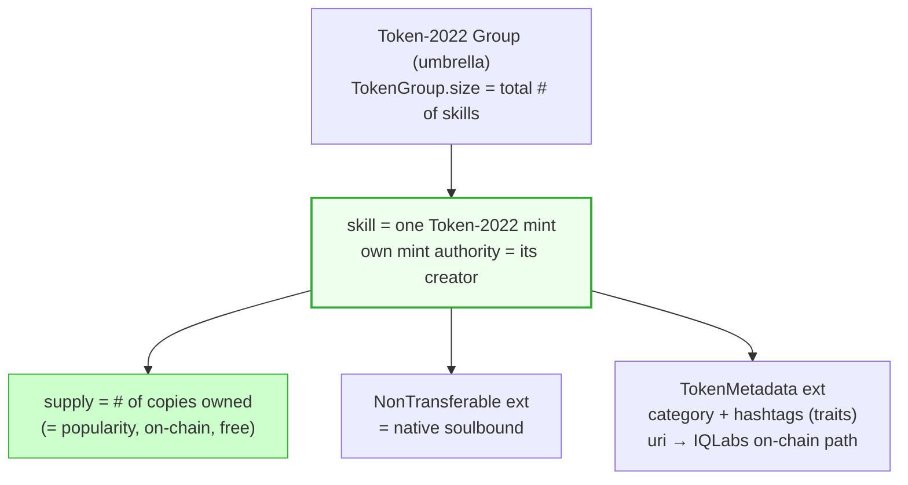
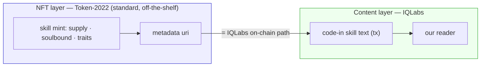

# NFT Structure & Ranking

> Sibling: [`skill-soulbound-structure.md`](skill-soulbound-structure.md) ·
> [`search.md`](search.md) (traits) · [`actions-and-adapters.md`](actions-and-adapters.md).
> The NFT model for skills — chosen so ranking, holder lists, categories, and search all
> fall out of it for free.

---

## 0. What the NFT structure must give us

A good NFT model makes almost everything else trivial:
- **Popular skill** = how many copies of that skill exist (its supply).
- **Famous agent** = sum of supply across the skills that agent created.
- **Ecosystem user list** = the union of all holders.
- **Category / hashtags** = NFT traits → drive [`search.md`](search.md) filtering.

The hard requirement: **one umbrella collection; each item (skill) has a different creator;
each item can be owned in many copies; with a per-item on-chain count.**

---

## 1. The model: Token-2022 semi-fungible (one mint per skill)

The naive "1 NFT = 1 owner" model would make 500 owners = 500 NFT accounts (heavy). The
right model is a **semi-fungible token**: **one mint per skill, and `supply` grows as each
owner is minted one token.** `mint.supply` *is* the per-skill copy count — on-chain, free,
enforced by the token program.

Everything maps to a native Token-2022 feature — **no custom soulbound to build**:

| Requirement | Token-2022 feature | On-chain? |
|---|---|---|
| umbrella collection | `TokenGroup` (`size` = # skills) | ✅ enforced count |
| per-item different creator | each skill = own mint + own authority | ✅ |
| many copies per item | mint 1 token per owner → `supply`++ | ✅ |
| **per-skill popularity count** | **`mint.supply`** | ✅ free, enforced |
| soulbound | **`NonTransferable` extension** | ✅ native (set at mint init) |
| traits (category/hashtags) | `TokenMetadata` `additional_metadata` | ✅ on-chain |
| all holders / user list | DAS `getTokenAccounts` per mint | indexer-fronted |

Two caveats to design around:
- **Burn drift:** `NonTransferable` blocks transfer but **not burn**, so `supply` =
  issued-not-burned. For a *live* holder list read DAS, don't trust `supply` as immutable.
- **No nested groups:** a mint being both a group and a member is undocumented — don't rely
  on it. Per-skill counts come from each mint's `supply`, not a sub-group `size`.

---

## 2. NFT layer ⟂ IQLabs are separate (key)

**IQLabs does not need to support Token-2022.** The two layers are independent and meet at
one field:

- **NFT layer** = Token-2022 mint (ownership, supply, soulbound, traits) — minted with the
  standard, nothing IQLabs-specific.
- **Content layer** = skill text stored via IQLabs **code-in**; the mint's `uri` holds the
  **IQLabs on-chain path** (code-in tx). Our reader resolves it.
- This is exactly IQ6900's pattern (NFT uri = code-in tx hash), swapping its mpl-core shell
  for a Token-2022 semi-fungible mint. **The IQLabs contract is untouched** — it just stores
  text and we read it.

**Division of labor (the rule):**
- **NFT (Token-2022) does everything NFT-shaped** — ownership, supply/popularity, soulbound,
  traits, holder list. The NFT carries only a **txid** (the on-chain path) — nothing else.
- **code-in / inscription is for text data only** — profiles, reputation, audit, skill text.
  Not for ownership or counting (the NFT already does that for free).

So we never rebuild on-chain what the token standard gives us; a custom PDA for ownership is
out — it would make the NFT pointless.

So: mint NFTs with Token-2022 ourselves (a sibling concern), put the IQLabs path in the uri.
No IQLabs/Token-2022 coupling, no contract changes.

---

## 3. Alternatives (heavier — why not)

Kept for the record; the semi-fungible model above wins on every axis we need.

| Option | Per-item on-chain count | Soulbound | Why not |
|---|---|---|---|
| **mpl-core + Edition plugins** | ❌ `maxSupply` is informational, not a counter | build (freeze) | no real count; same IQ6900 stack but loses free supply |
| **mpl-token-metadata Master/Print** | ✅ `MasterEdition.supply` enforced | build (freeze/pNFT) | **500 copies = 500 print mints** (heavy, pricey); bolt-on soulbound |
| **Compressed NFTs (Bubblegum)** | ❌ count leaves via DAS | build | full DAS dependence, no native count; only if each copy must be a distinct traited NFT at huge scale |
| **mpl-404 / hybrid, LibrePlex** | n/a | ❌ (404 is tradeable) | anti-soulbound / no unique advantage |

The only one with a comparable native counter is mpl-token-metadata, but it forces a
separate mint+account per copy (the heavy "edition" architecture). Token-2022 semi-fungible
gives the same counter (`supply`) with **one mint per skill** + native soulbound + on-chain
traits.

---

## 4. What ranking still needs (off-chain)

On-chain gives the raw counters; ranking/aggregation is still a cheap off-chain read
(the `CacheLayer` from [`actions-and-adapters.md`](actions-and-adapters.md) §4):
- **per-skill popularity** = `mint.supply` (read directly).
- **famous agent** = sum of `supply` over that creator's skill mints (aggregate via DAS).
- **user list** = union of holders across mints (DAS `getTokenAccounts`).

---

## 5. TODO

- [ ] Confirm the Token-2022 extension set per skill mint: `NonTransferable` +
      `TokenMetadata` + `GroupMemberPointer`/`TokenGroupMember`; umbrella `TokenGroup`.
- [ ] Minting flow: who pays, when supply increments (on `buy_skill`), free = price-0 mint.
- [ ] Trait schema: exact category list + hashtag rules (feeds [`search.md`](search.md)).
- [ ] Popularity formula: total supply vs paid-only weighting; sybil (free-mint bot) defense.
- [ ] Famous-agent score: supply sum vs followers vs cumulative revenue.
- [ ] Holder enumeration: DAS scan cadence/cache in the `CacheLayer`.
- [ ] Update [`skill-soulbound-structure.md`](skill-soulbound-structure.md): the
      `SkillOwnership` PDA is **dropped** — Token-2022 ownership *is* the soulbound record
      (the mint handles soulbound + supply + holder list). No custom PDA (a PDA would make
      the NFT pointless).

---

> **Sources:** Token-2022 extensions (NonTransferable, TokenMetadata, Token Groups
> `size`/`max_size`) — solana.com/docs/tokens/extensions; mpl-token-metadata Print
> (`supply`/`max_supply`) — developers.metaplex.com/token-metadata/print; mpl-core Editions
> (informational only); Bubblegum/state compression; DAS `getTokenAccounts` (holders).
