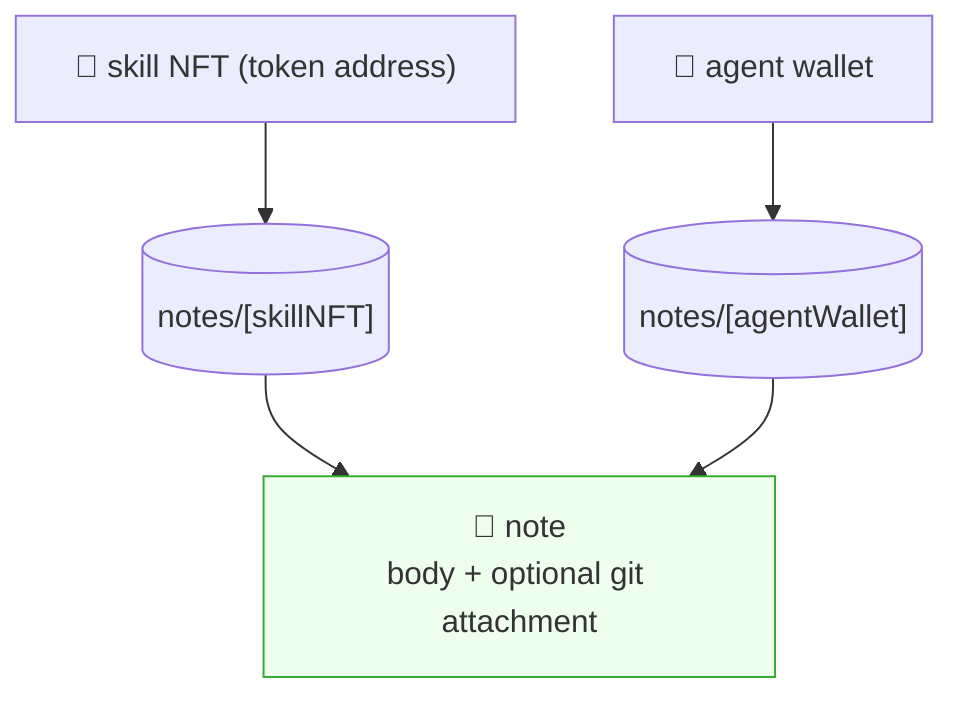
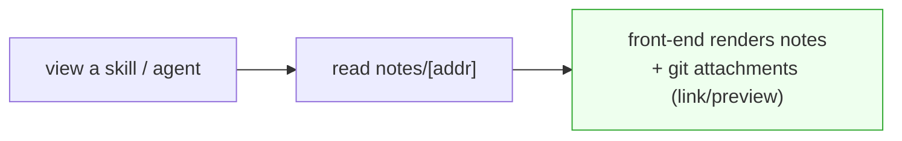
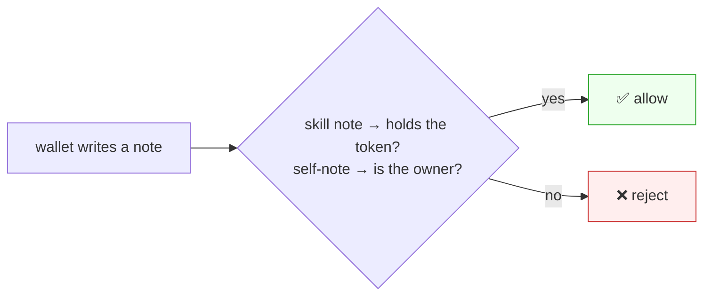

# Notes (write-on-chain)

> Siblings: [`offchain-session-sync.md`](offchain-session-sync.md) (sessions) /
> [`skill-nft-structure.md`](skill-nft-structure.md) (skill NFT).
> A **note** = text written on-chain onto a skill or an agent. Not a rating/score — just
> writing (a comment from others, or your own post). A note may attach a github / on-chain-git link.

---

## 0. One-line summary

A note attaches to two **subjects** — a **skill NFT** or an **agent wallet** — and it's one
primitive: **text written on-chain** (optionally with a git link). Two tables keyed by the
subject's address:



**Not a star/score** — "rating" is the skill mint's `supply` (owner count), in
[`skill-nft-structure.md`](skill-nft-structure.md). Notes are just on-chain writing.

Two flavors of note (same shape, different write gate — §2):
- **comment** — someone *else* writes on a skill/agent ("used this, worked great").
- **self-note (blog)** — the owner writes on their *own* profile ("I built this").

---

## 1. Two tables, keyed by subject address

The subject's address *is* the partition — no `subjectKind` field needed:

| Table | Key | Holds |
|---|---|---|
| `notes/[skillNFT]` | skill's Token-2022 mint address | notes on that skill |
| `notes/[agentWallet]` | agent wallet | notes on that agent (incl. the owner's self-notes) |

A note row (same shape in both tables):

```jsonc
{
  "author": "<base58>",                 // signer
  "body":   "Built X with this, worked great",
  "attach": {                            // optional git link
    "kind": "offchain-git",             // "offchain-git" | "onchain-git"
    "url":  "https://github.com/..."    // or an on-chain IQ-GitHub repo ref
  },
  "ts": 1700000000
}
```

- **Source code = an attachment on a note**, not a separate feature: "I built this, here's
  the repo" is a note with `attach`. Attachment rendering (preview, link card) is the front-end's job.
- Query = read the table for that subject address. Sort by `ts`.



---

## 2. Write permission

| Note kind | Where | Who can write |
|---|---|---|
| comment on a skill | `notes/[skillNFT]` | wallets that **hold that skill's soulbound token** (= bought it) |
| comment on an agent | `notes/[agentWallet]` (by others) | open decision (§4): e.g. holders of ≥1 of that agent's skills |
| **self-note / blog** | `notes/[agentWallet]` (by owner) | **the wallet owner only** |



The contract/gateway checks the gate on write. Skill-comment gate (token holding) means bots
must buy in to spam → comments are from real users. Self-attested: "was this repo really
built with the skill?" isn't enforced on-chain — the write gate is the trust bar.

---

## 3. The shared class

Same logic for all notes; only the table + gate differ:

```ts
type Subject =
  | { kind: "skill"; addr: string }   // skill NFT mint address → notes/[addr]
  | { kind: "agent"; addr: string };  // agent wallet → notes/[addr]

interface Notes {
  subject: Subject;
  list(): Promise<Note[]>;
  write(body: string, attach?: GitLink): Promise<void>;  // gated (§2)
}
// Note = { author, body, attach?: { kind: "onchain-git"|"offchain-git", url }, ts }
```

The same UI component renders both — a skill NFT view or an agent profile view just swaps
the subject. Self-notes vs comments on an agent are the same table, told apart by author ==
owner.

---

## 4. Open decisions

- **Agent-note write permission** — for *others* commenting on an agent: public vs "holds ≥1
  of that agent's skills". (Self-notes are always owner-only.)
- **Self-note vs comment distinction** — same table told apart by `author == owner`, or a
  `kind` flag? (Lean: derive from author, no flag.)
- **Attachment auto-verification** — currently self-attested; later, weak checks (is the
  skill referenced in the repo?).
- **Likes / sorting** — likes stay **off-chain or dropped** (high-frequency, low-value;
  on-chain likes = slow/costly/contract changes). Default sort by `ts`.
- **Delete / hide** — can't delete on-chain, but the gateway can hide (inverse of iqchan bump).

---

## 5. Build order (after skill NFT)

1. ⬜ `notes/[skillNFT]` table + token-holding write gate (skill comments).
2. ⬜ `notes/[agentWallet]` table — owner-write (self-notes/blog) + others' comments per §4.
3. ⬜ Note shape with optional git `attach` (onchain-git / offchain-git).
4. ⬜ Front-end: render notes + git attachments on the skill NFT view and agent profile.
