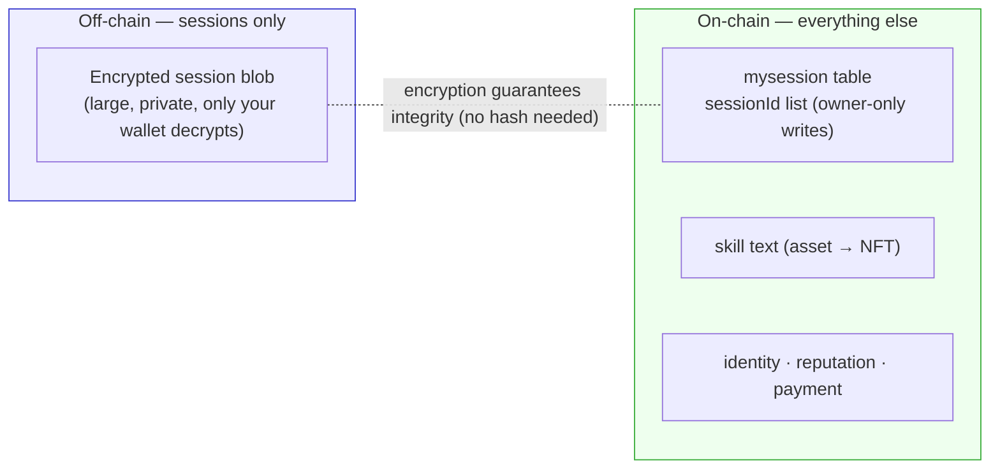
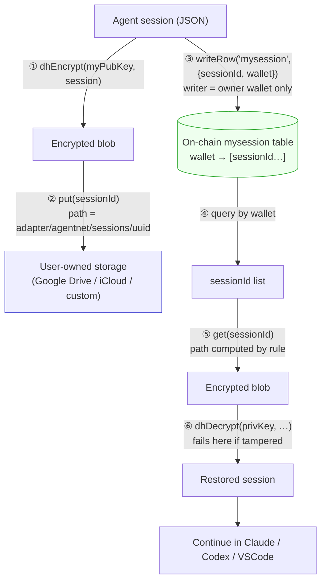
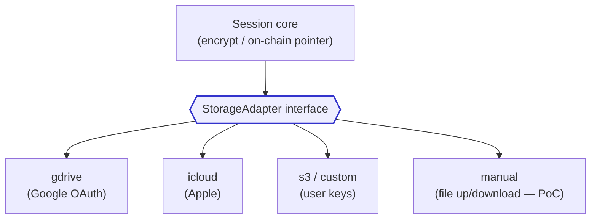
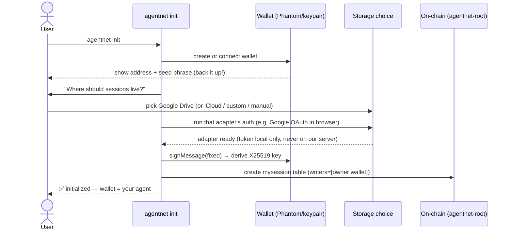
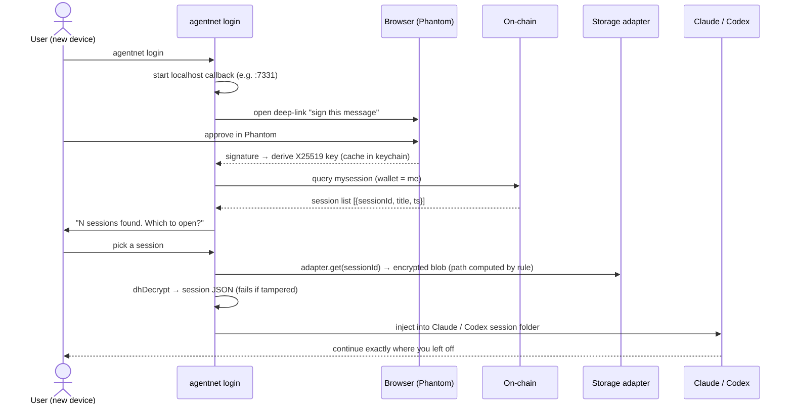
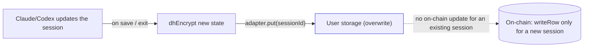
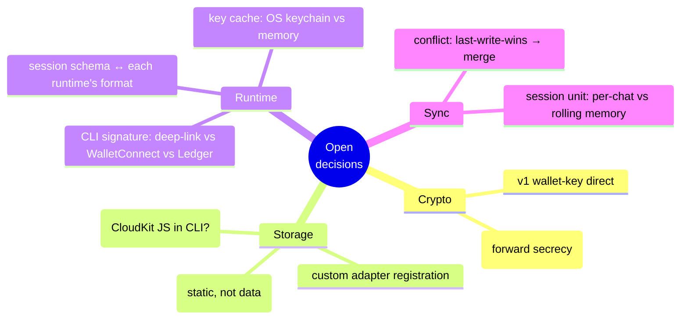

# Off-Chain Session Management & Sync

> Vision docs: [`../README.md`](../README.md) (EN) / [`../aboutkr.md`](../aboutkr.md) (KR).
> Sibling doc: [`skill-nft-structure.md`](skill-nft-structure.md).
> This doc is the **build plan** — "how we actually ship the first deliverable".
>
> 🔍 **Before coding, search OSS first:** `solana wallet signMessage derive encryption key`,
> `phantom connect react wallet-adapter`, `google drive oauth token local store`. Read iq-locker
> (live `deriveX25519Keypair`) + iq-wide-web (Phantom connect) before writing.

---

## 0. What we build first (and why)

We verified the vision against real code (`iqlabs-solana-sdk`, `iq-wide-web`, `iq-locker`)
and against `skills.sh`. The conclusion that decides everything:

| Layer | Where it lives | Why |
|---|---|---|
| **Session / context** (this doc) | **off-chain encrypted blob** + only a sessionId list on-chain | large, only you read it, no reason to publish forever |
| Skill text | **on-chain** | short, and a tradeable **asset** (soulbound NFT) — [`skill-nft-structure.md`](skill-nft-structure.md) |
| Identity (wallet = agent) | **on-chain** | no company can seize or delete it |
| Reputation / ownership graph | **on-chain** | survives leaving any app |
| Payment (star = micro-payment) | **on-chain** | wallet-to-wallet, no account |

**The only off-chain thing is the session/context blob** — because it's large, private,
and yours alone. Everything else (skills, identity, reputation, payment) is on-chain.
This doc covers **session sync**; skills-on-chain + soulbound NFTs live in
[`skill-nft-structure.md`](skill-nft-structure.md).
And `skills.sh` (Vercel's `npx skills`) **deliberately skips** one thing —
**"log in → my sessions/context follow me across every machine and editor".**
That gap is our differentiator.

The first deliverable is exactly that gap: **encrypted session sync, keyed by a Solana
wallet → into a storage the user owns → usable from Claude / Codex / VSCode.**



---

## 1. The whole loop in one picture



Three pieces. Only **one** is new code (the storage adapter); the rest is SDK assembly.
On-chain holds only the `sessionId` list — no pointer, no hash (path is computed by rule,
integrity is guaranteed by encryption).

---

## 2. Crypto — use `iqlabs` crypto as-is

Encryption **reuses the crypto module of `iqlabs-solana-sdk` as-is** (nothing new to build):
`deriveX25519Keypair(signMessage)` derives a key from a wallet signature → `dhEncrypt`/`dhDecrypt`.

Just two key properties:
- Same wallet = always the same key ⇒ **recoverable on any device** (no raw private key
  needed, Phantom-compatible).
- Authenticated encryption (AES-GCM) ⇒ **decryption fails if tampered** ⇒ no on-chain
  integrity hash needed.

> ⚠️ No forward secrecy (same wallet = same key). Acceptable for v1; v2 can wrap a
> per-session key to fix it.

---

## 3. Storage adapter — the only new component

**We provide no storage.** The user picks their own — Google Drive,
iCloud, even a custom backend. Different stores mean different auth/APIs, so we hide them
all behind one interface (the way `skills.sh` covered 71 editors with one dumb file convention):

```ts
interface StorageAdapter {
  readonly id: string;                            // "gdrive" | "icloud" | "s3" | "manual"
  put(sessionId: string, blob: Uint8Array): Promise<void>;  // path computed by rule
  get(sessionId: string): Promise<Uint8Array>;              // found by the same rule
  list?(): Promise<string[]>;                     // sessionIds in this store (optional)
  remove?(sessionId: string): Promise<void>;
}
// Common path rule for every adapter: `agentnet/sessions/{sessionId}`
```



- The adapter **returns no pointer (url)** — the path is fixed at `agentnet/sessions/{sessionId}`,
  so `sessionId` alone locates it. No pointer on-chain.
- The blob is **already authenticated-encrypted (AES-GCM)**, so a third-party store can't
  read it, and **decryption fails if tampered** → no on-chain integrity hash either.
- **AgentNet's only login is Phantom.** Google OAuth happens *only* for users who pick
  Drive, *inside* that adapter, in the user's own environment. We store zero data.

**Build order:** `manual` (0 auth, validates crypto+chain) → `gdrive` → `s3` → `icloud`.

---

## 4. On-chain index — keep on-chain minimal

Session content is never uploaded. **Nor are the pointer, hash, or storage type.**
On-chain holds only the **list** of "these sessionIds belong to this wallet":

Sessions are stored as **rows keyed by the owner's wallet address** in AgentNet's
**`mysession` table**. **Write permission is the owner wallet only** (writers = [owner]) —
nobody can inject a row into my session list.

```jsonc
// writeRow("mysession", …) — plaintext, harmless if public. Writer = owner wallet only
{
  "sessionId": "uuid",            // which session
  "wallet":    "<base58>",        // owner = query key (= the only wallet allowed to write)
  "title":     "Split UI review", // for UI list display (optional, omit if sensitive)
  "ts":        1700000000         // for sorting (optional)
}
```

**What we drop and why:**

| Dropped field | Why we can omit it |
|---|---|
| `hash` (integrity) | **Encryption (AES-GCM) already verifies integrity.** If a blob is tampered, `dhDecrypt` *fails*. No on-chain hash → **no need to update on-chain when a session changes** |
| `agent` (persona) | **Wallet = agent**, so it's redundant. Queries are per-wallet anyway |
| `url` (pointer) | Computed by a **deterministic path rule**. `sessionId` is enough (below) |
| `storage` (adapter) | **User-local setting.** "Which store this wallet uses" stays private |

**Deterministic storage path — why `url` is unnecessary:**
Each adapter stores at a fixed rule:
```
{adapter}/agentnet/sessions/{sessionId}
e.g. Google Drive: agentnet/sessions/<uuid>
     S3:           s3://<bucket>/agentnet/sessions/<uuid>
```
Since `sessionId` alone computes the path, there's no reason to write a pointer on-chain.

**Storage type stays user-local (not on-chain):**
Once the user sets "my storage is gdrive" on a new device (`~/.agentnet/config.json`),
it's automatic afterward. If several stores are enabled, the adapters are all scanned for
the `sessionId`. → Even the storage type is never made public.

- DbRoot: **`agentnet-root`** (separate from `iqprofile-root` for clean permissions).
- Table **`mysession`**, id column `sessionId`, queried by `wallet`.
- **Write permission = owner wallet only** (`writers = [owner]`). The contract's
  `require_writer_auth_if_set` only lets wallets in `writers` through — the opposite of
  empty writers (public); here we fill it so *only the owner* can write.
- Confirmed building blocks: `getUserPda`, `writeRow`, `codeIn`, SNS `.sol`.

---

## 5. The real end-to-end scenario (this must actually work)

The end-to-end flow, concrete enough to build.

### 5.1 First run — `agentnet init`



> The storage type (`storage:"gdrive"`) lives only in the local `config.json`, not
> on-chain (see §4).

What gets persisted locally after init (`~/.agentnet/config.json`):
- wallet public key (NOT the secret — secret stays in OS keychain / hardware wallet)
- chosen `storage` adapter id + its local credential handle
- nothing sensitive that isn't also on-chain or encrypted

### 5.2 Another device — `agentnet login`, then use in Claude/Codex

The hard part: a **CLI can't use Phantom directly** (browser wallet). Standard fix =
a one-shot local callback + browser deep-link to get the signature.



**Key reuse:** since the derive-message is fixed, a new device produces the **same**
X25519 key from the same wallet — so a blob encrypted on device A decrypts on device B.
No key transfer, ever.

### 5.3 During work — save back



**Important:** since there's no hash on-chain, **updating an existing session just
overwrites in storage** — no on-chain transaction needed. The on-chain writeRow happens
**only once, when a new sessionId is first created.** → Big savings in cost and speed.
(This is the real payoff of dropping the hash in §4.)

Conflict policy v1: last-write-wins by the storage file's modified time. Smarter merge later.

---

## 6. How it plugs into each runtime

`skills.sh` proved the model: write into the folder each editor already reads.
We reuse that convention and add a wallet-sync layer on top.

| Runtime | How we get the signature | Where to inject the session | Stage |
|---|---|---|---|
| Web app (PoC) | wallet-adapter (exists in `iq-wide-web`) | the web UI itself | 🟢 first |
| Claude CLI | localhost callback + browser deep-link | `~/.claude/…` (skills.sh path convention) | 🟡 next |
| Codex CLI | same callback pattern | Codex session folder | 🟡 next |
| VSCode ext | extension opens deep-link for signature | extension state / session folder | 🟡 next |
| Hermes / OpenClaw | each runtime's plugin API | their context injection point | 🔴 later |

Across runtimes the **core never changes** — only "how we get the signature" and
"where we drop the session" swap out.

> **CLI wrapping detail (subprocess, JSONL capture, canonical format, Codex↔Claude +
> cross-device continuity)** lives in [`actions-and-adapters.md`](actions-and-adapters.md)
> §5b. This doc owns the session/encryption model; that doc owns the runtime wrapping.

---

## 7. PoC — the smallest thing that proves it

> Goal: web, Phantom connect → save a session → open another browser → connect → restore.

- [ ] `/sessions` page in `iq-wide-web`
- [ ] `manual` storage adapter (file down/upload — 0 auth, path rule `agentnet/sessions/{id}`)
- [ ] encrypt a dummy session with `dhEncrypt` → `adapter.put(sessionId)`
- [ ] on `agentnet-root`, create `mysession` table (writers=[owner]) → `writeRow("mysession", {sessionId, wallet})`
- [ ] on reconnect: query sessionId list by wallet → `adapter.get(sessionId)` → `dhDecrypt` → render
- [ ] then swap `manual` → `gdrive`

Starting with `manual` lets us prove **encryption + on-chain list** before touching any
storage OAuth.

---

## 8. Open decisions (resolve before/while building)



1. **CLI ↔ Phantom signature** — start with localhost callback + deep-link.
2. **Session schema → runtime format** — each tool stores chats differently; need a
   canonical schema + per-runtime converters.
3. **iCloud reality check** — confirm CloudKit JS is usable headless; if not, Drive +
   custom first.
4. **DbRoot** — confirm `agentnet-root` (separate) vs reusing `iqprofile-root`.
