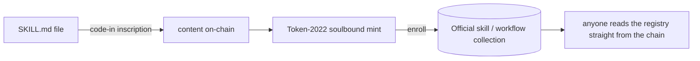
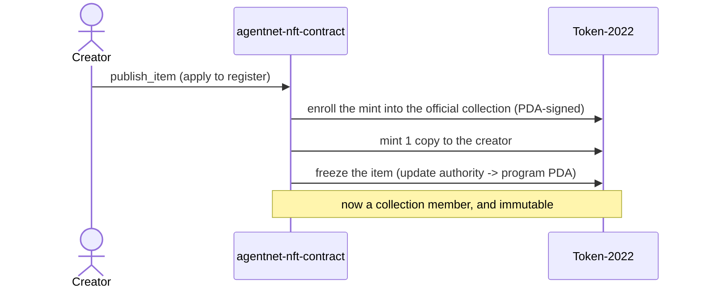
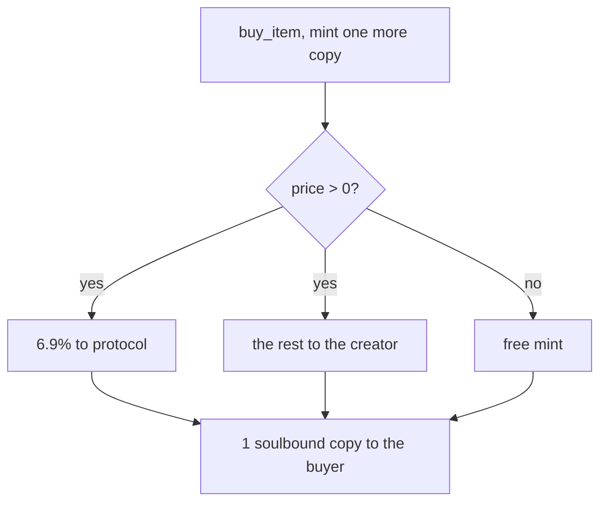
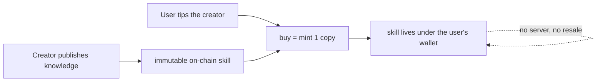

# Open-source announcement thread (X) - on-chain skill NFT collection + contract

Draft thread for opening `agentnet-nft-contract` + `agentnet-nft-indexer`. Each tweet is under
the 280-char limit. One mermaid per content tweet (render to an image to attach; Twitter does not
render mermaid). Tweets 2 and 3 mirror the contract README diagrams; 1 and 4 are new here.

---

## 1/ (intro)

> Today I open-source the NFT collection behind AgentNet's on-chain skills, and the contract that runs it.
>
> An on-chain semi-fungible collection anyone can put a file into. I hope it becomes a good standard, and that marketplaces like Magic Eden or Tensor render NFTs like these.

Mermaid - the big picture (a file becomes a member of an open on-chain collection):

## 2/ (what it is)

> TL;DR: it is an on-chain collection of SKILL.md files.
>
> A creator applies to my contract, and it enrolls their mint as a member of the official skill or workflow collection. That membership is the registry, read straight from the chain.

Mermaid - register into the collection (mirrors the contract README "How a mint is registered"):

## 3/ (minting + economics)

> Every copy is minted by an on-chain buy. Buying a skill mints one more. On each mint 6.9% goes to the protocol and all the rest goes straight to the creator. No layer in between taking a cut.

Mermaid - buy mints a copy and splits the price (mirrors the README buy flow):

## 4/ (the idea)

> No resale, no trading. You publish knowledge in the open; anyone who wants it tips the creator and gets an agent skill that lives under their wallet, with no server keeping it alive. That is the whole thing.

Mermaid - a skill's life: publish once, tip to collect, lives under the wallet forever:

## 5/ (links)

> Open source. Fork it, index it, build on it.
>
> Contract (the item gate): https://github.com/IQCoreTeam/agentnet-nft-contract
> Indexer: https://github.com/IQCoreTeam/agentnet-nft-indexer
