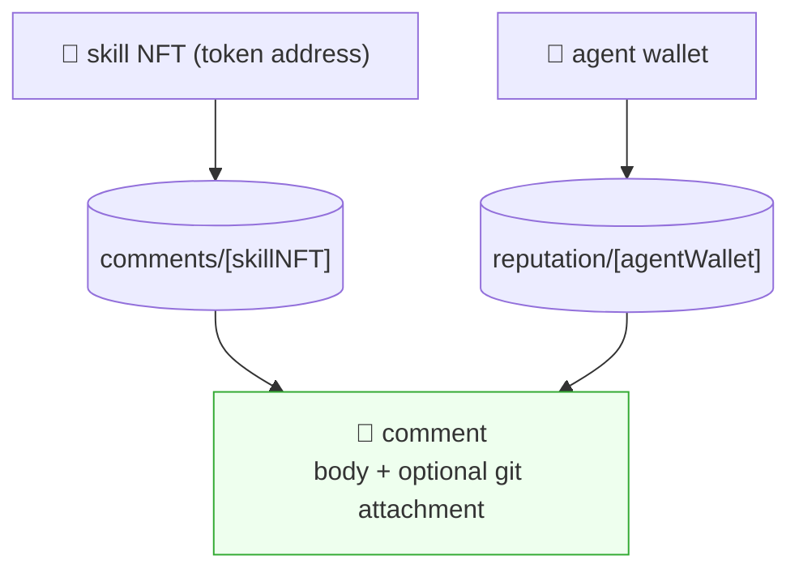
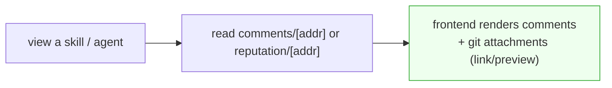
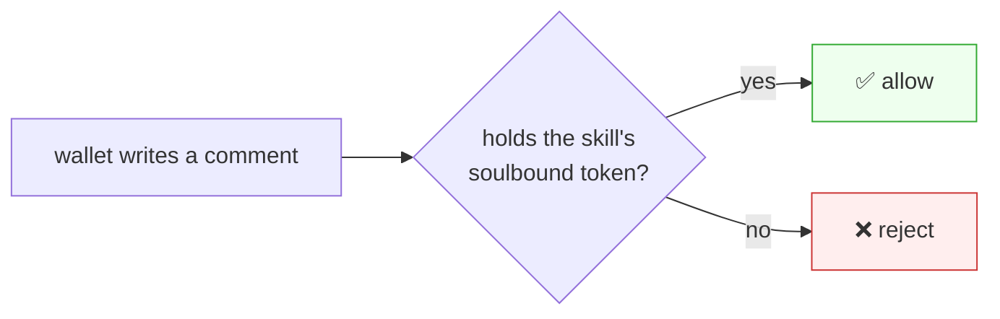

# Reputation Wrapper

> Siblings: [`offchain-session-sync.md`](offchain-session-sync.md) (sessions) /
> [`skill-nft-structure.md`](skill-nft-structure.md) (skill soulbound).
> Reputation = **comments** attached to a skill or an agent, where a comment may attach a
> github / on-chain-git link.

---

## 0. One-line summary

Reputation attaches to two **subject** kinds — a **skill NFT** and an **agent wallet** —
and the thing attached is one primitive: a **comment** (which can carry a git link). One
shared class, two backing tables keyed by the subject's address:



**No star rating** — "rating" is the skill mint's `supply` (owner count), already in
[`skill-nft-structure.md`](skill-nft-structure.md). Here we only do comments.

---

## 1. Two tables, keyed by subject address

The subject's address *is* the table partition — no `subjectKind` field needed:

| Table | Key | Holds |
|---|---|---|
| `comments/[skillNFT]` | skill's Token-2022 mint address | comments on that skill |
| `reputation/[agentWallet]` | agent wallet | comments on that agent |

A comment row (same shape in both tables):

```jsonc
{
  "author": "<base58>",                 // signer
  "body":   "Built X with this, worked great",
  "attach": {                            // optional git link
    "kind": "offchain-git",             // "offchain-git" | "onchain-git"
    "url":  "https://github.com/..."    // or an on-chain IQ-GitHub repo ref
  },
  "ts": 1700000000
}
```

- **Source code = an attachment on a comment**, not a separate feature: "I built this with
  the skill, here's the repo" is just a comment with `attach`. Attachment rendering (preview,
  link card) is the frontend's job.
- Query = read the table for that subject address. Sort by `ts`.



---

## 2. Write permission

- **`comments/[skillNFT]`** — only a wallet that **holds that skill's soulbound token**
  (= actually bought it). Bots must buy in to spam → costs money; comments are from real users.
- **`reputation/[agentWallet]`** — write gate is an open decision (§4): e.g. "anyone holding
  ≥1 of that agent's skills" vs public.



The contract/gateway checks token holding on write. Self-attested: "was this repo really
built with the skill?" isn't enforced on-chain — owner-only writes are the trust bar.

---

## 3. The shared class

Same logic for both subjects; only the table differs:

```ts
type Subject =
  | { kind: "skill"; addr: string }   // skill NFT mint address → comments/[addr]
  | { kind: "agent"; addr: string };  // agent wallet → reputation/[addr]

interface Reputation {
  subject: Subject;
  comments(): Promise<Comment[]>;
  addComment(body: string, attach?: GitLink): Promise<void>;  // gated (§2)
}
// Comment = { author, body, attach?: { kind: "onchain-git"|"offchain-git", url }, ts }
```

The same UI component renders both — a skill NFT view or an agent profile view just swaps
the subject.

---

## 4. Open decisions

- **Agent-reputation write permission** — public vs "holds ≥1 of that agent's skills".
- **Attachment auto-verification** — currently self-attested; later, weak checks (e.g. is
  the skill referenced in the repo?).
- **Comment likes / sorting** — likes stay **off-chain or dropped** (high-frequency,
  low-value; on-chain likes = slow/costly/contract changes). Default sort by `ts`.
- **Delete / hide** — can't delete on-chain, but the gateway can hide (inverse of iqchan bump).

---

## 5. Build order (after skill soulbound)

1. ⬜ `comments/[skillNFT]` table + token-holding write gate.
2. ⬜ `reputation/[agentWallet]` table (write permission per §4).
3. ⬜ Comment shape with optional git `attach` (onchain-git / offchain-git).
4. ⬜ Frontend: render comments + git attachments on the skill NFT view and agent profile.
