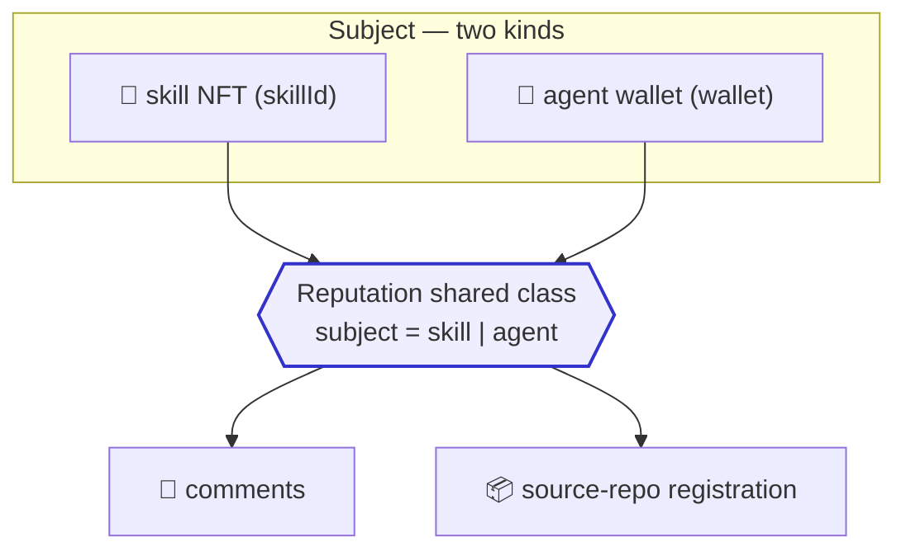
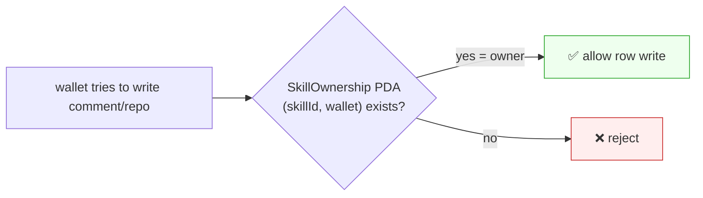
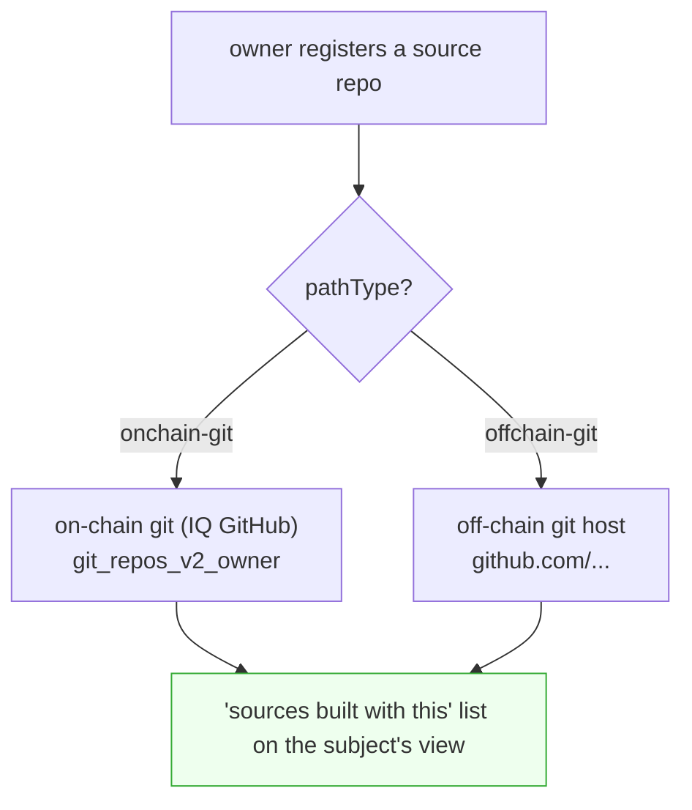

# Reputation Wrapper

> Siblings: [`offchain-session-sync.md`](offchain-session-sync.md) (sessions) /
> [`skill-soulbound-structure.md`](skill-soulbound-structure.md) (skill soulbound).
> This doc covers **reputation** — the shared layer that attaches comments and source
> repos to skills and agents.

---

## 0. One-line summary

Reputation attaches to only two **subject** kinds — a **skill NFT** and an **agent wallet**.
Both get the same things: **comments** and **source-repo registration**. So we handle it
with **one shared class** that only varies the subject kind (we don't build two pointless
wrappers).



**No star rating.** "Rating" is read from the NFT mint count (= number of owners/downloads)
— already handled by the `SkillOwnership` PDA count in
[`skill-soulbound-structure.md`](skill-soulbound-structure.md). Here we only cover
**comments and source repos**.

---

## 1. Shared class — abstract over one subject

Skill or agent, the only difference is "what the reputation attaches to." So the subject
is one `{ kind, id }`:

```ts
type Subject =
  | { kind: "skill";  id: string }   // skillId
  | { kind: "agent";  id: string };  // wallet(base58) — = the agent

interface Reputation {
  subject: Subject;
  comments(): Promise<Comment[]>;            // comments on this subject
  addComment(body: string): Promise<void>;   // owners only (permission below)
  repos(): Promise<RepoLink[]>;              // source repos registered to this subject
  addRepo(repo: RepoLink): Promise<void>;    // owners only
}
```

- **Skill reputation** = "how's this skill?" + "sources built with this skill"
- **Agent reputation** = "how's this agent?" + "sources this agent built"

Whether the UI shows an NFT (skill) view or an agent profile view, the **same component**
just swaps the subject.

---

## 2. Write permission — owners of that skill only

> **Decision (zo): commenting and source-repo registration are limited to "owners of
> that skill".**

Unlike sessions (`mysession`, owner-only), reputation is **written by many — but not just
anyone.** Only someone who **actually bought** the skill (= holds a `SkillOwnership` PDA)
can write.



What this gives:
- **Spam resistance** — a bot must first *buy* the skill to spam comments (costs money).
- **Trust** — "a comment from someone who actually bought it" is worth more.
- **No star rating needed** — the buyer count (mint count) is the rating; their comments
  are the qualitative review.

> Write permission for *agent* reputation is an open decision (§5) — e.g. "anyone who
> bought at least one of that agent's skills."

---

## 3. Comments — public table, author-signed

Comments are written by many, so they accumulate per-subject in a **public table**. Each
row is signed by the author's wallet.

```jsonc
// writeRow("reputation-comments", …) — public, but author must be an owner (§2)
{
  "subjectKind": "skill",          // "skill" | "agent"
  "subjectId":   "clean-code/solid", // skillId or wallet
  "author":      "<base58>",        // author wallet (signer = ownership-checked)
  "body":        "Built X with this skill, worked great",
  "ts":          1700000000
}
```

- Query: by `(subjectKind, subjectId)` to get all comments on that subject.
- Sort: by `ts` (likes, if any, are off-chain — see §5).
- **Write gate:** on write, the contract/gateway checks that
  `SkillOwnership(subjectId, author)` exists (§2).

---

## 4. Source-repo registration — register a public path

Register "sources built with this skill/agent." It's uploading a **path to public source**:

```jsonc
// writeRow("reputation-repos", …) — public, author must be an owner
{
  "subjectKind": "skill",          // "skill"(built with this) | "agent"(built by this)
  "subjectId":   "clean-code/solid",
  "author":      "<base58>",
  "repo":        "...",             // the path below
  "pathType":    "onchain-git",     // "onchain-git" | "offchain-git"
  "ts":          1700000000
}
```

**Two path kinds (the route to public source):**

| pathType | Points to | Example |
|---|---|---|
| `onchain-git` | **on-chain git** (IQ GitHub, git-sdk) | a repo in `git_repos_v2_<owner>` |
| `offchain-git` | **off-chain git host** (GitHub, etc.) | `https://github.com/...` |



**Verification is on you (zo):** "was this source really built with this skill/agent?" is
**self-attested by the registrant**; the chain does not enforce it. (Auto-verification is
an open decision §5.) But **only owners can register** (§2), so there's a minimal trust bar.

---

## 5. Open decisions

- **Agent-reputation write permission** — for skills, "owners of that skill" is clear. For
  agents? "anyone who bought one of that agent's skills" vs "anyone holding any owned skill"
  vs public.
- **Source-repo auto-verification** — currently self-attested. Later, weak auto-checks like
  "is the skillId stamped in the repo metadata?"
- **Comment likes / sorting** — **decided (zo): keep likes off-chain, or drop them.** An
  on-chain like is high-frequency, low-value data: a row per like + aggregation would be slow
  and costly, and would mean touching the contract. Not worth it. So likes are either an
  off-chain index (gateway counts) or omitted entirely. On-chain stays comments + repos only;
  default comment sort is by `ts`.
- **Delete / hide** — malicious comments can't be deleted, but the gateway could hide them
  (inverse of iqchan bump).
- **DbRoot/tables** — put `reputation-comments` and `reputation-repos` under `agentnet-root`?

---

## 6. Build order (after skill soulbound)

1. ⬜ `Reputation` shared class + `Subject` type (skill | agent).
2. ⬜ `reputation-comments` public table + owner write-gate (check `SkillOwnership`).
3. ⬜ `reputation-repos` public table + path kinds (onchain-git / offchain-git).
4. ⬜ UI: render comments + sources with the same component on the NFT (skill) view and the
   agent profile.
