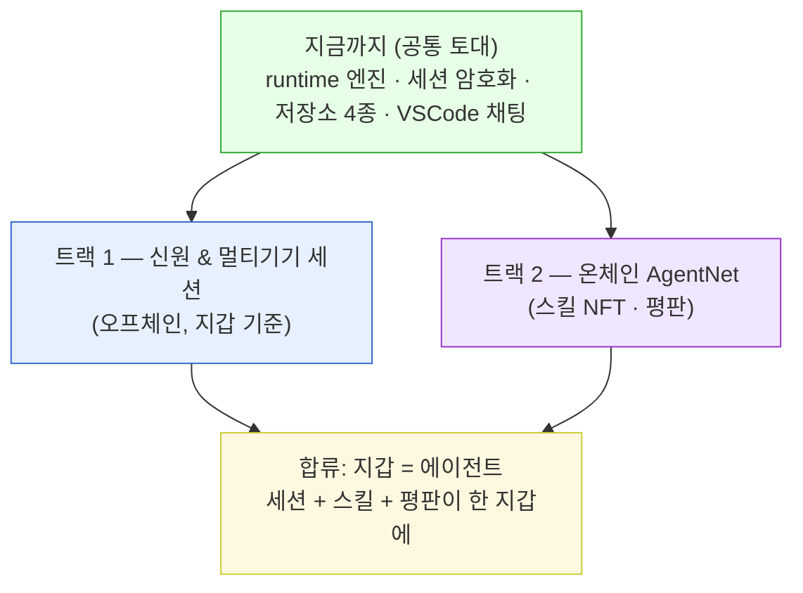
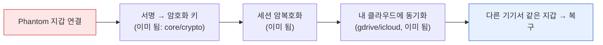
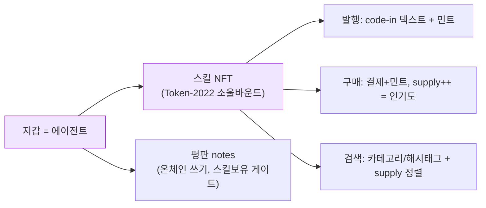
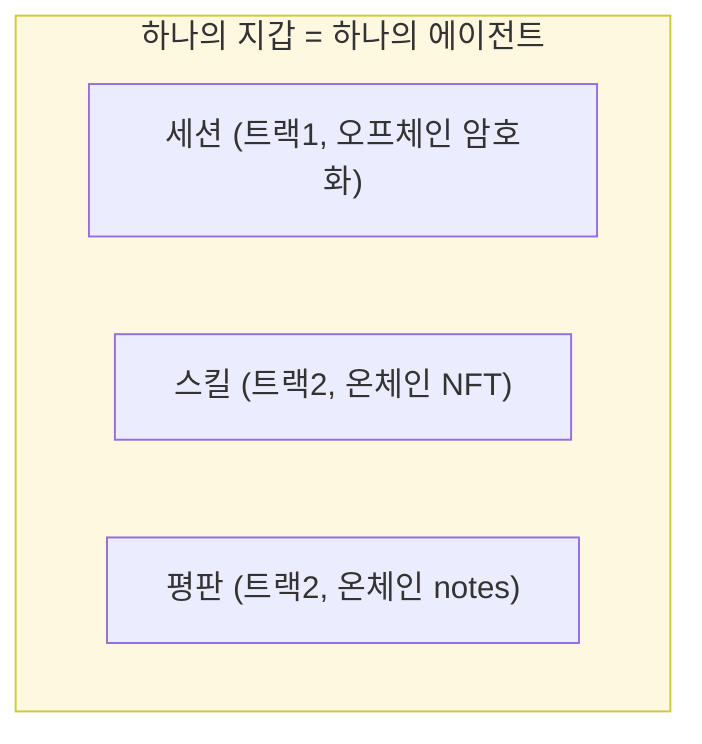

# AgentNet 로드맵 — 두 트랙

> 현황은 [`STATUS.md`](STATUS.md). 여기는 **앞으로 할 일**을 두 갈래로 나눈다.
> 지금까지 한 건 둘 다의 공통 토대(엔진+암호화+저장소). 이제 갈라진다.

---

# 트랙 1 — 지갑 신원 & 멀티기기 세션 동기화

**목표:** 지갑을 연결하면, 어느 기기·어느 앱(VSCode/모바일/CLI)에서 열든 **같은 세션이
암호화된 채로 클라우드에서 동기화**된다. "지갑 = 신원, 세션은 지갑을 따라온다."

### T1 할 일 (순서)

| # | 할 일 | 왜 / 무엇 | 의존 |
|---|---|---|---|
| **T1-1** | **진짜 Phantom 지갑 연결** | 지금 가짜 키페어(seed=7) 대신 실제 지갑 서명. VSCode는 딥링크/외부브라우저 콜백, 모바일은 지갑앱 연동. Wallet 인터페이스(contract.ts)만 만족하면 됨 — 엔진은 안 바뀜. | 부품 없음(신규) |
| **T1-2** | **온보딩 화면 연결** | 만들어둔 login()/detectCli()/STORAGE_OPTIONS를 UI에 꽂기: 지갑연결 → CLI체크 → 저장소선택(애플/구글/로컬/커스텀) → config 저장. | 부품 다 있음 |
| **T1-3** | **저장소 선택을 진짜로** | 지금 manualStorage 고정 → 유저가 고른 저장소(gdrive 등)로. gdrive는 GOOGLE_CLIENT_ID 발급 필요. | 부품 다 있음 |
| **T1-4** | **멀티기기 검증** | 기기 A에서 저장 → 기기 B에서 같은 지갑 login → 세션 복구되는지 실측. (같은 지갑=같은 키라 복호화 됨 — 설계상 됨, 실측만) | T1-1,2,3 |
| **T1-5** | **다른 앱 만들기** | VSCode 같은 앱을 모바일/CLI단독으로. 다 같은 src/(엔진+저장소) 재사용, surface만 새로. | T1-1 |
| **T1-6** | **로컬↔클라우드 중복 관리** | 로컬 기록 + 클라우드 기록이 겹치면 별로. 어느 게 진실인지(병렬 사용 충돌) 정책: last-write-wins(파일 ts) v1 → 나중 머지. | T1-4 |

**T1 끝 그림:** zo가 폰에서 지갑 연결 → 어제 VSCode에서 한 대화가 그대로 뜨고,
저장소에 **진짜 암호화된 세션이 이쁘게 동기화**돼 올라가 있다.

---

# 트랙 2 — 온체인 AgentNet (스킬 NFT · 평판)

**목표:** 지갑(=에이전트)이 **스킬을 발행·검색·구매**하고, **평판(notes)**을 남긴다.
세션이 이미 지갑에 합쳐졌으니, 다음은 **스킬과 평판이 같은 지갑에 붙는 온체인 레이어**.

### T2 할 일 (순서) — 설계는 plans에 이미 있음

| # | 할 일 | 참고 문서 | 상태 |
|---|---|---|---|
| **T2-1** | core/ 온체인 부분 — mysessions 등 테이블 시드 + IQLabs chain 래퍼 | [`coding-info.md`](coding-info.md) | 코드 0 |
| **T2-2** | **스킬 NFT 발행** — code-in 텍스트 + Token-2022 민트(소울바운드) | [`skill-nft-structure.md`](skill-nft-structure.md) | 코드 0 |
| **T2-3** | **스킬 구매** — 결제 + 민트 + supply++ (인기도) | 〃 | 코드 0 |
| **T2-4** | **검색** — 카테고리/해시태그(트레잇) 필터 + supply 정렬 | [`search.md`](search.md) | 코드 0 |
| **T2-5** | **평판 notes** — 온체인 쓰기, 스킬보유 게이트 | [`notes.md`](notes.md) | 코드 0 |
| **T2-6** | **검증 게이트** — 발행 전 품질/악성 검사 | [`skill-validation-adapter.md`](skill-validation-adapter.md) | 코드 0 |
| **T2-7** | **워크플로우 NFT** — 스킬 묶음 레시피, requiredSkills 게이트 | [`workflow-nft.md`](workflow-nft.md) | 코드 0 |
| **T2-8** | (나중) MCP 도구로 노출 — 에이전트 자율 구매 | coding-info Step7 | 코드 0 |

**T2 끝 그림:** 디자이너 에이전트(지갑)가 스킬을 사서 장착하고, 좋은 스킬엔 평판을
남기고, 인기 스킬은 supply로 정렬돼 보인다. 세션(트랙1)과 같은 지갑에 다 모인다.

---

## 합류점 — 왜 두 트랙인가

- **트랙1**(세션)은 **오프체인**(프라이버시 — 대화는 암호화, 지갑만 봄).
- **트랙2**(스킬·평판)는 **온체인**(공개 — 사고팔고 정렬).
- 둘 다 **같은 지갑**에 매달린다. 그래서 "지갑 연결 = 내 에이전트(세션+스킬+평판)가 통째로 따라옴".

## 지금 당장의 다음 한 수

**트랙1의 T1-1 (진짜 Phantom 지갑)** 이 다음 큰 갈림길.
이게 되면 T1-2~4(온보딩·저장소·멀티기기)가 줄줄이 풀린다 (부품 다 있으니).
트랙2는 트랙1과 **독립**이라 병렬 가능 — 온체인 코드는 세션과 안 겹친다.
