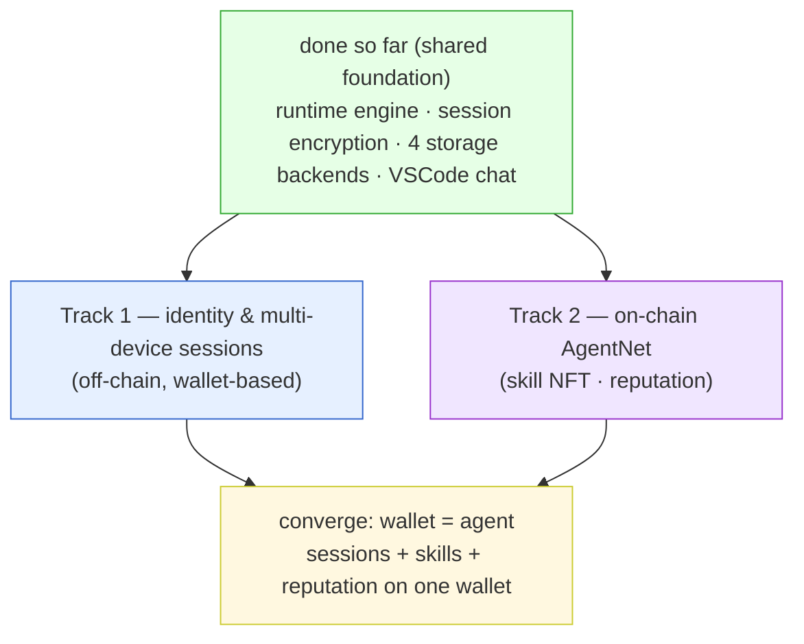
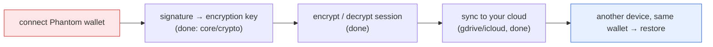
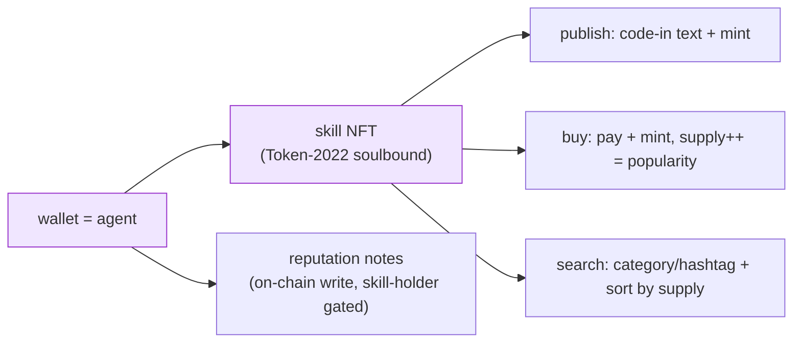
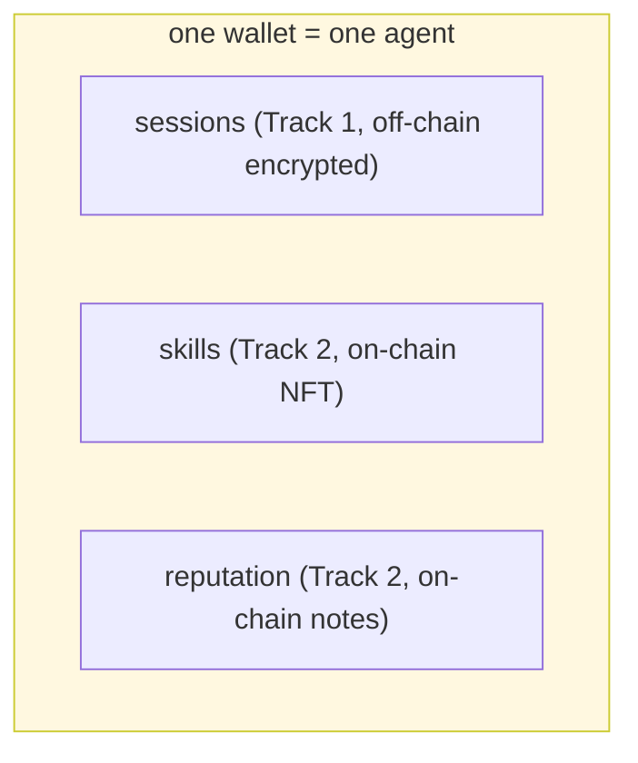

# AgentNet Roadmap — Two Tracks

> Current status: [`STATUS.md`](STATUS.md). This doc is about **what's next**, split into
> two branches. What's done so far is the shared foundation for both (engine + encryption
> + storage). From here it forks.

---

# Track 1 — Wallet Identity & Multi-Device Session Sync

**Goal:** Connect a wallet, and the **same session is synced (encrypted) from your cloud**
no matter which device or app (VSCode / mobile / CLI) you open it in.
"Wallet = identity; sessions follow the wallet."

### Track 1 tasks (in order)

| # | Task | Why / What | Depends on |
|---|---|---|---|
| **T1-1** | **Real Phantom wallet connect** | Replace the fake keypair (seed=7) with real wallet signing. VSCode via deep-link / external-browser callback; mobile via wallet-app integration. Only needs to satisfy the `Wallet` interface (`contract.ts`) — the engine doesn't change. | none yet (new) |
| **T1-2** | **Wire the onboarding screen** | Plug the already-built `login()` / `detectCli()` / `STORAGE_OPTIONS` into the UI: connect wallet → CLI check → storage picker (Apple/Google/local/custom) → save config. | parts exist |
| **T1-3** | **Make storage selection real** | Currently pinned to `manualStorage` → switch to the storage the user picked (gdrive, etc.). gdrive needs a `GOOGLE_CLIENT_ID`. | parts exist |
| **T1-4** | **Multi-device verification** | Save on device A → `login` with the same wallet on device B → confirm the session restores. (Same wallet = same key = decrypts; works by design, just needs a real test.) | T1-1,2,3 |
| **T1-5** | **Build other apps** | A VSCode-like app for mobile / standalone CLI. All reuse the same `src/` (engine + storage); only the surface is new. | T1-1 |
| **T1-6** | **Local↔cloud dedup** | Local records + cloud records overlapping is bad. Define which is the source of truth (parallel-use conflict): last-write-wins by file ts for v1 → smarter merge later. | T1-4 |

**Track 1 end state:** zo connects a wallet on their phone → yesterday's VSCode
conversation is right there, and the storage holds **the encrypted session, neatly synced**.

---

# Track 2 — On-Chain AgentNet (Skill NFT · Reputation)

**Goal:** The wallet (= an agent) **publishes / searches / buys skills** and leaves
**reputation notes**. Sessions are already merged onto the wallet; next is the
**on-chain layer where skills and reputation attach to the same wallet**.

### Track 2 tasks (in order) — designs already in plans/

| # | Task | Reference doc | Status |
|---|---|---|---|
| **T2-1** | core/ on-chain part — table seeds (mysessions, etc.) + IQLabs chain wrapper | [`coding-info.md`](coding-info.md) | no code |
| **T2-2** | **Publish skill NFT** — code-in text + Token-2022 mint (soulbound) | [`skill-nft-structure.md`](skill-nft-structure.md) | no code |
| **T2-3** | **Buy skill** — pay + mint + supply++ (popularity) | 〃 | no code |
| **T2-4** | **Search** — category/hashtag (trait) filter + sort by supply | [`search.md`](search.md) | no code |
| **T2-5** | **Reputation notes** — on-chain write, skill-holder gate | [`notes.md`](notes.md) | no code |
| **T2-6** | **Validation gate** — quality / maliciousness check before publish | [`skill-validation-adapter.md`](skill-validation-adapter.md) | no code |
| **T2-7** | **Workflow NFT** — skill-bundle recipe, requiredSkills gate | [`workflow-nft.md`](workflow-nft.md) | no code |
| **T2-8** | (later) Expose as MCP tools — agent autonomous buy | coding-info Step 7 | no code |

**Track 2 end state:** the designer agent (wallet) buys and equips skills, leaves
reputation on the good ones, and popular skills sort by supply. All of it gathers on
the same wallet as the sessions (Track 1).

---

## Convergence — Why Two Tracks

- **Track 1** (sessions) is **off-chain** (privacy — conversations are encrypted, only the wallet reads them).
- **Track 2** (skills · reputation) is **on-chain** (public — buy, sell, sort).
- Both hang off the **same wallet**. So "connect your wallet = your whole agent (sessions + skills + reputation) comes with it".

## The immediate next move

**Track 1's T1-1 (real Phantom wallet)** is the next big fork.
Once it's done, T1-2~4 (onboarding · storage · multi-device) fall into place (the parts already exist).
Track 2 is **independent** of Track 1 — on-chain code never touches the session pipeline — so it can run in parallel.
