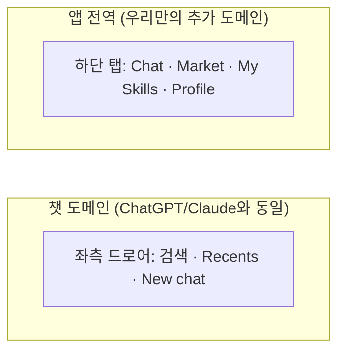
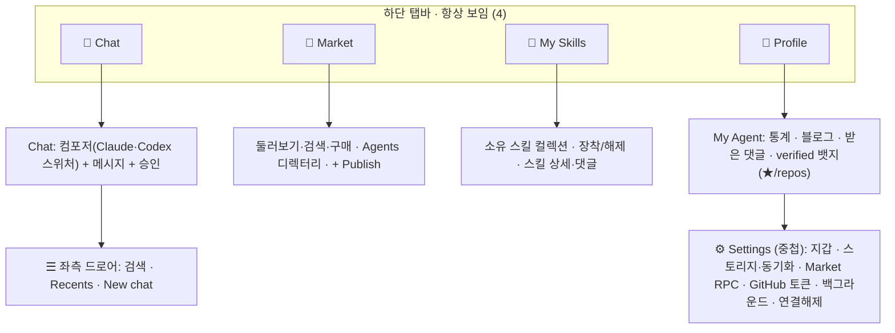

# AgentNet — 화면 재배치 제안 (Screen Rearrangement)

> **정체:** `confirmed-screen-flow.md`(현존 요소 인벤토리)를 바탕으로, **과학적 UX/IA 원칙 +
> 우리 앱 특성 + ChatGPT/Claude 친숙성**을 반영해 현재 플로우의 재배치 대안을 제안한다.
> **새 기능 추가 아님** — 이미 있는 화면들을 더 잘 배치하는 것.
> 날짜: 2026-06-23 · 근거 출처는 §7.

## 0. 목표·제약

- **과학적 근거** 위에서 결정 (추측 아님 — §7 출처).
- **우리 특성:** 바이브코딩 앱(챗이 코어 루프) + 영속 세션 + NFT·온체인 마켓 + 일종의 SNS(에이전트 프로필·블로그·댓글·명성) + 게임/수집. → "게임 + 코딩 편함" 둘 다 챙기되 **쉽게 다가가야** 함.
- **친숙성 사수:** ChatGPT/Claude와 기본은 같아야 함(너무 다르면 헷갈림 — Jakob's Law).
- **이유 없는 불편 제거.** (§1)

---

## 1. 지금 "이유없이 불편한" 지점 (friction)

| | 불편 | 왜 이유 없는 불편인가 |
|---|---|---|
| **F1** | 내비가 **안 보임** — 3카드 가로 스와이프 덱. Market·드로어가 라벨/아이콘 없이 스와이프 뒤에 숨음 | 숨은 내비는 사용률 ~절반, 발견율 >20%↓, 체감 난이도 ~21%↑ (NN/g). 보이는 탭이면 공짜로 해결되는 손해 |
| **F2** | **"내 컬렉션"이 문 3~4개로 산재** — 챗 헤더 "Skills" 버튼 / 드로어 "Skills" / Market "Owned" 탭 / "My Agent" | 단일 홈이 없어 매번 어디로 가야 할지 헷갈림 |
| **F3** | **"Skills" 라벨 충돌** — 드로어 "Skills"는 *마켓 전체*를, 챗 헤더 "Skills"는 *소유 스킬*을 연다 | 같은 단어가 두 곳으로 — 순수 혼란 |
| **F4** | **Market 진입 3문 / 소유 스킬 2문** | 중복 진입점이 "시장 vs 내것" 멘탈모델을 흐림 |
| **F5** | **My Agent(정체성)가 Market을 경유** — 드로어 "My Agent" → 마켓 안 프로필 | 육성한 내 에이전트(정서적 코어)가 상거래에 묻힘 |
| **F6** | **verified-work 등록이 `Configure→GitHub` 구석**, 소비처(프로필/스킬)는 없음 | 만든 곳과 보는 곳이 분리 |

---

## 2. 핵심 긴장과 해소

리서치가 두 방향으로 갈렸다:

- **챗앱 기준선(Agent B):** ChatGPT·Claude·Gemini·Grok 전부 **좌측 드로어**(히스토리·검색·New chat·설정), **하단 탭 아님**. 챗앱에 하단 탭을 넣는 건 오히려 Jakob's-Law 위반 위험.
- **다기능앱 IA(Agent A·C):** 챗+마켓+수집+소셜처럼 영역이 여럿이면 **보이는 하단 탭(3~5개)**이 필수. 스와이프 덱은 발견성 안티패턴.

**해소 — 둘 다 맞다, 적용 범위가 다르다:**
ChatGPT/Claude는 *순수 챗앱*이라 드로어 하나로 충분하다. 우리는 챗 외에 **마켓·수집·소셜이라는 별도 1급 도메인이 3개 더** 있어 드로어만으로는 못 담는다. 그래서:

- **도메인 간 전환** = 항상 보이는 **하단 탭** (스와이프 덱이 못 하던 일).
- **챗 도메인 내부**(히스토리 등) = **좌측 드로어** (ChatGPT/Claude 그대로).

즉 챗 멘탈모델은 **그대로 두고**, ChatGPT엔 없는 추가 도메인용으로 보이는 chrome만 얹는다.

---

## 3. 제안: 하단 탭 4개 + 챗 내부 드로어

**Before (현재)**

**After (제안)**

**탭별 = 전부 이미 있는 화면** (새 기능 0):
- **Chat** (기본 랜딩) — ChatScreen 그대로. 모델 스위처는 컴포저의 Claude/Codex 탭 유지.
- **Market** — MarketScreen의 Skills/Workflows/Agents + Publish (둘러보기·구매·발견).
- **My Skills** — 기존 "Owned" + 챗 "Skills" 버튼이 가리키던 소유 스킬을 **단일 홈**으로.
- **Profile** — 기존 AgentProfileView(본인)를 1급 탭으로. 통계·블로그·댓글·verified 표시. **설정/지갑/GitHub 토큰은 여기 아래 중첩**(progressive disclosure).

**좌측 드로어(챗 탭 내부)** — 기존 Sessions 드로어에서 "My Agent"·"Skills" 행을 빼고(탭으로 승격됨) **검색 + Recents + New chat**만 남김 = ChatGPT/Claude와 동일.

---

## 4. 친숙성 체크 (Jakob's Law — "너무 다르면 헷갈림" 방어)

| ChatGPT/Claude 관습 | 제안에서 |
|---|---|
| 챗이 기본 랜딩 | ✅ Chat 탭이 기본 |
| 히스토리·검색·New chat = 좌측 드로어(좌상단 ☰) | ✅ 그대로 |
| 모델 스위처 = 컴포저 근처 | ✅ Claude/Codex 컴포저 탭 유지 |
| 설정·계정 = 프로필/아바타 뒤 | ✅ Profile → Settings 중첩 |

→ 추가된 건 **하단 탭(도메인 전환)뿐**. 챗 사용 경험은 1:1로 보존되므로 기존 사용자가 헷갈릴 표면이 없다.

---

## 5. friction → 해소 매핑

| | 해소 |
|---|---|
| **F1** 숨은 내비 | 하단 탭으로 4개 도메인 **항상 보임** (스와이프는 탭 간 보조 제스처로 선택적 유지) |
| **F2** 컬렉션 산재 | **My Skills 단일 탭**으로 통합 |
| **F3** "Skills" 라벨 충돌 | Market(둘러보기) vs My Skills(소유) — **한 단어, 한 곳** |
| **F4** 중복 진입점 | Market·소유 각각 단일 진입 |
| **F5** 정체성이 상거래 경유 | **Profile 1급 탭** — 마켓 안 거침 |
| **F6** verified-work 매몰 | 표시는 **Profile + 스킬 카드(★/used in N repos)**, GitHub *토큰*만 Settings에 (등록 자체는 추후 블로그 연계 가능 — game-plan E1) |

---

## 6. 열린 선택 (형이 정할 것)

1. **탭 수 4 vs 5:** 지금은 소셜이 곧 프로필(전역 피드 없음)이라 **4탭(Chat·Market·My Skills·Profile)** 권장. 나중에 활동 피드가 생기면 **Community** 5번째 탭 추가.
2. **My Skills를 별도 탭 vs Profile 안 탭:** 도구 우선 앱(Phantom형)은 분리 권장 → 별도 탭. 단순화 원하면 Profile 안 서브탭으로.
3. **스와이프 덱 처리:** 완전 제거 vs 인접 탭 간 보조 스와이프로 유지(하단 탭이 주 내비).
4. **암호화폐 노출 완화 정도:** 지갑/체인/온체인 용어를 Settings·구매 시점으로 미루고 평소엔 "스킬"로만 보일지(권장).

---

## 7. 근거 (sources)

**내비/배치 과학**
- NN/g — Hamburger/Hidden Navigation Hurts UX (숨은 내비: 사용률 86%→57%, 발견율 >20%↓): https://www.nngroup.com/articles/hamburger-menus/
- NN/g — Mobile Navigation Patterns / Carousels (제스처·엣지스와이프 미발견): https://www.nngroup.com/articles/mobile-navigation-patterns/
- NN/g — Progressive Disclosure: https://www.nngroup.com/articles/progressive-disclosure/
- Material 3 — Navigation bar 3~5 destinations: https://m3.material.io/components/navigation-bar/guidelines
- Apple HIG — Tab bars(3~5, 탭 항상 보임): https://developer.apple.com/design/human-interface-guidelines/components/navigation-and-search/tab-bars
- Laws of UX — Jakob's / Hick's / Fitts's: https://lawsofux.com/
- Smashing — Thumb Zone(엄지 ~75%, 한손 ~49% → 하단 내비): https://www.smashingmagazine.com/2016/09/the-thumb-zone-designing-for-mobile-users/

**챗앱 친숙성 기준선**
- ChatGPT iOS FAQ / 모델 피커 컴포저 이동(2025): https://help.openai.com/en/articles/7885016-chatgpt-ios-app-faq · https://techcrunch.com/2025/08/12/chatgpts-model-picker-is-back-and-its-complicated/
- Claude — 모바일 모델 스위처(상단 모델명 탭): https://support.claude.com/en/articles/8664678
- 공통: 챗=랜딩, 히스토리=좌측 드로어, New chat=상단, 모델=컴포저 근처, 설정=프로필 뒤.

**도구+수집+소셜+마켓 결합 IA**
- Phantom — Home/Collectibles/Swap/Activity/Explore (소유=Collectibles, 마켓=Explore 분리): https://help.phantom.com/hc/en-us/articles/46027382248467
- Duolingo — Learn/Practice/Leaderboard/Quests/Profile (코어=탭1, 소셜=별 탭): https://blog.duolingo.com/new-duolingo-home-screen-design/
- OpenSea(마켓 우선은 컬렉션을 Profile에 흡수) / web3 온보딩 — 시드구문 단계서 ~60% 이탈 → 임베디드 지갑·점진 노출: https://sequence.xyz/blog/how-to-simplify-user-onboarding-for-a-web3-app
</content>
