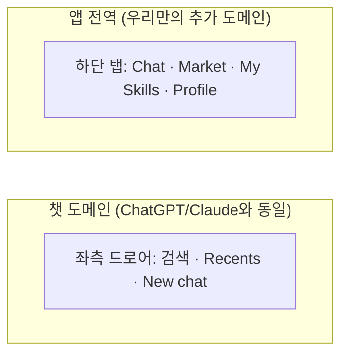
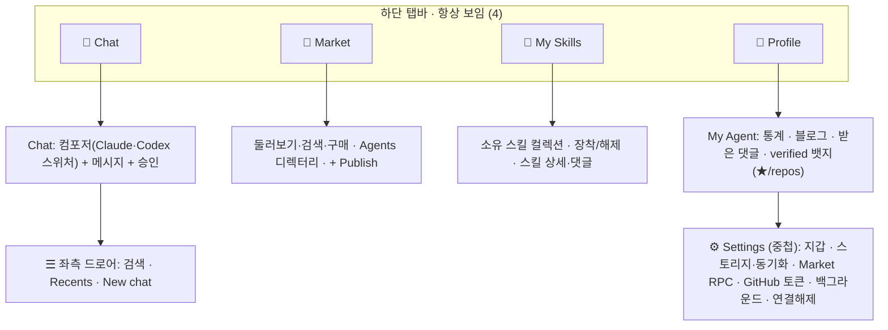

# AgentNet — 화면 재배치 제안 (Screen Rearrangement)

> **정체:** `confirmed-screen-flow.md`(현존 요소 인벤토리)를 바탕으로, **과학적 UX/IA 원칙 +
> 우리 앱 특성 + ChatGPT/Claude 친숙성**을 반영해 현재 플로우의 재배치 대안을 제안한다.
> **새 기능 추가 아님** — 이미 있는 화면들을 더 잘 배치하는 것.
> 날짜: 2026-06-23 · 근거 출처는 §7.

## 0. 목표·제약

- **과학적 근거** 위에서 결정 (추측 아님 — §7 출처).
- **우리 특성:** 바이브코딩 앱(챗이 코어 루프) + 영속 세션 + NFT·온체인 마켓 + 일종의 SNS(에이전트 프로필·블로그·댓글·명성) + 게임/수집. → "게임 + 코딩 편함" 둘 다 챙기되 **쉽게 다가가야** 함.
- **친숙성 사수:** ChatGPT/Claude와 기본은 같아야 함(너무 다르면 헷갈림 — Jakob's Law).
- **이유 없는 불편 제거.** (§1)

---

## 1. 지금 "이유없이 불편한" 지점 (friction)

| | 불편 | 왜 이유 없는 불편인가 |
|---|---|---|
| **F1** | 내비가 **안 보임** — 3카드 가로 스와이프 덱. Market·드로어가 라벨/아이콘 없이 스와이프 뒤에 숨음 | 숨은 내비는 사용률 ~절반, 발견율 >20%↓, 체감 난이도 ~21%↑ (NN/g). 보이는 탭이면 공짜로 해결되는 손해 |
| **F2** | **"내 컬렉션"이 문 3~4개로 산재** — 챗 헤더 "Skills" 버튼 / 드로어 "Skills" / Market "Owned" 탭 / "My Agent" | 단일 홈이 없어 매번 어디로 가야 할지 헷갈림 |
| **F3** | **"Skills" 라벨 충돌** — 드로어 "Skills"는 *마켓 전체*를, 챗 헤더 "Skills"는 *소유 스킬*을 연다 | 같은 단어가 두 곳으로 — 순수 혼란 |
| **F4** | **Market 진입 3문 / 소유 스킬 2문** | 중복 진입점이 "시장 vs 내것" 멘탈모델을 흐림 |
| **F5** | **My Agent(정체성)가 Market을 경유** — 드로어 "My Agent" → 마켓 안 프로필 | 육성한 내 에이전트(정서적 코어)가 상거래에 묻힘 |
| **F6** | **verified-work 등록이 `Configure→GitHub` 구석**, 소비처(프로필/스킬)는 없음 | 만든 곳과 보는 곳이 분리 |

---

## 2. 핵심 긴장과 해소

리서치가 두 방향으로 갈렸다:

- **챗앱 기준선(Agent B):** ChatGPT·Claude·Gemini·Grok 전부 **좌측 드로어**(히스토리·검색·New chat·설정), **하단 탭 아님**. 챗앱에 하단 탭을 넣는 건 오히려 Jakob's-Law 위반 위험.
- **다기능앱 IA(Agent A·C):** 챗+마켓+수집+소셜처럼 영역이 여럿이면 **보이는 하단 탭(3~5개)**이 필수. 스와이프 덱은 발견성 안티패턴.

**해소 — 둘 다 맞다, 적용 범위가 다르다:**
ChatGPT/Claude는 *순수 챗앱*이라 드로어 하나로 충분하다. 우리는 챗 외에 **마켓·수집·소셜이라는 별도 1급 도메인이 3개 더** 있어 드로어만으로는 못 담는다. 그래서:



- **도메인 간 전환** = 항상 보이는 **하단 탭** (스와이프 덱이 못 하던 일).
- **챗 도메인 내부**(히스토리 등) = **좌측 드로어** (ChatGPT/Claude 그대로).

즉 챗 멘탈모델은 **그대로 두고**, ChatGPT엔 없는 추가 도메인용으로 보이는 chrome만 얹는다.

---

## 3. 제안: 하단 탭 4개 + 챗 내부 드로어

**Before (현재)**


**After (제안)**



**탭별 = 전부 이미 있는 화면** (새 기능 0):
- **Chat** (기본 랜딩) — ChatScreen 그대로. 모델 스위처는 컴포저의 Claude/Codex 탭 유지.
- **Market** — MarketScreen의 Skills/Workflows/Agents + Publish (둘러보기·구매·발견).
- **My Skills** — 기존 "Owned" + 챗 "Skills" 버튼이 가리키던 소유 스킬을 **단일 홈**으로.
- **Profile** — 기존 AgentProfileView(본인)를 1급 탭으로. 통계·블로그·댓글·verified 표시. **설정/지갑/GitHub 토큰은 여기 아래 중첩**(progressive disclosure).

**좌측 드로어(챗 탭 내부)** — 기존 Sessions 드로어에서 "My Agent"·"Skills" 행을 빼고(탭으로 승격됨) **검색 + Recents + New chat**만 남김 = ChatGPT/Claude와 동일.

**재질(material) 한 줄 — 컴포저·FAB·탭바는 "판떼기"가 아니라 뒤가 투명하게 fade되는 바로.**
형이 보낸 텔레그램 샷의 포인트: 입력칸·떠다니는 버튼이 *불투명 판(opaque panel)*이 아니라 **배경이 투명하고, 바 근처로 올라온 콘텐츠가 점점 사라지는(fade)** 느낌. 유리블러(글래스) 아님 — 그냥 **투명 + 페이드**다. 이 효과의 정식 명칭:

| 용어 | 무엇 | 구현 키워드 |
|---|---|---|
| **Gradient fade / fade-out mask** (그라데이션 페이드 / 페이드 마스크) ★핵심 | 콘텐츠 자체의 불투명도를 바 쪽으로 갈수록 1→0으로 떨어뜨려, **하드 엣지 없이** 메시지가 바 밑으로 녹아 사라지게 | 스크롤 콘텐츠에 알파 그라데이션 마스크: `mask-image: linear-gradient(to top, transparent, black)` (RN은 `MaskedView` + `expo-linear-gradient`) |
| **Edge fade / scroll fade** (엣지 페이드) | 위 효과를 가리키는 더 일반적인 이름. 스크롤 영역의 위/아래 가장자리에서 콘텐츠가 페이드 | 동일 (컨테이너 가장자리 마스크) |

→ 바 자체 배경은 **투명**(또는 거의 투명), 그 뒤로 지나가는 콘텐츠를 마스크로 페이드시키는 게 핵심. 텔레그램·iMessage가 입력칸 위에서 쓰는 게 정확히 이거다. 우리도 **챗 컴포저 · New chat FAB · 떠다니는 캡슐 탭바** 셋 다 이 페이드 마스크로 통일하면 "떠 있는데 판때기 아님"이 완성된다.

---

## 4. 내비 스타일 — 미니멀하면서 발견성 유지 (올드해 보이지 않게)

> 형 우려("항상 보이는 하단 탭은 옛날 UI 같다") 정면 검토. **결론: 올드한 건 패턴이 아니라 스타일이다.**
> 떠다니는 반투명 하단바는 2025년 iOS 26·Material 3가 둘 다 미는 방향 = 지금 가장 모던한 형태.

**핵심 통찰 — 패턴 ≠ 스타일.** 하단 탭바 자체는 안 낡았다. iOS 26 "Liquid Glass"와 Material 3 Expressive가 2025에 *떠다니고 반투명한* 하단바로 오히려 강화했다(M3는 드로어를 deprecated). 낡아 보이는 건 2014년식 스타일: 꽉 찬 풀너비·불투명·딱딱한 상단 보더·5개 빽빽한 아이콘. **패턴은 유지하고 스타일만 바꾸면** 발견성과 모던함을 동시에 가진다.

| 올드한 스타일 (피함) | 2024-2025 모던 스타일 (채택) |
|---|---|
| 화면 끝에 붙은 풀너비 | 가장자리서 띄운 **floating 캡슐/pill** |
| 불투명 + 1px 상단 보더 | **반투명 + blur(frosted / Liquid Glass)** · 보더 없음 · 부드러운 그림자 |
| 5+개 빽빽 동일 아이콘 | **≤4개** · 여유 간격 |
| 높고 항상 고정 | **낮고** · 콘텐츠에 반응 |
| 항상 동일 | **스크롤 내리면 최소화 / 올리면 복귀** |

**스크롤 자동 숨김 = 공식 절충안.** 내릴 때(읽는 중) 바가 최소화되고 올릴 때(이동 의도) 즉시 복귀. iOS 26 `tabBarMinimizeBehavior(.onScrollDown)` 기본 제공, Material도 표준 패턴. 우리처럼 **긴 코드 답변을 읽을 때 chrome이 사라졌다가 제스처로 바로 돌아오니** 궁합이 특히 좋다.

**완전 숨김 / 제스처 전용은 "단일 목적 앱"만 가능.** ChatGPT(챗 하나)·Things·BeReal·Arc는 목적지가 적어 chrome 없이 간다. 우리처럼 도메인 4개인 다기능 앱은 — 가장 닮은 **Phantom(지갑+트레이드+탐색)도 보이는 바를 유지**한다. NN/g: 주 내비를 숨기면 발견성·사용률 ~절반. ("탭바는 낡았다"는 건 일부 디자이너의 소수 의견이지 합의가 아님.)

**적용 권장:**
- **떠다니는 반투명(blur) 캡슐 바** — 가장자리서 띄우고, 둥글게, 보더 없이, 낮게.
- **스크롤 내릴 때 최소화 / 올릴 때 복귀** (양 플랫폼 네이티브).
- **4개만 + 라벨** (Market·Collection은 아이콘만으론 안 읽힘 → 라벨 유지).
- **New chat = FAB**(또는 상단 compose) — 탭 낭비 안 함(Apple·Google: 탭은 이동용이지 액션용 아님).
- 인접 탭 간 스와이프는 **보조 가속기로** 남겨도 됨(주 내비는 보이는 바).

→ 형이 원하는 "미니멀·모던"(떠다니는 글래스 + 적은 항목 + 읽을 때 사라지는 chrome)을 주면서도 NN/g 발견성 선(주 목적지는 절대 숨기지 않음) 안쪽에 머문다. 진짜 죽여야 할 건 **상단 nav를 햄버거에 숨기는 것**(구글도 그래서 드로어 deprecated). 단, 챗 *내부*의 히스토리 드로어는 ChatGPT/Claude 관습이라 유지 — 그건 전역 내비가 아니라 섹션 내부 보조 내비라 예외.

---

## 5. 친숙성 체크 (Jakob's Law — "너무 다르면 헷갈림" 방어)

| ChatGPT/Claude 관습 | 제안에서 |
|---|---|
| 챗이 기본 랜딩 | ✅ Chat 탭이 기본 |
| 히스토리·검색·New chat = 좌측 드로어(좌상단 ☰) | ✅ 그대로 |
| 모델 스위처 = 컴포저 근처 | ✅ Claude/Codex 컴포저 탭 유지 |
| 설정·계정 = 프로필/아바타 뒤 | ✅ Profile → Settings 중첩 |

→ 추가된 건 **하단 탭(도메인 전환)뿐**. 챗 사용 경험은 1:1로 보존되므로 기존 사용자가 헷갈릴 표면이 없다.

---

## 6. friction → 해소 매핑

| | 해소 |
|---|---|
| **F1** 숨은 내비 | 하단 탭으로 4개 도메인 **항상 보임** (스와이프는 탭 간 보조 제스처로 선택적 유지) |
| **F2** 컬렉션 산재 | **My Skills 단일 탭**으로 통합 |
| **F3** "Skills" 라벨 충돌 | Market(둘러보기) vs My Skills(소유) — **한 단어, 한 곳** |
| **F4** 중복 진입점 | Market·소유 각각 단일 진입 |
| **F5** 정체성이 상거래 경유 | **Profile 1급 탭** — 마켓 안 거침 |
| **F6** verified-work 매몰 | 표시는 **Profile + 스킬 카드(★/used in N repos)**, GitHub *토큰*만 Settings에 (등록 자체는 추후 블로그 연계 가능 — game-plan E1) |

---

## 7. 열린 선택 (형이 정할 것)

1. **탭 수 4 vs 5:** 지금은 소셜이 곧 프로필(전역 피드 없음)이라 **4탭(Chat·Market·My Skills·Profile)** 권장. 나중에 활동 피드가 생기면 **Community** 5번째 탭 추가.
2. **My Skills를 별도 탭 vs Profile 안 탭:** 도구 우선 앱(Phantom형)은 분리 권장 → 별도 탭. 단순화 원하면 Profile 안 서브탭으로.
3. **내비 바 형태(§4):** **떠다니는 반투명 캡슐 + 스크롤 자동숨김**(권장) vs 상단 스와이프 탭(Phantom형) vs 고정 단순 바.
4. **New chat 위치:** FAB vs 상단 compose vs 드로어 상단(셋 다 친숙성 OK).
5. **스와이프 덱 처리:** 완전 제거 vs 인접 탭 간 보조 스와이프로 유지(하단 탭이 주 내비).
6. **암호화폐 노출 완화 정도:** 지갑/체인/온체인 용어를 Settings·구매 시점으로 미루고 평소엔 "스킬"로만 보일지(권장).

---

## 8. 근거 (sources)

**내비/배치 과학**
- NN/g — Hamburger/Hidden Navigation Hurts UX (숨은 내비: 사용률 86%→57%, 발견율 >20%↓): https://www.nngroup.com/articles/hamburger-menus/
- NN/g — Mobile Navigation Patterns / Carousels (제스처·엣지스와이프 미발견): https://www.nngroup.com/articles/mobile-navigation-patterns/
- NN/g — Progressive Disclosure: https://www.nngroup.com/articles/progressive-disclosure/
- Material 3 — Navigation bar 3~5 destinations: https://m3.material.io/components/navigation-bar/guidelines
- Apple HIG — Tab bars(3~5, 탭 항상 보임): https://developer.apple.com/design/human-interface-guidelines/components/navigation-and-search/tab-bars
- Laws of UX — Jakob's / Hick's / Fitts's: https://lawsofux.com/
- Smashing — Thumb Zone(엄지 ~75%, 한손 ~49% → 하단 내비): https://www.smashingmagazine.com/2016/09/the-thumb-zone-designing-for-mobile-users/

**챗앱 친숙성 기준선**
- ChatGPT iOS FAQ / 모델 피커 컴포저 이동(2025): https://help.openai.com/en/articles/7885016-chatgpt-ios-app-faq · https://techcrunch.com/2025/08/12/chatgpts-model-picker-is-back-and-its-complicated/
- Claude — 모바일 모델 스위처(상단 모델명 탭): https://support.claude.com/en/articles/8664678
- 공통: 챗=랜딩, 히스토리=좌측 드로어, New chat=상단, 모델=컴포저 근처, 설정=프로필 뒤.

**도구+수집+소셜+마켓 결합 IA**
- Phantom — Home/Collectibles/Swap/Activity/Explore (소유=Collectibles, 마켓=Explore 분리): https://help.phantom.com/hc/en-us/articles/46027382248467
- Duolingo — Learn/Practice/Leaderboard/Quests/Profile (코어=탭1, 소셜=별 탭): https://blog.duolingo.com/new-duolingo-home-screen-design/
- OpenSea(마켓 우선은 컬렉션을 Profile에 흡수) / web3 온보딩 — 시드구문 단계서 ~60% 이탈 → 임베디드 지갑·점진 노출: https://sequence.xyz/blog/how-to-simplify-user-onboarding-for-a-web3-app

**내비 스타일 · 미니멀 트렌드 (§4)**
- Apple HIG / WWDC25 — iOS 26 Liquid Glass 탭바(떠다니고 반투명, 스크롤 시 최소화 `tabBarMinimizeBehavior`): https://developer.apple.com/videos/play/wwdc2025/284/ · https://www.donnywals.com/exploring-tab-bars-on-ios-26-with-liquid-glass/
- 9to5Google — Material 3 Expressive 내비(짧은 flexible 바, 드로어 deprecated, 액션은 floating toolbar로 분리): https://9to5google.com/2025/05/14/material-3-expressive-navigation/
- Mobbin — Tab Bar 트렌드(floating·translucent·≤5개·라벨 권장): https://mobbin.com/glossary/tab-bar
- Linear 모바일 리디자인(자체 frosted/Liquid-Glass 탭바) / Phantom 현행(상단 스와이프 탭 + floating "+" FAB + 하단 Search) — 다도메인 앱도 보이는 바 유지: https://linear.app/changelog/2025-10-16-mobile-app-redesign · https://help.phantom.com
- "완전 숨김/제스처 전용은 단일목적 앱(ChatGPT·Things·BeReal·Arc)만" + NN/g 숨은 내비 비용 재확인(위 §8 내비/배치 과학 NN/g 출처).

---

## 9. 확정 설계 (selected layout)

**확정 (2026-06-23, §7 선택):**
- 탭: **4탭** — 💬 Chat · 🛒 Market · 🎒 My Skills · 👤 Profile
- 내비 바: **떠다니는 반투명 캡슐 + 스크롤 자동숨김** (4개 + 라벨)
- New chat: **우하단 FAB**
- 온체인 노출: **평소 '스킬'로만, 지갑/체인/SOL은 Settings·구매 시점으로**

### 9.1 글로벌 셸

```
떠다니는 캡슐 바(항상 4탭, 스크롤↓ 최소화 / 스크롤↑ 복귀):
   ╭──────────────────────────╮
   │ 💬     🛒     🎒     👤 │
   │Chat  Market  Skills  Me  │
   ╰──────────────────────────╯
- 기본 랜딩 = Chat 탭
- 인접 탭 스와이프는 보조 가속기(주 내비는 캡슐 바)
```

### 9.2 탭별 와이어프레임

**① Chat (홈)**
```
┌────────────────────────────┐
│ ☰  AgentNet · C3EP…ekrH     │  헤더: 메뉴 · 제목 · 지갑
│        (메시지 스트림)      │
│                       ╭───╮ │  New chat FAB
│                       │ + │ │
│                       ╰───╯ │
│ ┌────────────────────────┐ │
│ │[Claude·Codex] ⚙ Auto   │ │  컴포저: 엔진탭+모델/모드
│ │ 메시지…        📎 🎤 ▶ │ │
│ └────────────────────────┘ │
│  ╭ 💬   🛒   🎒   👤 ╮     │
└────────────────────────────┘
☰ → 좌측 드로어: 🔍 검색 · Recents(세션 열기/삭제)   ← 드로어는 히스토리 전용으로 축소
```

**② Market (둘러보기·획득)**
```
┌────────────────────────────┐
│ Market           🔍  [+ 발행]│
│ [Skills][Workflows][Agents] │  ← 내부 탭에서 'Owned' 제거
│ ┌────┐┌────┐┌────┐          │
│ │카드││카드││카드│  …       │  스킬 카드 그리드
│ └────┘└────┘└────┘          │
│  → SkillDetail (구매/댓글)   │
│  Agents → AgentProfile(타인) │
│  ╭ 💬   🛒   🎒   👤 ╮      │
└────────────────────────────┘
가격은 '스킬 가격', 온체인 용어/서명은 구매 확인 단계에서만
```

**③ My Skills (내 컬렉션)**
```
┌────────────────────────────┐
│ My Skills          보유 12  │
│ ┌────┐┌────┐┌────┐          │
│ │장착││장착││해제│  …       │  소유 스킬 = 단일 홈
│ └────┘└────┘└────┘          │  (기존 Market 'Owned' + 챗 'Skills' 버튼 통합)
│  → SkillDetail (제거/재장착/댓글)
│  ╭ 💬   🛒   🎒   👤 ╮      │
└────────────────────────────┘
※ 추후 Skill-Dex(실루엣·세트 완성도)가 들어올 자리
```

**④ Profile (My Agent = 정체성·명성)**
```
┌────────────────────────────┐
│ 👤 내 에이전트        ⚙ 설정 │
│ 통계: Created · Owned · Holders
│ ★ verified: N repos · ★stars │  ← verified-work '표시'를 여기로(신규 노출)
│ ── Blog (self-note) ───────  │
│ ── 받은 Comments ─────────   │
│ 내가 만든 스킬 그리드        │
│  ╭ 💬   🛒   🎒   👤 ╮      │
└────────────────────────────┘
⚙ 설정(중첩): 스토리지·동기화 · Market RPC · GitHub 토큰 · 백그라운드 · 지갑/연결해제
   → 지갑/체인/백업 등 크립토는 전부 여기 아래(평소 화면엔 안 보임)
```

### 9.3 현재 → 신규 매핑 (기존 화면이 어디로)

| 기존 위치 | 신규 위치 |
|---|---|
| 3카드 스와이프 덱(드로어·챗·마켓) | **떠다니는 4탭 캡슐 바** |
| 드로어 "My Agent" | **Profile 탭** |
| 드로어 "Skills" (→마켓) | **Market 탭** |
| 드로어 "Configure" | **Profile → ⚙ 설정**(중첩) |
| 드로어 Recents + (신규) 검색 | **Chat 탭 ☰ 드로어** (히스토리 전용) |
| 챗 헤더 "Skills" 버튼(→소유) | **My Skills 탭** |
| 챗 헤더 "Markets" 알약 | 제거(탭으로 대체) |
| Market "Owned" 탭 | **My Skills 탭** |
| Market Skills/Workflows/Agents/+Publish | **Market 탭** 그대로 |
| AgentProfileView(본인) | **Profile 탭** |
| AgentProfileView(타인) | Market → Agents → (그대로) |
| verified-work 등록(Configure→GitHub) | 등록은 ⚙ 설정 유지 · **표시는 Profile + 스킬 카드(신규)** |

### 9.4 구체 변경 목록 (구현 관점)

- **셸/내비:** `ChatDeck`(3카드 스와이프)를 떠다니는 4탭 캡슐 바 + 탭 라우팅으로 교체. 스크롤 자동숨김. 인접 탭 스와이프는 보조로 유지 가능.
- **드로어(`Sessions.tsx`):** "My Agent"·"Skills"·"Configure" 행 제거 → 검색 + Recents만. (Configure 서브메뉴 로직은 Profile 설정으로 이전.)
- **Chat 헤더(`ChatScreen.tsx`):** "Skills" 버튼·"Markets" 알약 제거. New chat **FAB** 추가.
- **Market(`MarketScreen.tsx`):** 내부 탭에서 "Owned" 제거(→ My Skills 탭으로). 나머지 유지.
- **My Skills(신규 탭):** 기존 owned 스킬 뷰 + (챗 owned 진입점) 통합한 컬렉션 화면.
- **Profile(신규 탭):** `AgentProfileView`(self) 승격 + ⚙ 설정(기존 Configure) 중첩 + **verified 뱃지 표시**.
- **verified 표시:** Profile + `SkillCardTile`에 "used in N repos · ★stars" 뱃지(인덱서 데이터 소비 — 표시 로직 신규).
- **크립토 카피:** 평소 화면 'NFT/지갑/체인/SOL' → '스킬/보유/가격'. 온체인 용어·서명은 구매 확인 & ⚙ 설정에서만.

### 9.5 이유없는 불편 → 이 설계에서 해소 확인

F1 숨은 내비→캡슐 4탭 / F2 컬렉션 산재→My Skills 단일 / F3 'Skills' 라벨 충돌→Market vs My Skills 분리 / F4 중복 진입→탭 단일화 / F5 정체성 마켓 경유→Profile 탭 / F6 verified 매몰→Profile·카드에 표시. (전부 §6 매핑과 일치.)

</content>
