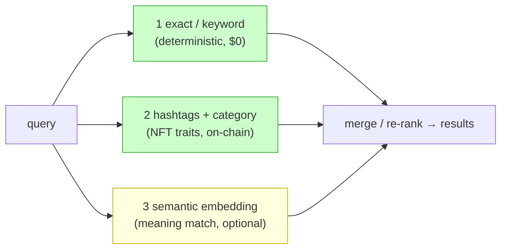
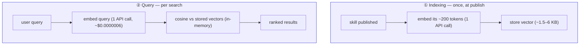
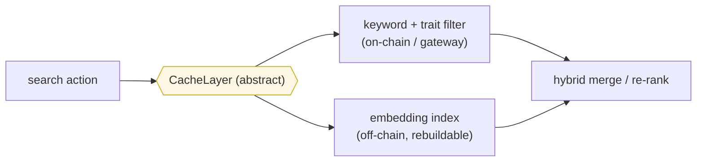

# Skill & Agent Search

> Sibling: [`00-overview.md`](00-overview.md) · [`nft-ranking-structure.md`](nft-ranking-structure.md)
> · [`actions-and-adapters.md`](actions-and-adapters.md) (`browseSkills` / `listAgents`).
> How search works: exact/keyword + hashtags/categories (as NFT traits) + an optional
> semantic layer that gives the "hotdog → 7-Eleven" leap.

---

## 0. The problem

Plain **exact / substring matching is not enough**. Searching "hotdog" should still surface
a 7-Eleven skill even though the word "hotdog" isn't in it — that's *semantic* match by
meaning. But full semantic search sounds heavy. The good news (verified, §3): for our scale
it's nearly free with **no always-on model**.

So search is **layered** — start cheap, add the semantic leap only where it matters.

This is **hybrid search** (keyword + vector), the recommended pattern — keyword keeps
precision/determinism, embeddings add the vocabulary-mismatch leap.

---

## 1. The signals — and how each maps to NFT traits

> Search signals are pushed into the NFT structure as much as possible — collection,
> category, and hashtags become **NFT traits**.

| Signal | What | Where it lives | Gives |
|---|---|---|---|
| **collection** | the umbrella ("IQ Skills") | NFT collection | grouping |
| **category** | few fixed buckets (coding / design / research / writing…) | **NFT trait** | coarse filter, big drawers |
| **hashtags** | free, multi-label (`#json-parsing` `#convenience-store`) | **NFT trait(s)** | fine filter, search signal |
| **keyword** | words in name + description | skill text (code-in) | exact / substring |
| **embedding** | vector of the skill's meaning | off-chain index (§3) | semantic leap |

Because category + hashtags are **NFT traits**, they're on-chain, permanent, and filterable
the same way the marketplace already filters NFTs (ties into
[`nft-ranking-structure.md`](nft-ranking-structure.md) — traits depend on the A/B collection
choice). `browseSkills` (in [`actions-and-adapters.md`](actions-and-adapters.md)) splits by
these traits.

### category vs hashtag — they're complementary
- **category** = a small fixed set, one big drawer per skill (also the NFT trait used for browsing).
- **hashtags** = many free labels per skill, the fine-grained search signal.
- Neither alone does "hotdog → 7-Eleven" unless someone tagged it — that gap is what the
  embedding layer (§2) fills.

---

## 2. Keyword/hashtag vs embedding — the actual difference

| | Keyword + hashtags | Embedding semantic |
|---|---|---|
| Matches | shared **words** / tags | shared **meaning** (no common words needed) |
| "hotdog" → "7-Eleven" | only if tagged | ✅ yes |
| typo / synonym / abbreviation | ✗ (unless dictionary) | ✅ tolerant |
| precision / determinism | ✅ high | 🔶 fuzzy (re-rank to fix) |
| cost | $0 | ~$0 at our scale (§3) |
| best for | "name a thing" | "describe a need" |

**Rule of thumb (by catalog size):**
- Hundreds of skills → keyword + good hashtags is plenty.
- Low thousands → ~10k → **hybrid is the sweet spot** (keyword/tags for precision,
  embedding as fallback/re-rank for intent queries).
- Embeddings start *mattering* once people search by intent and browsing breaks down.

→ **Ship keyword + hashtags(as NFT traits) first; add embedding as a hybrid fallback.**

---

## 3. How to do embedding semantic — and the cost/ops reality

> Does embedding semantic search cost more / require a model running 24/7? **No idle cost,
> no always-on model.** It's pay-per-call (pennies) + a few MB of storage. (2025–2026
> pricing; sources at bottom.)

**Two phases, neither needs a running model:**

**Cost facts (for ~10k skills ≈ 2M tokens):**
- Embed whole corpus **once**: text-embedding-3-small **$0.02/1M → ~$0.04 (4 cents)**;
  Voyage lite has a **200M-token free tier → $0**; self-hosted MiniLM/bge-small (CPU) → **$0**.
- Per search: **~$0.0000006** (a million searches ≈ $0.60).
- **Idle / always-on cost: $0** — stateless API calls, no GPU, no monthly minimum.
- Vectors are tiny: 384-dim = ~1.5 KB; 10k skills ≈ **15 MB** → just hold in memory.
- **No vector DB needed** at ≤10k–100k: brute-force in-memory cosine is sub-millisecond.
  (ANN index / vector DB only matters past ~50k–100k.)

**What to AVOID (these are the only things with idle cost):**
- ❌ Dedicated/reserved embedding instances (e.g. hourly model rental) — billed 24/7.
- ❌ Hosted vector DBs with monthly minimums (e.g. Pinecone Standard $50/mo) — unnecessary here.
- ❌ A *separate* always-on box just to host a small model — if self-hosting, embed inside
  the existing backend so marginal cost ≈ $0.

**Cheapest viable setup:**
1. Embed with `text-embedding-3-small` ($0.02/1M) **or** Voyage lite (free tier) **or**
   self-host MiniLM/bge-small on CPU ($0).
2. Store vectors as a column in the DB/cache we already have (or sqlite-vec).
3. Search = in-memory cosine scan. No vector DB.

---

## 4. Where it runs

Same `CacheLayer` abstraction as `listAgents` ([`actions-and-adapters.md`](actions-and-adapters.md) §4):
the keyword + trait filter can run on-chain/gateway reads; the embedding index is an
off-chain side index (cheap to rebuild). **Gateway or a separate backend — not decided now;**
depends on the NFT trait structure landing first.

---

## 5. Build order

1. ⬜ Keyword + substring over skill name/description (on-chain reads). $0, deterministic.
2. ⬜ **category + hashtags as NFT traits** — depends on NFT collection A/B
   ([`nft-ranking-structure.md`](nft-ranking-structure.md)) landing first.
3. ⬜ Trait filter in `browseSkills` (split by category, filter by hashtags).
4. ⬜ Embedding index (start with the cheapest: 3-small or self-host MiniLM) + in-memory
   cosine; wire as a hybrid fallback/re-rank.
5. ⬜ Same search over **agents** (match agent by the meaning of their skills).

## 6. Open decisions

- **Embedding provider** — pay-per-call API (3-small / Voyage free) vs self-host MiniLM/bge
  in the existing backend. Both have ~$0 idle; pick by deployment preference.
- **Hybrid merge** — how to combine keyword score + cosine (weighted? keyword-first then
  semantic fallback?).
- **Re-embed trigger** — only when skill text changes (cheap), or periodic.
- **Trait schema** — exact category list + hashtag rules, tied to the NFT trait design.

---

> **Sources (embedding cost/ops, 2025–2026):** OpenAI embeddings pricing (text-embedding-3-small
> $0.02/1M), Voyage AI pricing (200M free tier), Cohere pricing, Pinecone pricing (Starter
> free / Standard $50 min), sentence-transformers all-MiniLM-L6-v2 model card (CPU, 384-dim,
> ~90MB), pgvector vs Pinecone, sqlite-vec. (Per-query embedding ≈ $6e-7; 10k corpus ≈ 4¢;
> idle cost = $0 with pay-per-call.)
