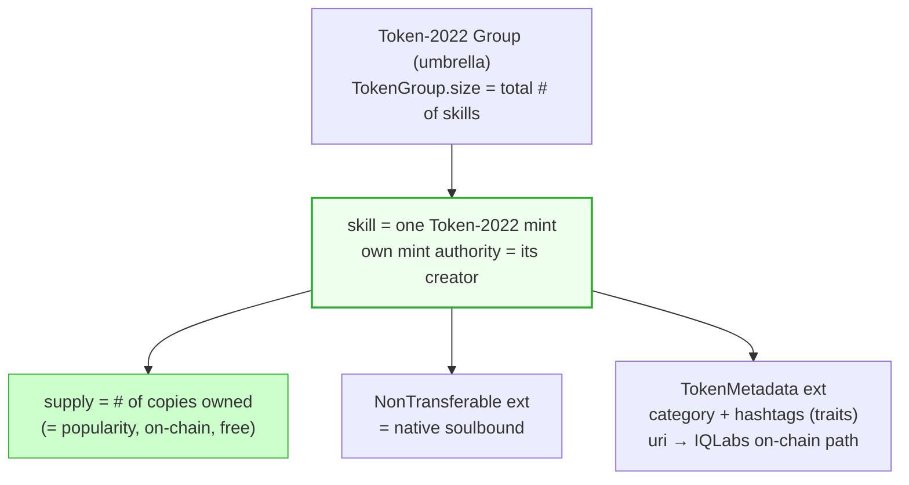
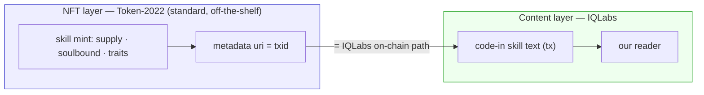
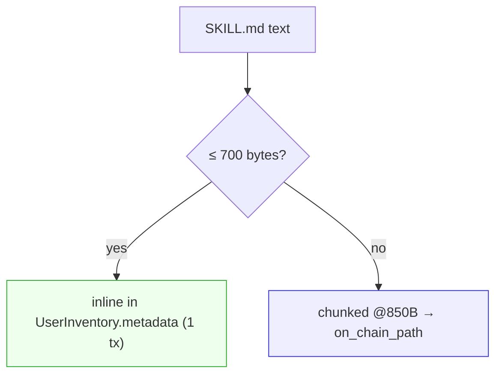
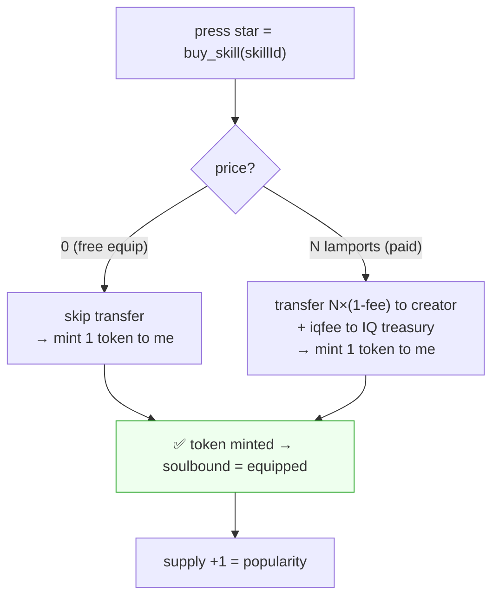
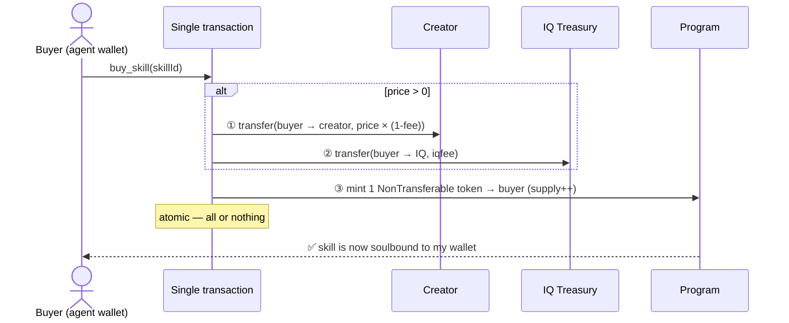

# Skill NFT Structure

> Siblings: [`offchain-session-sync.md`](offchain-session-sync.md) (sessions) ·
> [`search.md`](search.md) (traits) · [`actions-and-adapters.md`](actions-and-adapters.md).
> How a skill becomes an on-chain, soulbound, ownable, countable NFT — chosen so ranking,
> holder lists, categories, and search all fall out of it for free.
>
> 🔍 **Before coding, search OSS first:** `solana token-2022 NonTransferable mint example`,
> `token metadata extension additional_metadata`, `token group extension spl`, `IQ6900 code-in nft`.
> Read IQ6900 (code-in → uri pattern) before writing the mint helpers.

---

## 0. Why a skill is an NFT (and goes on-chain)

A skill is **owned** (soulbound), **sold**, **counted**, and **searched** — that's exactly
what an NFT gives. So:
- Skill **text** goes on-chain via code-in (it's short; size limits in §3). On-chain text =
  the asset *itself*, not a pointer at our server — ownership becomes real.
- Skill **ownership** is a soulbound token: "this ability is mine," non-transferable, proven
  by holding the token.

> **Core unification:** star, payment, and equip are not built separately — all three are
> **one soulbound purchase** (`buy_skill`); "free" is just a price-0 mint. Full flow in §4.

A good NFT model then makes everything downstream trivial — for free, from on-chain fields:
- **Popular skill** = a skill's copy count (`supply`).
- **Famous agent** = sum of `supply` across the skills that agent created.
- **Ecosystem user list** = the union of all holders.
- **Category / hashtags** = NFT traits → drive [`search.md`](search.md).

The hard requirement those imply: **one umbrella collection; each skill has a different
creator; each skill is ownable in many copies; with a per-skill on-chain count.**

---

## 1. The model: Token-2022 semi-fungible (one mint per skill)

The naive "1 NFT = 1 owner" model would make 500 owners = 500 NFT accounts (heavy). The
right model is a **semi-fungible token**: **one mint per skill, and `supply` grows as each
owner is minted one token.** `mint.supply` *is* the per-skill copy count — on-chain, free,
enforced by the token program.

Everything maps to a native Token-2022 feature — **no custom soulbound to build, no
ownership PDA** (the token *is* the ownership record):

| Requirement | Token-2022 feature | On-chain? |
|---|---|---|
| umbrella collection | `TokenGroup` (`size` = # skills) | ✅ enforced count |
| per-item different creator | each skill = own mint + own authority | ✅ |
| many copies per item | mint 1 token per owner → `supply`++ | ✅ |
| **per-skill popularity count** | **`mint.supply`** | ✅ free, enforced |
| soulbound | **`NonTransferable` extension** | ✅ native (set at mint init) |
| traits (category/hashtags) | `TokenMetadata` `additional_metadata` | ✅ on-chain |
| all holders / user list | DAS `getTokenAccounts` per mint | indexer-fronted |

Two caveats to design around:
- **Burn drift:** `NonTransferable` blocks transfer but **not burn**, so `supply` =
  issued-not-burned. For a *live* holder list read DAS, don't trust `supply` as immutable.
- **No nested groups:** a mint being both a group and a member is undocumented — don't rely
  on it. Per-skill counts come from each mint's `supply`, not a sub-group `size`.

---

## 2. NFT layer ⟂ IQLabs are separate (the key rule)

**IQLabs does not need to support Token-2022.** The two layers are independent and meet at
one field — the mint's `uri`:

**Division of labor:**
- **NFT (Token-2022) does everything NFT-shaped** — ownership, supply/popularity, soulbound,
  traits, holder list. The NFT carries only a **txid** (the on-chain path), nothing else.
- **code-in / inscription is for text data only** — skill text here; profiles, notes,
  audit elsewhere. Not for ownership or counting (the NFT already does that for free).

So we mint NFTs with Token-2022 ourselves (a sibling concern) and put the IQLabs code-in
path in the `uri`. **No IQLabs/Token-2022 coupling, no contract changes**, and we never
rebuild on-chain what the token standard already gives us.

This is exactly IQ6900's pattern (NFT `uri` = code-in tx hash), swapping its mpl-core shell
for a Token-2022 semi-fungible mint.

> **No skills registry table.** The NFT collection *is* the skill list: "which skills exist"
> = enumerate the collection (DAS); "how popular" = each mint's `supply`; "by whom" = the
> creator; "category/tags" = traits. ⚠️ Don't re-introduce a `skills:all` IQLabs table — it
> would duplicate the NFT.

---

## 3. On-chain skill text — code-in limits (real numbers)

From `iqlabs-solana-sdk/src/sdk/constants.ts` and the contract:
- `DIRECT_METADATA_MAX_BYTES = 700` → skill JSON ≤ ~700B is stored **inline** in one tx.
- Larger → chunked at `CHUNK_SIZE = 850`; `on_chain_path` points to the chunk-chain tx.
- A `SKILL.md` (frontmatter + a paragraph of instructions) is usually **well under 700B**,
  so most skills are a single inline write. Long ones chunk — no off-chain needed.

The mint's `uri` holds this txid. (Reference: IQ6900's retrieval API
`GET /get_transaction_info/:tx_hash` returns the on-chain content for a code-in tx.)

---

## 4. Purchase flow = star = payment = equip (all unified)

We don't build star, payment, free-like, and equip separately — it's all one `buy_skill`.
The only difference is whether the price is 0 or positive. One atomic tx:

Atomic payment sequence (paid case):

What this unification gives for free:
- **No separate payment / star / tip system** — price 0 or N, same `buy_skill`; free star = price-0.
- **iqfee = IQ revenue** — a paid purchase auto-routes a portion to the treasury.
- **Popularity for free** — `supply` = number of owners; a native token field, no counter.

---

## 5. Alternatives (heavier — why not)

Kept for the record; the semi-fungible model wins on every axis we need.

| Option | Per-item on-chain count | Soulbound | Why not |
|---|---|---|---|
| **mpl-core + Edition plugins** | ❌ `maxSupply` informational, not a counter | build (freeze) | no real count |
| **mpl-token-metadata Master/Print** | ✅ `MasterEdition.supply` enforced | build (freeze/pNFT) | **500 copies = 500 print mints** (heavy); bolt-on soulbound |
| **Compressed NFTs (Bubblegum)** | ❌ count leaves via DAS | build | full DAS dependence; only if each copy must be a distinct traited NFT at huge scale |
| **mpl-404 / hybrid, LibrePlex** | n/a | ❌ (404 is tradeable) | anti-soulbound / no unique advantage |

The only comparable native counter is mpl-token-metadata's `supply`, but it forces a
separate mint+account per copy. Token-2022 gives the same counter with **one mint per skill**
+ native soulbound + on-chain traits.

> **Optional premium tier:** a *resellable* premium skill could use a full mpl-core/IQ6900
> NFT (transferable, marketplace) instead of the soulbound semi-fungible. Same code-in core;
> keep it a separate type, don't blur the soulbound default with a flag.

---

## 6. Ranking & holders (off-chain aggregation)

On-chain gives the raw counters; ranking is a cheap off-chain read (the `CacheLayer` from
[`actions-and-adapters.md`](actions-and-adapters.md) §4; detail in [`search.md`](search.md)):
- **per-skill popularity** = `mint.supply` (read directly).
- **famous agent** = sum of `supply` over that creator's skill mints (DAS aggregate).
- **user list** = union of holders across mints (DAS `getTokenAccounts`).

How this connects: owned skills (soulbound tokens) = the agent's capability list on its
profile; sessions (off-chain) = its memory ([`offchain-session-sync.md`](offchain-session-sync.md)).
Together: **wallet = abilities (on-chain) + memory (off-chain), portable across runtimes.**

---

## 7. Build order

1. ⬜ Publish: code-in the skill text → mint a Token-2022 skill into the collection
   (`uri` = code-in txid, `NonTransferable`, `TokenMetadata` traits). No registry table.
2. ⬜ `buy_skill` instruction — star + payment + free-equip in one atomic tx (price 0 → skip
   transfer; >0 → creator + iqfee; always mint 1 token, `supply`++).
3. ⬜ Ranking/holders off-chain (§6) via the `CacheLayer`.
4. ⬜ (optional) premium resellable tier (§5).

## 8. Open decisions

- **Token-2022 extension set** — confirm per mint: `NonTransferable` + `TokenMetadata` +
  `GroupMemberPointer`/`TokenGroupMember`; umbrella `TokenGroup`.
- **Trait schema** — exact category list + hashtag rules (feeds [`search.md`](search.md)).
- **Price model** — creator sets per-skill price (0 = free); fixed vs free-set.
- **iqfee split** — IQ treasury share % on a paid purchase; whether free mints pay a minimal fee.
- **Popularity formula + sybil** — total `supply` vs paid-only weighting; defend against
  free-mint bots (make free mints cost something).
- **Famous-agent score** — supply sum vs followers vs cumulative revenue.
- **Inline vs chunk threshold** — enforce ≤700B for 1-tx simplicity vs allow long.
- **skillId scheme** — the vision's `iq://category/name@creator.sol` convention.

---

> **Sources:** Token-2022 extensions (NonTransferable, TokenMetadata, Token Groups
> `size`/`max_size`) — solana.com/docs/tokens/extensions; mpl-token-metadata Print
> (`supply`/`max_supply`) — developers.metaplex.com/token-metadata/print; mpl-core Editions
> (informational only); Bubblegum/state compression; DAS `getTokenAccounts` (holders);
> IQ6900 (code-in + NFT uri pattern).
