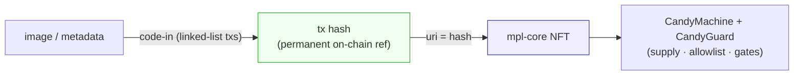
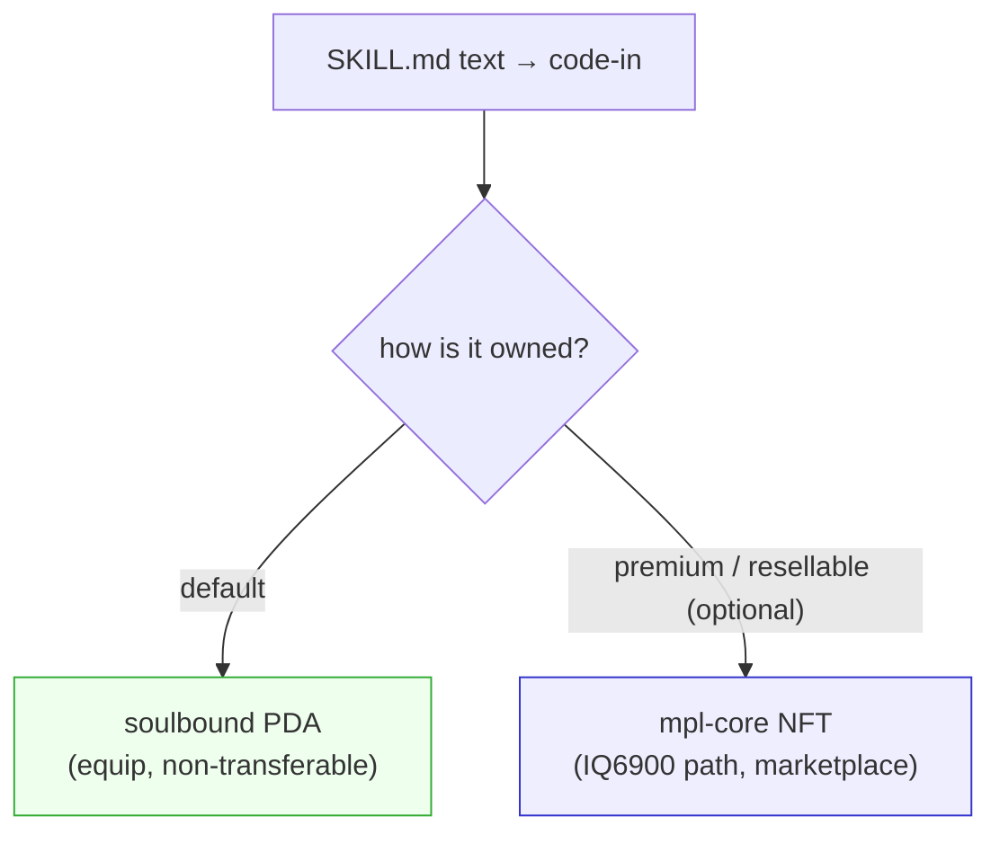
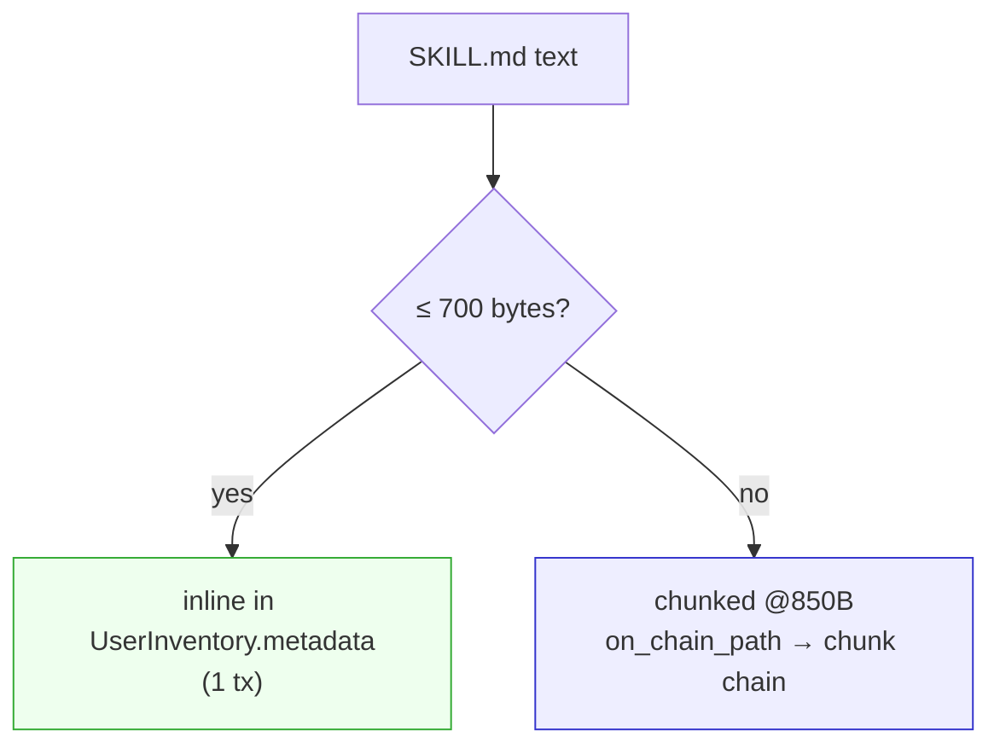
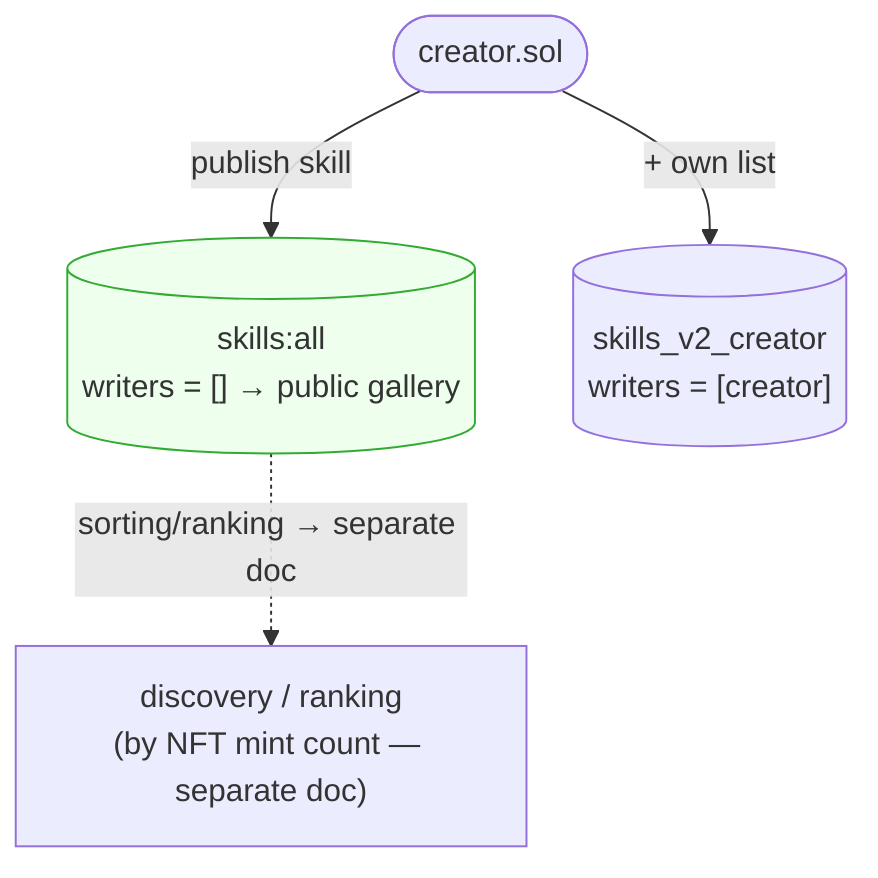
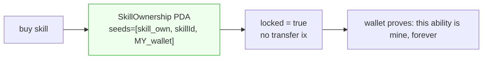
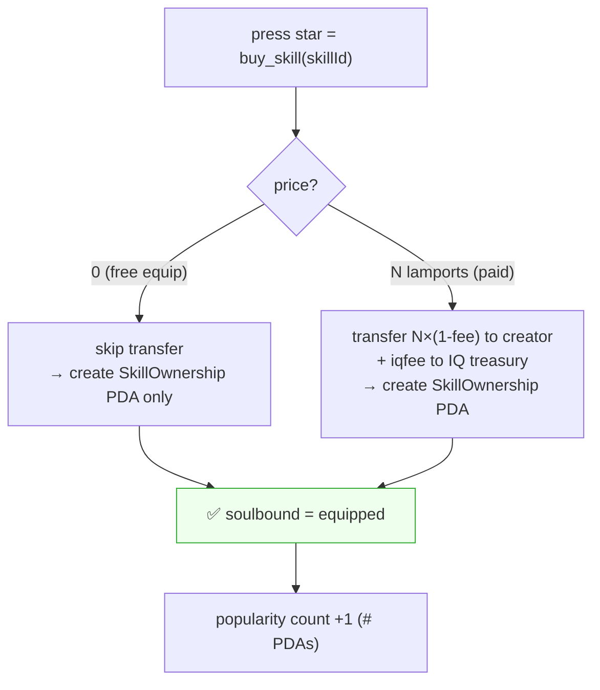
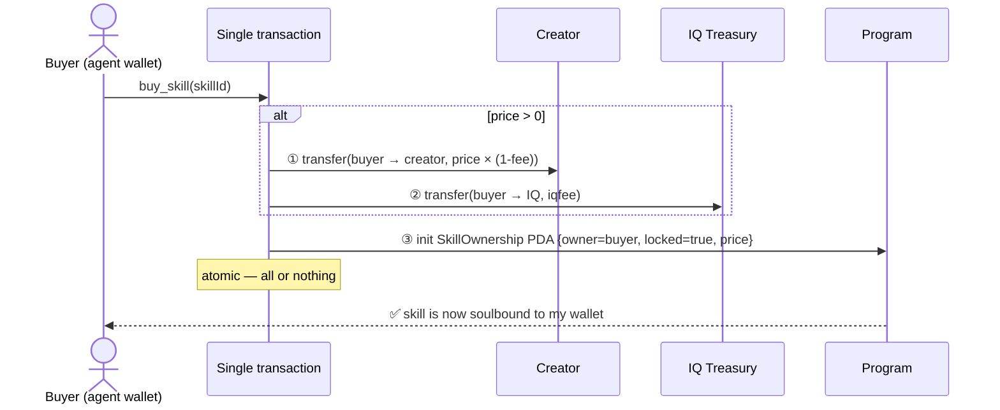
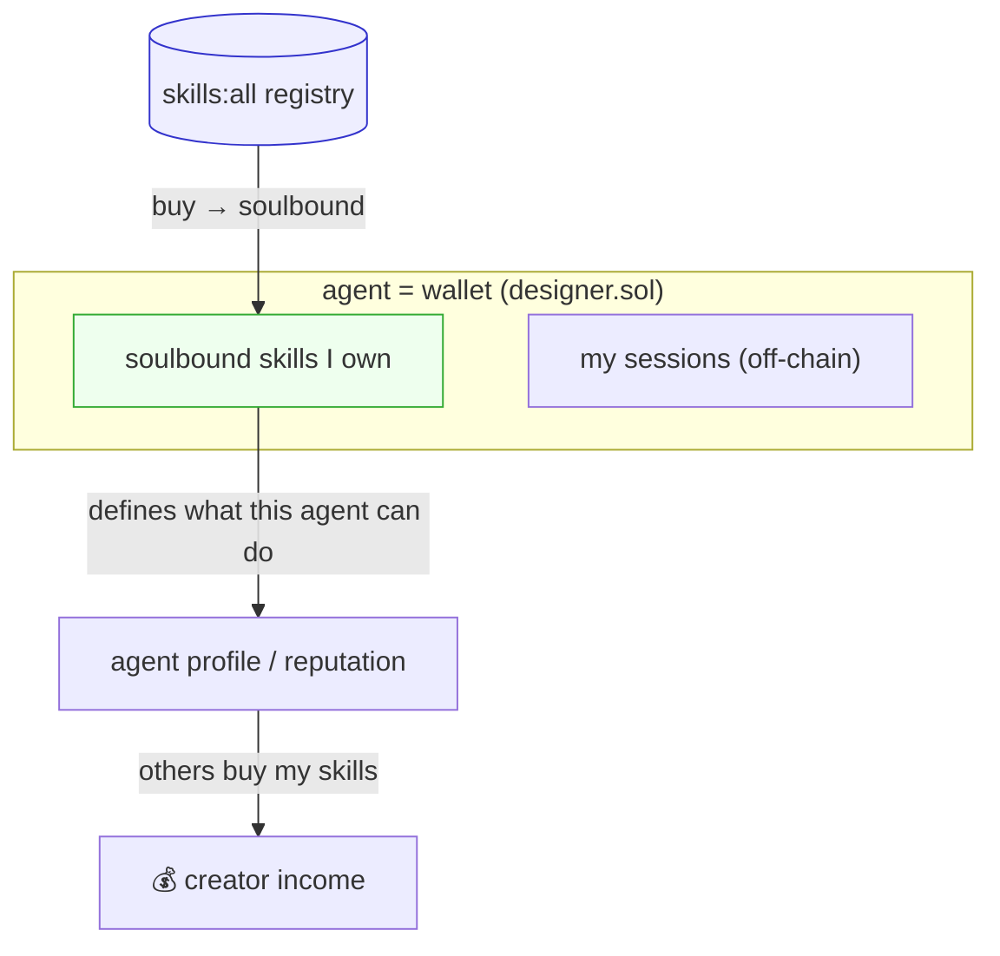

# Skills Soulbound NFT Structure

> Sibling of [`offchain-session-sync.md`](offchain-session-sync.md). This doc covers the
> **other half**: skills live **on-chain** as text, and are owned/sold as **soulbound**
> tokens bound to an agent's wallet. Verified against `IQLabsContract`,
> `iqlabs-solana-sdk`, `iqlabs-git-sdk`.
>
> 📄 **Popular-skill / famous-agent ranking (= ranking by NFT mint count) goes in a
> separate doc.** This doc only covers "how a skill gets on-chain and is owned as
> soulbound." Count aggregation, sorting, and sybil prevention are split out to the next doc.

---

## 0. Why skills go fully on-chain

(For the overall off-chain/on-chain split, see [`00-overview.md`](00-overview.md) §1.)
Skill text goes **fully on-chain** — not a pointer — because:
- Short — fits on-chain cheaply (size limits below).
- It's an **asset**. If the text lived off-chain, a "skill NFT" would point at our server —
  meaningless. On-chain text = the asset *itself* is the chain entry. Ownership becomes real.
- Owned/sold as **soulbound** = "this ability is mine," non-transferable, proven by wallet.

> **Core unification:** star, payment, and equip are not built separately — all three
> are **one soulbound purchase** (`buy_skill`); "free" is just a price-0 mint. Full flow in §5.

---

## 1. What already exists vs. what we build (verified)

| Piece | Status | Where |
|---|---|---|
| Store skill text on-chain (≤700B inline, more via chunks) | ✅ exists | `codeIn`, `UserInventory.metadata` |
| Public registry `skills:all` (empty writers = anyone) | ✅ clone git-sdk | `git_repos:all` pattern |
| Per-creator `skills_v2_<owner>` (writers=[owner]) | ✅ clone git-sdk | `repoListHint` pattern |
| Atomic **write + SOL transfer in one tx** | ✅ exists | `db_code_in` does `system_program::transfer` then write |
| NFT **collection gate** (gate writes by owning an NFT) | ✅ exists | `GateConfig` / `verify_collection` |
| NFT **minting** | ✅ proven elsewhere — **IQ6900 NFT** mints with `mpl-core` + CandyMachine, image/metadata via code-in | see §1b |
| **Soulbound / non-transferable ownership** | ❌ **build** (thin) | new `SkillOwnership` PDA + `buy_skill` ix |

**Takeaway:** soulbound skill ownership is a **thin wrapper** — one new PDA + one
instruction — on top of primitives that all exist. Not a big new chain.

---

## 1b. Reference: how IQ6900 NFT does fully on-chain NFTs

IQ6900 already shipped a fully on-chain NFT collection — worth studying because it proves
the minting path exists and clarifies *what we don't need*.

How IQ6900 works:
1. **code-in the asset** → image + metadata written into Solana **instruction data**,
   chained as a linked list (`tailTx` / `beforeTx`, with `method` / `decodeBreak` marking
   chunk boundaries). Large assets chain across many txs. The first tx hash is the ref.
2. **Wrap in a standard NFT** → `mpl-core` + `mpl-core-candy-machine`. The NFT's `uri`
   (and `image`) field holds the **code-in tx hash** instead of an HTTP URL.
3. **CandyMachine + CandyGuard** → preload supply (`addConfigLines`), gate minting
   (`allowList`, `startDate`/`endDate`, `mintLimit`, `tokenGate`).



**What this means for skills — we don't need the full NFT shell.** IQ6900's mpl-core
wrapper exists because *art must trade on NFT marketplaces*. A skill is text + an ability,
not art. So:

| | IQ6900 NFT | AgentNet skill |
|---|---|---|
| content | image + metadata (large) | `SKILL.md` text (short) |
| on-chain storage | code-in linked-list (many txs) | usually **1 inline tx** (≤700B) |
| ownership shell | `mpl-core` NFT (transferable) | **soulbound PDA** (bound = "my ability") |
| why that shape | art must resell on marketplaces | abilities are *equipped*, not flipped |

So the **default skill = code-in text + soulbound PDA** — no CandyMachine needed.
A **full mpl-core NFT is optional**: only for a *resellable premium skill* meant to live
on NFT marketplaces. Then we reuse IQ6900's exact path (code-in the skill text → hash into
`uri` → mint via CandyMachine). Two product tiers, one shared code-in core.



> Reference: IQ6900 NFT (mpl-core + mpl-core-candy-machine + code-in). Retrieval API:
> `GET /get_transaction_info/:tx_hash` → returns the on-chain image string + metadata JSON.

---

## 2. On-chain skill storage — the limits (real numbers)

From `iqlabs-solana-sdk/src/sdk/constants.ts` and the contract:

- `DIRECT_METADATA_MAX_BYTES = 700` → skill JSON ≤ ~700B is stored **inline** in one tx.
- Larger → chunked at `CHUNK_SIZE = 850`, with `on_chain_path` pointing to the chunk-chain tx.
- A `SKILL.md` (frontmatter + a paragraph of instructions) is usually **well under 700B**,
  so most skills are a single inline write. Long ones just chunk — no off-chain needed.



---

## 3. Registry — clone the git-sdk pattern as-is

`skills:all` is a public gallery anyone can publish to; `skills_v2_<owner>` is the
creator's own list. The "empty writers ⇒ public" rule is enforced in the contract:

```rust
// IQLabsContract …/helpers.rs  — require_writer_auth_if_set
if table.writers.is_empty() { return Ok(()); }   // empty ⇒ anyone can write
```



> The publish registry only holds "which skills exist." **"How popular" (sorting/ranking)
> is by NFT mint count (= number of `SkillOwnership` PDAs), and that aggregation/sorting/
> sybil design lives in a separate doc.**

Registry columns (cloned + extended):
`["skillId", "owner", "name", "description", "skillRef", "priceLamports", "soulbound", "timestamp"]`
— `skillRef` = inline text or `on_chain_path`; skills bound on purchase carry `soulbound: true`.

---

## 4. Soulbound ownership — the one new thing

No native soulbound exists, so we add a small ownership record the **program** controls
(users can never reassign it):

```rust
// NEW — the only real addition
#[account]
pub struct SkillOwnership {
    pub skill_id: String,   // which skill
    pub owner:    Pubkey,   // bound to this wallet
    pub acquired_at: i64,
    pub price_paid: u64,    // 0 = free equip, >0 = paid (ranking signal)
    pub locked:   bool,     // true = soulbound, non-transferable
}
// PDA seeds: ["skill_own", skill_id, owner] — deterministic, one per (skill, owner)
```

- Derived per `(skill_id, owner)` ⇒ can't move to another wallet.
- Only the program can write it ⇒ there is no user-side transfer instruction ⇒ soulbound.
- "Equip as my own ability" (the vision's *star*) = this record exists under my wallet.



---

## 5. Purchase flow = star = payment = equip (all unified)

**Core: we don't build star, payment, free-like, and equip separately.** It's all one
`buy_skill`. The only difference is whether the price is 0 or positive. The contract
already does "transfer SOL then write" in one instruction (`db_code_in`), so we assemble
it the same way — one tx, atomic.



Atomic payment sequence (paid case):



**What this unification gives for free:**
- **No separate payment system** — price 0 or N, same `buy_skill`.
- **No separate star/tip system** — star = purchase. Free star = price-0 purchase.
- **iqfee = IQ revenue** — on a paid purchase, a portion auto-routes to the treasury.
- **The foundation for popularity sorting comes for free** — a skill's `SkillOwnership`
  PDA count (= NFT mint count) = number of owners. No separate counter table; it's already
  on-chain data.

> 📄 **How to aggregate/sort these PDA counts and prevent sybil (free bot mints)** — i.e.
> the popular-skill / famous-agent ranking design — lives in a **separate doc**. This doc
> stops at "mint counts accumulate on-chain."

---

## 6. How this connects to the rest



- Skills owned (soulbound) = the agent's capability list, shown on its profile.
- Sessions (off-chain, encrypted) = the agent's memory — the
  [`offchain-session-sync.md`](offchain-session-sync.md) half.
- Together: **wallet = an agent with abilities (on-chain) + memory (off-chain), portable
  across any runtime.**

---

## 7. Build order (after the session-sync PoC)

1. ⬜ Clone the git-sdk registry → `skills:all` + `skills_v2_<owner>`, publish/fetch skill text on-chain.
2. ⬜ Add `SkillOwnership` PDA + `buy_skill` instruction — **this one thing is star,
   payment, and free-equip all at once** (price 0 → skip transfer, >0 → creator+iqfee
   transfer, always create the PDA).
3. ⬜ (later) gate premium-skill collections with the existing `GateConfig`.
4. 📄 Popular-skill / famous-agent **sorting/ranking** (by NFT mint count) → **separate doc**.

## 8. Open decisions

- **Soulbound vs resellable** — two clean tiers (see §1b): *default* = code-in + soulbound
  PDA (equip, non-transferable); *premium/optional* = full mpl-core NFT via IQ6900's path
  (resellable on marketplaces). Shared code-in core. Don't blur them into one flag.
- **Price model** — creator sets a per-skill price (0 = free equip allowed). Fixed vs free-set.
- **iqfee split** — IQ treasury share % on a paid purchase (creator keeps the rest). Whether
  free mints pay a minimal fee.
- **Inline vs chunk threshold** — enforce skills ≤700B for 1-tx simplicity vs allow long?
- **skillId scheme** — the vision's `iq://category/name@creator.sol` address convention.

> 📄 **Sorting/ranking/sybil (preventing free bot mints) design lives in the separate
> ranking doc, not here** (NFT mint-count aggregation, paid/total mint weighting, making
> bots costly, etc.).
