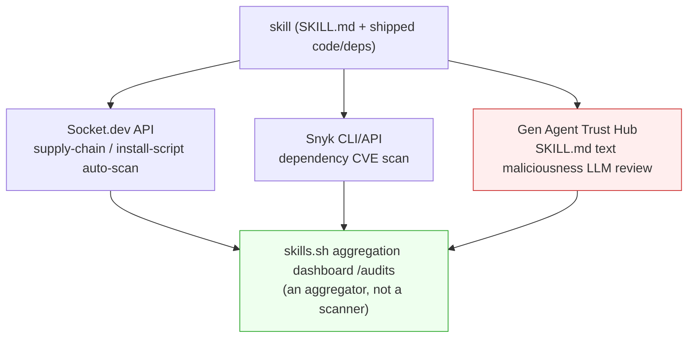
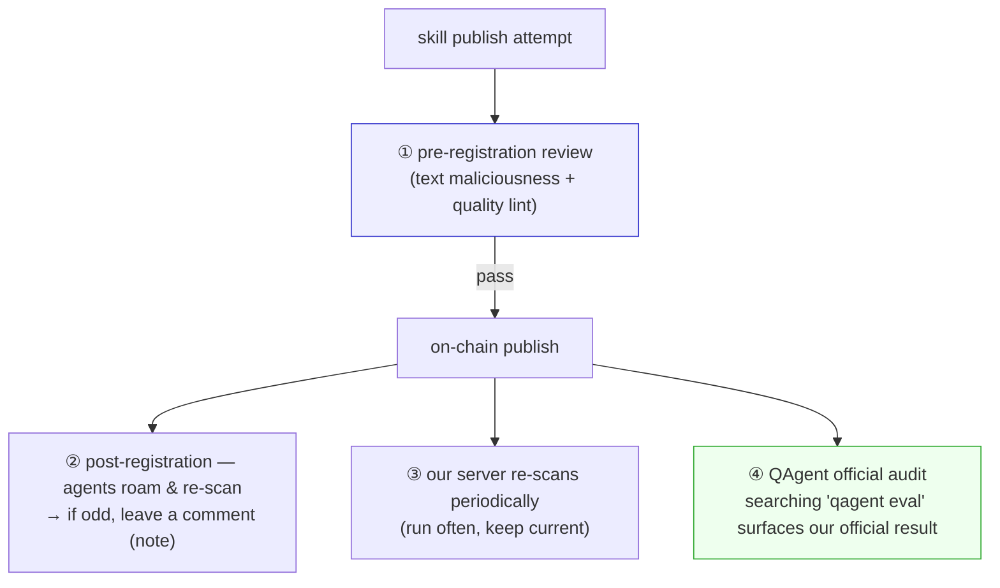
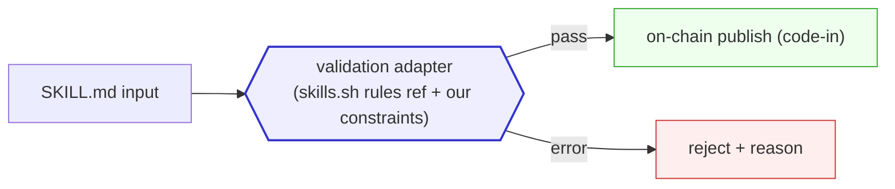

# Skill Validation Adapter — 🚧 Plan

> Sibling: [`skill-nft-structure.md`](skill-nft-structure.md).
> Plan to build a **validation adapter** modeled on skills.sh's skill validation, gating
> skills before they go on-chain.

---

## 0. What skills.sh "validation" is

> Source: `github.com/vercel-labs/skills` repo + skills.sh docs.

skills.sh has **no official validation product**:
- The released CLI only enforces "`name` + `description` present and string" (`parseSkillMd()`
  silently skips otherwise). No formal validate command.
- A `skills validate` / `lint` command exists **only in an unmerged PR (#509)**, not on main.
- No hosted validation API, not importable as a package, no JSON schema file.

So there's nothing to fetch and reuse. **PR #509 is a reference template** — we copy its
logic into our own adapter (reference, not dependency).

This is **quality lint** (name/description/length). The more important piece is skills.sh's
**security-audit page** (`/audits`) — §0b.

---

## 0b. skills.sh `/audits` — security audit (⚠️ all guesswork)

> ⚠️ **The below is a guess.** The `skills.sh/audits` page has no methodology docs, so this
> is reverse-engineered from the nature of the three tools. Not confirmed.

`skills.sh/audits` is **separate** from quality lint — it's a **dashboard aggregating the
results of three external security tools.** Page text: *"Combined security audit results
from Gen Agent Trust Hub, Socket, and Snyk."* One row per skill, e.g.
`azure-validate → Safe | 0 alerts | Critical`.

| Column | Tool | What it checks | Result form |
|---|---|---|---|
| **Gen** | Gen Agent Trust Hub | **maliciousness of SKILL.md text** (prompt injection, harmful instructions) — guessed LLM-based | `Safe` / `High Risk` |
| **Socket** | Socket.dev | supply chain / install scripts / network (code shipped with the skill) | `0 alerts` etc. |
| **Snyk** | Snyk | dependency CVE vulnerabilities | `Low/Med/High/Critical` |

**Guessed pipeline:**



**Takeaways:**
- skills.sh itself is an **aggregator, not a scanner** — it collects three vendors' results.
- As in `Safe | 0 alerts | Critical`, the **three tools look at different layers** (text /
  supply chain / CVE). One tool isn't enough.
- **Our skills are mostly text (≤700B), little to no code/deps** → more than Socket/Snyk,
  **"text-maliciousness review" (Gen-style) is our #1.** It must be filtered before being
  permanently written on-chain.

---

## 0c. Our scanning — when & by whom (zo's idea)

Run scans not **once** but at multiple times and by multiple actors:



- **① Pre-registration review** — gate before going on-chain. Reject publish on malicious
  instructions. (this doc §1–3)
- **② Post-registration agent roaming** — agents roam and re-scan skills → on a problem,
  leave a **note** (links to [`notes.md`](notes.md)).
  Distributed watch.
- **③ Server periodic scan** — we re-scan often on the server to keep safety status current
  (dependency CVEs appear over time, so a one-time scan isn't enough).
- **④ QAgent official audit** — searching something like "qagent eval" surfaces **our
  official audit result** — our official audit view, corresponding to skills.sh's `/audits`.

> So scanning is not *one pre-publish pass* but an ongoing process: **before (gate) + after
> (roam / periodic / official).** Results surface via two routes — notes (②) and the
> official view (④).

---

## 1. What we build — the validation adapter

A gate that a skill must pass **before** going on-chain (§ skill-soulbound). We reference
skills.sh PR rules and add **our constraints** (on-chain ≤700B, etc.).



Why an "adapter": so the rule set is **swappable** — skills.sh-compat mode (name+desc only),
strict mode (PR #509 rules), our on-chain mode (with size limits).

---

## 2. Validation rules — reference + ours

**skills.sh current (de-facto) — minimal compat:**
- `name` required, string
- `description` required, string

**PR #509 reference — quality (worth copying):**
- `name`: 1–64 chars, kebab-case recommended (`^[a-z0-9][a-z0-9._-]*[a-z0-9]$`)
- `description`: < 20 chars = error, > 500 chars = warning
- `author` / `license`(SPDX) / `repository`(URL) / `keywords` / `agents` = optional, warn/info
- body < 50 chars = info

**Ours (on-chain constraints):**
- **Size**: ≤700B recommended to fit an inline 1tx (else chunk — `skill-nft-structure.md` §2)
- **skillId convention**: validate `iq://category/name@creator.sol` form (open decision)
- **Terminal-escape sanitize**: reference skills.sh `sanitize.ts` (display safety, CWE-150)

**Security layer (borrowed from skills.sh /audits — more important for us):**
- **Text maliciousness** (Gen-style, guess §0b): **LLM review** of whether the SKILL.md
  carries prompt injection / harmful instructions (file deletion, data exfiltration, external
  sending). Text is our main payload, so **#1.**
- (optional) **Supply chain / CVE** (Socket/Snyk-style): only connect external tools when the
  skill ships code/deps.

| Layer | Rule source | Enforce |
|---|---|---|
| Minimal compat | skills.sh current | name+desc |
| Quality | PR #509 (copy) | length, kebab, SPDX, etc. |
| On-chain | ours | ≤700B, skillId convention |
| **Security (text maliciousness)** | borrowed from skills.sh /audits (LLM) | **reject harmful instructions — #1** |
| Security (supply chain / CVE) | Socket/Snyk-style (optional) | only when code is shipped |

---

## 3. Adapter interface (sketch)

```ts
interface ValidationAdapter {
  readonly id: string;                  // "skills-sh-compat" | "strict" | "onchain"
  validate(skillMd: string): ValidationResult;
}

interface ValidationResult {
  ok: boolean;
  errors: Issue[];     // blocks passing
  warnings: Issue[];   // passes but warns
}
// Issue = { field: string, severity: "error"|"warning"|"info", message: string }
```

- Default `onchain` adapter = skills.sh minimal + PR #509 quality + our size limit.
- The publish flow calls code-in only after `validate()` passes.

---

## 4. TODO

- [ ] **Reference-copy** PR #509 `src/validate.ts` `validateFrontmatter`/`isValidSPDX`
      (unmerged → no dependency, copy into our code).
- [ ] Reference `frontmatter.ts` (YAML-only parser, avoids eval-RCE) / `sanitize.ts` patterns.
- [ ] Add our on-chain constraint rules (≤700B, skillId convention).
- [ ] **Text-maliciousness LLM review adapter** (Gen-style) — #1 security check.
- [ ] (optional) Socket/Snyk-style external-tool adapter — for skills that ship code.
- [ ] Adapters: `skills-sh-compat` / `strict` / `onchain` / **`security-llm`**.
- [ ] Wire the validation gate into the publish pipeline (between steps in
      `skill-nft-structure.md` §7 build order).
- [ ] **Implement the 4 scan times** (§0c): pre-registration gate / agent roaming → note
      comment / server periodic / QAgent official view.
- [ ] **QAgent official audit view** — searching "qagent eval" surfaces our official audit
      result (corresponds to skills.sh /audits).
- [ ] (open) Whether to auto-validate/convert when **importing** skills.sh skills into ours.

---

## 5. Open decisions

- **Validation location** — client (pre-publish local) vs gateway (post-publish display gating)
  vs both.
- **On-chain enforcement** — contract rejects (pricey) vs gateway just hides (cheap, preferred).
- **PR #509 tracking** — sync rules if it merges.
- **Text-maliciousness review model** — which model, cost/false-positive policy. (Gen Agent
  Trust Hub guess §0b)
- **QAgent official-audit trust** — record our official audit results on-chain (tamper-proof)
  vs server view only. How to establish QAgent's authority as the auditor.
- **Agent-roaming scan incentive** — why would an agent scan others' skills and leave a
  note (reward? iqfee rebate?).
- **Server periodic-scan cadence** — CVEs appear over time. Re-scan interval / triggers.
