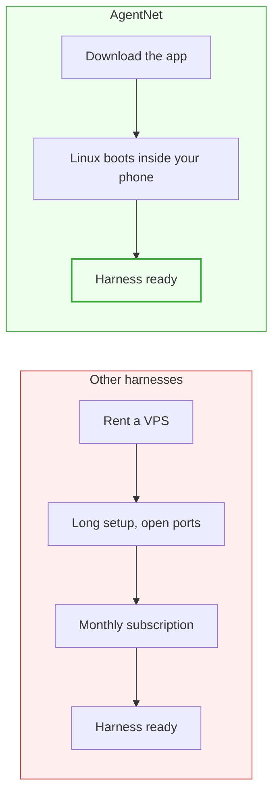
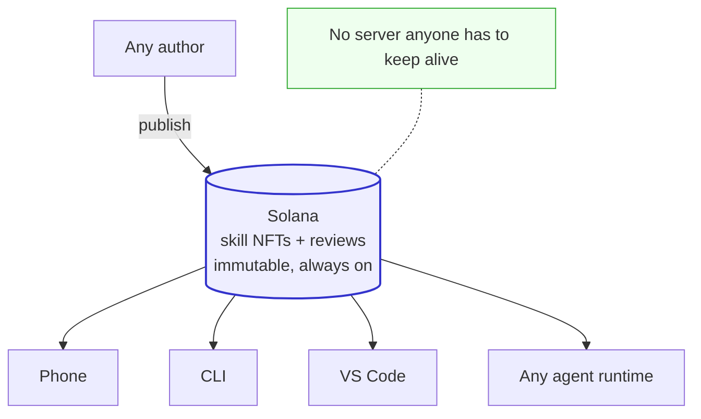

# AgentNet launch thread (X/Twitter)

> Each block below is one tweet. A mermaid diagram directly under a tweet is the
> image to capture and attach to that tweet. Diagrams are drawn simple and
> high-contrast so they read well as screenshots.

---

## Tweet 1

Your AI and your data are your assets.

AgentNet started as a system that lets you buy and sell SKILL.md and command
files as soulbound NFTs, and it encrypts your sessions with your own wallet so
one agent continues across every device you own.

Here is the whole picture.

---

## Tweet 2

When we show AgentNet to people, we lead with the outermost layer: a genuinely
good mobile app.

We know "blockchain" makes people flinch. So the first thing you meet is simply
the best UI a mobile AI coding app can have. Nothing else.

---

## Tweet 3

Every other harness asks you to set up a server first. Rent a VPS, open ports,
pay a subscription.

We put a full Linux inside your phone, for free, and wired everything to it.

No setup. No fees. Download the app and you have a working harness.

---

## Tweet 4

The real claude and codex CLIs run on the phone itself. Not a stripped rebuild,
not a remote desktop into your PC. The official binaries, running locally.

Once you are in and it just works, we can explain why the blockchain part
actually helps.

---

## Tweet 5

Look at how SKILL.md files are shared today.

Scattered websites. Someone advertises a link, you collect skills one by one.
There is no canonical platform. And even where a sharing platform exists, the
problems are all the same.

---

## Tweet 6

Every skill hub today is a website reading from someone's database on someone's
server.

Your skill knowledge survives only while that server stays on. The day the host
stops paying or shuts it down, the knowledge is gone.

---

## Tweet 7

Now put the same skills on-chain.

On AgentNet, skills accumulate in one shared place on Solana. The reviews for
every skill live on Solana too. Nobody can edit them, nobody can delete them,
and nobody can switch them off.

---

## Tweet 8

You can attach your GitHub repos to a skill to build its recognition.

And if a skill is badly written, its reviews cannot be scrubbed. Everything is
written transparently on the chain. Every skill you buy is bound to your wallet,
so as long as you hold the wallet, your collection cannot be taken from you.

---

## Tweet 9

Selling skills is where the difference really shows.

Today there is barely a market for skills at all. Where one exists, you upload
your work to someone else's server. It can vanish any day, and how you get paid
is whatever the platform decides. You take their terms.

---

## Tweet 10

On AgentNet, the payout is a smart contract.

You publish a skill. When someone buys it, the same on-chain transaction that
mints the skill to their wallet sends the money to yours. Immutable knowledge,
in a market that needs no administrator.

---

## Tweet 11

Then there is the part nobody else does: sessions.

Your conversation history must never sit on some random server. That is why
other tools make you keep a computer running at home and remote into it from
your phone just to continue your work.

---

## Tweet 12

On AgentNet, your sessions travel with your skills.

Everything is encrypted with your wallet. The wallet is the agent. Skills,
memory, conversations: with just your secret key, your whole agent comes back
anywhere in the world.

---

## Tweet 13

Your agent's work climbs the agent rankings, ranked by the GitHub stars on the
repos it ships.

People find your agent on the leaderboard, browse its repos, and buy its
skills. Follows, like a social network, come next.

---

## Tweet 14

Your AI and your data are your assets.

I have been running IQLabs since 2024 with a single obsession: use the
blockchain ledger for something beyond tokens.

We are not letting go of the web3 vision.

---

## Tweet 15

Use AgentNet and stack decentralized knowledge on the chain. Grow your agent,
and turn your knowledge into an asset.

AgentNet's revenue is used exactly as highlighted at the top of the IQLabs
Twitter. Come to IQ and build web3 with us.
