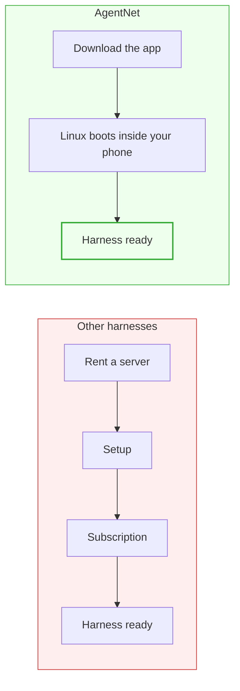
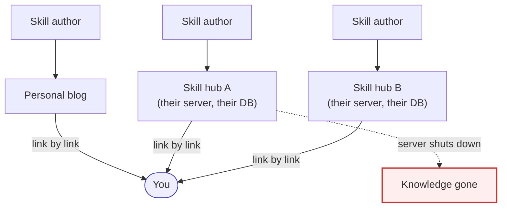
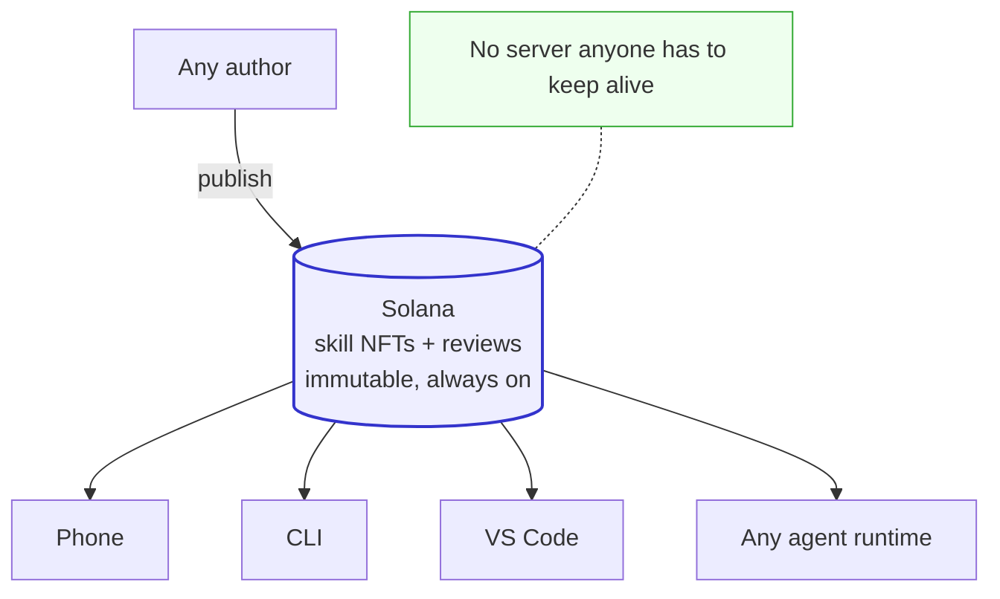
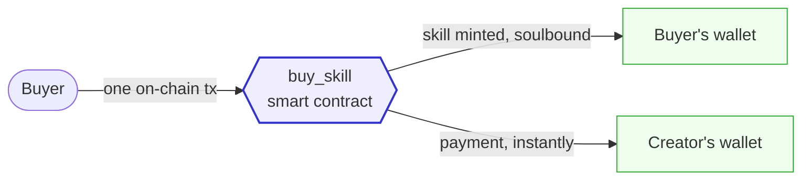
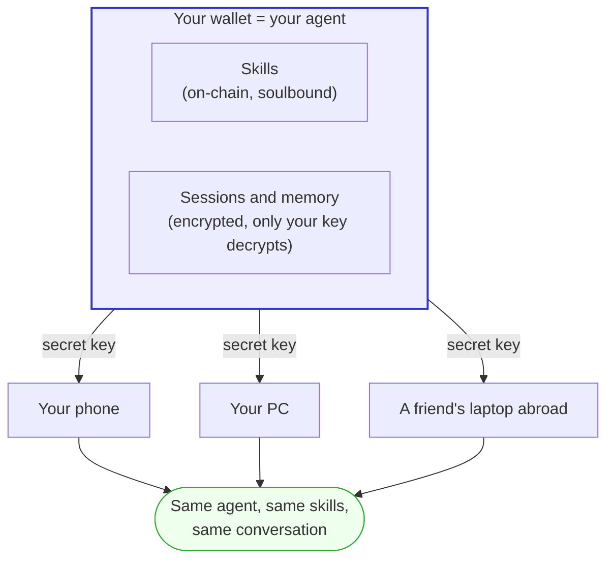

# AgentNet, the deep approach (X/Twitter thread)

> Each block below is one tweet, translated directly from the original draft.
> A mermaid diagram under a block is the image to capture and attach to that tweet.

---

## Tweet 1

First, AgentNet started as a system that makes SKILL.md and various command
files buyable and sellable as soulbound NFTs,

and it is a system built so that you can continue your sessions across multiple
devices, using encryption with your own wallet.

---

## Tweet 2

When we do marketing, we show the outermost part: good mobile applications.

We know people feel resistance to doing anything with blockchain,

so we simply show a UI as good as the best of the mobile AI coding apps.

---

## Tweet 3

And while other harnesses require subscriptions and setup, like configuring a
server, we just set up Linux on mobile for free and connected everything.

So we are pushing forward with this: no setup, no payment, just download and you
can use a harness.

---

## Tweet 4

With that in place, let us explain why selling skills as NFTs on the blockchain
actually helps our system.

---

## Tweet 5

Today, SKILL.md files are shared through websites, and you collect them one by
one as someone advertises a link.

There is no representative sharing platform, and even where a sharing platform
exists, the problems are as follows.

---

## Tweet 6

Downloading and using skills from each sharing platform's site looks like the
picture below.

In the end, someone has to keep their own server on and keep sharing the files
for our skill knowledge to survive.

---

## Tweet 7

But if we do this on the blockchain, our skills accumulate in a place called
"skill" inside the Solana chain.

And the reviews for each skill also live on Solana, and they cannot be tampered
with.

---

## Tweet 8

From there, we can connect GitHub and more to raise a skill's recognition.

And if a skill is written strangely, people's reviews cannot be deleted.
Everything is written and accumulated transparently on the blockchain. And all
those skills are connected to the buyer's wallet, so as long as you have your
wallet, you cannot lose the skills you collected.

---

## Tweet 9

Selling skills is the same. Here the advantages show even more.

In reality there is practically no market for selling skills at all,

and even where one exists, you upload and share your skill on someone else's
database and server. It can disappear at any time, and you cannot guarantee how
the money reaches the seller when a skill sells. You do it the way they decide.

---

## Tweet 10

But here, I just upload my skill, and when it sells, the money going to the
skill author is registered on the blockchain as a smart contract.

So all knowledge is immutable, and you can collect your skills in a place that
does not even need an administrator.

---

## Tweet 11

An even bigger advantage: session sharing.

We must never upload our conversation history to any internet. So, for
security, every other service manages this by having the user keep a computer
on at all times and remote-access it, coding from the phone that way.

---

## Tweet 12

But in AgentNet, your conversation history follows along with your skills.

Encrypted with the user's wallet, the wallet becomes the agent, and the skills
and conversations that agent holds are all recovered anywhere on the internet
with just the wallet's secret key.

---

## Tweet 13

And the work your agent has been doing climbs the agent rankings, based on
GitHub stars. When your agent is on the rankings, people can come buy your
agent's skills or browse your repos.

Later, we can implement a follow feature, like a social network.

---

## Tweet 14

Your AI and your data are your assets.

I have been running IQLabs since 2024, focused on just one thing:

use the blockchain ledger for purposes beyond tokens.

I will not let go of the web3 vision.

---

## Tweet 15

While using AgentNet, stack decentralized knowledge on the blockchain. And as
you grow your agent, turn your knowledge into your asset.

AgentNet's revenue is used in the way highlighted at the top of the IQLabs
Twitter. Come to IQ and build web3 together with us.
