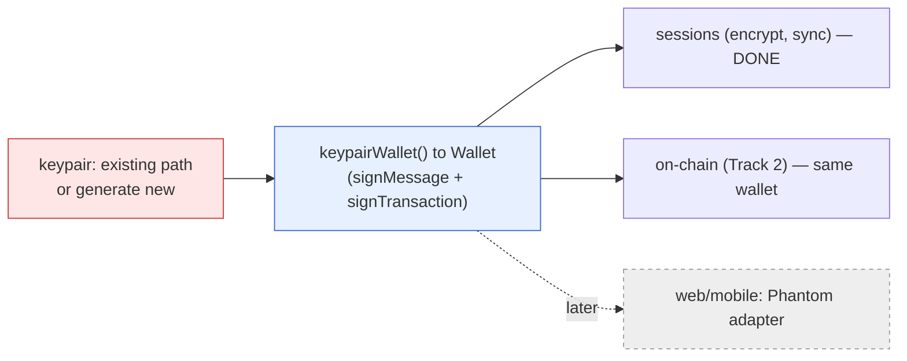
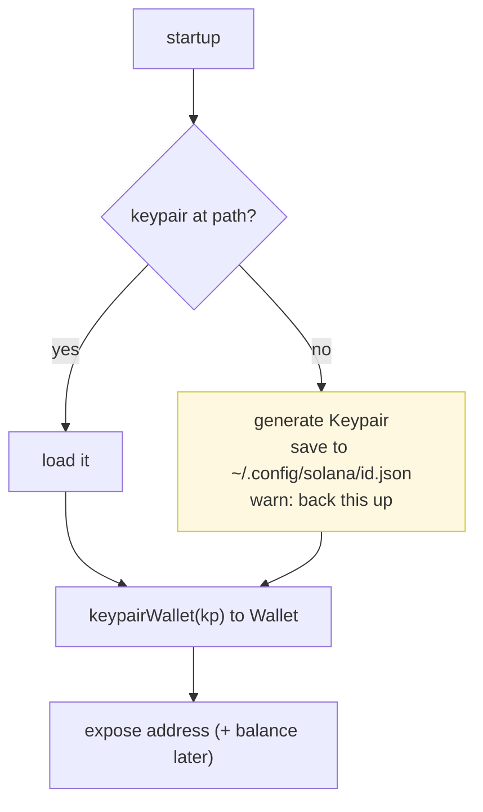

# Track 1 — Build Plan (identity & multi-device session sync)

> Detailed plan for Track 1 (overview in [`STATUS.md`](STATUS.md) section 6).
> **Decision:** in CLI/VSCode, the wallet is a **local Solana keypair** (path or
> generated) — no web wallet. Phantom/mobile wallets come later, plugged in via the
> same `Wallet` interface. This matches `keypairWallet()` we already have.

## Wallet model (decided)

- **CLI/VSCode:** load a Solana keypair from a file path. Default to the Solana CLI
  standard `~/.config/solana/id.json`. If none exists, **generate one** and save it
  there (with a clear "this is your agent's wallet, back it up" notice).
- The keypair becomes a full `Wallet` via `keypairWallet()` (signMessage for sessions,
  signTransaction for on-chain). Already built; just needs the load/generate step.
- Funding: buying skills (Track 2) needs SOL in that wallet — the UI shows the
  address + balance so the user can top up before purchases. (No funding logic in
  Track 1; just surface the address.)
- **Web/mobile (later):** Phantom deep-link / wallet-app implement `Wallet`
  directly. Kept out of this track on purpose.

---

## Tasks (in order)

| # | Task | What exactly | Files |
|---|---|---|---|
| **T1-1** | **Local keypair wallet** | loadOrCreateKeypair(path?): read keypair from path (default ~/.config/solana/id.json), or generate + save if missing. Wrap with keypairWallet(). Expose address. | new src/account/localWallet.ts (uses existing keypairWallet, paths.ts) |
| **T1-2** | **Onboarding flow (wire it)** | On startup: isInitialized() false runs onboarding. Steps: (a) wallet (load/generate, show address), (b) detectCli() shows codex/claude status + guidance, (c) STORAGE_OPTIONS picker calls initialize(cfg, openBrowser). Then login(wallet) for the real runtime. | surfaces/vscode/extension.ts + a small onboarding webview |
| **T1-3** | **Real storage selection** | Replace the pinned manualStorage() with login(wallet).storage from the chosen backend. gdrive needs GOOGLE_CLIENT_ID (env / setting). | extension.ts |
| **T1-4** | **Settings: view / switch storage** | "Saving to: X" via getStorageInfo(); "change" via switchStorage(). Also show wallet address + (optional) SOL balance. | onboarding/settings webview |
| **T1-5** | **Multi-device test** | Same keypair on machine B then login then sessions decrypt & list. (Same key by design; this verifies it for real over a cloud backend.) | manual test + a script |
| **T1-6** | **Local-cloud dedup** | If both local and a cloud backend hold a session id, pick newest by ts (v1). Decide whether local is a cache of cloud or a separate backend. | store.ts / login.ts |

---

## T1-1 detail (the first concrete step)

New module `src/account/localWallet.ts`:
- `solanaDefaultKeypairPath()` returns `~/.config/solana/id.json`
- `loadOrCreateKeypair(path?)` returns `{ keypair, created, path }`
  - file exists: parse the JSON byte array, `Keypair.fromSecretKey`
  - missing: `Keypair.generate()`, write the byte array, `created: true`
- `localWallet(path?)` returns `keypairWallet(loadOrCreateKeypair(path).keypair)`

Tiny, leans entirely on existing pieces (keypairWallet, paths.ts, @solana/web3.js).
Verify with a script: generate then wallet then sign a dummy message then a session
encrypt/decrypt round-trips.

---

## Already done vs new (so we don't rebuild)

- DONE: keypairWallet() / testWallet() — keypair to full Wallet (PR #2)
- DONE: login() / initialize() / isInitialized() / switchStorage() / getStorageInfo()
- DONE: detectCli(), STORAGE_OPTIONS
- DONE: all 4 storage backends, encryption, session store
- NEW: localWallet.ts (T1-1) — the only real new logic
- NEW: onboarding webview + wiring (T1-2 to T1-4) — UI work over existing parts

## Order to build
T1-1 (keypair wallet) then T1-2 (onboarding) then T1-3 (real storage) then
T1-4 (settings) then T1-5 (multi-device test) then T1-6 (dedup).
T1-1 unblocks everything; do it first.
