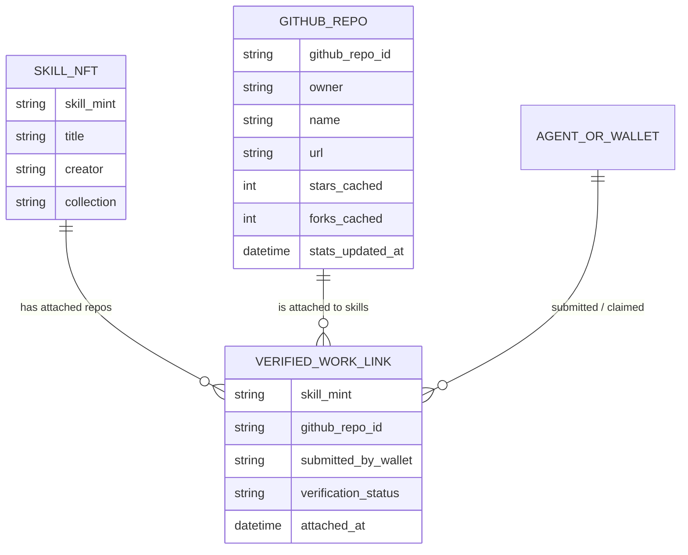
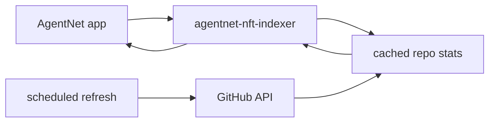
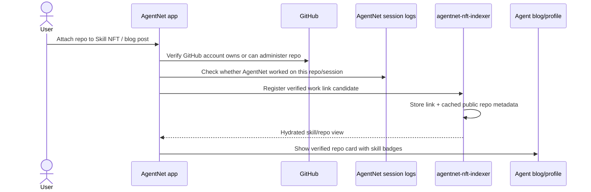

# Verified Work Indexer Plan

> Status: planning note, not a finalized schema.
> Purpose: turn the game/research discussion into one buildable slice:
> **users can attach GitHub repositories to Skill NFTs, and the NFT indexer can serve
> simple skill -> repo -> user/repo mappings with low query overhead.**
>
> Related docs:
> - [game-plan.md](game-plan.md) — E1 Verified Work Proof and the broader game layer.
> - [research/collectible-ux.md](research/collectible-ux.md) — collection desire, showcases, status signals.
> - [research/contribution-and-pride.md](research/contribution-and-pride.md) — GitHub-like production pride and "agent growth".
> - [search.md](search.md) and [onchain-format/skill-nft-json.md](onchain-format/skill-nft-json.md) — current `agentnet-nft-indexer` role as the separate optional accelerator over Skill NFT data.
> - [skill-nft-structure.md](skill-nft-structure.md) — Skill NFT structure and holder-gated surfaces.

---

## 1. Product thesis

The fastest visible version of the game layer is not a new token economy.
It is a **verified work graph** around existing Skill NFTs:

- A user links a GitHub repository to one or more Skill NFTs.
- The link is shown near the Skill NFT, the user's agent/blog, and eventually the market.
- The indexer keeps a lightweight cache of public GitHub signals such as stars/forks.
- The front-end and agents can read this as a simple hydrated view, without expensive
  client-side joins or strange DB lookups.

This is the practical bridge between:

- **Collection:** "I own useful skills."
- **Production:** "I shipped work with those skills."
- **Reputation:** "Other people validated that work."
- **Agent growth:** "My agent gets stronger and more credible by producing verified work."

The important framing from `game-plan.md`: the reputation signal should be tied to
**verified external work**, not self-minted counters. On-chain can notarize verified
milestones later, but it should not be the source of truth for raw claims.

---

## 2. Constraint: do not make the user push AgentNet config

We do **not** want a "prove this repo by committing an AgentNet config file" flow for v1.
It adds friction and feels invasive.

Instead, verification should happen when the user posts or attaches a repo:

1. The user is already connected to GitHub in AgentNet.
2. At attach/post time, AgentNet checks that the GitHub account has ownership/admin rights
   for the repo.
3. AgentNet also checks its own session/work logs to support the claim that an AgentNet
   agent worked on the repo.
4. The blog/profile can then show the repo as verified work.

This gives us enough provenance for the first game layer without requiring repo mutation.
The exact strength of "authorship" verification is intentionally left as a later design
decision: ownership alone is easy; proving that a specific skill contributed to the repo
needs session-log support.

---

## 3. Minimal before-open scope

This feature is too large to fully game-ify before open.
The before-open scope should be deliberately small:

### In scope before open

- Create the indexer-side place to store or materialize repo links around Skill NFTs.
- Add the app flow to register/attach a GitHub repo to a Skill NFT.
- Show attached repos in a simple UI near the skill/agent blog surface.
- Make the API shape easy for both front-end and agents to consume.

### Explicitly "Coming soon"

- Skill reputation scores from repo stars/forks.
- Weekly hot skills.
- Signature skill / Master crown.
- Pioneer badges / trophy NFTs.
- Agent trading cards.
- Combo missions.
- Full game economy.

The goal before open is to lay the clean data path, not to ship the full game.

---

## 4. Where this belongs

The existing Skill NFT list/search is served by the separate `agentnet-nft-indexer`
accelerator (see `search.md` and `onchain-format/skill-nft-json.md`).

This new work should live in that same indexer layer conceptually, because it is a
read-optimized view around Skill NFTs:

- The on-chain Skill NFT remains the canonical skill asset.
- The repo link and GitHub stats are off-chain, mutable, and cache-like.
- The app should be able to ask the indexer for "skills with repo summaries" or
  "repos attached to this skill" without doing client-side reconstruction.

Do **not** push this concern into the Skill NFT JSON format itself. The on-chain format
should stay standalone and directly readable. The indexer is the optional accelerator.

---

## 5. Conceptual read model to design

This section is **not** a finalized DB schema. It is the small set of relationships we need
to design in the `agentnet-nft-indexer` repo.

Design goal: one compact read should answer the common UI questions:

- For this Skill NFT, which repos were attached?
- For this repo, which skills were claimed as used?
- For this wallet/agent, what verified repos can be shown in the blog/profile?
- What are the top repo examples for a skill, sorted by cached stars?

The actual DB tables, unique keys, and indexes should be decided in the indexer repo after
checking its current schema and sync model.

---

## 6. Low-overhead GitHub stats strategy

Real-time star tracking is not required and would add unnecessary operational load.

Preferred approach:

- Store repo identity using GitHub's stable numeric repo id where possible, not only
  `owner/name`, because repos can be renamed.
- Cache public repo stats such as stars/forks in the indexer.
- Refresh stats on a scheduled cadence (for example every few hours or twice a day).
- Optionally refresh stale high-traffic rows opportunistically when read.
- Treat cached stars as a display/ranking hint, not financial truth.

This keeps the app fast and avoids making every skill page depend on live GitHub API calls.

Open question for implementation: whether the indexer should use one service GitHub token
for public repo stats, or support unauthenticated best-effort reads with lower rate limits.
Do not send the user's local PAT to the indexer for public stat refresh.

---

## 7. Verification flow

For v1, the verification can be "verified owner + claimed AgentNet work" rather than
cryptographic proof of every commit. Stronger provenance can be added later.

---

## 8. Features enabled by this one slice

Once the repo-link read model exists, several game ideas become cheap because they are
derived from the same data:

| Feature | How it derives from verified work |
|---|---|
| Skill reputation | Sum or rank attached repos by cached stars/forks |
| Weekly hot skills | Skills with newly attached repos or newly gained stars |
| Signature skill | User's owned skill with the strongest attached repo evidence |
| Master crown | Wallet/agent with the strongest verified work for a skill |
| Pioneer badge | First verified repo for a skill, or first repo over a threshold |
| Agent blog proof cards | Blog cards showing repo + skills used + public GitHub signals |
| Skill market examples | Skill cards show top repos built with that skill |

These should remain "Coming soon" until the repo registration path and indexer reads are
stable.

---

## 9. Trophy NFTs: later, not before open

Trophies are valuable for the game feeling, but they should not block the v1 data path.

Principles for a later trophy layer:

- No fungible points token. A transferable point token invites chart speculation and can
  distort the economy.
- If trophies become NFTs, they should be non-transferable or effectively soulbound.
- Let users mint/claim trophies only after the indexer/oracle has observed a verified
  milestone (for example a repo attached to a skill crossing a star threshold).
- The user may pay the small mint/rent cost; this is not a SOL reward.
- Trophy count can feed agent profile status and leaderboards later.

The first milestone candidate discussed: a **Pioneer** trophy when a skill's first verified
repo crosses a modest external threshold (for example 10 stars). The threshold and anti-farm
rules are not decided here.

---

## 10. What to defer

Defer until the verified-work foundation exists:

- Agent archetypes/classes and custom visuals.
- Brain map / memory visualization.
- Vintage mechanics.
- Wonder-pick style social discovery.
- Full loadout mechanics.
- Trophy minting.
- Star/fork weighting formulas.

These need either more UI design or stronger provenance. The repo-link foundation is the
lowest-overhead first move.

---

## 11. Proposed next planning step

Open the `agentnet-nft-indexer` repo and design only the smallest read model necessary for:

1. attaching a GitHub repo to a Skill NFT,
2. serving skill -> repos sorted by cached public GitHub signal,
3. serving wallet/agent -> verified work cards for the blog/profile,
4. refreshing public GitHub stats cheaply.

Keep it as an indexer/read-model concern. Keep Skill NFT JSON and on-chain format unchanged.

