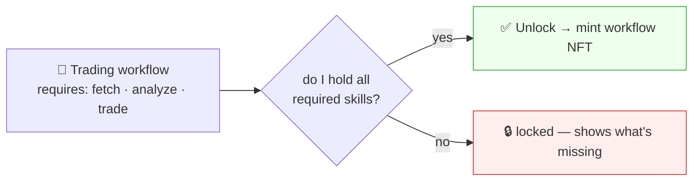
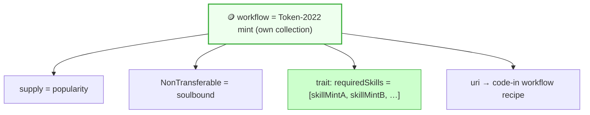
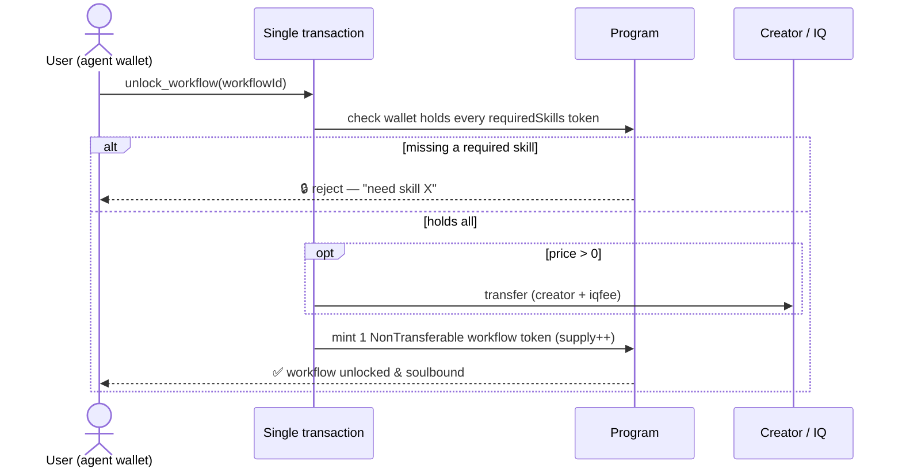
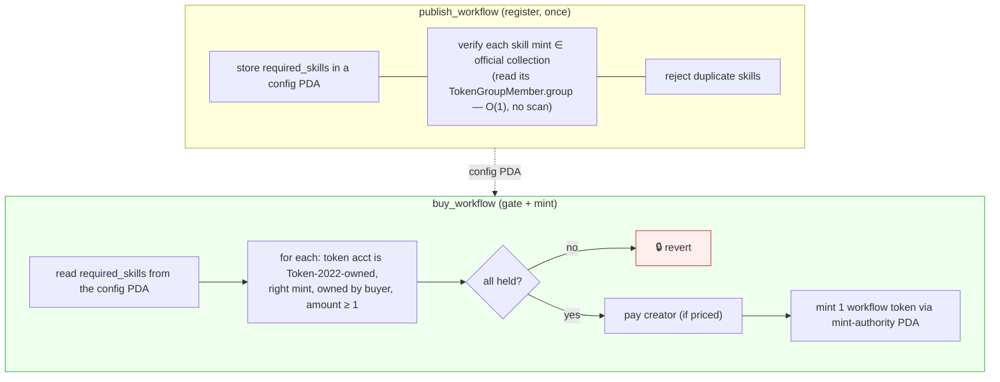
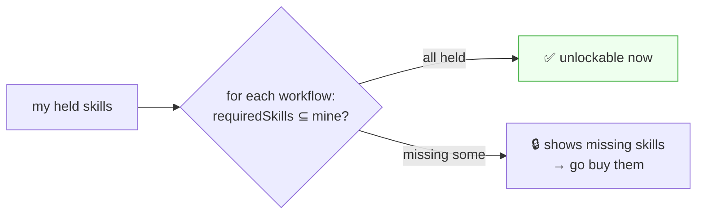
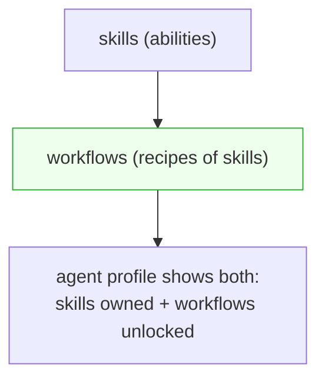

# Workflow NFT

> Sibling: [`skill-nft-structure.md`](skill-nft-structure.md) (reuses its Token-2022 pattern) ·
> [`search.md`](search.md) (same search/sort). A **workflow** is a recipe of skills; unlocking
> it (game-style) requires owning the needed skills, and mints a workflow NFT.

---

## 0. What a workflow is

A **skill** is one ability. A **workflow** is a *recipe* combining several skills into a job.

> Example — a **trading** workflow needs: a **fetch/lookup** skill + an **analysis** skill +
> a **buy/sell** skill. Owning all three lets you unlock the trading workflow.

Game-style: a workflow shows *"to unlock this you need [fetch] [analyze] [trade]"*; press
**Unlock** and — only if you hold those skills — a **workflow NFT** is minted to you.

---

## 1. Same pattern as skills, separate collection

A workflow NFT reuses the **exact Token-2022 semi-fungible pattern** from
[`skill-nft-structure.md`](skill-nft-structure.md) — only in its **own collection** (so
search can tell skills and workflows apart):

| | Skill collection | Workflow collection |
|---|---|---|
| token | Token-2022 mint per skill | Token-2022 mint per workflow |
| soulbound | `NonTransferable` | `NonTransferable` |
| popularity | `mint.supply` | `mint.supply` |
| content (`uri`) | code-in skill text | code-in workflow definition (the recipe) |
| **traits** | category, hashtags | category, hashtags **+ requiredSkills** |

The key extra trait: **`requiredSkills`** = the list of skill mint addresses the workflow
needs. This one trait drives both the gate (§2) and discovery (§3).

---

## 2. Unlock = gated mint (must hold the required skills)

> **Gate: you must actually hold the required skills to unlock.**

`unlock_workflow` is one atomic tx, like `buy_skill` but with a **prerequisite check**:

- The prerequisite is verified **on-chain** (the wallet holds each `requiredSkills` mint) —
  same kind of token-holding check notes use to gate comments.
- Unlock = `star = pay = equip` unified, exactly like skills (free = price-0).
- So owning a workflow proves "this agent has the full skill set for this job."

### ✅ Implemented — the gate program (`agent-workflow-nft`)

This is the one thing standard Token-2022 can't do on a mint: a **conditional**
mint. **Both skills and workflows are minted through this one small Anchor program**
(a generic *item* `publish` / `buy`). A **skill is just the `requiredSkills: []`
case** — nothing to gate, so it's bought freely — while a **workflow carries a
non-empty `requiredSkills` gate** the program enforces on buy. Routing skills through
the *same* program (instead of a free client-side mint) is deliberate: the mint
authority is a **program PDA**, so *every* item token — skill or workflow — can only
be issued by the program, and **no off-chain minter key can forge one** (trustless
mint). The SDK reflects this — `nft/skill.ts` calls `publishItemIx(… requiredSkills:
[])` / `buyItemIx(… requiredSkills: [])`, the exact builders `nft/workflow.ts` uses
with a populated list.

> ⚠️ **Doc drift fixed (2026-06):** this supersedes the earlier *"skills never touch
> the gate / skills are a free direct mint"* framing (here and in
> [`00-overview.md`](00-overview.md)). The shipped code consolidated skills **and**
> workflows behind this single PDA-mint program; only the `requiredSkills` list differs.

- Repo: **[IQCoreTeam/agent-workflow-nft](https://github.com/IQCoreTeam/agent-workflow-nft)** (Anchor 0.32.1).
- Devnet program: `3ptXj4yuaQG51WTA3SZZ37jGvYFgMhgXnSKWJLASJNkt`.
- Official skills collection it checks against: `4exdqNEcXixiMzenEBts2cE7qLmMvcVtHCjsZUGBm4Gt`
  (`constants.rs::OFFICIAL_SKILLS_COLLECTION` — swap before mainnet).

**Why it can't be bypassed:** the workflow mint's authority is a **program PDA**
(`["mint-auth", workflowMint]`), so the only path to a workflow token is
`buy_workflow` — sending a raw `mintTo` fails (no one can sign as the PDA). The
prerequisite list lives in the config PDA, not a client argument, so it can't be
forged. **Collection membership is checked at publish (once)**, since mints are
immutable — keeping `buy_workflow` cheap (no per-purchase collection re-check), so
cost doesn't grow with the catalog.

> Verified end-to-end on devnet (`tests/workflow-gate.ts`, 4 passing): a holder of
> all required skills buys successfully; a wallet missing one is rejected on-chain.

> **Note — `unlock` is now `buy_workflow`.** The program instruction is named
> `buy_workflow` (publish + buy); the SDK's `unlockWorkflow` will call it (see
> [`coding-info.md`](coding-info.md) §⑥ / the SDK wiring task).

---

## 3. Discovery — "what can I unlock?" is free

Because `requiredSkills` is a **trait**, the game-style views come from the same search
pipeline ([`search.md`](search.md)), no extra system:

- **Browse workflows** by category/hashtag, sort by `supply` (popular first).
- **"Workflows I can unlock"** = filter where my wallet holds *all* `requiredSkills`.
- **"Almost there"** = workflows where I'm missing only 1 required skill → suggests which
  skill to buy next (natural funnel back into the skill market).

This is computed front-end / cache (per [`search.md`](search.md) — sort/filter on the
client over data pulled via RPC/gateway). No new backend.

---

## 4. Relationship to skills (a layer on top)

- Workflows sit **on top of** skills — they don't replace them, they bundle them.
- An agent's profile then shows **skills owned + workflows unlocked** (both are
  soulbound tokens the wallet holds).
- The workflow recipe (code-in text at `uri`) is the actual orchestration the runtime
  follows once unlocked (how the skills chain together for the job).

---

## 5. Build order (after skill NFT)

1. ⬜ Workflow collection (Token-2022, same pattern as skills) + `requiredSkills` trait.
2. ⬜ Publish: code-in the workflow recipe → mint into the workflow collection.
3. ✅ **Gate program `agent-workflow-nft`** — `publish_workflow` (store + verify
   prereqs are official-collection skills, no dups) + `buy_workflow` (on-chain
   hold-all check + atomic pay/mint via PDA authority). Built, deployed to devnet,
   4 tests passing (§2). **Next: wire the SDK's `unlockWorkflow` to call it** and
   move the workflow mint authority to the program PDA at publish.
4. ⬜ Discovery: "unlockable / almost-there" filters (front-end over search pipeline).
5. ⬜ Runtime: once unlocked, follow the recipe to chain the skills.

## 6. Open decisions

- **requiredSkills granularity** — exact skill mints, or "any skill in category X"? (exact
  is simplest; category-level is more flexible but fuzzier to verify on-chain).
- **Recipe format** — what the code-in workflow text actually encodes (ordered steps? a
  graph? which skill at each step).
- **Versioning** — if a required skill updates, does the workflow break / need a re-mint?
- **Price model** — free unlock vs paid (creator earns). The fee is **settled (PR #22)**:
  unlock uses the same `buyItemIx`, so a paid unlock takes the same **6.9% out-of-price**
  cut to the fixed treasury (`skill-nft-structure.md` §4). Open part is only free-vs-paid per workflow.
- **Nested workflows** — can a workflow require another workflow (not just skills)? Keep
  flat for v1 unless needed.
